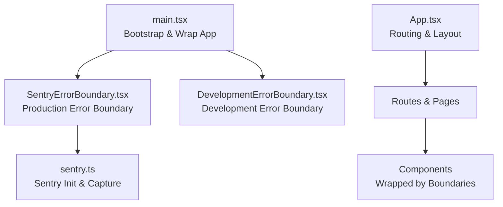
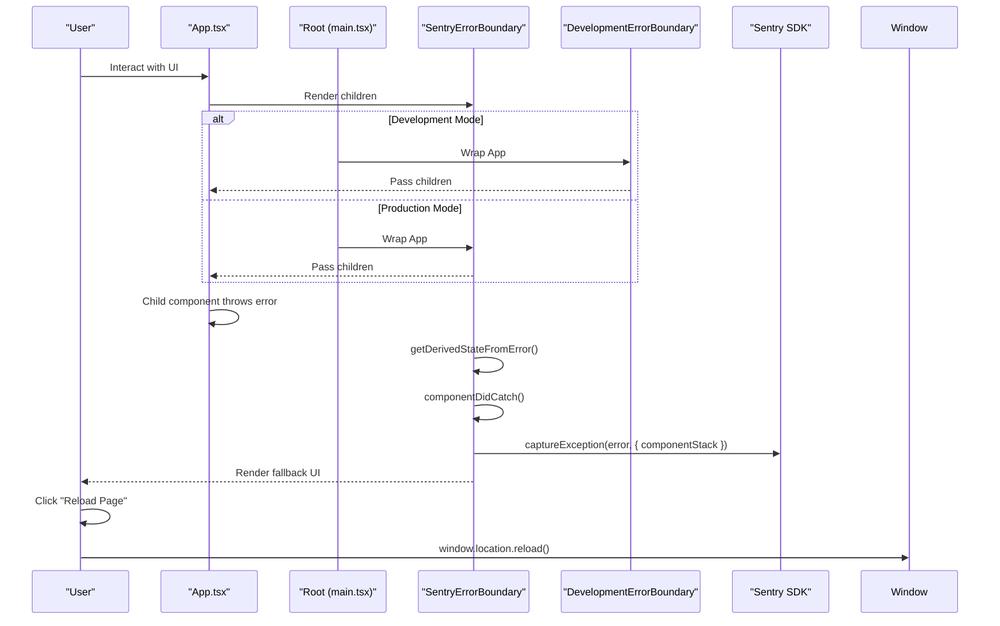
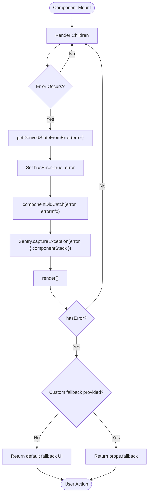
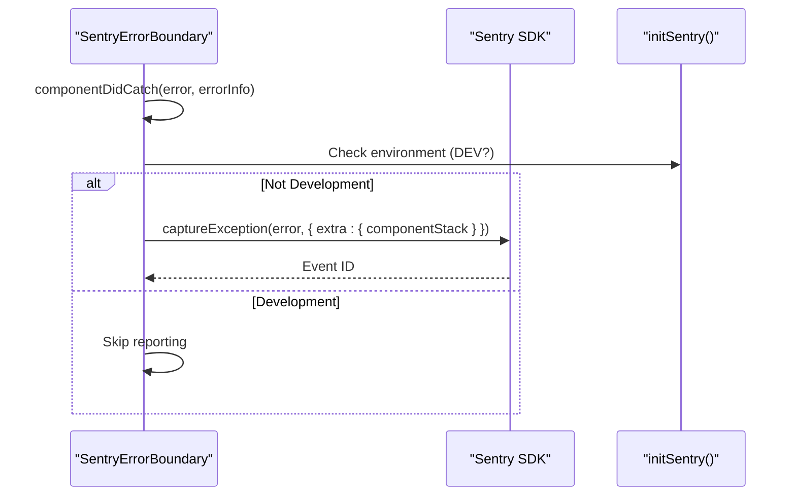
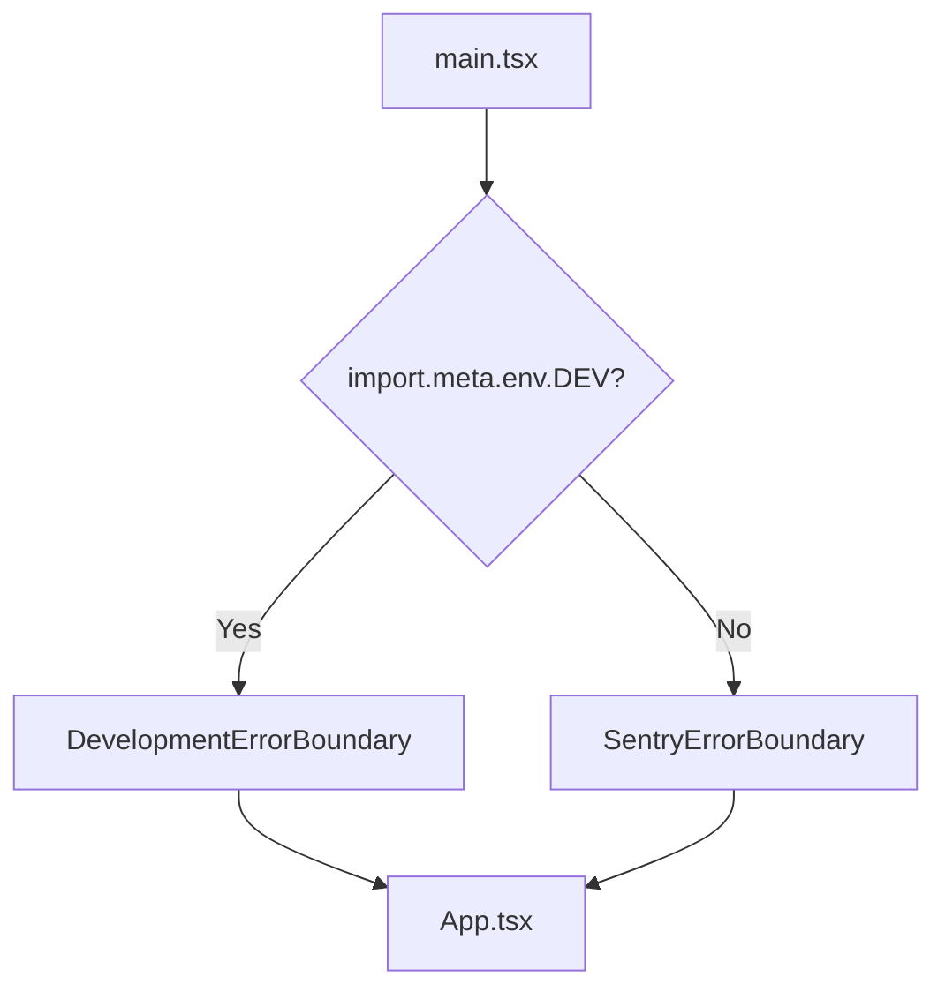
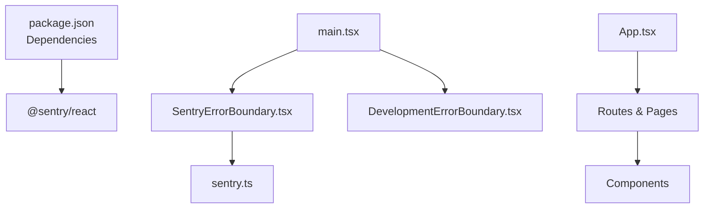

# Error Boundaries Implementation

<cite>
**Referenced Files in This Document**
- [SentryErrorBoundary.tsx](file://src/components/SentryErrorBoundary.tsx)
- [SentryErrorBoundary.test.tsx](file://src/components/SentryErrorBoundary.test.tsx)
- [DevelopmentErrorBoundary.tsx](file://src/components/DevelopmentErrorBoundary.tsx)
- [sentry.ts](file://src/lib/sentry.ts)
- [main.tsx](file://src/main.tsx)
- [App.tsx](file://src/App.tsx)
- [package.json](file://package.json)
</cite>

## Table of Contents
1. [Introduction](#introduction)
2. [Project Structure](#project-structure)
3. [Core Components](#core-components)
4. [Architecture Overview](#architecture-overview)
5. [Detailed Component Analysis](#detailed-component-analysis)
6. [Dependency Analysis](#dependency-analysis)
7. [Performance Considerations](#performance-considerations)
8. [Troubleshooting Guide](#troubleshooting-guide)
9. [Conclusion](#conclusion)

## Introduction
This document provides comprehensive guidance for implementing React Error Boundaries in the Nutrio application, focusing on the SentryErrorBoundary component. It explains how the boundary prevents application crashes from propagating, documents lifecycle methods, fallback UI rendering, error state management, and integration with Sentry for automatic error reporting. Practical examples demonstrate how to wrap critical components, customize fallback UIs, and implement error recovery strategies.

## Project Structure
The error boundary implementation spans several key files:
- Application bootstrap and boundary wrapping in main.tsx
- Error boundary components (SentryErrorBoundary and DevelopmentErrorBoundary)
- Sentry initialization and error capture utilities
- Testing coverage for boundary behavior

**Diagram sources**
- [main.tsx:20-47](file://src/main.tsx#L20-L47)
- [SentryErrorBoundary.tsx:14-63](file://src/components/SentryErrorBoundary.tsx#L14-L63)
- [DevelopmentErrorBoundary.tsx:20-96](file://src/components/DevelopmentErrorBoundary.tsx#L20-L96)
- [sentry.ts:3-37](file://src/lib/sentry.ts#L3-L37)
- [App.tsx:139-739](file://src/App.tsx#L139-L739)

**Section sources**
- [main.tsx:1-50](file://src/main.tsx#L1-L50)
- [App.tsx:1-739](file://src/App.tsx#L1-L739)

## Core Components
This section analyzes the primary error boundary components and their roles in the application.

### SentryErrorBoundary
A class-based React error boundary that:
- Catches unhandled errors thrown by child components
- Reports errors to Sentry in production environments
- Renders a user-friendly fallback UI or a custom fallback prop
- Provides a reload mechanism to recover from transient issues

Key behaviors:
- Lifecycle methods:
  - getDerivedStateFromError: Updates state to indicate an error occurred
  - componentDidCatch: Logs error details and captures exception via Sentry
  - render: Returns fallback UI or children based on error state
- Fallback UI: Includes a friendly message and a reload button
- Custom fallback: Accepts a custom ReactNode via the fallback prop

Integration with Sentry:
- Uses Sentry.captureException with component stack metadata
- Disabled in development mode to avoid noise

**Section sources**
- [SentryErrorBoundary.tsx:14-63](file://src/components/SentryErrorBoundary.tsx#L14-L63)
- [SentryErrorBoundary.tsx:65-76](file://src/components/SentryErrorBoundary.tsx#L65-L76)

### DevelopmentErrorBoundary
A development-focused error boundary designed to:
- Catch hot module replacement (HMR) related errors
- Provide actionable recovery guidance for React Fast Refresh issues
- Offer a simple reload option for other development errors

Key behaviors:
- Detects specific HMR-related error messages
- Renders contextual help and a reload button
- Falls back to a generic error UI when not an HMR issue

**Section sources**
- [DevelopmentErrorBoundary.tsx:20-96](file://src/components/DevelopmentErrorBoundary.tsx#L20-L96)

### Sentry Initialization and Utilities
The application initializes Sentry globally and exposes helper functions:
- initSentry: Configures Sentry with browser tracing, session replay, environment, and release information
- captureError: Captures exceptions with optional context
- captureMessage: Sends messages with severity levels
- setUserContext and clearUserContext: Manage user identity for Sentry events

Environment safeguards:
- Sentry operations are disabled in development mode
- beforeSend filters sensitive user data (email, IP address)

**Section sources**
- [sentry.ts:3-37](file://src/lib/sentry.ts#L3-L37)
- [sentry.ts:39-72](file://src/lib/sentry.ts#L39-L72)

## Architecture Overview
The error boundary architecture ensures robust error handling across the application:

**Diagram sources**
- [main.tsx:20-47](file://src/main.tsx#L20-L47)
- [SentryErrorBoundary.tsx:19-33](file://src/components/SentryErrorBoundary.tsx#L19-L33)
- [sentry.ts:39-48](file://src/lib/sentry.ts#L39-L48)

## Detailed Component Analysis

### SentryErrorBoundary Lifecycle and Rendering
The boundary follows React error boundary lifecycle methods to manage error states and rendering:

**Diagram sources**
- [SentryErrorBoundary.tsx:19-62](file://src/components/SentryErrorBoundary.tsx#L19-L62)

**Section sources**
- [SentryErrorBoundary.tsx:14-63](file://src/components/SentryErrorBoundary.tsx#L14-L63)

### Error Reporting Integration with Sentry
Automatic error reporting occurs when an error is caught:
- Error metadata includes component stack information
- Reporting is disabled in development mode
- Global Sentry initialization sets up performance monitoring and session replay

**Diagram sources**
- [SentryErrorBoundary.tsx:23-33](file://src/components/SentryErrorBoundary.tsx#L23-L33)
- [sentry.ts:3-37](file://src/lib/sentry.ts#L3-L37)

**Section sources**
- [SentryErrorBoundary.tsx:23-33](file://src/components/SentryErrorBoundary.tsx#L23-L33)
- [sentry.ts:3-37](file://src/lib/sentry.ts#L3-L37)

### Fallback UI Rendering and Customization
The boundary renders either:
- A default fallback UI with a friendly message and reload button
- A custom fallback provided via the fallback prop

Testing demonstrates both behaviors:
- Default fallback appears when no custom fallback is provided
- Custom fallback replaces the default when supplied

**Section sources**
- [SentryErrorBoundary.tsx:35-62](file://src/components/SentryErrorBoundary.tsx#L35-L62)
- [SentryErrorBoundary.test.tsx:10-53](file://src/components/SentryErrorBoundary.test.tsx#L10-L53)

### Development vs Production Error Boundaries
The application wraps the app differently depending on the environment:
- Development: Wraps App with DevelopmentErrorBoundary for HMR-related issues
- Production: Wraps App with SentryErrorBoundary for global error handling

**Diagram sources**
- [main.tsx:20-37](file://src/main.tsx#L20-L37)

**Section sources**
- [main.tsx:20-37](file://src/main.tsx#L20-L37)

### Practical Implementation Examples
Guidance for implementing error boundaries around critical components:

- Wrap high-risk components:
  - Place SentryErrorBoundary around components that perform complex rendering or external API calls
  - Use the fallback prop to provide context-specific messaging for critical flows

- Functional components:
  - Use the useErrorHandler hook to report handled errors with additional context
  - Example usage pattern: call useErrorHandler(error, { operation: "fetchUserData" })

- Recovery strategies:
  - Provide a reload button to recover from transient failures
  - Consider navigation to a safe route on persistent errors
  - Log error details for debugging and monitoring

**Section sources**
- [SentryErrorBoundary.tsx:65-76](file://src/components/SentryErrorBoundary.tsx#L65-L76)

## Dependency Analysis
The error boundary system relies on the following dependencies and configurations:

**Diagram sources**
- [package.json:91-92](file://package.json#L91-L92)
- [main.tsx:8-9](file://src/main.tsx#L8-L9)
- [SentryErrorBoundary.tsx:1](file://src/components/SentryErrorBoundary.tsx#L1)
- [sentry.ts:1](file://src/lib/sentry.ts#L1)

**Section sources**
- [package.json:91-92](file://package.json#L91-L92)
- [main.tsx:8-9](file://src/main.tsx#L8-L9)
- [SentryErrorBoundary.tsx:1](file://src/components/SentryErrorBoundary.tsx#L1)
- [sentry.ts:1](file://src/lib/sentry.ts#L1)

## Performance Considerations
- Error boundaries should wrap only critical components to minimize unnecessary overhead
- Avoid heavy computations in fallback UIs to ensure quick recovery
- Keep error reporting selective in development to reduce console noise
- Use Sentry sampling rates appropriately to balance observability and performance

## Troubleshooting Guide
Common scenarios and resolutions:

- Errors not reported in development:
  - Expected behavior; Sentry reporting is disabled in development mode
  - Verify environment configuration and ensure DEV flag is accurate

- HMR-related errors during development:
  - DevelopmentErrorBoundary catches and displays helpful guidance
  - Use the provided reload button to recover from hot refresh issues

- Custom fallback not rendering:
  - Ensure the fallback prop is passed correctly to SentryErrorBoundary
  - Confirm the child component is indeed throwing an error

- Sentry configuration issues:
  - Verify DSN and environment variables are set
  - Check beforeSend filtering for sensitive data

**Section sources**
- [DevelopmentErrorBoundary.tsx:44-75](file://src/components/DevelopmentErrorBoundary.tsx#L44-L75)
- [SentryErrorBoundary.test.tsx:22-52](file://src/components/SentryErrorBoundary.test.tsx#L22-L52)
- [sentry.ts:28-35](file://src/lib/sentry.ts#L28-L35)

## Conclusion
The SentryErrorBoundary component provides a robust foundation for preventing application crashes from propagating by catching unhandled errors, reporting them to Sentry, and rendering user-friendly fallback UIs. Combined with the DevelopmentErrorBoundary for development scenarios and centralized Sentry configuration, the system ensures reliable error handling across environments. By following the implementation examples and customization guidelines, teams can effectively wrap critical components, tailor fallback experiences, and maintain strong observability with minimal performance impact.