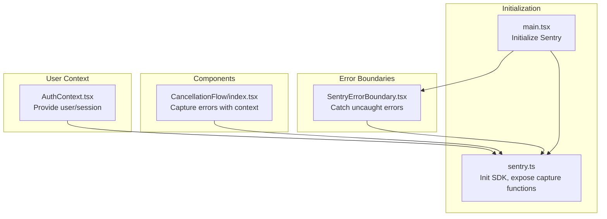
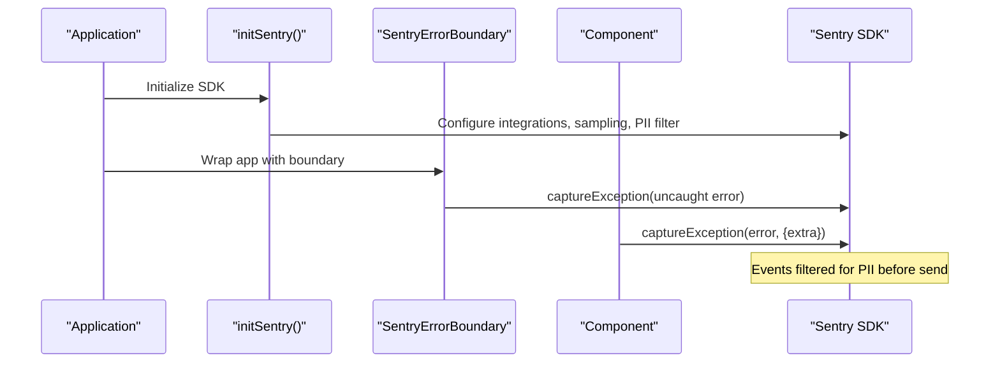
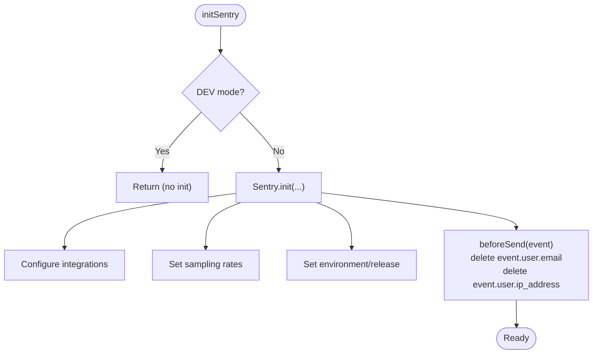
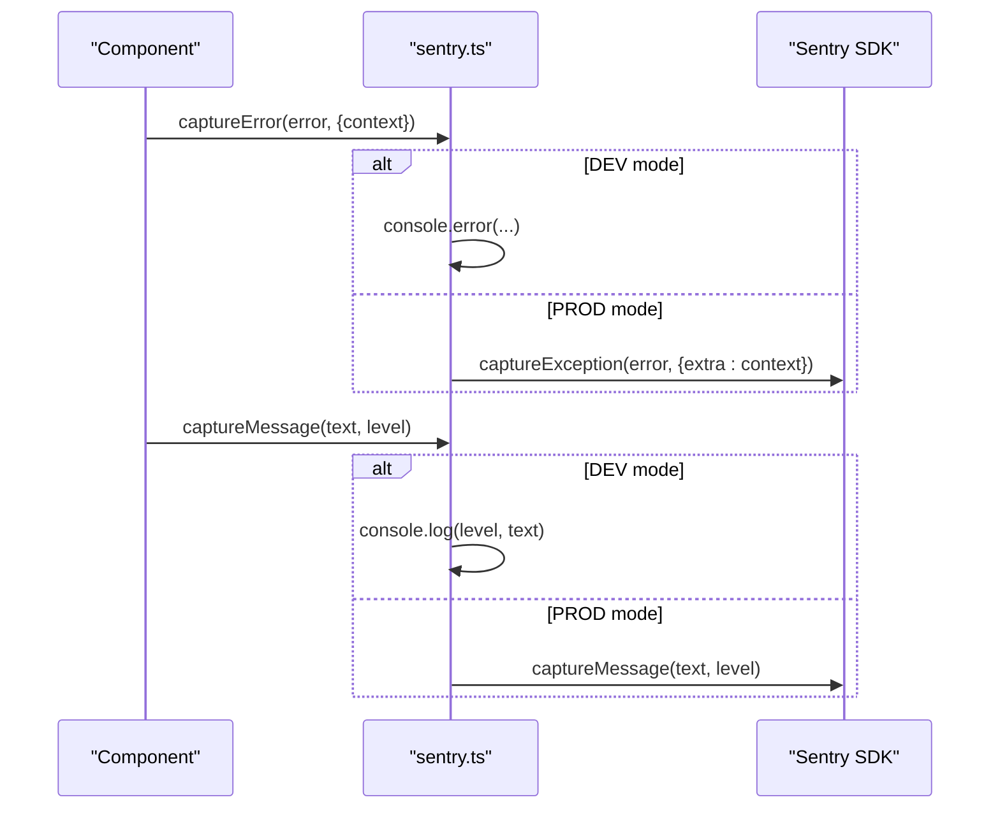
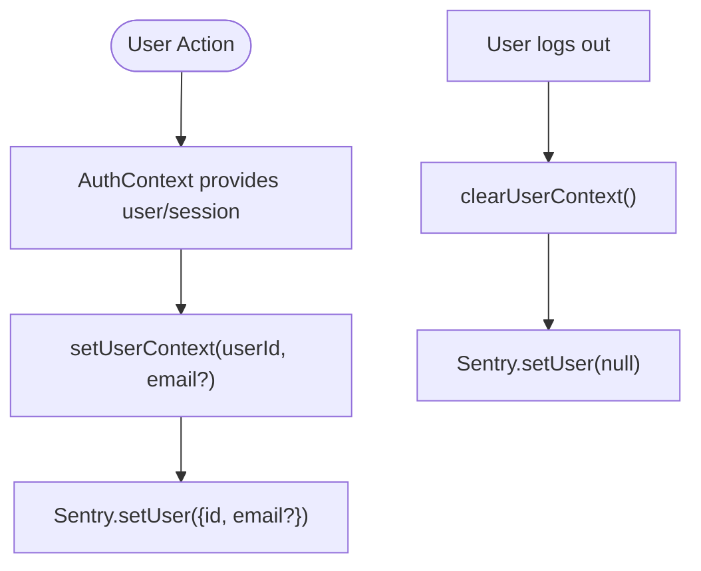
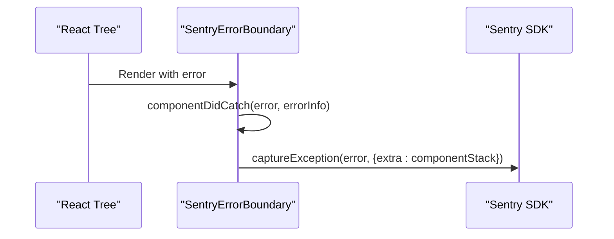
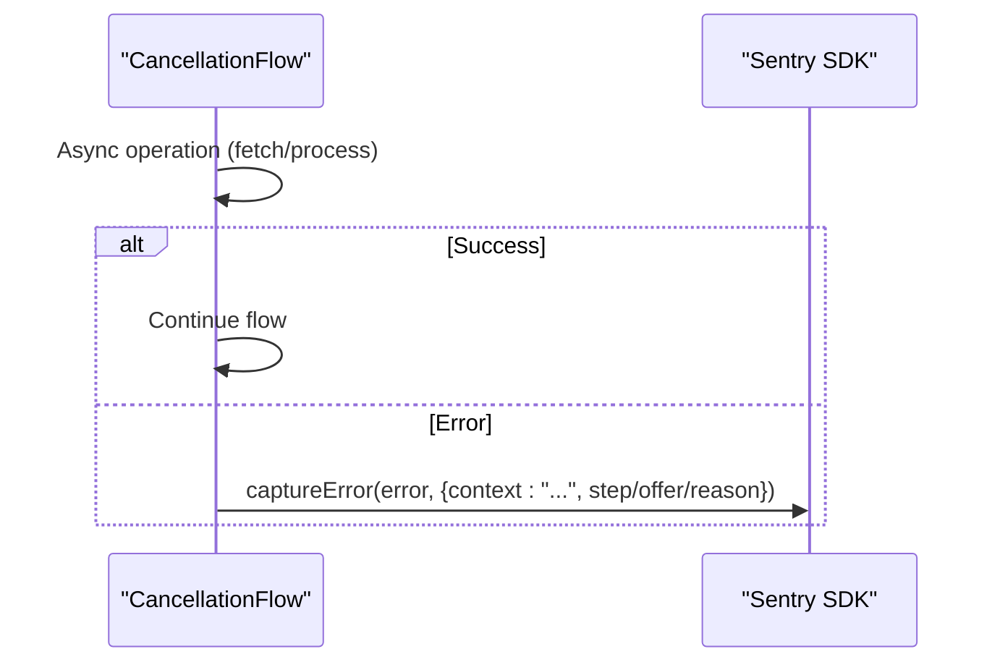
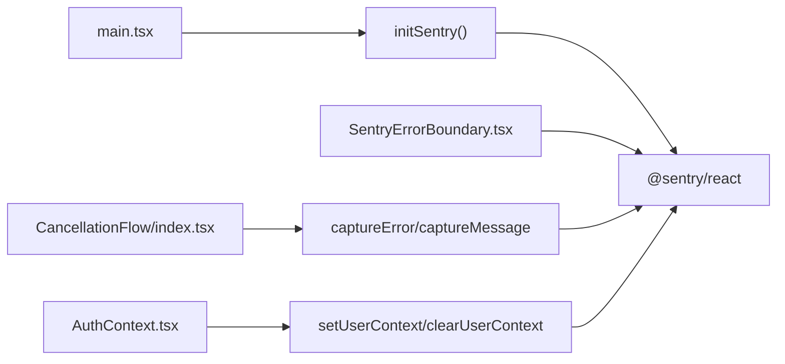

# Error Capture and Context Management

<cite>
**Referenced Files in This Document**
- [sentry.ts](file://src/lib/sentry.ts)
- [SentryErrorBoundary.tsx](file://src/components/SentryErrorBoundary.tsx)
- [main.tsx](file://src/main.tsx)
- [CancellationFlow/index.tsx](file://src/components/CancellationFlow/index.tsx)
- [AuthContext.tsx](file://src/contexts/AuthContext.tsx)
</cite>

## Table of Contents
1. [Introduction](#introduction)
2. [Project Structure](#project-structure)
3. [Core Components](#core-components)
4. [Architecture Overview](#architecture-overview)
5. [Detailed Component Analysis](#detailed-component-analysis)
6. [Dependency Analysis](#dependency-analysis)
7. [Performance Considerations](#performance-considerations)
8. [Troubleshooting Guide](#troubleshooting-guide)
9. [Conclusion](#conclusion)

## Introduction
This document explains the error capture mechanisms and user context management implemented with Sentry in the application. It covers the initialization process, error and message capture functions, user context setup and clearing, PII filtering strategies, and practical examples of capturing application errors, user actions, and system events. The goal is to provide both technical depth and practical guidance for maintaining robust error reporting while preserving user privacy.

## Project Structure
The error reporting system centers around a dedicated Sentry library module that initializes the SDK, exposes capture functions, and manages user context. Error boundaries wrap the application to ensure uncaught errors are captured, and various components use the capture functions for structured error reporting.

**Diagram sources**
- [main.tsx:14](file://src/main.tsx#L14)
- [sentry.ts:3](file://src/lib/sentry.ts#L3)
- [SentryErrorBoundary.tsx:23](file://src/components/SentryErrorBoundary.tsx#L23)
- [CancellationFlow/index.tsx:66](file://src/components/CancellationFlow/index.tsx#L66)
- [AuthContext.tsx:31](file://src/contexts/AuthContext.tsx#L31)

**Section sources**
- [main.tsx:14](file://src/main.tsx#L14)
- [sentry.ts:3](file://src/lib/sentry.ts#L3)

## Core Components
This section documents the primary functions and their roles in error capture and context management.

- **initSentry**: Initializes the Sentry SDK with environment-specific configuration, integrations, sampling rates, and PII filtering.
- **captureError**: Captures exceptions with optional structured context for debugging.
- **captureMessage**: Sends messages with severity levels for operational logging.
- **setUserContext**: Sets user identity for correlation with error reports.
- **clearUserContext**: Clears user identity to maintain privacy.

Key behaviors:
- Development mode disables Sentry to avoid noise during local development.
- PII filtering removes sensitive fields from user data before sending events.
- Integrations include tracing and session replay for enhanced diagnostics.

**Section sources**
- [sentry.ts:3](file://src/lib/sentry.ts#L3)
- [sentry.ts:28](file://src/lib/sentry.ts#L28)
- [sentry.ts:39](file://src/lib/sentry.ts#L39)
- [sentry.ts:50](file://src/lib/sentry.ts#L50)
- [sentry.ts:59](file://src/lib/sentry.ts#L59)
- [sentry.ts:68](file://src/lib/sentry.ts#L68)

## Architecture Overview
The error reporting architecture integrates initialization, error boundaries, and component-level capture functions. User context is established via authentication state and cleared on logout.

**Diagram sources**
- [main.tsx:14](file://src/main.tsx#L14)
- [sentry.ts:3](file://src/lib/sentry.ts#L3)
- [SentryErrorBoundary.tsx:23](file://src/components/SentryErrorBoundary.tsx#L23)
- [sentry.ts:39](file://src/lib/sentry.ts#L39)

## Detailed Component Analysis

### Sentry Initialization and PII Filtering
The initialization function configures:
- DSN, environment, release version
- Browser tracing and session replay integrations
- Sampling rates for performance and replays
- A beforeSend hook that removes sensitive user fields (email, IP address)

**Diagram sources**
- [sentry.ts:3](file://src/lib/sentry.ts#L3)
- [sentry.ts:28](file://src/lib/sentry.ts#L28)

**Section sources**
- [sentry.ts:3](file://src/lib/sentry.ts#L3)
- [sentry.ts:28](file://src/lib/sentry.ts#L28)

### Error Capture Functions
Two primary functions enable structured error reporting:

- **captureError(error, context?)**
  - In development, logs to console.
  - In production, captures exceptions with extra context for debugging.
  - Context is ideal for correlating errors with feature state or user actions.

- **captureMessage(message, level)**
  - In development, logs to console with level prefix.
  - In production, sends messages with severity for operational insights.

**Diagram sources**
- [sentry.ts:39](file://src/lib/sentry.ts#L39)
- [sentry.ts:50](file://src/lib/sentry.ts#L50)

**Section sources**
- [sentry.ts:39](file://src/lib/sentry.ts#L39)
- [sentry.ts:50](file://src/lib/sentry.ts#L50)

### User Context Management
User context is managed through two functions:

- **setUserContext(userId, email?)**
  - Sets user identity in Sentry for correlation.
  - Email is obfuscated by generating a local placeholder to avoid sending PII.

- **clearUserContext()**
  - Clears user identity to protect privacy after logout or navigation away from authenticated areas.

**Diagram sources**
- [AuthContext.tsx:31](file://src/contexts/AuthContext.tsx#L31)
- [sentry.ts:59](file://src/lib/sentry.ts#L59)
- [sentry.ts:68](file://src/lib/sentry.ts#L68)

**Section sources**
- [sentry.ts:59](file://src/lib/sentry.ts#L59)
- [sentry.ts:68](file://src/lib/sentry.ts#L68)
- [AuthContext.tsx:31](file://src/contexts/AuthContext.tsx#L31)

### Error Boundaries and Uncaught Error Handling
The application wraps the main app with an error boundary that:
- Catches uncaught errors in the React tree.
- Logs error details locally.
- In production, captures the error with component stack information for debugging.

**Diagram sources**
- [SentryErrorBoundary.tsx:23](file://src/components/SentryErrorBoundary.tsx#L23)

**Section sources**
- [SentryErrorBoundary.tsx:23](file://src/components/SentryErrorBoundary.tsx#L23)

### Practical Examples and Usage Patterns
Common scenarios demonstrate structured error reporting and context injection:

- **Cancellation Flow**: Multiple async operations capture errors with contextual metadata (step, offer code, reason) to aid debugging without exposing PII.
- **Operational Logging**: Use captureMessage with appropriate severity levels for system events and user actions.

**Diagram sources**
- [CancellationFlow/index.tsx:66](file://src/components/CancellationFlow/index.tsx#L66)
- [CancellationFlow/index.tsx:136](file://src/components/CancellationFlow/index.tsx#L136)
- [CancellationFlow/index.tsx:187](file://src/components/CancellationFlow/index.tsx#L187)
- [CancellationFlow/index.tsx:231](file://src/components/CancellationFlow/index.tsx#L231)
- [CancellationFlow/index.tsx:280](file://src/components/CancellationFlow/index.tsx#L280)

**Section sources**
- [CancellationFlow/index.tsx:66](file://src/components/CancellationFlow/index.tsx#L66)
- [CancellationFlow/index.tsx:136](file://src/components/CancellationFlow/index.tsx#L136)
- [CancellationFlow/index.tsx:187](file://src/components/CancellationFlow/index.tsx#L187)
- [CancellationFlow/index.tsx:231](file://src/components/CancellationFlow/index.tsx#L231)
- [CancellationFlow/index.tsx:280](file://src/components/CancellationFlow/index.tsx#L280)

## Dependency Analysis
The error reporting system relies on a small set of cohesive dependencies:

- **Initialization**: main.tsx calls initSentry to configure Sentry globally.
- **Error Boundaries**: SentryErrorBoundary ensures uncaught errors are captured.
- **Component-level Capture**: Components import captureError/captureMessage for targeted reporting.
- **User Context**: AuthContext provides user/session state; sentry.ts manages Sentry.setUser.

**Diagram sources**
- [main.tsx:14](file://src/main.tsx#L14)
- [SentryErrorBoundary.tsx:23](file://src/components/SentryErrorBoundary.tsx#L23)
- [CancellationFlow/index.tsx:66](file://src/components/CancellationFlow/index.tsx#L66)
- [AuthContext.tsx:31](file://src/contexts/AuthContext.tsx#L31)

**Section sources**
- [main.tsx:14](file://src/main.tsx#L14)
- [SentryErrorBoundary.tsx:23](file://src/components/SentryErrorBoundary.tsx#L23)
- [CancellationFlow/index.tsx:66](file://src/components/CancellationFlow/index.tsx#L66)
- [AuthContext.tsx:31](file://src/contexts/AuthContext.tsx#L31)

## Performance Considerations
- Sampling rates are configured to balance observability and overhead for tracing and session replays.
- beforeSend filtering reduces payload sizes and protects privacy by removing PII.
- Avoid capturing excessive context in production to minimize network overhead.

## Troubleshooting Guide
- **Development vs Production**: In development, capture functions log to console instead of sending to Sentry. Verify environment variables if events do not appear.
- **PII Removal**: Confirm that user emails and IP addresses are removed by the beforeSend filter before investigating user-related issues.
- **User Context Not Visible**: Ensure setUserContext is called after authentication and clearUserContext on logout.
- **Uncaught Errors**: Verify that the error boundary is wrapping the application root and that captureException is invoked with component stack information.

**Section sources**
- [sentry.ts:28](file://src/lib/sentry.ts#L28)
- [sentry.ts:59](file://src/lib/sentry.ts#L59)
- [sentry.ts:68](file://src/lib/sentry.ts#L68)
- [SentryErrorBoundary.tsx:23](file://src/components/SentryErrorBoundary.tsx#L23)

## Conclusion
The application implements a robust, privacy-conscious error reporting system using Sentry. Initialization, error capture functions, user context management, and PII filtering work together to provide actionable insights while protecting user privacy. Following the documented patterns ensures consistent, structured error reporting across components and reliable correlation of errors with user sessions and application state.