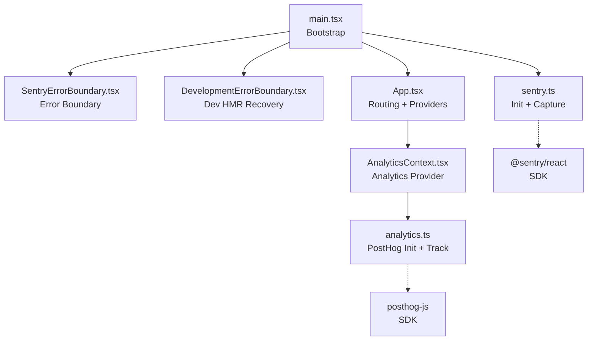
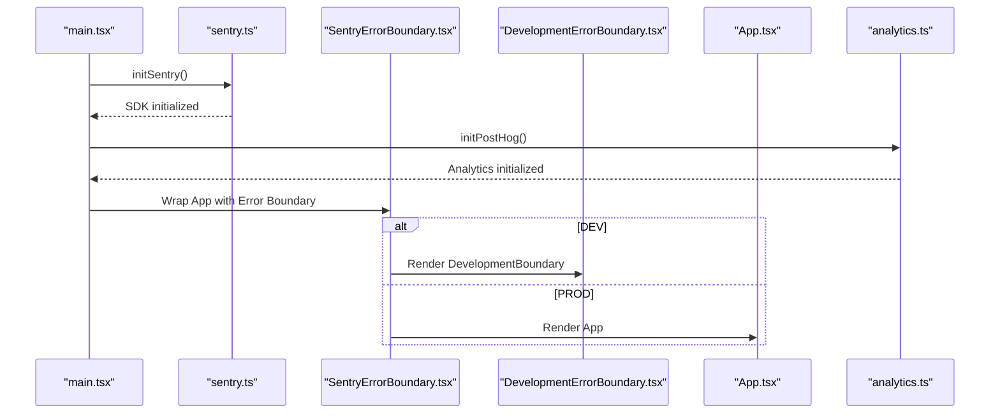
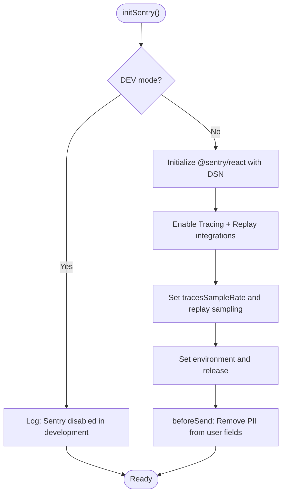
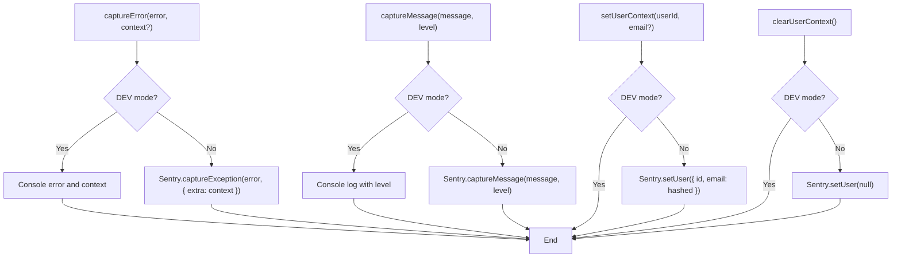
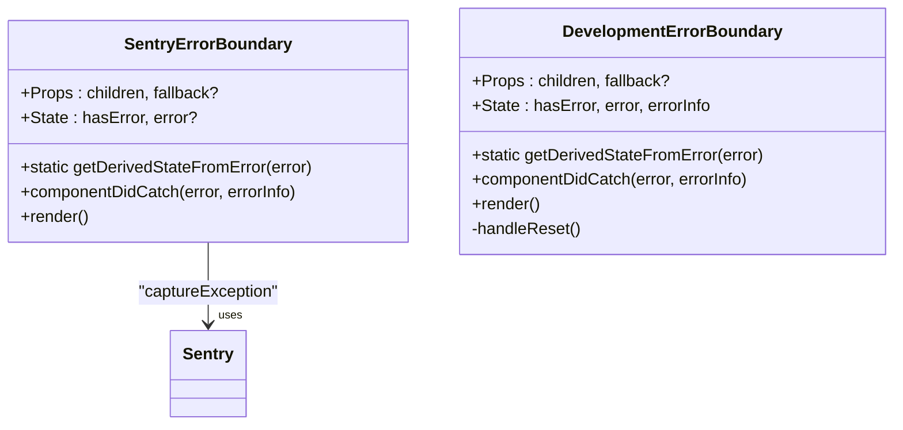
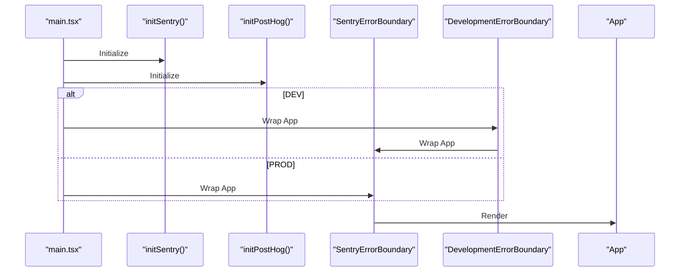
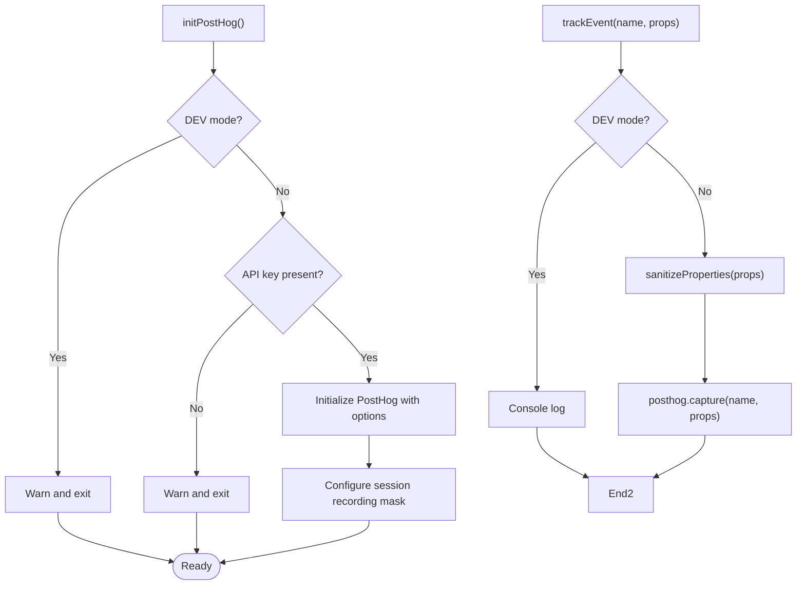
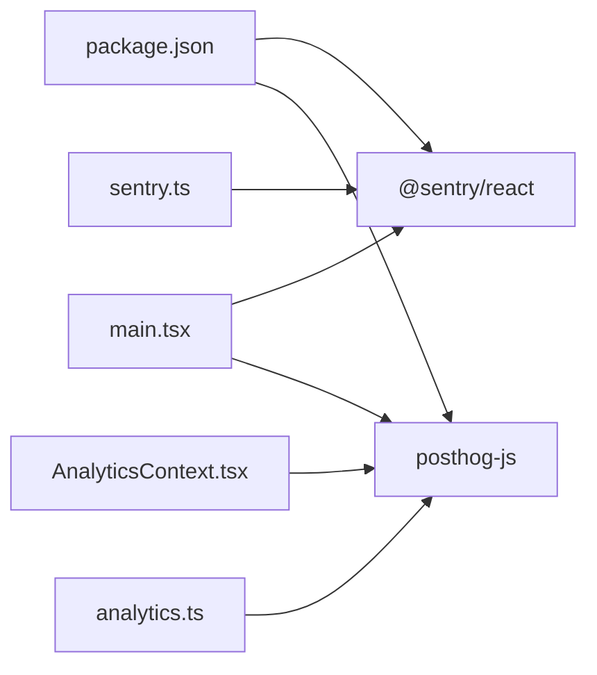

# Error Tracking & Monitoring

<cite>
**Referenced Files in This Document**
- [sentry.ts](file://src/lib/sentry.ts)
- [SentryErrorBoundary.tsx](file://src/components/SentryErrorBoundary.tsx)
- [DevelopmentErrorBoundary.tsx](file://src/components/DevelopmentErrorBoundary.tsx)
- [main.tsx](file://src/main.tsx)
- [App.tsx](file://src/App.tsx)
- [analytics.ts](file://src/lib/analytics.ts)
- [AnalyticsContext.tsx](file://src/contexts/AnalyticsContext.tsx)
- [package.json](file://package.json)
- [deploy.mjs](file://deploy.mjs)
</cite>

## Table of Contents
1. [Introduction](#introduction)
2. [Project Structure](#project-structure)
3. [Core Components](#core-components)
4. [Architecture Overview](#architecture-overview)
5. [Detailed Component Analysis](#detailed-component-analysis)
6. [Dependency Analysis](#dependency-analysis)
7. [Performance Considerations](#performance-considerations)
8. [Troubleshooting Guide](#troubleshooting-guide)
9. [Conclusion](#conclusion)
10. [Appendices](#appendices)

## Introduction
This document explains the error tracking and monitoring systems in the Nutrio application. It covers Sentry integration (initialization, configuration, error capture, and user context), React Error Boundaries (including development-specific handling), error filtering strategies for privacy, performance monitoring via tracing and session replay, practical examples for capturing errors and debug messages, and guidance for interpreting error reports and setting up alerts and dashboards.

## Project Structure
The error and monitoring stack is implemented across a small set of focused modules:
- Initialization and configuration live in a dedicated library module for Sentry.
- Two React Error Boundary components provide crash prevention and user feedback.
- Application bootstrap wires initialization and wraps the app with error boundaries.
- Analytics (PostHog) complements Sentry with privacy-aware event tracking and session recording.

**Diagram sources**
- [main.tsx:13-47](file://src/main.tsx#L13-L47)
- [SentryErrorBoundary.tsx:14-63](file://src/components/SentryErrorBoundary.tsx#L14-L63)
- [DevelopmentErrorBoundary.tsx:20-94](file://src/components/DevelopmentErrorBoundary.tsx#L20-L94)
- [sentry.ts:3-37](file://src/lib/sentry.ts#L3-L37)
- [App.tsx:139-736](file://src/App.tsx#L139-L736)
- [AnalyticsContext.tsx:22-39](file://src/contexts/AnalyticsContext.tsx#L22-L39)
- [analytics.ts:3-35](file://src/lib/analytics.ts#L3-L35)

**Section sources**
- [main.tsx:13-47](file://src/main.tsx#L13-L47)
- [sentry.ts:3-37](file://src/lib/sentry.ts#L3-L37)
- [SentryErrorBoundary.tsx:14-63](file://src/components/SentryErrorBoundary.tsx#L14-L63)
- [DevelopmentErrorBoundary.tsx:20-94](file://src/components/DevelopmentErrorBoundary.tsx#L20-L94)
- [App.tsx:139-736](file://src/App.tsx#L139-L736)
- [AnalyticsContext.tsx:22-39](file://src/contexts/AnalyticsContext.tsx#L22-L39)
- [analytics.ts:3-35](file://src/lib/analytics.ts#L3-L35)

## Core Components
- Sentry initialization and configuration: Initializes SDK, enables browser tracing and session replay, sets sampling rates, environment, release, and PII filters.
- Error capture utilities: Dedicated functions to capture exceptions and messages with severity levels.
- User context management: Set and clear user identity while hashing PII for privacy.
- React Error Boundaries: Production boundary captures unhandled errors and displays a friendly fallback; development boundary handles HMR-related issues.
- Analytics provider: Initializes PostHog, records page views and events, and sanitizes PII.

**Section sources**
- [sentry.ts:3-37](file://src/lib/sentry.ts#L3-L37)
- [sentry.ts:39-72](file://src/lib/sentry.ts#L39-L72)
- [SentryErrorBoundary.tsx:14-63](file://src/components/SentryErrorBoundary.tsx#L14-L63)
- [DevelopmentErrorBoundary.tsx:20-94](file://src/components/DevelopmentErrorBoundary.tsx#L20-L94)
- [analytics.ts:3-35](file://src/lib/analytics.ts#L3-L35)
- [AnalyticsContext.tsx:22-39](file://src/contexts/AnalyticsContext.tsx#L22-L39)

## Architecture Overview
The runtime error and monitoring architecture integrates Sentry and PostHog early in the boot process. Sentry captures exceptions and performance traces, while PostHog records user events and session recordings with privacy safeguards.

**Diagram sources**
- [main.tsx:13-47](file://src/main.tsx#L13-L47)
- [sentry.ts:3-37](file://src/lib/sentry.ts#L3-L37)
- [SentryErrorBoundary.tsx:25-36](file://src/components/SentryErrorBoundary.tsx#L25-L36)
- [DevelopmentErrorBoundary.tsx:28-40](file://src/components/DevelopmentErrorBoundary.tsx#L28-L40)
- [App.tsx:139-736](file://src/App.tsx#L139-L736)
- [analytics.ts:3-35](file://src/lib/analytics.ts#L3-L35)

## Detailed Component Analysis

### Sentry Integration and Configuration
- Initialization disables in development and reads configuration from environment variables.
- Integrations include browser tracing and session replay with configurable masking.
- Sampling rates:
  - Traces sampling rate set to high coverage for performance insights.
  - Session replay sampling rates configured for sessions and on-error scenarios.
- Environment and release metadata are set from build-time environment variables.
- PII filtering removes sensitive user fields before sending events.

**Diagram sources**
- [sentry.ts:3-37](file://src/lib/sentry.ts#L3-L37)

**Section sources**
- [sentry.ts:3-37](file://src/lib/sentry.ts#L3-L37)

### Error Capture Utilities
- captureError: Captures exceptions with optional context extras.
- captureMessage: Sends structured messages with severity levels.
- setUserContext and clearUserContext: Set or clear user identity for correlation; PII is hashed for privacy.

**Diagram sources**
- [sentry.ts:39-72](file://src/lib/sentry.ts#L39-L72)

**Section sources**
- [sentry.ts:39-72](file://src/lib/sentry.ts#L39-L72)

### React Error Boundaries
- SentryErrorBoundary:
  - Catches unhandled errors and logs component stack context.
  - Captures exceptions to Sentry in production.
  - Renders a friendly fallback UI with a reload action.
- DevelopmentErrorBoundary:
  - Specialized handling for HMR-related invalid hook errors.
  - Provides targeted recovery guidance and reload button.

**Diagram sources**
- [SentryErrorBoundary.tsx:14-76](file://src/components/SentryErrorBoundary.tsx#L14-L76)
- [DevelopmentErrorBoundary.tsx:20-94](file://src/components/DevelopmentErrorBoundary.tsx#L20-L94)

**Section sources**
- [SentryErrorBoundary.tsx:14-76](file://src/components/SentryErrorBoundary.tsx#L14-L76)
- [DevelopmentErrorBoundary.tsx:20-94](file://src/components/DevelopmentErrorBoundary.tsx#L20-L94)

### Application Bootstrap and Wrapping
- The root initializes Sentry and PostHog early.
- Wraps the app with SentryErrorBoundary; in development, further wraps with DevelopmentErrorBoundary.
- App routing and providers are rendered inside the boundary chain.

**Diagram sources**
- [main.tsx:13-47](file://src/main.tsx#L13-L47)

**Section sources**
- [main.tsx:13-47](file://src/main.tsx#L13-L47)

### Analytics Provider and Privacy Controls
- PostHog initialization respects development mode and requires a configured API key.
- Session recording masks inputs and excludes PII.
- Analytics events include an explicit error occurrence event with sanitized properties.

**Diagram sources**
- [analytics.ts:3-35](file://src/lib/analytics.ts#L3-L35)
- [analytics.ts:56-68](file://src/lib/analytics.ts#L56-L68)
- [analytics.ts:146-160](file://src/lib/analytics.ts#L146-L160)

**Section sources**
- [analytics.ts:3-35](file://src/lib/analytics.ts#L3-L35)
- [analytics.ts:56-68](file://src/lib/analytics.ts#L56-L68)
- [analytics.ts:146-160](file://src/lib/analytics.ts#L146-L160)

## Dependency Analysis
- Sentry SDK is included via package dependencies.
- The application code depends on @sentry/react for initialization, capture, and user context.
- PostHog SDK is included for complementary analytics and session recording.

**Diagram sources**
- [package.json:91-111](file://package.json#L91-L111)
- [main.tsx:6-7](file://src/main.tsx#L6-L7)
- [sentry.ts:1](file://src/lib/sentry.ts#L1)
- [AnalyticsContext.tsx:3-11](file://src/contexts/AnalyticsContext.tsx#L3-L11)
- [analytics.ts:1](file://src/lib/analytics.ts#L1)

**Section sources**
- [package.json:91-111](file://package.json#L91-L111)
- [main.tsx:6-7](file://src/main.tsx#L6-L7)
- [sentry.ts:1](file://src/lib/sentry.ts#L1)
- [AnalyticsContext.tsx:3-11](file://src/contexts/AnalyticsContext.tsx#L3-L11)
- [analytics.ts:1](file://src/lib/analytics.ts#L1)

## Performance Considerations
- Tracing sampling rate is set high to capture performance signals broadly.
- Session replay sampling rates balance insight and cost/privacy:
  - Session sample rate targets a subset of sessions.
  - On-error sample rate ensures problematic sessions are recorded.
- Input masking in session replay avoids capturing sensitive data.

Practical guidance:
- Adjust replaysSessionSampleRate and replaysOnErrorSampleRate based on traffic volume and storage budget.
- Consider lowering tracesSampleRate in high-traffic environments to reduce overhead.

**Section sources**
- [sentry.ts:18-26](file://src/lib/sentry.ts#L18-L26)

## Troubleshooting Guide
Common issues and resolutions:
- Sentry not reporting in development:
  - Behavior is by design; initialization is skipped in development. Use captureMessage or captureError in development for local logging.
- Missing environment variables:
  - The deployment script warns when Sentry or PostHog variables are missing. Configure VITE_SENTRY_DSN, VITE_APP_VERSION, VITE_POSTHOG_KEY, and VITE_POSTHOG_HOST as needed.
- PII exposure concerns:
  - Both Sentry beforeSend and PostHog sanitize properties and mask inputs. Verify that user context does not include raw PII beyond hashed identifiers.
- HMR-related errors in development:
  - DevelopmentErrorBoundary detects invalid hook calls and suggests a page reload to resolve hot module replacement conflicts.

**Section sources**
- [sentry.ts:4-7](file://src/lib/sentry.ts#L4-L7)
- [deploy.mjs:52-55](file://deploy.mjs#L52-L55)
- [analytics.ts:146-160](file://src/lib/analytics.ts#L146-L160)
- [DevelopmentErrorBoundary.tsx:44-74](file://src/components/DevelopmentErrorBoundary.tsx#L44-L74)

## Conclusion
The Nutrio application integrates Sentry for robust error capture and performance monitoring, complemented by PostHog for behavioral analytics and session recording. React Error Boundaries protect the UI from crashes and improve user experience. Privacy is enforced through PII filtering and masking. With the provided utilities and configurations, teams can confidently monitor reliability, investigate issues, and maintain user trust.

## Appendices

### Practical Examples

- Capture a custom error with context:
  - Use the captureError utility to record exceptions with contextual extras for later investigation.
  - Reference: [sentry.ts:39-48](file://src/lib/sentry.ts#L39-L48)

- Send a debug message with severity:
  - Use captureMessage to emit structured logs with levels (e.g., info, warning, error).
  - Reference: [sentry.ts:50-57](file://src/lib/sentry.ts#L50-L57)

- Set user context for correlation:
  - Call setUserContext with a user identifier and optional email; PII is hashed for privacy.
  - Reference: [sentry.ts:59-66](file://src/lib/sentry.ts#L59-L66)

- Clear user context:
  - Call clearUserContext after logout or when switching identities.
  - Reference: [sentry.ts:68-72](file://src/lib/sentry.ts#L68-L72)

- Track error occurrences in analytics:
  - Use the analytics provider to record error_occurred events with sanitized properties.
  - Reference: [analytics.ts:139-144](file://src/lib/analytics.ts#L139-L144)

### Error Report Interpretation

- Stack trace analysis:
  - Review component stack captured by the error boundary to locate the origin of unhandled errors.
  - Reference: [SentryErrorBoundary.tsx:27-31](file://src/components/SentryErrorBoundary.tsx#L27-L31)

- User impact assessment:
  - Correlate errors with user context (hashed identifiers) and session replay to understand user impact and reproduction steps.
  - References: [sentry.ts:59-66](file://src/lib/sentry.ts#L59-L66), [sentry.ts:20-22](file://src/lib/sentry.ts#L20-L22)

- Priority categorization:
  - Use captureMessage severity levels to triage and categorize incidents.
  - Reference: [sentry.ts:50-57](file://src/lib/sentry.ts#L50-L57)

### Alerts and Dashboards

- Sentry:
  - Configure alert rules for error volume spikes, regressions, and user-impacting errors.
  - Use tags (environment, release, user id) to slice and filter dashboards.
  - Enable performance alerts for slow transactions and high error rates.

- PostHog:
  - Create funnel alerts for critical user journeys.
  - Monitor session replays for recurring user pain points.
  - Use feature flags to gate risky changes and measure impact.

[No sources needed since this section provides general guidance]