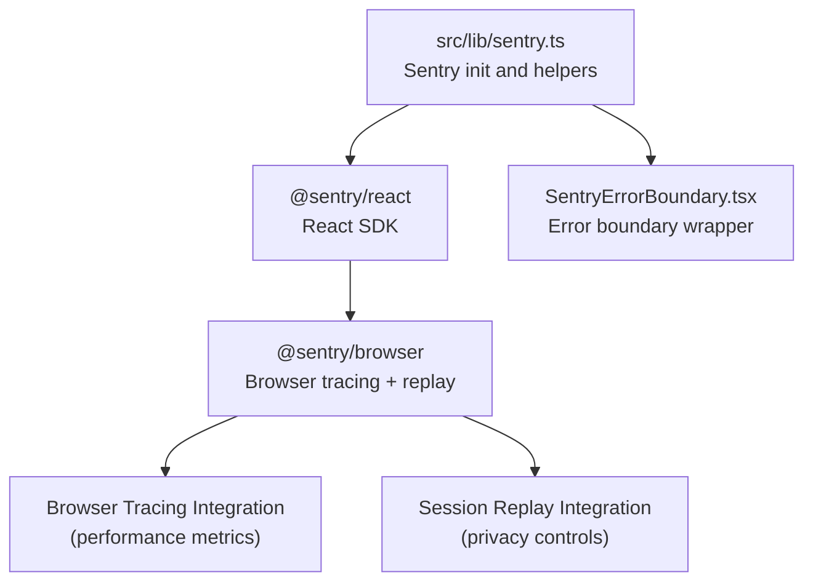
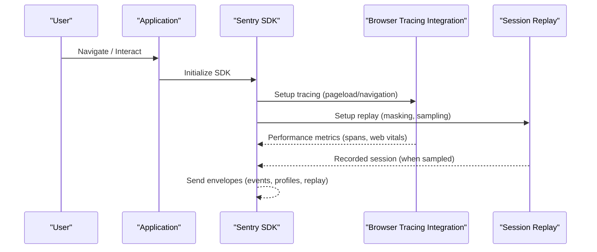
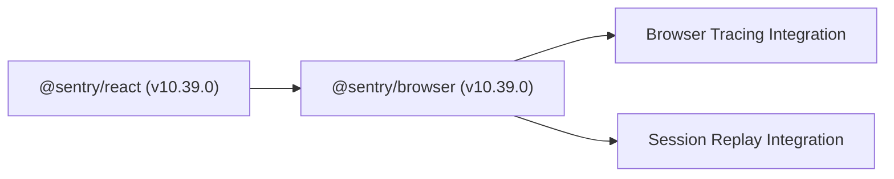

# Performance Monitoring

<cite>
**Referenced Files in This Document**
- [sentry.ts](file://src/lib/sentry.ts)
- [package.json](file://package.json)
- [browserTracingIntegration.js](file://node_modules/@sentry/browser/build/npm/esm/dev/tracing/browserTracingIntegration.js)
- [SentryErrorBoundary.tsx](file://src/components/SentryErrorBoundary.tsx)
</cite>

## Table of Contents
1. [Introduction](#introduction)
2. [Project Structure](#project-structure)
3. [Core Components](#core-components)
4. [Architecture Overview](#architecture-overview)
5. [Detailed Component Analysis](#detailed-component-analysis)
6. [Dependency Analysis](#dependency-analysis)
7. [Performance Considerations](#performance-considerations)
8. [Troubleshooting Guide](#troubleshooting-guide)
9. [Conclusion](#conclusion)

## Introduction
This document explains how performance monitoring is implemented using Sentry in the project. It covers browser tracing integration, how performance metrics are captured across user interactions, tracing sampling rates and their overhead impact, session replay configuration with masking and privacy controls, and practical guidance for interpreting performance data to identify bottlenecks and optimize application performance.

## Project Structure
The performance monitoring implementation centers around a dedicated Sentry initialization module and the browser tracing integration. The Sentry SDK is integrated via the official React SDK and includes browser tracing and session replay capabilities.

**Diagram sources**
- [sentry.ts:1-73](file://src/lib/sentry.ts#L1-L73)
- [package.json:91-92](file://package.json#L91-L92)
- [browserTracingIntegration.js:1-200](file://node_modules/@sentry/browser/build/npm/esm/dev/tracing/browserTracingIntegration.js#L1-L200)

**Section sources**
- [sentry.ts:1-73](file://src/lib/sentry.ts#L1-L73)
- [package.json:91-92](file://package.json#L91-L92)

## Core Components
- Sentry initialization and configuration
  - Initializes Sentry with DSN, browser tracing, and session replay integrations.
  - Sets performance monitoring sampling rate and session replay sampling rates.
  - Applies environment and release metadata.
  - Filters sensitive user data before sending events.
- Helper functions for capturing errors, messages, and user context.
- Error boundary integration for graceful error handling and reporting.

**Section sources**
- [sentry.ts:3-37](file://src/lib/sentry.ts#L3-L37)
- [sentry.ts:39-72](file://src/lib/sentry.ts#L39-L72)
- [SentryErrorBoundary.tsx:1-200](file://src/components/SentryErrorBoundary.tsx#L1-L200)

## Architecture Overview
Sentry’s browser tracing automatically instruments page loads and navigation transactions, capturing resource spans, long tasks, long animation frames, first input delay (INP), and element timing. Session Replay records user sessions for visual debugging, with configurable masking and privacy controls.

**Diagram sources**
- [sentry.ts:9-37](file://src/lib/sentry.ts#L9-L37)
- [browserTracingIntegration.js:1-200](file://node_modules/@sentry/browser/build/npm/esm/dev/tracing/browserTracingIntegration.js#L1-L200)

## Detailed Component Analysis

### Sentry Initialization and Sampling
- Browser tracing integration is enabled with explicit options for long tasks, long animation frames, INP, and element timing.
- Performance monitoring sampling rate is set to 1.0 (100%), meaning all pageload and navigation transactions are captured.
- Session replay sampling:
  - Session sample rate is set to 0.1 (10%) for performance sessions.
  - Error-only replay sample rate is set to 1.0 (100%) to ensure all error sessions are recorded.
- Environment and release metadata are set from environment variables.
- Before sending events, sensitive user data is filtered out.

Practical implications:
- With a 1.0 traces sample rate, every pageload and navigation generates a transaction with spans and performance metrics.
- Session replay adds overhead; the 0.1 session sample rate reduces recording frequency while still capturing errors via the 1.0 onError sample rate.

**Section sources**
- [sentry.ts:9-37](file://src/lib/sentry.ts#L9-L37)

### Browser Tracing Integration
The browser tracing integration captures:
- Pageload and navigation transactions.
- Outgoing requests with HTTP timings.
- Long tasks and long animation frames.
- First Input Delay (INP) and Element Timing.
- Web Vitals (e.g., LCP, CLS) attached to transactions.

Options commonly used in this project:
- Long task and long animation frame capture enabled.
- INP and element timing capture enabled.
- Automatic detection of redirects and linking of subsequent traces for coherent user journeys.

These features provide comprehensive visibility into user-perceived performance across interactions.

**Section sources**
- [browserTracingIntegration.js:1-200](file://node_modules/@sentry/browser/build/npm/esm/dev/tracing/browserTracingIntegration.js#L1-L200)

### Session Replay Configuration and Privacy Controls
Session Replay is configured with:
- Masking options to hide text and media by default.
- Separate sampling rates for sessions and error-only recordings.

Privacy controls:
- Text and media are masked by default to protect sensitive content.
- Sampling rates reduce overhead and limit data retention.

Impact:
- Lower session replay sampling reduces CPU and bandwidth usage.
- Error-only sampling ensures problematic sessions are captured even with reduced baseline coverage.

**Section sources**
- [sentry.ts:13-22](file://src/lib/sentry.ts#L13-L22)

### Error Boundary Integration
The application wraps rendering with a Sentry error boundary to gracefully capture unhandled errors and surface them to Sentry. This improves observability of runtime failures alongside performance data.

**Section sources**
- [SentryErrorBoundary.tsx:1-200](file://src/components/SentryErrorBoundary.tsx#L1-L200)

## Dependency Analysis
Sentry is integrated via the React SDK and browser SDK. The browser SDK powers both tracing and session replay.

**Diagram sources**
- [package.json:91-92](file://package.json#L91-L92)

**Section sources**
- [package.json:91-92](file://package.json#L91-L92)

## Performance Considerations
- Tracing sampling rate
  - At 1.0, every pageload and navigation is traced, which maximizes observability but increases overhead. Consider lowering to a smaller fraction (e.g., 0.1–0.5) in production to balance insight and cost.
- Session replay sampling
  - Baseline session replay at 0.1 reduces overhead while still capturing errors at 1.0. Adjust based on performance budget and privacy requirements.
- Metrics capture
  - Long tasks, long animation frames, INP, and element timing add instrumentation overhead. Disable selectively if CPU usage spikes under load.
- Filtering and privacy
  - Removing sensitive user data before sending reduces payload sizes and improves compliance.

[No sources needed since this section provides general guidance]

## Troubleshooting Guide
- Development vs. production behavior
  - In development, Sentry initialization is skipped. Ensure production builds set the DSN and environment variables to enable monitoring.
- Verifying sampling
  - Confirm that tracesSampleRate and replaysSessionSampleRate are set appropriately in the Sentry initialization.
- Privacy and masking
  - If sensitive content appears in replays, adjust masking options and review the replay configuration.
- Error boundary coverage
  - Wrap critical parts of the app with the error boundary to ensure unhandled errors are captured and reported.

**Section sources**
- [sentry.ts:4-7](file://src/lib/sentry.ts#L4-L7)
- [sentry.ts:13-22](file://src/lib/sentry.ts#L13-L22)
- [SentryErrorBoundary.tsx:1-200](file://src/components/SentryErrorBoundary.tsx#L1-L200)

## Conclusion
The project integrates Sentry with browser tracing and session replay to deliver comprehensive performance monitoring. With a 1.0 tracing sample rate and targeted replay sampling, it balances observability and overhead. Privacy is enforced via masking and selective replay sampling. Use the built-in helpers and error boundary to ensure robust error and performance telemetry, and tune sampling rates to meet performance budgets.