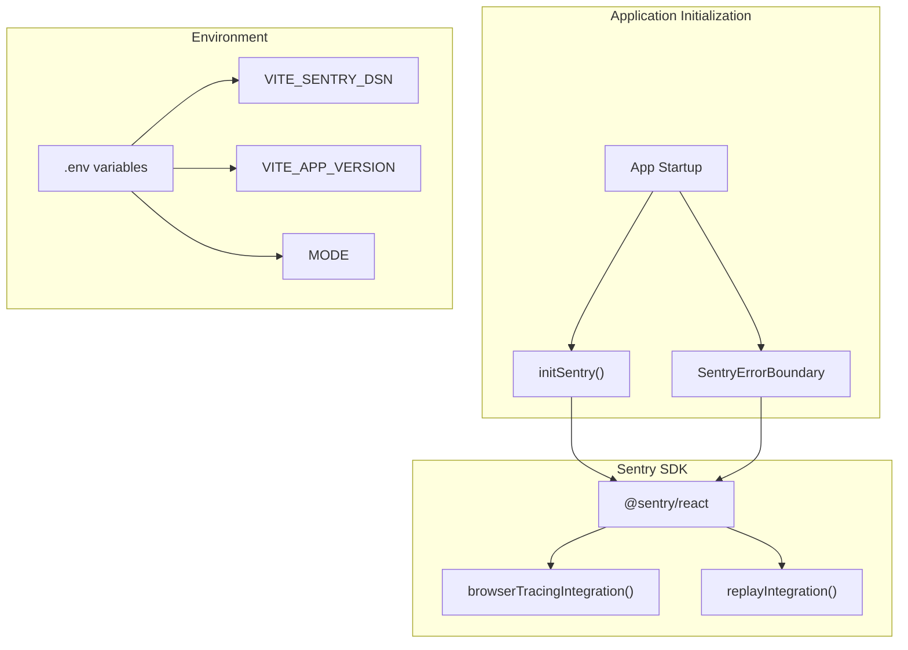
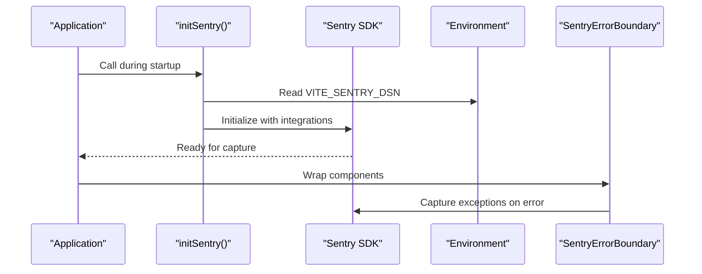
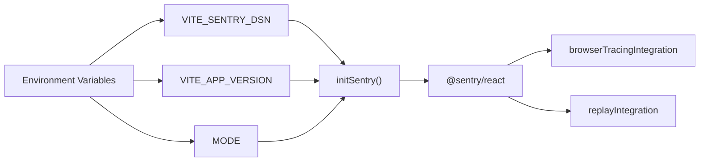

# Sentry Configuration

<cite>
**Referenced Files in This Document**
- [sentry.ts](file://src/lib/sentry.ts)
- [SentryErrorBoundary.tsx](file://src/components/SentryErrorBoundary.tsx)
- [DEPLOYMENT_SUMMARY.md](file://DEPLOYMENT_SUMMARY.md)
- [FINAL_STEPS.md](file://FINAL_STEPS.md)
- [system-architecture.html](file://docs/plans/system-architecture.html)
</cite>

## Table of Contents
1. [Introduction](#introduction)
2. [Project Structure](#project-structure)
3. [Core Components](#core-components)
4. [Architecture Overview](#architecture-overview)
5. [Detailed Component Analysis](#detailed-component-analysis)
6. [Dependency Analysis](#dependency-analysis)
7. [Performance Considerations](#performance-considerations)
8. [Troubleshooting Guide](#troubleshooting-guide)
9. [Conclusion](#conclusion)

## Introduction
This document provides comprehensive guidance for configuring Sentry error tracking and performance monitoring in the Nutrio application. It covers initialization, environment-specific behavior, browser tracing and session replay integration, sampling rate configuration, and practical examples for different deployment environments. The focus is on the production-ready implementation present in the codebase and deployment documentation.

## Project Structure
The Sentry configuration in Nutrio consists of:
- A dedicated library module that initializes the Sentry SDK with browser tracing and session replay
- An error boundary component that integrates with Sentry for uncaught errors
- Deployment documentation specifying environment variables and configuration steps

**Diagram sources**
- [sentry.ts:3-37](file://src/lib/sentry.ts#L3-L37)
- [SentryErrorBoundary.tsx:14-33](file://src/components/SentryErrorBoundary.tsx#L14-L33)
- [DEPLOYMENT_SUMMARY.md:36-44](file://DEPLOYMENT_SUMMARY.md#L36-L44)

**Section sources**
- [sentry.ts:1-73](file://src/lib/sentry.ts#L1-L73)
- [SentryErrorBoundary.tsx:1-48](file://src/components/SentryErrorBoundary.tsx#L1-L48)
- [DEPLOYMENT_SUMMARY.md:1-85](file://DEPLOYMENT_SUMMARY.md#L1-L85)

## Core Components
This section details the primary Sentry integration components and their responsibilities.

### Sentry Library Module
The library module encapsulates Sentry initialization and utility functions:
- Initializes Sentry with DSN, integrations, environment, and release version
- Disables Sentry in development mode
- Provides helper functions for capturing errors, messages, and user context

Key capabilities:
- Browser tracing integration for performance monitoring
- Session replay integration with configurable masking
- Sampling rates for performance and replay capture
- PII filtering before sending events
- User context management for correlation

**Section sources**
- [sentry.ts:3-37](file://src/lib/sentry.ts#L3-L37)
- [sentry.ts:39-72](file://src/lib/sentry.ts#L39-L72)

### Error Boundary Integration
The error boundary component integrates with Sentry to capture uncaught errors:
- Wraps application components to intercept rendering errors
- Sends error details to Sentry with component stack information
- Provides graceful fallback UI in production

**Section sources**
- [SentryErrorBoundary.tsx:14-33](file://src/components/SentryErrorBoundary.tsx#L14-L33)
- [SentryErrorBoundary.tsx:35-48](file://src/components/SentryErrorBoundary.tsx#L35-L48)

## Architecture Overview
The Sentry integration follows a layered approach:
- Initialization occurs early in the application lifecycle
- Error boundary wraps the application for runtime error capture
- Environment variables drive configuration for production deployments

**Diagram sources**
- [sentry.ts:3-37](file://src/lib/sentry.ts#L3-L37)
- [SentryErrorBoundary.tsx:19-33](file://src/components/SentryErrorBoundary.tsx#L19-L33)
- [system-architecture.html:934-958](file://docs/plans/system-architecture.html#L934-L958)

**Section sources**
- [system-architecture.html:934-958](file://docs/plans/system-architecture.html#L934-L958)

## Detailed Component Analysis

### Sentry Initialization and Configuration
The initialization function performs the following:
- Checks development mode and disables Sentry in development
- Reads DSN from environment variables
- Sets up browser tracing and session replay integrations
- Configures sampling rates for performance and replay capture
- Sets environment and release version metadata
- Applies PII filtering before sending events

```mermaid
flowchart TD
Start(["initSentry() called"]) --> CheckDev{"import.meta.env.DEV?"}
CheckDev --> |Yes| Disable["Log and return (disabled)"]
CheckDev --> |No| ReadEnv["Read VITE_SENTRY_DSN"]
ReadEnv --> SetupIntegrations["Configure browserTracingIntegration<br/>and replayIntegration"]
SetupIntegrations --> SetupSampling["Set tracesSampleRate<br/>Set replaysSessionSampleRate<br/>Set replaysOnErrorSampleRate"]
SetupSampling --> SetMeta["Set environment and release"]
SetMeta --> PII["Apply beforeSend PII filter"]
PII --> InitSDK["Initialize Sentry SDK"]
InitSDK --> End(["Ready"])
```

**Diagram sources**
- [sentry.ts:3-37](file://src/lib/sentry.ts#L3-L37)

**Section sources**
- [sentry.ts:3-37](file://src/lib/sentry.ts#L3-L37)

### Browser Tracing Integration
Browser tracing enables performance monitoring:
- Captures navigation and pageload spans
- Integrates with the tracing sample rate setting
- Provides insights into frontend performance

Configuration highlights:
- Enabled via `Sentry.browserTracingIntegration()`
- Controlled by `tracesSampleRate` setting

**Section sources**
- [sentry.ts:11-12](file://src/lib/sentry.ts#L11-L12)
- [sentry.ts](file://src/lib/sentry.ts#L19)

### Session Replay Integration
Session replay captures user sessions for debugging:
- Enabled via `Sentry.replayIntegration()`
- Configurable masking options for text and media
- Separate sampling rates for session and error-based replays

Configuration highlights:
- `maskAllText: false` and `blockAllMedia: false` for privacy balance
- `replaysSessionSampleRate: 0.1` for periodic sampling
- `replaysOnErrorSampleRate: 1.0` for capturing replays on errors

**Section sources**
- [sentry.ts:13-16](file://src/lib/sentry.ts#L13-L16)
- [sentry.ts:21-22](file://src/lib/sentry.ts#L21-L22)

### Environment and Release Management
Environment and release metadata enhance observability:
- Environment is set from `import.meta.env.MODE`
- Release version is set from `import.meta.env.VITE_APP_VERSION` with fallback to `"1.0.0"`
- These values appear in Sentry events for correlation

**Section sources**
- [sentry.ts](file://src/lib/sentry.ts#L24)
- [sentry.ts](file://src/lib/sentry.ts#L26)

### PII Filtering
Before sending events, sensitive user data is filtered:
- Removes email and IP address from user context
- Ensures compliance with privacy requirements

**Section sources**
- [sentry.ts:28-35](file://src/lib/sentry.ts#L28-L35)

### Error Boundary Integration Details
The error boundary component:
- Intercepts rendering errors using `getDerivedStateFromError`
- Captures exceptions with component stack information
- Provides fallback UI in production while suppressing logs in development

**Section sources**
- [SentryErrorBoundary.tsx:19-33](file://src/components/SentryErrorBoundary.tsx#L19-L33)
- [SentryErrorBoundary.tsx:35-48](file://src/components/SentryErrorBoundary.tsx#L35-L48)

## Dependency Analysis
The Sentry integration depends on environment variables and follows a specific initialization order within the application lifecycle.

**Diagram sources**
- [sentry.ts:9-26](file://src/lib/sentry.ts#L9-L26)
- [DEPLOYMENT_SUMMARY.md:36-44](file://DEPLOYMENT_SUMMARY.md#L36-L44)

**Section sources**
- [sentry.ts:9-26](file://src/lib/sentry.ts#L9-L26)
- [DEPLOYMENT_SUMMARY.md:36-44](file://DEPLOYMENT_SUMMARY.md#L36-L44)

## Performance Considerations
- Sampling rates should be tuned based on traffic volume and storage costs:
  - `tracesSampleRate: 1.0` captures all performance traces in current configuration
  - `replaysSessionSampleRate: 0.1` samples 10% of sessions for replay capture
  - `replaysOnErrorSampleRate: 1.0` ensures replays are captured on all errors
- Masking options (`maskAllText`, `blockAllMedia`) balance privacy with replay usefulness
- Environment and release metadata help correlate performance across deployments

[No sources needed since this section provides general guidance]

## Troubleshooting Guide
Common issues and resolutions:
- Sentry not initializing in development:
  - Expected behavior: Sentry is disabled in development mode
  - Verify `import.meta.env.DEV` evaluation and console logs
- Missing DSN configuration:
  - Ensure `VITE_SENTRY_DSN` is set in production environment
  - Confirm environment variable availability at build/runtime
- Session replay not appearing:
  - Check `replaysSessionSampleRate` and `replaysOnErrorSampleRate` values
  - Verify replay integration configuration and privacy masking settings
- Error boundary not capturing errors:
  - Ensure the boundary wraps the affected components
  - Confirm production build and absence of development mode overrides

**Section sources**
- [sentry.ts:4-7](file://src/lib/sentry.ts#L4-L7)
- [SentryErrorBoundary.tsx:26-33](file://src/components/SentryErrorBoundary.tsx#L26-L33)

## Conclusion
The Nutrio application implements a robust Sentry configuration that includes browser tracing, session replay, environment-aware metadata, and PII filtering. The setup is designed for production readiness with environment-driven configuration and sensible sampling defaults. By following the deployment guidelines and environment variable requirements, teams can effectively monitor application performance and errors across environments.