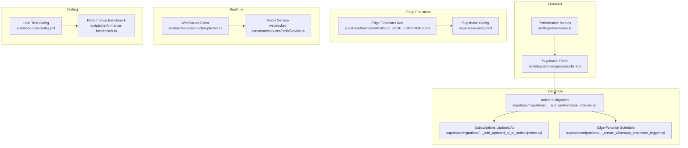
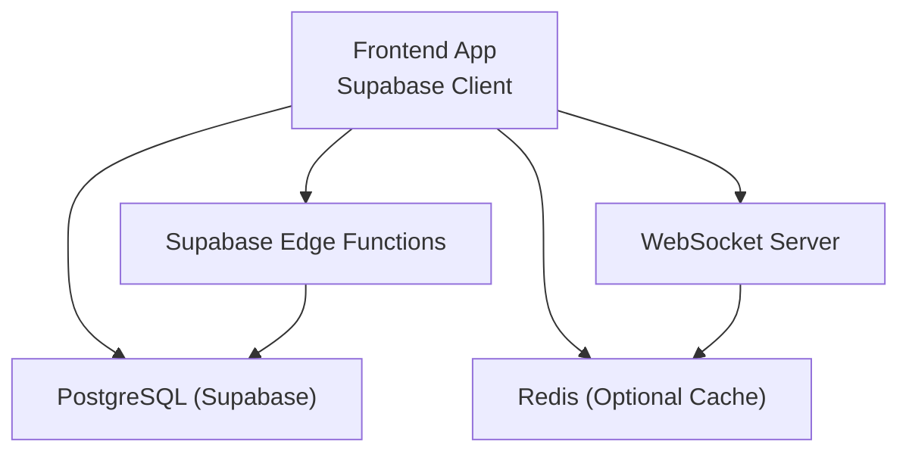
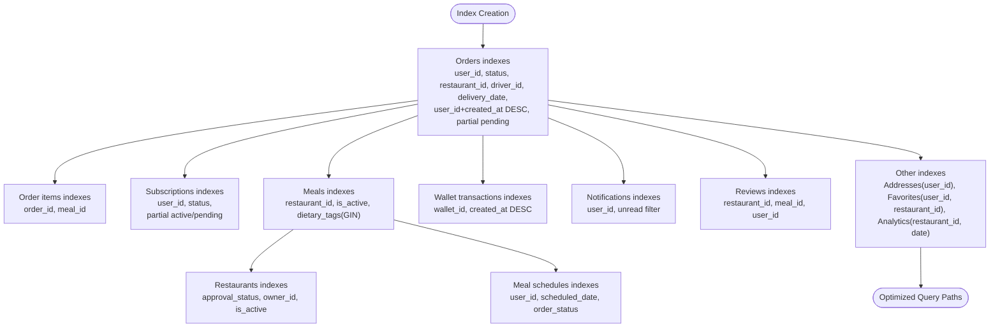
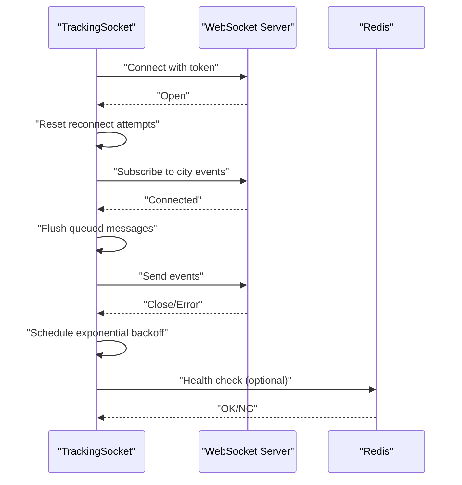
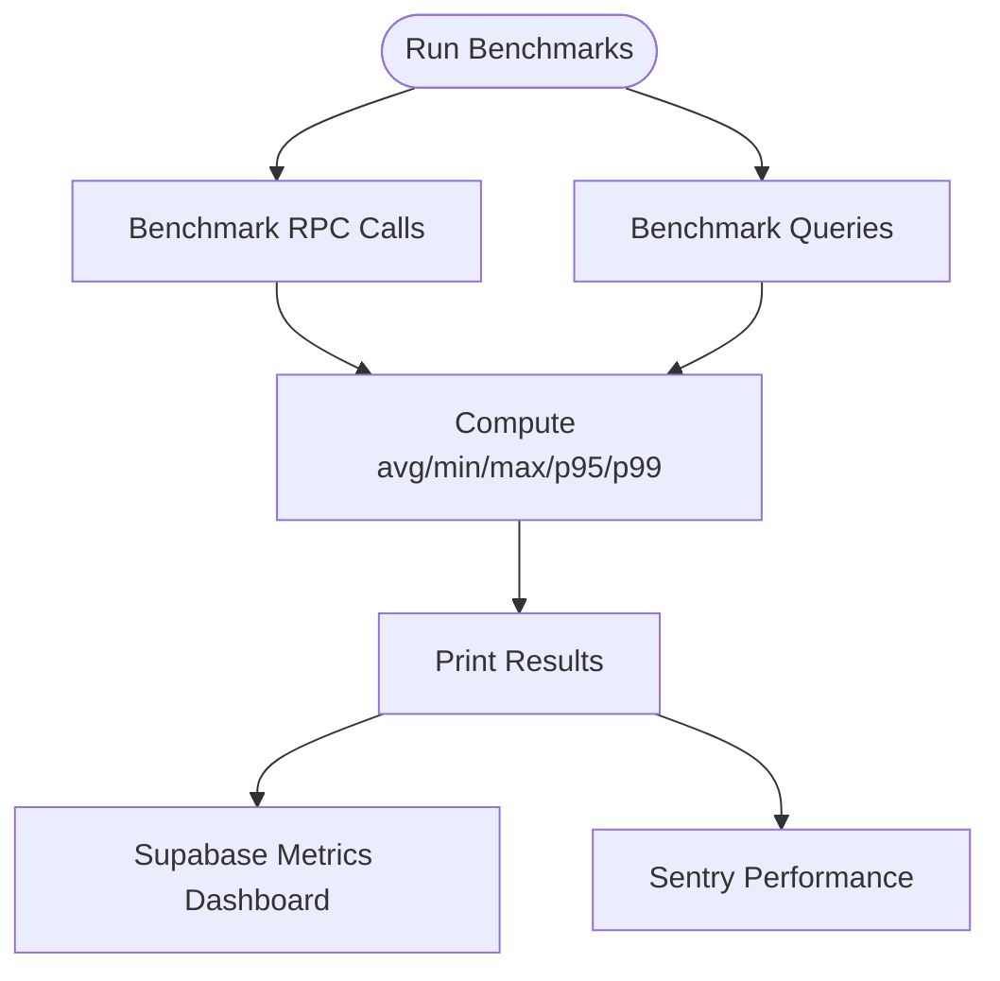
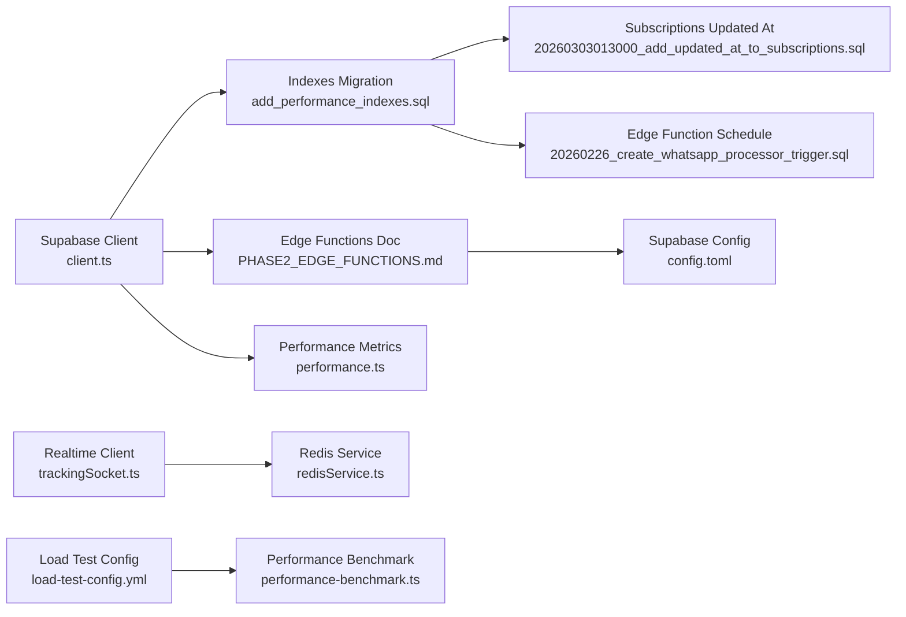

# Database Performance

<cite>
**Referenced Files in This Document**
- [client.ts](file://src/integrations/supabase/client.ts)
- [performance-benchmark.ts](file://scripts/performance-benchmark.ts)
- [PHASE2_EDGE_FUNCTIONS.md](file://supabase/functions/PHASE2_EDGE_FUNCTIONS.md)
- [add_performance_indexes.sql](file://supabase/migrations/20250218000001_add_performance_indexes.sql)
- [load-test-config.yml](file://tests/load-test-config.yml)
- [trackingSocket.ts](file://src/fleet/services/trackingSocket.ts)
- [redisService.ts](file://websocket-server/src/services/redisService.ts)
- [20260303013000_add_updated_at_to_subscriptions.sql](file://supabase/migrations/20260303013000_add_updated_at_to_subscriptions.sql)
- [20260226_create_whatsapp_processor_trigger.sql](file://supabase/migrations/20260226_create_whatsapp_processor_trigger.sql)
- [config.toml](file://supabase/config.toml)
- [load-test-config.yml](file://tests/load-test-config.yml)
- [performance.ts](file://src/lib/performance.ts)
- [COMPLETE_PRODUCTION_AUDIT_FINAL.md](file://COMPLETE_PRODUCTION_AUDIT_FINAL.md)
</cite>

## Table of Contents
1. [Introduction](#introduction)
2. [Project Structure](#project-structure)
3. [Core Components](#core-components)
4. [Architecture Overview](#architecture-overview)
5. [Detailed Component Analysis](#detailed-component-analysis)
6. [Dependency Analysis](#dependency-analysis)
7. [Performance Considerations](#performance-considerations)
8. [Troubleshooting Guide](#troubleshooting-guide)
9. [Conclusion](#conclusion)

## Introduction
This document provides a comprehensive guide to database performance profiling in Nutrio’s Supabase implementation. It covers query optimization techniques (index usage, query execution plans, and connection pooling), edge function performance monitoring (cold start optimization, execution time tracking, and resource utilization), real-time subscription efficiency (connection management, data filtering, and event batching), and the use of Supabase’s built-in monitoring tools alongside custom performance metrics. Practical examples demonstrate how to optimize slow queries, implement effective indexing strategies, and manage database connections efficiently.

## Project Structure
The performance-focused components are distributed across:
- Supabase client configuration and edge function documentation
- Database migration scripts introducing performance indexes
- Load testing and performance benchmarking utilities
- Real-time WebSocket client and Redis services
- Supabase configuration and monitoring artifacts

**Diagram sources**
- [client.ts:1-57](file://src/integrations/supabase/client.ts#L1-L57)
- [PHASE2_EDGE_FUNCTIONS.md:1-411](file://supabase/functions/PHASE2_EDGE_FUNCTIONS.md#L1-L411)
- [config.toml:1-59](file://supabase/config.toml#L1-L59)
- [add_performance_indexes.sql:1-73](file://supabase/migrations/20250218000001_add_performance_indexes.sql#L1-L73)
- [20260303013000_add_updated_at_to_subscriptions.sql:1-11](file://supabase/migrations/20260303013000_add_updated_at_to_subscriptions.sql#L1-L11)
- [20260226_create_whatsapp_processor_trigger.sql:34-46](file://supabase/migrations/20260226_create_whatsapp_processor_trigger.sql#L34-L46)
- [trackingSocket.ts:36-214](file://src/fleet/services/trackingSocket.ts#L36-L214)
- [redisService.ts:233-263](file://websocket-server/src/services/redisService.ts#L233-L263)
- [load-test-config.yml:1-173](file://tests/load-test-config.yml#L1-L173)
- [performance-benchmark.ts:1-232](file://scripts/performance-benchmark.ts#L1-L232)
- [performance.ts](file://src/lib/performance.ts)

**Section sources**
- [client.ts:1-57](file://src/integrations/supabase/client.ts#L1-L57)
- [PHASE2_EDGE_FUNCTIONS.md:1-411](file://supabase/functions/PHASE2_EDGE_FUNCTIONS.md#L1-L411)
- [config.toml:1-59](file://supabase/config.toml#L1-L59)
- [add_performance_indexes.sql:1-73](file://supabase/migrations/20250218000001_add_performance_indexes.sql#L1-L73)
- [trackingSocket.ts:36-214](file://src/fleet/services/trackingSocket.ts#L36-L214)
- [redisService.ts:233-263](file://websocket-server/src/services/redisService.ts#L233-L263)
- [load-test-config.yml:1-173](file://tests/load-test-config.yml#L1-L173)
- [performance-benchmark.ts:1-232](file://scripts/performance-benchmark.ts#L1-L232)
- [performance.ts](file://src/lib/performance.ts)

## Core Components
- Supabase client configuration with Capacitor storage adapter for sessions and persistence.
- Edge functions documentation detailing deployment, environment variables, triggers, and monitoring.
- Database migration introducing targeted indexes for critical tables and partial indexes for common query patterns.
- Real-time WebSocket client with exponential backoff and message queuing.
- Performance benchmarking suite measuring RPC and query latencies with percentiles and error tracking.
- Load testing configuration defining concurrency phases and performance thresholds.
- Redis service for connection lifecycle management and health checks.

**Section sources**
- [client.ts:1-57](file://src/integrations/supabase/client.ts#L1-L57)
- [PHASE2_EDGE_FUNCTIONS.md:1-411](file://supabase/functions/PHASE2_EDGE_FUNCTIONS.md#L1-L411)
- [add_performance_indexes.sql:1-73](file://supabase/migrations/20250218000001_add_performance_indexes.sql#L1-L73)
- [trackingSocket.ts:36-214](file://src/fleet/services/trackingSocket.ts#L36-L214)
- [performance-benchmark.ts:1-232](file://scripts/performance-benchmark.ts#L1-L232)
- [load-test-config.yml:1-173](file://tests/load-test-config.yml#L1-L173)
- [redisService.ts:233-263](file://websocket-server/src/services/redisService.ts#L233-L263)

## Architecture Overview
The system integrates Supabase for relational data and edge functions for automation, with real-time capabilities via WebSocket and optional Redis-backed caching. Performance monitoring spans frontend Web Vitals, backend Supabase metrics, and custom benchmarks.

**Diagram sources**
- [client.ts:1-57](file://src/integrations/supabase/client.ts#L1-L57)
- [PHASE2_EDGE_FUNCTIONS.md:1-411](file://supabase/functions/PHASE2_EDGE_FUNCTIONS.md#L1-L411)
- [add_performance_indexes.sql:1-73](file://supabase/migrations/20250218000001_add_performance_indexes.sql#L1-L73)
- [trackingSocket.ts:36-214](file://src/fleet/services/trackingSocket.ts#L36-L214)
- [redisService.ts:233-263](file://websocket-server/src/services/redisService.ts#L233-L263)

## Detailed Component Analysis

### Database Indexing Strategy
Nutrio’s migration introduces indexes on frequently queried columns and composite indexes to accelerate common filters and joins. Partial indexes further optimize hot query patterns by restricting index coverage to rows matching active or pending states.

Key index categories:
- Orders: user_id, status, restaurant_id, driver_id, delivery_date; composite user_id + created_at DESC; partial pending orders
- Order items: order_id, meal_id
- Subscriptions: user_id, status; partial active/pending subscriptions
- Meals: restaurant_id, is_active, dietary_tags (GIN)
- Restaurants: approval_status, owner_id, is_active
- Meal schedules: user_id, scheduled_date, order_status
- Wallet transactions: wallet_id, created_at DESC
- Notifications: user_id, unread filter
- Reviews: restaurant_id, meal_id, user_id
- Addresses and Favorites: user_id, restaurant_id
- Analytics: restaurant_id, date

**Diagram sources**
- [add_performance_indexes.sql:1-73](file://supabase/migrations/20250218000001_add_performance_indexes.sql#L1-L73)

**Section sources**
- [add_performance_indexes.sql:1-73](file://supabase/migrations/20250218000001_add_performance_indexes.sql#L1-L73)

### Optimizing Slow Queries
Practical steps to optimize slow queries:
- Confirm index coverage for equality and range predicates on WHERE clauses.
- Use EXPLAIN/EXPLAIN ANALYZE to inspect query plans and ensure index scans are used.
- Prefer selective filters early in WHERE clauses to reduce row counts.
- Avoid expressions on indexed columns; rewrite conditions to use base columns.
- Limit SELECT lists to required columns and paginate results.
- Use LIMIT for exploratory queries; rely on indexes for ORDER BY with covered sorts.

Examples of targeted optimizations supported by existing indexes:
- User order history: filter by user_id and order by created_at DESC using composite index.
- Pending orders: leverage partial index on status with appropriate WHERE clause.
- Subscription status checks: filter by user_id and status using dedicated index.

**Section sources**
- [add_performance_indexes.sql:1-73](file://supabase/migrations/20250218000001_add_performance_indexes.sql#L1-L73)

### Connection Pooling Strategies
Connection pooling is essential for handling sustained loads without timeouts. Best practices:
- Keep persistent connections open for the duration of the app lifecycle.
- Reuse a single Supabase client instance per environment.
- Avoid creating new clients per request; maintain one client per tenant/session if needed.
- Monitor database connection utilization and scale Supabase plan accordingly.
- Apply connection limits and timeouts in client configuration.

Evidence of pooling focus in testing:
- Load test configuration explicitly requires “Database connection pooling must handle load.”

**Section sources**
- [load-test-config.yml:154-172](file://tests/load-test-config.yml#L154-L172)

### Edge Function Performance Monitoring
Edge functions require careful monitoring for cold starts, execution time, and resource usage. The documentation outlines:
- Environment variables and deployment steps.
- Error handling patterns and logging.
- Monitoring via Supabase CLI logs for both functions.
- Automation triggers and scheduling via pg_net and cron.

Cold start optimization tips:
- Keep function bundles minimal; avoid heavy imports.
- Initialize expensive resources outside handler scope.
- Use service role keys securely and validate inputs early.
- Batch external API calls and respect rate limits.

Execution time tracking:
- Use Supabase logs to capture latency and error rates.
- Integrate with Sentry for performance breadcrumbs and error tracking.

Resource utilization:
- Monitor CPU and memory spikes; adjust function timeouts and retry policies.
- Use partial indexes and efficient queries to reduce runtime.

**Section sources**
- [PHASE2_EDGE_FUNCTIONS.md:1-411](file://supabase/functions/PHASE2_EDGE_FUNCTIONS.md#L1-L411)
- [config.toml:1-59](file://supabase/config.toml#L1-L59)

### Real-Time Subscription Efficiency
Real-time updates are handled via WebSocket with robust connection management:
- Exponential backoff and reconnect scheduling to handle transient failures.
- Message queue flushed upon successful connection to ensure no events are missed.
- Role-based subscription routing to minimize unnecessary traffic.
- Optional Redis integration for scalable pub/sub and connection lifecycle management.

**Diagram sources**
- [trackingSocket.ts:36-214](file://src/fleet/services/trackingSocket.ts#L36-L214)
- [redisService.ts:233-263](file://websocket-server/src/services/redisService.ts#L233-L263)

**Section sources**
- [trackingSocket.ts:36-214](file://src/fleet/services/trackingSocket.ts#L36-L214)
- [redisService.ts:233-263](file://websocket-server/src/services/redisService.ts#L233-L263)

### Database Query Profiling and Custom Metrics
Supabase provides built-in monitoring dashboards for query performance and database metrics. Custom performance metrics complement this:
- Frontend Web Vitals tracking for user-perceived performance.
- Supabase client-side timing and Sentry breadcrumbs for API latency.
- Dedicated performance benchmarking suite capturing RPC and query latencies with percentiles.

**Diagram sources**
- [performance-benchmark.ts:1-232](file://scripts/performance-benchmark.ts#L1-L232)
- [performance.ts](file://src/lib/performance.ts)

**Section sources**
- [performance-benchmark.ts:1-232](file://scripts/performance-benchmark.ts#L1-L232)
- [performance.ts](file://src/lib/performance.ts)

### Additional Database Enhancements
- Subscriptions updated_at column added for compatibility with legacy function paths, ensuring safe updates while newer versions phase in.
- Edge function scheduler table enables periodic execution when pg_cron is unavailable, supporting maintenance tasks like notification processing.

**Section sources**
- [20260303013000_add_updated_at_to_subscriptions.sql:1-11](file://supabase/migrations/20260303013000_add_updated_at_to_subscriptions.sql#L1-L11)
- [20260226_create_whatsapp_processor_trigger.sql:34-46](file://supabase/migrations/20260226_create_whatsapp_processor_trigger.sql#L34-L46)

## Dependency Analysis
The performance ecosystem depends on coordinated components across client, database, edge functions, and real-time layers.

**Diagram sources**
- [client.ts:1-57](file://src/integrations/supabase/client.ts#L1-L57)
- [add_performance_indexes.sql:1-73](file://supabase/migrations/20250218000001_add_performance_indexes.sql#L1-L73)
- [PHASE2_EDGE_FUNCTIONS.md:1-411](file://supabase/functions/PHASE2_EDGE_FUNCTIONS.md#L1-L411)
- [config.toml:1-59](file://supabase/config.toml#L1-L59)
- [20260303013000_add_updated_at_to_subscriptions.sql:1-11](file://supabase/migrations/20260303013000_add_updated_at_to_subscriptions.sql#L1-L11)
- [20260226_create_whatsapp_processor_trigger.sql:34-46](file://supabase/migrations/20260226_create_whatsapp_processor_trigger.sql#L34-L46)
- [trackingSocket.ts:36-214](file://src/fleet/services/trackingSocket.ts#L36-L214)
- [redisService.ts:233-263](file://websocket-server/src/services/redisService.ts#L233-L263)
- [load-test-config.yml:1-173](file://tests/load-test-config.yml#L1-L173)
- [performance-benchmark.ts:1-232](file://scripts/performance-benchmark.ts#L1-L232)
- [performance.ts](file://src/lib/performance.ts)

**Section sources**
- [client.ts:1-57](file://src/integrations/supabase/client.ts#L1-L57)
- [PHASE2_EDGE_FUNCTIONS.md:1-411](file://supabase/functions/PHASE2_EDGE_FUNCTIONS.md#L1-L411)
- [config.toml:1-59](file://supabase/config.toml#L1-L59)
- [add_performance_indexes.sql:1-73](file://supabase/migrations/20250218000001_add_performance_indexes.sql#L1-L73)
- [20260303013000_add_updated_at_to_subscriptions.sql:1-11](file://supabase/migrations/20260303013000_add_updated_at_to_subscriptions.sql#L1-L11)
- [20260226_create_whatsapp_processor_trigger.sql:34-46](file://supabase/migrations/20260226_create_whatsapp_processor_trigger.sql#L34-L46)
- [trackingSocket.ts:36-214](file://src/fleet/services/trackingSocket.ts#L36-L214)
- [redisService.ts:233-263](file://websocket-server/src/services/redisService.ts#L233-L263)
- [load-test-config.yml:1-173](file://tests/load-test-config.yml#L1-L173)
- [performance-benchmark.ts:1-232](file://scripts/performance-benchmark.ts#L1-L232)
- [performance.ts](file://src/lib/performance.ts)

## Performance Considerations
- Query optimization: leverage composite and partial indexes; avoid unnecessary scans; limit result sets; use pagination.
- Connection pooling: reuse clients; monitor utilization; scale plans; enforce timeouts.
- Edge functions: minimize cold starts; batch external calls; monitor logs; track execution times.
- Real-time: implement exponential backoff; queue messages; filter events; integrate Redis for scalability.
- Monitoring: combine Supabase dashboards with Sentry and custom benchmarks; define thresholds aligned with load tests.

[No sources needed since this section provides general guidance]

## Troubleshooting Guide
Common issues and remedies:
- Database connection timeouts: verify connection pooling configuration and upgrade Supabase plan if needed.
- Edge function cold starts: reduce bundle size, initialize resources outside handlers, and validate environment variables.
- Real-time disconnections: confirm exponential backoff and message queue flushing; check Redis health if used.
- Slow queries: review query plans, ensure index usage, and apply selective filters.

**Section sources**
- [load-test-config.yml:154-172](file://tests/load-test-config.yml#L154-L172)
- [PHASE2_EDGE_FUNCTIONS.md:325-361](file://supabase/functions/PHASE2_EDGE_FUNCTIONS.md#L325-L361)
- [trackingSocket.ts:164-178](file://src/fleet/services/trackingSocket.ts#L164-L178)
- [redisService.ts:254-263](file://websocket-server/src/services/redisService.ts#L254-L263)

## Conclusion
Nutrio’s Supabase implementation incorporates targeted indexing, edge function monitoring, and real-time connection management to achieve strong performance at scale. By aligning database queries with composite and partial indexes, maintaining efficient connection pooling, and leveraging Supabase’s monitoring tools with custom benchmarks, the system can sustain high concurrency while preserving responsiveness. Continuous profiling and iterative optimization will ensure long-term reliability under increasing load.

[No sources needed since this section summarizes without analyzing specific files]