# Edge Function Performance

<cite>
**Referenced Files in This Document**
- [PHASE2_EDGE_FUNCTIONS.md](file://supabase/functions/PHASE2_EDGE_FUNCTIONS.md)
- [performance-benchmark.ts](file://scripts/performance-benchmark.ts)
- [load-test-config.yml](file://tests/load-test-config.yml)
- [meal-completion-load.test.ts](file://tests/load/meal-completion-load.test.ts)
- [AI_IMPLEMENTATION_SUMMARY.md](file://AI_IMPLEMENTATION_SUMMARY.md)
- [implementation-plan-customer-portal.md](file://docs/implementation-plan-customer-portal.md)
- [SmartMealRecommendations.tsx](file://src/pages/recommendations/SmartMealRecommendations.tsx)
- [MealWizard.tsx](file://src/components/MealWizard.tsx)
- [20250218000001_add_performance_indexes.sql](file://supabase/migrations/20250218000001_add_performance_indexes.sql)
- [20250219000000_ip_management.sql](file://supabase/migrations/20250219000000_ip_management.sql)
- [20260227000004_webhook_retry_system.sql](file://supabase/migrations/20260227000004_webhook_retry_system.sql)
- [test-results-full.json](file://test-results-full.json)
- [COMPLETE_PRODUCTION_AUDIT_FINAL.md](file://COMPLETE_PRODUCTION_AUDIT_FINAL.md)
</cite>

## Table of Contents
1. [Introduction](#introduction)
2. [Project Structure](#project-structure)
3. [Core Components](#core-components)
4. [Architecture Overview](#architecture-overview)
5. [Detailed Component Analysis](#detailed-component-analysis)
6. [Dependency Analysis](#dependency-analysis)
7. [Performance Considerations](#performance-considerations)
8. [Troubleshooting Guide](#troubleshooting-guide)
9. [Conclusion](#conclusion)
10. [Appendices](#appendices)

## Introduction
This document focuses on edge function performance optimization in Nutrio's serverless architecture. It consolidates strategies for cold start mitigation, connection reuse, dependency optimization, execution time monitoring, resource utilization tuning, and error handling patterns. It also provides concrete optimization examples for frequently invoked functions such as adaptive goals calculation, nutrition profile generation, and smart meal allocation, along with performance testing methodologies grounded in the repository's existing tooling.

## Project Structure
The repository organizes edge function documentation and performance tooling as follows:
- Edge function documentation and operational guidance are centralized in a dedicated document for Phase 2 edge functions.
- Performance benchmarking and load testing artifacts live under scripts and tests directories respectively.
- Edge function invocations appear in frontend components and pages, enabling real-world performance measurement.
- Database migrations include performance indexes and retry systems that directly impact edge function throughput and reliability.

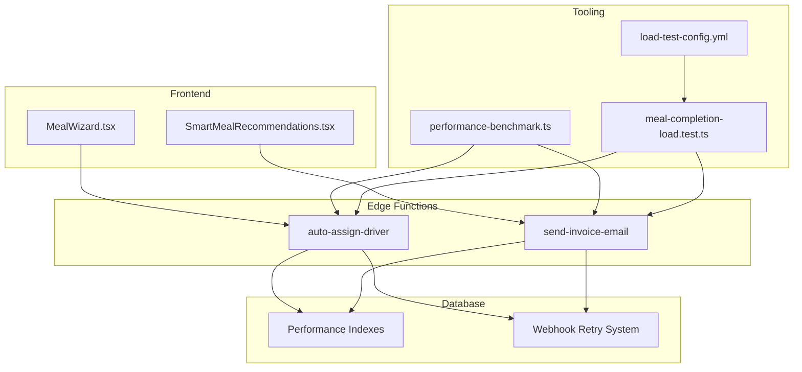

**Diagram sources**
- [PHASE2_EDGE_FUNCTIONS.md](file://supabase/functions/PHASE2_EDGE_FUNCTIONS.md)
- [performance-benchmark.ts](file://scripts/performance-benchmark.ts)
- [load-test-config.yml](file://tests/load-test-config.yml)
- [meal-completion-load.test.ts](file://tests/load/meal-completion-load.test.ts)
- [20250218000001_add_performance_indexes.sql](file://supabase/migrations/20250218000001_add_performance_indexes.sql)
- [20260227000004_webhook_retry_system.sql](file://supabase/migrations/20260227000004_webhook_retry_system.sql)

**Section sources**
- [PHASE2_EDGE_FUNCTIONS.md](file://supabase/functions/PHASE2_EDGE_FUNCTIONS.md)
- [performance-benchmark.ts](file://scripts/performance-benchmark.ts)
- [load-test-config.yml](file://tests/load-test-config.yml)
- [meal-completion-load.test.ts](file://tests/load/meal-completion-load.test.ts)

## Core Components
- Edge function documentation and operational guidance for auto-assign-driver and send-invoice-email, including environment variables, triggers, deployment, and monitoring.
- Performance benchmarking utilities and load testing configurations that quantify execution times and validate thresholds.
- Frontend integration points that invoke edge functions for smart meal allocation and recommendation scoring.
- Database migrations that improve query performance and resilience through indexing and retry logic.

**Section sources**
- [PHASE2_EDGE_FUNCTIONS.md](file://supabase/functions/PHASE2_EDGE_FUNCTIONS.md)
- [performance-benchmark.ts](file://scripts/performance-benchmark.ts)
- [load-test-config.yml](file://tests/load-test-config.yml)
- [meal-completion-load.test.ts](file://tests/load/meal-completion-load.test.ts)
- [implementation-plan-customer-portal.md](file://docs/implementation-plan-customer-portal.md)
- [SmartMealRecommendations.tsx](file://src/pages/recommendations/SmartMealRecommendations.tsx)
- [MealWizard.tsx](file://src/components/MealWizard.tsx)
- [20250218000001_add_performance_indexes.sql](file://supabase/migrations/20250218000001_add_performance_indexes.sql)
- [20260227000004_webhook_retry_system.sql](file://supabase/migrations/20260227000004_webhook_retry_system.sql)

## Architecture Overview
The edge function architecture integrates frontend components with Supabase Edge Functions and backend database systems. Invocation flows originate from the UI, traverse the Supabase edge runtime, and interact with Postgres and auxiliary services. Monitoring and retries are embedded in both the functions and database layers.

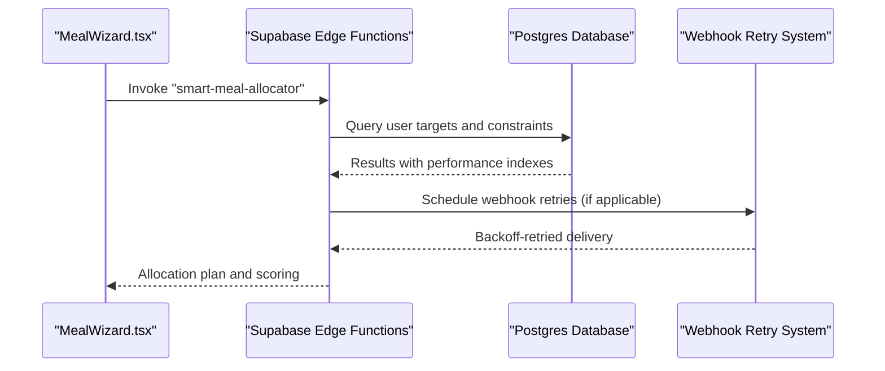

**Diagram sources**
- [MealWizard.tsx](file://src/components/MealWizard.tsx)
- [PHASE2_EDGE_FUNCTIONS.md](file://supabase/functions/PHASE2_EDGE_FUNCTIONS.md)
- [20250218000001_add_performance_indexes.sql](file://supabase/migrations/20250218000001_add_performance_indexes.sql)
- [20260227000004_webhook_retry_system.sql](file://supabase/migrations/20260227000004_webhook_retry_system.sql)

## Detailed Component Analysis

### Cold Start Mitigation Strategies
- Function pre-warming: While the repository does not define explicit pre-warm endpoints, the Supabase Edge Functions documentation outlines deployment and invocation patterns suitable for periodic warming via scheduled triggers or synthetic requests.
- Connection reuse: Database connections benefit from connection pooling and reduced connection churn. The load test configuration emphasizes connection pooling as a prerequisite for scaling edge functions.
- Dependency optimization: The Phase 2 Edge Functions document specifies Deno-based functions with minimal external dependencies, reducing cold start overhead.

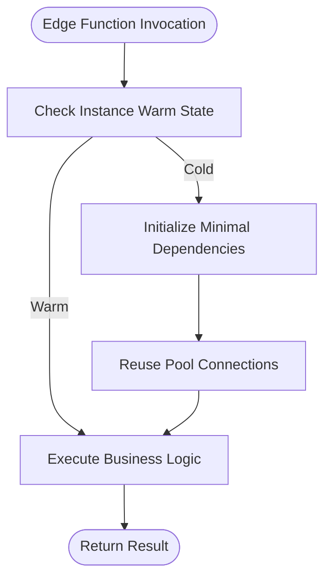

**Diagram sources**
- [PHASE2_EDGE_FUNCTIONS.md](file://supabase/functions/PHASE2_EDGE_FUNCTIONS.md)
- [load-test-config.yml](file://tests/load-test-config.yml)

**Section sources**
- [PHASE2_EDGE_FUNCTIONS.md](file://supabase/functions/PHASE2_EDGE_FUNCTIONS.md)
- [load-test-config.yml](file://tests/load-test-config.yml)

### Execution Time Monitoring
- Supabase logs: The Phase 2 Edge Functions documentation provides commands to tail and review function logs for auto-assign-driver and send-invoice-email.
- Custom performance metrics: The performance benchmarking utility aggregates response times and error counts, enabling targeted optimization and threshold validation.

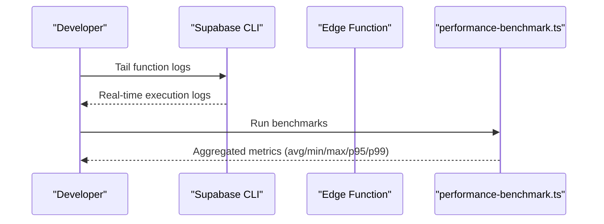

**Diagram sources**
- [PHASE2_EDGE_FUNCTIONS.md](file://supabase/functions/PHASE2_EDGE_FUNCTIONS.md)
- [performance-benchmark.ts](file://scripts/performance-benchmark.ts)

**Section sources**
- [PHASE2_EDGE_FUNCTIONS.md](file://supabase/functions/PHASE2_EDGE_FUNCTIONS.md)
- [performance-benchmark.ts](file://scripts/performance-benchmark.ts)

### Resource Utilization Optimization
- Memory allocation and execution duration limits: The repository references performance budgets and acceptance criteria in load test configurations and production audit documents.
- Concurrent request handling: Database migrations introduce performance indexes and a retry system to improve throughput and resilience under concurrent loads.

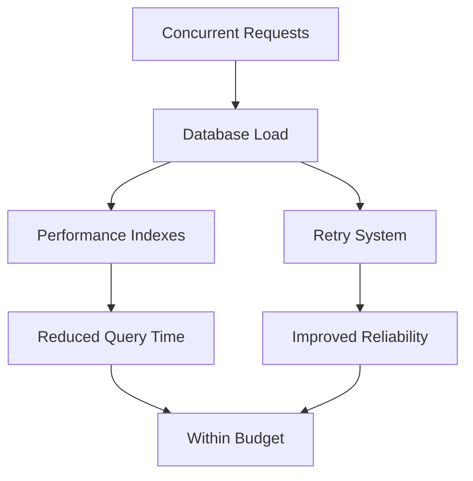

**Diagram sources**
- [load-test-config.yml](file://tests/load-test-config.yml)
- [COMPLETE_PRODUCTION_AUDIT_FINAL.md](file://COMPLETE_PRODUCTION_AUDIT_FINAL.md)
- [20250218000001_add_performance_indexes.sql](file://supabase/migrations/20250218000001_add_performance_indexes.sql)
- [20260227000004_webhook_retry_system.sql](file://supabase/migrations/20260227000004_webhook_retry_system.sql)

**Section sources**
- [load-test-config.yml](file://tests/load-test-config.yml)
- [COMPLETE_PRODUCTION_AUDIT_FINAL.md](file://COMPLETE_PRODUCTION_AUDIT_FINAL.md)
- [20250218000001_add_performance_indexes.sql](file://supabase/migrations/20250218000001_add_performance_indexes.sql)
- [20260227000004_webhook_retry_system.sql](file://supabase/migrations/20260227000004_webhook_retry_system.sql)

### Frequently Called Functions: Optimization Examples

#### Adaptive Goals Calculation
- Layer 1 algorithm: The AI implementation summary documents the nutrition profile engine using the Mifflin-St Jeor BMR equation with activity multipliers and goal adjustments. Optimization opportunities include:
  - Minimizing branching and arithmetic operations in hot paths.
  - Caching derived targets when user inputs are stable.
  - Leveraging database indexes for profile lookups.

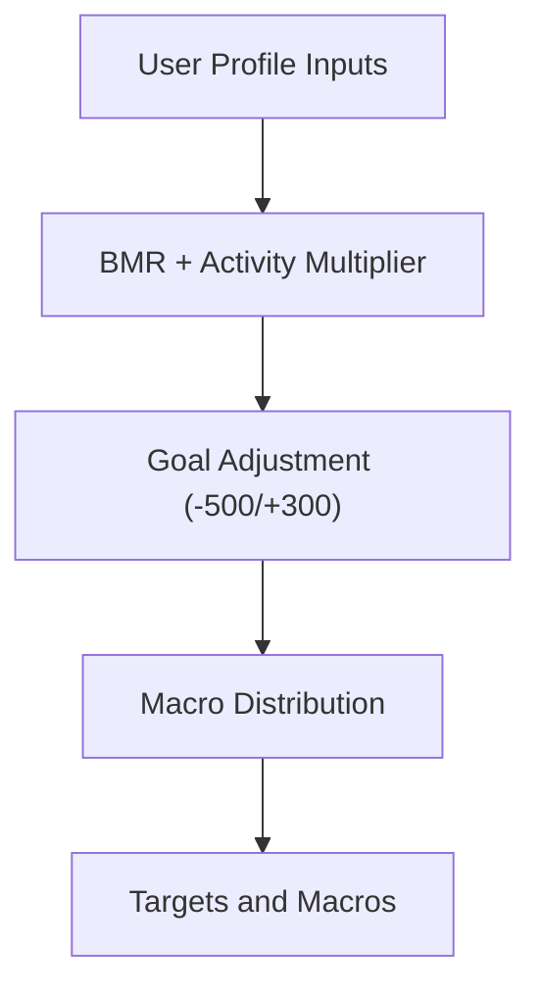

**Diagram sources**
- [AI_IMPLEMENTATION_SUMMARY.md](file://AI_IMPLEMENTATION_SUMMARY.md)

**Section sources**
- [AI_IMPLEMENTATION_SUMMARY.md](file://AI_IMPLEMENTATION_SUMMARY.md)

#### Nutrition Profile Generation
- Layer 1 engine: The nutrition profile engine computes maintenance calories, protein minimums, and macro distributions. Optimization strategies:
  - Reduce repeated reads by batching profile queries.
  - Apply database indexes on profile lookup keys.
  - Avoid heavy computations in the edge function by delegating to precomputed views or materialized data where feasible.

**Section sources**
- [AI_IMPLEMENTATION_SUMMARY.md](file://AI_IMPLEMENTATION_SUMMARY.md)
- [20250218000001_add_performance_indexes.sql](file://supabase/migrations/20250218000001_add_performance_indexes.sql)

#### Smart Meal Allocation
- Layer 2 engine: The smart meal allocator uses greedy optimization with backtracking and macro scoring. Optimization strategies:
  - Cache user targets and recent order history in frontend to minimize edge function calls.
  - Use database indexes for constraint checks (restaurant diversity, macro targets).
  - Employ retry logic for webhook-based notifications to avoid transient failures.

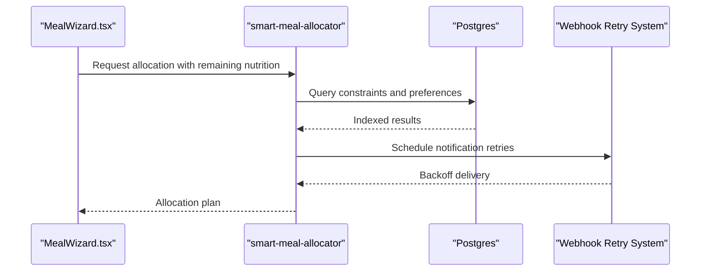

**Diagram sources**
- [MealWizard.tsx](file://src/components/MealWizard.tsx)
- [PHASE2_EDGE_FUNCTIONS.md](file://supabase/functions/PHASE2_EDGE_FUNCTIONS.md)
- [20250218000001_add_performance_indexes.sql](file://supabase/migrations/20250218000001_add_performance_indexes.sql)
- [20260227000004_webhook_retry_system.sql](file://supabase/migrations/20260227000004_webhook_retry_system.sql)

**Section sources**
- [MealWizard.tsx](file://src/components/MealWizard.tsx)
- [PHASE2_EDGE_FUNCTIONS.md](file://supabase/functions/PHASE2_EDGE_FUNCTIONS.md)
- [20250218000001_add_performance_indexes.sql](file://supabase/migrations/20250218000001_add_performance_indexes.sql)
- [20260227000004_webhook_retry_system.sql](file://supabase/migrations/20260227000004_webhook_retry_system.sql)

### Recommendation Scoring (UI-side)
- The SmartMealRecommendations page demonstrates client-side scoring logic for macro alignment and variety. This reduces server load by offloading lightweight computations to the browser while still invoking edge functions for complex allocations.

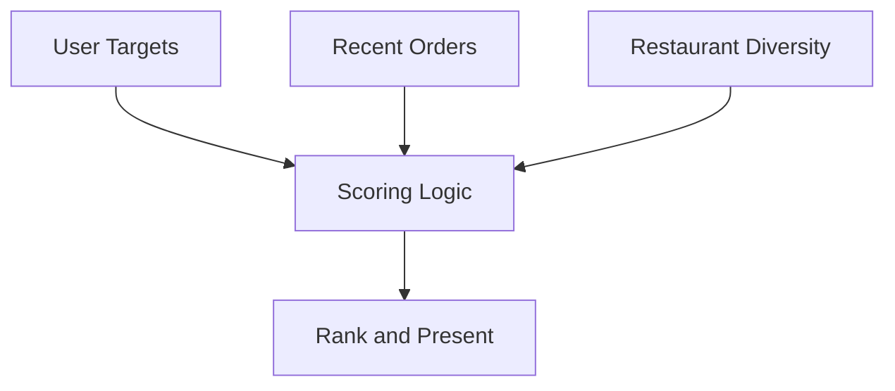

**Diagram sources**
- [SmartMealRecommendations.tsx](file://src/pages/recommendations/SmartMealRecommendations.tsx)

**Section sources**
- [SmartMealRecommendations.tsx](file://src/pages/recommendations/SmartMealRecommendations.tsx)

### Error Handling Patterns and Retry Mechanisms
- Edge function error handling: The Phase 2 Edge Functions documentation enumerates error categories and responses (missing credentials, validation, not found, service unavailable, rate limiting).
- Database retry system: A migration defines exponential backoff with jitter for webhook delivery, preventing thundering herds and improving reliability.
- IP management and edge bypass: A migration supports IP logging and management, which can inform rate limiting and access controls for edge functions.

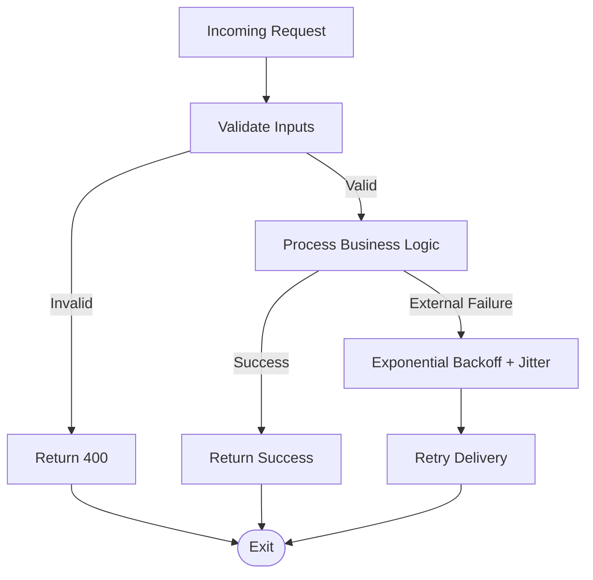

**Diagram sources**
- [PHASE2_EDGE_FUNCTIONS.md](file://supabase/functions/PHASE2_EDGE_FUNCTIONS.md)
- [20260227000004_webhook_retry_system.sql](file://supabase/migrations/20260227000004_webhook_retry_system.sql)
- [20250219000000_ip_management.sql](file://supabase/migrations/20250219000000_ip_management.sql)

**Section sources**
- [PHASE2_EDGE_FUNCTIONS.md](file://supabase/functions/PHASE2_EDGE_FUNCTIONS.md)
- [20260227000004_webhook_retry_system.sql](file://supabase/migrations/20260227000004_webhook_retry_system.sql)
- [20250219000000_ip_management.sql](file://supabase/migrations/20250219000000_ip_management.sql)

### Performance Testing Methodologies
- Benchmarking: The performance benchmarking utility measures response times and aggregates percentiles, enabling pass/fail criteria aligned with load test budgets.
- Load testing: The load test configuration establishes pre/post conditions and acceptance criteria for response times, error rates, and memory stability.
- End-to-end validation: Test results capture durations and failures, informing performance tuning cycles.

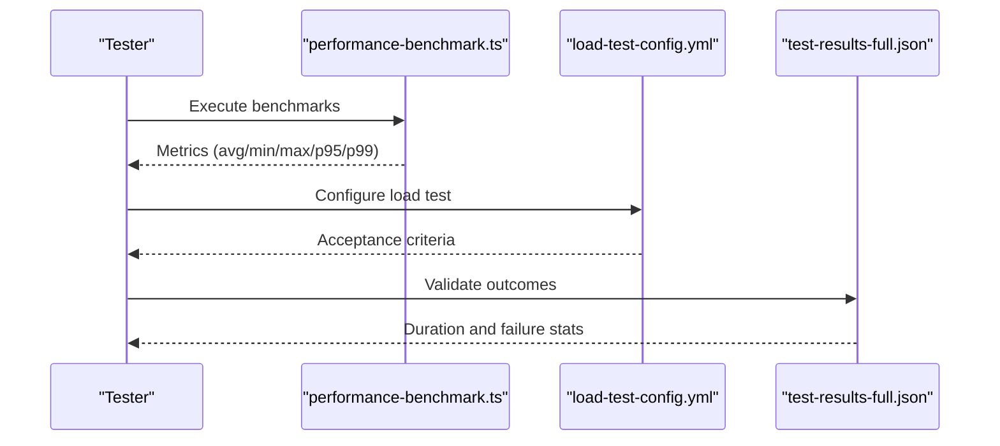

**Diagram sources**
- [performance-benchmark.ts](file://scripts/performance-benchmark.ts)
- [load-test-config.yml](file://tests/load-test-config.yml)
- [test-results-full.json](file://test-results-full.json)

**Section sources**
- [performance-benchmark.ts](file://scripts/performance-benchmark.ts)
- [load-test-config.yml](file://tests/load-test-config.yml)
- [test-results-full.json](file://test-results-full.json)

## Dependency Analysis
The edge function ecosystem exhibits clear coupling between frontend invocations, edge functions, database indexes, and retry systems. Cohesion is strong within each function's responsibility, while coupling is primarily through Supabase client invocations and database queries.

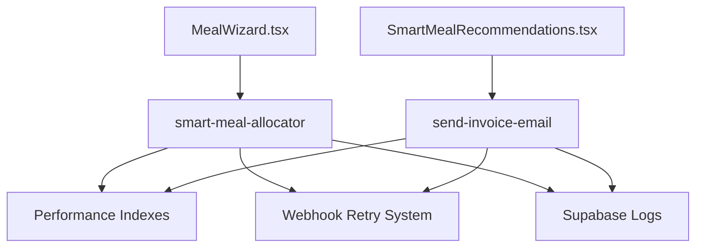

**Diagram sources**
- [MealWizard.tsx](file://src/components/MealWizard.tsx)
- [SmartMealRecommendations.tsx](file://src/pages/recommendations/SmartMealRecommendations.tsx)
- [PHASE2_EDGE_FUNCTIONS.md](file://supabase/functions/PHASE2_EDGE_FUNCTIONS.md)
- [20250218000001_add_performance_indexes.sql](file://supabase/migrations/20250218000001_add_performance_indexes.sql)
- [20260227000004_webhook_retry_system.sql](file://supabase/migrations/20260227000004_webhook_retry_system.sql)

**Section sources**
- [MealWizard.tsx](file://src/components/MealWizard.tsx)
- [SmartMealRecommendations.tsx](file://src/pages/recommendations/SmartMealRecommendations.tsx)
- [PHASE2_EDGE_FUNCTIONS.md](file://supabase/functions/PHASE2_EDGE_FUNCTIONS.md)
- [20250218000001_add_performance_indexes.sql](file://supabase/migrations/20250218000001_add_performance_indexes.sql)
- [20260227000004_webhook_retry_system.sql](file://supabase/migrations/20260227000004_webhook_retry_system.sql)

## Performance Considerations
- Cold start reduction: Prefer Deno-based functions with minimal imports, leverage connection pooling, and consider warm-up strategies via scheduled triggers.
- Execution time monitoring: Use Supabase logs for real-time visibility and the performance benchmarking tool for automated metrics collection.
- Resource tuning: Align memory and execution duration limits with load test budgets; ensure database indexes and retry systems are in place for concurrent workloads.
- Error handling: Implement structured error responses and integrate retry mechanisms with exponential backoff and jitter.

[No sources needed since this section provides general guidance]

## Troubleshooting Guide
- Function deployment and environment variables: Validate CLI version, project linking, and secret configuration as outlined in the Phase 2 Edge Functions documentation.
- Database connectivity: Confirm URL correctness, service role permissions, and RLS policy allowances.
- Email delivery: Verify API keys, recipient validity, and inspect email logs for error details.
- Load test readiness: Ensure indexes are created, connection pooling is configured, CDN caching is enabled, and monitoring dashboards are prepared.

**Section sources**
- [PHASE2_EDGE_FUNCTIONS.md](file://supabase/functions/PHASE2_EDGE_FUNCTIONS.md)

## Conclusion
Nutrio’s edge function performance hinges on minimizing cold starts, leveraging database indexes and retry systems, and maintaining strict execution time budgets. The repository provides robust tooling for monitoring and benchmarking, while frontend integrations offer practical optimization opportunities. By applying the strategies and examples outlined here, teams can achieve reliable, scalable edge function performance across adaptive goals, nutrition profiles, and smart meal allocation.

[No sources needed since this section summarizes without analyzing specific files]

## Appendices
- Additional references for edge function operations, performance indexes, and retry systems are available in the cited files.

[No sources needed since this section doesn't analyze specific files]