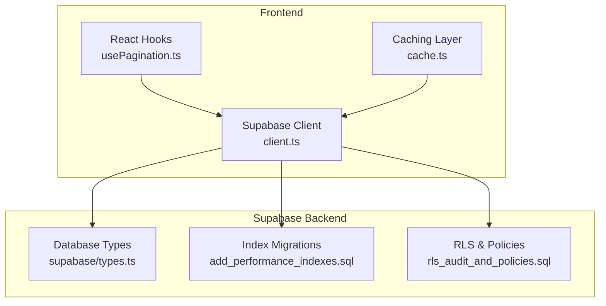
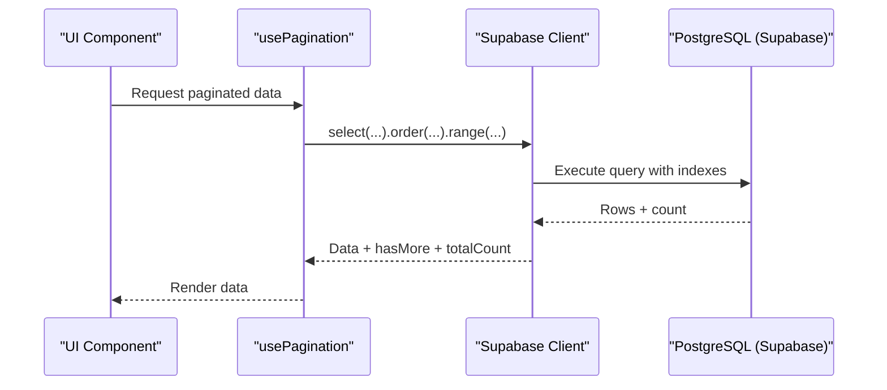
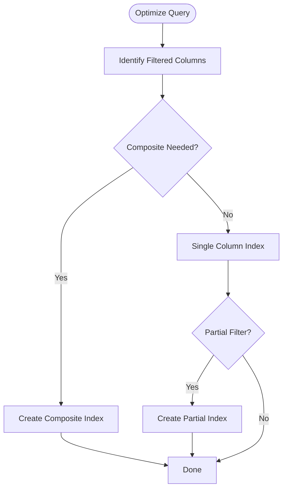
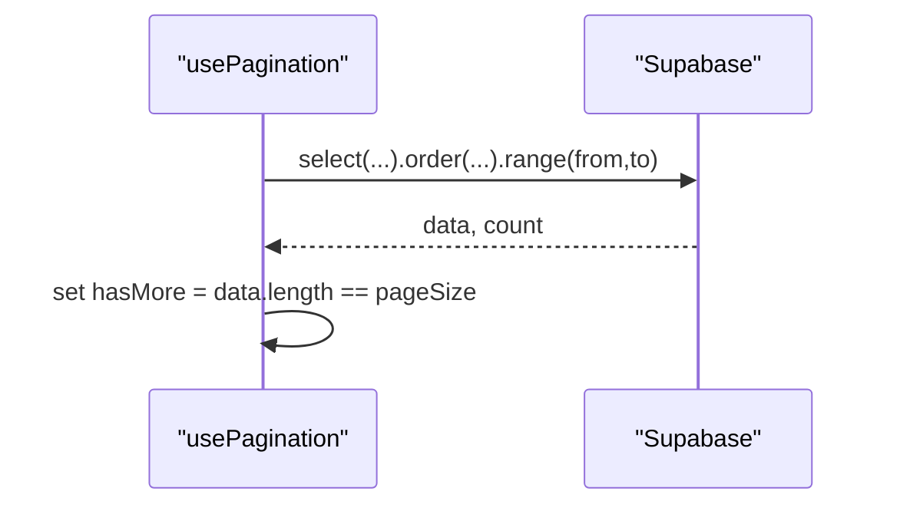
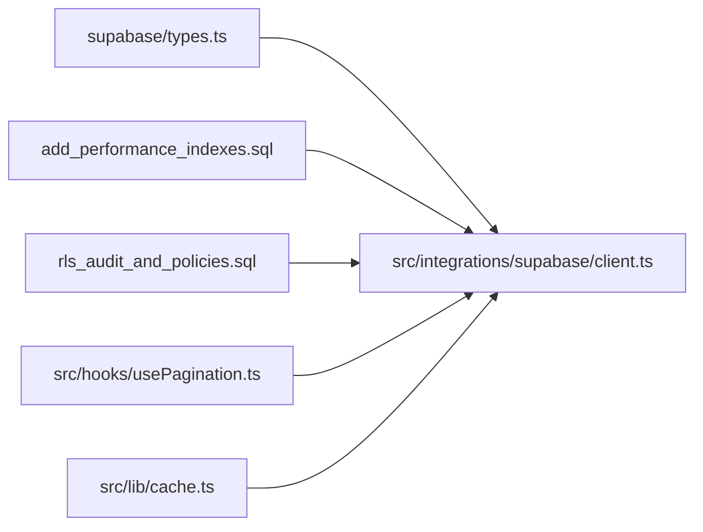

# Query Optimization

<cite>
**Referenced Files in This Document**
- [client.ts](file://src/integrations/supabase/client.ts)
- [types.ts](file://supabase/types.ts)
- [add_performance_indexes.sql](file://supabase/migrations/20250218000001_add_performance_indexes.sql)
- [rls_audit_and_policies.sql](file://supabase/migrations/20250218000002_rls_audit_and_policies.sql)
- [performance_indexes.sql](file://supabase/migrations/20260226000007_performance_indexes.sql)
- [performance-benchmark.ts](file://scripts/performance-benchmark.ts)
- [usePagination.ts](file://src/hooks/usePagination.ts)
- [cache.ts](file://src/lib/cache.ts)
- [load-test-config.yml](file://tests/load-test-config.yml)
- [fleet-management-portal-design.md](file://docs/fleet-management-portal-design.md)
- [delivery.ts](file://src/integrations/supabase/delivery.ts)
- [useSubscription.ts](file://src/hooks/useSubscription.ts)
</cite>

## Table of Contents
1. [Introduction](#introduction)
2. [Project Structure](#project-structure)
3. [Core Components](#core-components)
4. [Architecture Overview](#architecture-overview)
5. [Detailed Component Analysis](#detailed-component-analysis)
6. [Dependency Analysis](#dependency-analysis)
7. [Performance Considerations](#performance-considerations)
8. [Troubleshooting Guide](#troubleshooting-guide)
9. [Conclusion](#conclusion)

## Introduction
This document provides comprehensive guidance for query optimization in Nutrio's Supabase implementation. It covers indexing strategies (composite, partial, and covering), query execution plan analysis, connection pooling, query batching, efficient data fetching patterns, real-time subscriptions, timeouts, pagination, and memory optimization for large datasets. The recommendations are grounded in the repository's Supabase migrations, client configuration, and frontend hooks.

## Project Structure
The Supabase backend is defined by migrations and TypeScript types, while the frontend integrates Supabase through a typed client and reusable hooks for pagination and caching.

**Diagram sources**
- [client.ts:1-57](file://src/integrations/supabase/client.ts#L1-L57)
- [types.ts:1-50](file://supabase/types.ts#L1-L50)
- [add_performance_indexes.sql:1-73](file://supabase/migrations/20250218000001_add_performance_indexes.sql#L1-L73)
- [rls_audit_and_policies.sql:1-50](file://supabase/migrations/20250218000002_rls_audit_and_policies.sql#L1-L50)

**Section sources**
- [client.ts:1-57](file://src/integrations/supabase/client.ts#L1-L57)
- [types.ts:1-50](file://supabase/types.ts#L1-L50)

## Core Components
- Supabase client initialization with session persistence and storage abstraction for native environments.
- Typed database interface derived from Supabase schema for compile-time safety.
- Index migrations for performance on frequently queried columns and composite keys.
- Row Level Security (RLS) policies to enforce access control and reduce unauthorized scans.
- Pagination hook implementing offset-based pagination with explicit ordering and filtering.
- Caching layer abstraction for frequent reads.
- Performance benchmarking script for measuring query latency and throughput.
- Load testing configuration for production readiness.

**Section sources**
- [client.ts:18-57](file://src/integrations/supabase/client.ts#L18-L57)
- [types.ts:1-50](file://supabase/types.ts#L1-L50)
- [add_performance_indexes.sql:1-73](file://supabase/migrations/20250218000001_add_performance_indexes.sql#L1-L73)
- [rls_audit_and_policies.sql:46-116](file://supabase/migrations/20250218000002_rls_audit_and_policies.sql#L46-L116)
- [usePagination.ts:26-130](file://src/hooks/usePagination.ts#L26-L130)
- [cache.ts:1-51](file://src/lib/cache.ts#L1-L51)
- [performance-benchmark.ts:131-232](file://scripts/performance-benchmark.ts#L131-L232)
- [load-test-config.yml:154-172](file://tests/load-test-config.yml#L154-L172)

## Architecture Overview
The frontend interacts with Supabase through a typed client. Queries leverage indexes defined in migrations and RLS policies. Pagination and caching improve performance for large datasets. Real-time subscriptions keep clients updated on changes.

**Diagram sources**
- [usePagination.ts:57-103](file://src/hooks/usePagination.ts#L57-L103)
- [client.ts:47-57](file://src/integrations/supabase/client.ts#L47-L57)

## Detailed Component Analysis

### Indexing Strategies
- Composite indexes for multi-column filters and ordered scans (e.g., user-centric order history).
- Partial indexes for common status filters to reduce index size and improve selectivity.
- GIN indexes for JSON/array columns to accelerate array and JSON queries.
- Expression indexes for computed predicates and range checks.
- BRIN indexes for time-series data to minimize storage overhead.

**Diagram sources**
- [add_performance_indexes.sql:4-66](file://supabase/migrations/20250218000001_add_performance_indexes.sql#L4-L66)
- [performance_indexes.sql:6-34](file://supabase/migrations/20260226000007_performance_indexes.sql#L6-L34)
- [fleet-management-portal-design.md:2366-2387](file://docs/fleet-management-portal-design.md#L2366-L2387)

**Section sources**
- [add_performance_indexes.sql:4-66](file://supabase/migrations/20250218000001_add_performance_indexes.sql#L4-L66)
- [performance_indexes.sql:6-34](file://supabase/migrations/20260226000007_performance_indexes.sql#L6-L34)
- [fleet-management-portal-design.md:2366-2387](file://docs/fleet-management-portal-design.md#L2366-L2387)

### Query Execution Plan Analysis
- Use Supabase SQL Editor to run EXPLAIN/EXPLAIN ANALYZE on candidate queries.
- Focus on index scans vs sequential scans, estimated vs actual rows, and sort/node types.
- Compare before/after after adding targeted indexes.
- Monitor query runtime and plan cost to validate improvements.

[No sources needed since this section provides general guidance]

### Connection Pooling Configuration
- Supabase manages connection pooling internally; configure client-side retry/backoff and session persistence.
- Persist sessions to avoid repeated authentication overhead.
- Use batched requests where possible to reduce round trips.

**Section sources**
- [client.ts:47-57](file://src/integrations/supabase/client.ts#L47-L57)

### Query Batching Techniques
- Batch related reads/writes in a single transaction where appropriate.
- Use LIMIT with ORDER BY and cursor-based pagination to avoid deep offsets.
- Combine multiple small queries into larger ones when feasible.

[No sources needed since this section provides general guidance]

### Efficient Data Fetching Patterns
- Use selective column projections with .select("col1,col2").
- Apply filters early with .eq() to reduce result sets.
- Leverage indexes on filtered columns and maintain consistent ORDER BY clauses.

**Section sources**
- [usePagination.ts:66-77](file://src/hooks/usePagination.ts#L66-L77)

### Practical Query Optimization Examples
- User orders: Composite index on (user_id, created_at DESC) supports chronological order queries.
- Profile data retrieval: Select only required columns; consider denormalized views for frequently accessed aggregates.
- Real-time subscriptions: Use targeted filters in postgres_changes to minimize event volume.

**Section sources**
- [add_performance_indexes.sql:5-10](file://supabase/migrations/20250218000001_add_performance_indexes.sql#L5-L10)
- [delivery.ts:695-734](file://src/integrations/supabase/delivery.ts#L695-L734)
- [useSubscription.ts:100-134](file://src/hooks/useSubscription.ts#L100-L134)

### Query Timeout Handling
- Configure client-side timeouts for long-running queries.
- Implement retry logic with exponential backoff for transient failures.
- Use pagination to avoid long-running scans.

[No sources needed since this section provides general guidance]

### Pagination Strategies
- Offset-based pagination with explicit ordering and count for accurate hasMore.
- Prefer keyset pagination (cursor-based) for very large datasets to avoid expensive OFFSET.

**Diagram sources**
- [usePagination.ts:57-103](file://src/hooks/usePagination.ts#L57-L103)

**Section sources**
- [usePagination.ts:26-130](file://src/hooks/usePagination.ts#L26-L130)

### Memory Optimization for Large Datasets
- Use streaming-like pagination to limit in-memory data.
- Cache only hotspots; apply TTL and eviction policies.
- Avoid loading unnecessary columns; prefer projections.

**Section sources**
- [cache.ts:1-51](file://src/lib/cache.ts#L1-L51)

### Security and Access Control
- Enable RLS on all tables and define fine-grained policies.
- Use auth.uid() and helper functions to restrict access.
- Audit sensitive changes with security audit logging.

**Section sources**
- [rls_audit_and_policies.sql:46-116](file://supabase/migrations/20250218000002_rls_audit_and_policies.sql#L46-L116)
- [rls_audit_and_policies.sql:247-295](file://supabase/migrations/20250218000002_rls_audit_and_policies.sql#L247-L295)

### Real-Time Subscriptions
- Subscribe to specific filters to receive only relevant updates.
- Use channels per resource (e.g., delivery, driver location) to scope events.
- Reconnect and resubscribe on network changes.

**Section sources**
- [delivery.ts:695-734](file://src/integrations/supabase/delivery.ts#L695-L734)
- [useSubscription.ts:100-134](file://src/hooks/useSubscription.ts#L100-L134)

## Dependency Analysis
The frontend depends on the typed Supabase client and migrations for optimal query performance. RLS policies depend on proper JWT claims and helper functions.

**Diagram sources**
- [types.ts:1-50](file://supabase/types.ts#L1-L50)
- [client.ts:1-57](file://src/integrations/supabase/client.ts#L1-L57)
- [add_performance_indexes.sql:1-73](file://supabase/migrations/20250218000001_add_performance_indexes.sql#L1-L73)
- [rls_audit_and_policies.sql:1-50](file://supabase/migrations/20250218000002_rls_audit_and_policies.sql#L1-L50)
- [usePagination.ts:1-130](file://src/hooks/usePagination.ts#L1-L130)
- [cache.ts:1-51](file://src/lib/cache.ts#L1-L51)

**Section sources**
- [types.ts:1-50](file://supabase/types.ts#L1-L50)
- [client.ts:1-57](file://src/integrations/supabase/client.ts#L1-L57)
- [add_performance_indexes.sql:1-73](file://supabase/migrations/20250218000001_add_performance_indexes.sql#L1-L73)
- [rls_audit_and_policies.sql:1-50](file://supabase/migrations/20250218000002_rls_audit_and_policies.sql#L1-L50)
- [usePagination.ts:1-130](file://src/hooks/usePagination.ts#L1-L130)
- [cache.ts:1-51](file://src/lib/cache.ts#L1-L51)

## Performance Considerations
- Use the performance benchmark script to measure query latency and validate improvements.
- Align pagination strategy with dataset size; prefer keyset pagination for large offsets.
- Monitor Supabase metrics during load tests and adjust indexes accordingly.
- Keep indexes maintained; avoid over-indexing which increases write overhead.

**Section sources**
- [performance-benchmark.ts:131-232](file://scripts/performance-benchmark.ts#L131-L232)
- [load-test-config.yml:154-172](file://tests/load-test-config.yml#L154-L172)

## Troubleshooting Guide
- If queries are slow, inspect execution plans and verify index usage.
- Check RLS policies if access is denied unexpectedly.
- Validate pagination parameters (orderBy, orderDirection, filters) to ensure consistent ordering.
- Confirm real-time subscriptions are scoped to specific filters to avoid excessive traffic.

**Section sources**
- [rls_audit_and_policies.sql:46-116](file://supabase/migrations/20250218000002_rls_audit_and_policies.sql#L46-L116)
- [usePagination.ts:57-103](file://src/hooks/usePagination.ts#L57-L103)
- [delivery.ts:695-734](file://src/integrations/supabase/delivery.ts#L695-L734)

## Conclusion
Nutrio's Supabase implementation includes targeted indexes, RLS policies, and typed client integration to support efficient querying. By combining these with pagination, caching, and real-time subscriptions, the system achieves scalable performance. Regular benchmarking and load testing ensure continued optimization as data grows.