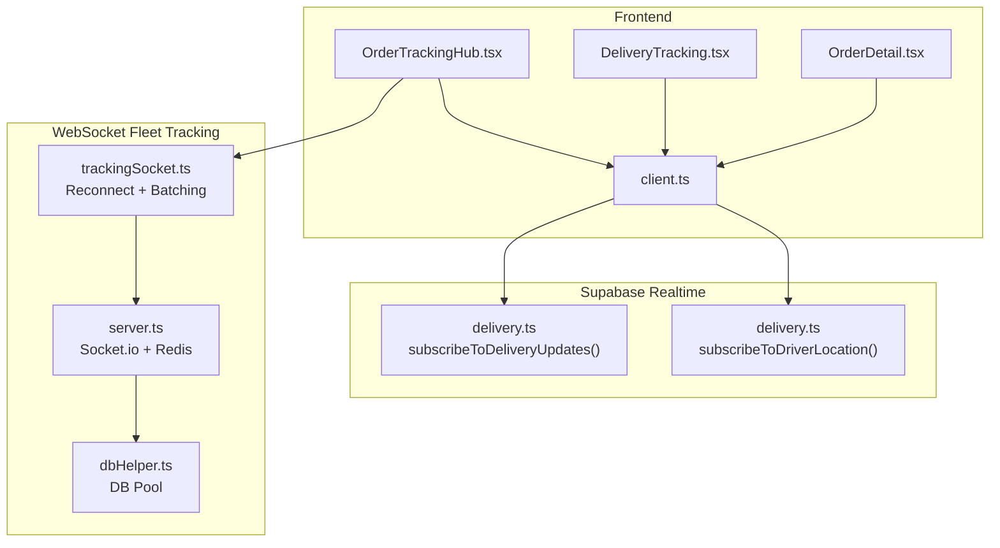
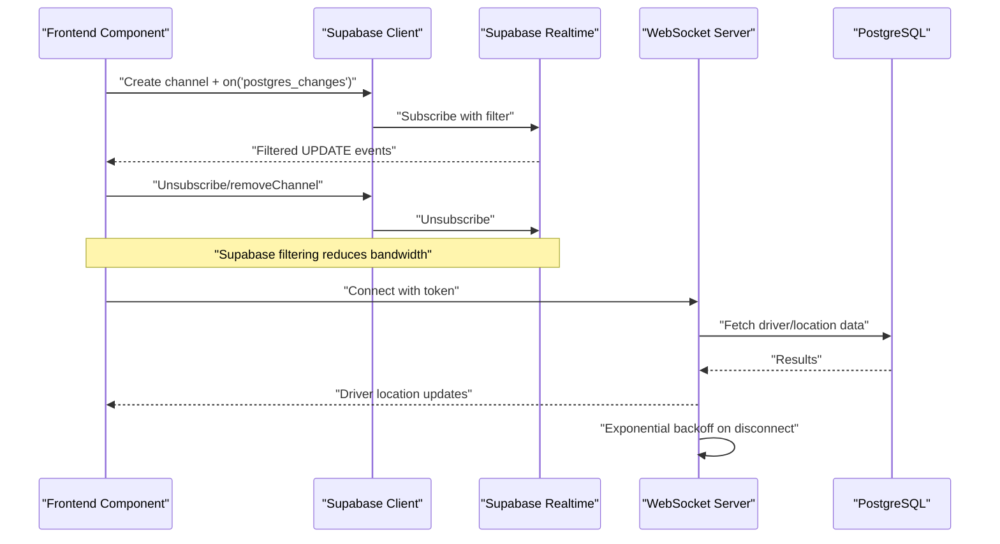
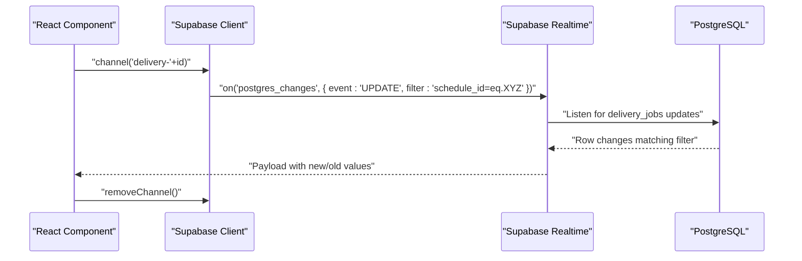
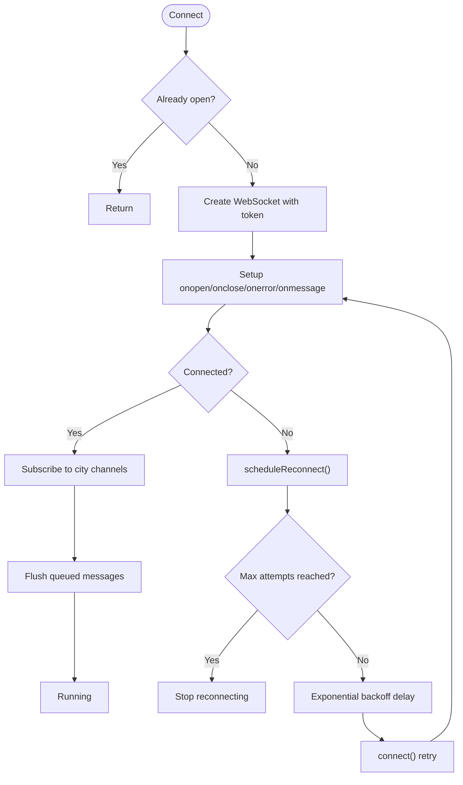
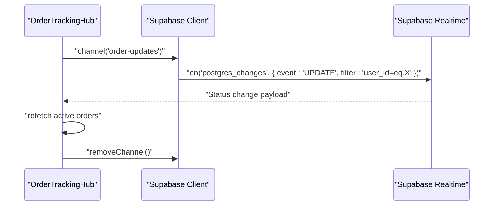
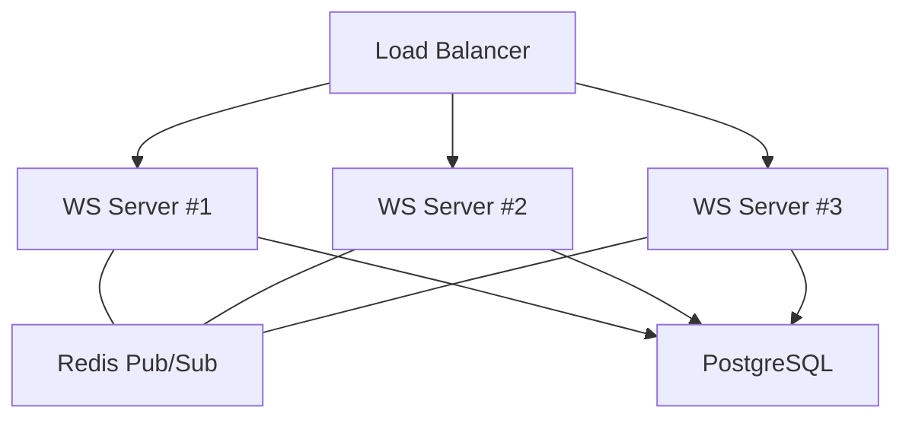
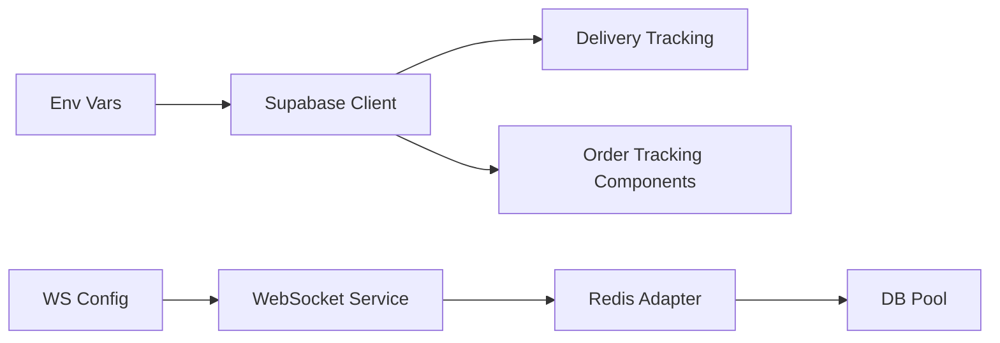

# Real-time Data Efficiency

<cite>
**Referenced Files in This Document**
- [client.ts](file://src/integrations/supabase/client.ts)
- [delivery.ts](file://src/integrations/supabase/delivery.ts)
- [trackingSocket.ts](file://src/fleet/services/trackingSocket.ts)
- [server.ts](file://websocket-server/src/server.ts)
- [dbHelper.ts](file://websocket-server/src/handlers/dbHelper.ts)
- [OrderDetail.tsx](file://src/pages/OrderDetail.tsx)
- [OrderTrackingHub.tsx](file://src/components/OrderTrackingHub.tsx)
- [DeliveryTracking.tsx](file://src/pages/DeliveryTracking.tsx)
- [usePagination.ts](file://src/hooks/usePagination.ts)
- [useUserOrders.ts](file://src/hooks/useUserOrders.ts)
- [CONCERNS.md](file://.planning/codebase/CONCERNS.md)
- [20260303013000_add_updated_at_to_subscriptions.sql](file://supabase/migrations/20260303013000_add_updated_at_to_subscriptions.sql)
</cite>

## Table of Contents
1. [Introduction](#introduction)
2. [Project Structure](#project-structure)
3. [Core Components](#core-components)
4. [Architecture Overview](#architecture-overview)
5. [Detailed Component Analysis](#detailed-component-analysis)
6. [Dependency Analysis](#dependency-analysis)
7. [Performance Considerations](#performance-considerations)
8. [Troubleshooting Guide](#troubleshooting-guide)
9. [Conclusion](#conclusion)

## Introduction
This document provides a comprehensive guide to real-time data efficiency optimization in Nutrio's Supabase Realtime implementation. It focuses on connection management strategies (pooling, automatic reconnection, graceful degradation), data filtering techniques, event batching, subscription optimization, and practical examples for order tracking, live notifications, and collaborative features. It also covers connection scaling, latency optimization, and handling failures gracefully.

## Project Structure
The real-time system spans three primary areas:
- Supabase Realtime client initialization and delivery tracking subscriptions
- WebSocket-based fleet tracking with reconnection and batching
- Frontend components subscribing to Supabase channels for live updates

**Diagram sources**
- [client.ts:47-57](file://src/integrations/supabase/client.ts#L47-L57)
- [delivery.ts:695-734](file://src/integrations/supabase/delivery.ts#L695-L734)
- [trackingSocket.ts:25-287](file://src/fleet/services/trackingSocket.ts#L25-L287)
- [server.ts:37-51](file://websocket-server/src/server.ts#L37-L51)
- [dbHelper.ts:9-29](file://websocket-server/src/handlers/dbHelper.ts#L9-L29)

**Section sources**
- [client.ts:1-57](file://src/integrations/supabase/client.ts#L1-L57)
- [delivery.ts:1-735](file://src/integrations/supabase/delivery.ts#L1-L735)
- [trackingSocket.ts:1-287](file://src/fleet/services/trackingSocket.ts#L1-L287)
- [server.ts:1-256](file://websocket-server/src/server.ts#L1-L256)
- [dbHelper.ts:1-57](file://websocket-server/src/handlers/dbHelper.ts#L1-L57)

## Core Components
- Supabase client initialization with auth persistence and token refresh
- Delivery tracking subscriptions with Supabase Realtime filtering
- WebSocket fleet tracking service with exponential backoff and message queuing
- Frontend components subscribing to Supabase channels for live updates
- Pagination and caching utilities supporting efficient data retrieval

Key implementation references:
- Supabase client creation and auth storage: [client.ts:47-57](file://src/integrations/supabase/client.ts#L47-L57)
- Delivery updates subscription: [delivery.ts:695-712](file://src/integrations/supabase/delivery.ts#L695-L712)
- Driver location subscription: [delivery.ts:717-734](file://src/integrations/supabase/delivery.ts#L717-L734)
- WebSocket tracking service: [trackingSocket.ts:25-287](file://src/fleet/services/trackingSocket.ts#L25-L287)
- Real-time order tracking hub: [OrderTrackingHub.tsx:93-114](file://src/components/OrderTrackingHub.tsx#L93-L114)
- Real-time delivery tracking page: [DeliveryTracking.tsx:257-275](file://src/pages/DeliveryTracking.tsx#L257-L275)

**Section sources**
- [client.ts:47-57](file://src/integrations/supabase/client.ts#L47-L57)
- [delivery.ts:695-734](file://src/integrations/supabase/delivery.ts#L695-L734)
- [trackingSocket.ts:25-287](file://src/fleet/services/trackingSocket.ts#L25-L287)
- [OrderTrackingHub.tsx:93-114](file://src/components/OrderTrackingHub.tsx#L93-L114)
- [DeliveryTracking.tsx:257-275](file://src/pages/DeliveryTracking.tsx#L257-L275)

## Architecture Overview
The system combines Supabase Realtime for relational event streaming and a dedicated WebSocket server for high-frequency location updates. Supabase channels filter events server-side, reducing payload sizes. The WebSocket server scales horizontally with Redis pub/sub and applies exponential backoff for resilient client reconnections.

**Diagram sources**
- [delivery.ts:695-734](file://src/integrations/supabase/delivery.ts#L695-L734)
- [OrderTrackingHub.tsx:93-114](file://src/components/OrderTrackingHub.tsx#L93-L114)
- [DeliveryTracking.tsx:257-275](file://src/pages/DeliveryTracking.tsx#L257-L275)
- [trackingSocket.ts:34-85](file://src/fleet/services/trackingSocket.ts#L34-L85)
- [server.ts:37-51](file://websocket-server/src/server.ts#L37-L51)

## Detailed Component Analysis

### Supabase Realtime Client and Filtering
- Initialization sets up auth persistence and token refresh using Capacitor preferences on native or localStorage on web.
- Delivery tracking subscriptions use Supabase Realtime with server-side filtering to minimize payload and network overhead.
- Frontend components subscribe to channels for live updates and unsubscribe on unmount to prevent leaks.

**Diagram sources**
- [client.ts:47-57](file://src/integrations/supabase/client.ts#L47-L57)
- [delivery.ts:695-712](file://src/integrations/supabase/delivery.ts#L695-L712)
- [OrderTrackingHub.tsx:93-114](file://src/components/OrderTrackingHub.tsx#L93-L114)

**Section sources**
- [client.ts:18-42](file://src/integrations/supabase/client.ts#L18-L42)
- [delivery.ts:695-734](file://src/integrations/supabase/delivery.ts#L695-L734)
- [OrderTrackingHub.tsx:93-114](file://src/components/OrderTrackingHub.tsx#L93-L114)
- [DeliveryTracking.tsx:257-275](file://src/pages/DeliveryTracking.tsx#L257-L275)

### WebSocket Fleet Tracking Service
- Implements connection lifecycle with exponential backoff and retry limits.
- Queues outbound messages when disconnected and flushes on reconnect.
- Subscribes to city-based channels based on user role and manages subscriptions dynamically.

**Diagram sources**
- [trackingSocket.ts:34-85](file://src/fleet/services/trackingSocket.ts#L34-L85)
- [trackingSocket.ts:162-178](file://src/fleet/services/trackingSocket.ts#L162-L178)
- [trackingSocket.ts:180-198](file://src/fleet/services/trackingSocket.ts#L180-L198)

**Section sources**
- [trackingSocket.ts:25-287](file://src/fleet/services/trackingSocket.ts#L25-L287)
- [server.ts:37-51](file://websocket-server/src/server.ts#L37-L51)

### Frontend Real-time Subscriptions
- Order tracking hub subscribes to Supabase channels for live updates on meal schedule status changes.
- Delivery tracking page subscribes to delivery updates and driver location inserts for live tracking.
- Components clean up subscriptions on unmount to avoid memory leaks.

**Diagram sources**
- [OrderTrackingHub.tsx:93-114](file://src/components/OrderTrackingHub.tsx#L93-L114)
- [DeliveryTracking.tsx:257-275](file://src/pages/DeliveryTracking.tsx#L257-L275)

**Section sources**
- [OrderTrackingHub.tsx:93-114](file://src/components/OrderTrackingHub.tsx#L93-L114)
- [DeliveryTracking.tsx:257-275](file://src/pages/DeliveryTracking.tsx#L257-L275)

### Connection Scaling and Latency Optimization
- WebSocket server uses Redis adapter for horizontal scaling and Socket.IO configuration for compression and timeouts.
- Supabase Realtime leverages server-side filtering to reduce bandwidth.
- Database pooling improves connection reuse and throughput.

**Diagram sources**
- [server.ts:37-51](file://websocket-server/src/server.ts#L37-L51)
- [server.ts:53-55](file://websocket-server/src/server.ts#L53-L55)
- [dbHelper.ts:9-29](file://websocket-server/src/handlers/dbHelper.ts#L9-L29)

**Section sources**
- [server.ts:37-51](file://websocket-server/src/server.ts#L37-L51)
- [server.ts:53-55](file://websocket-server/src/server.ts#L53-L55)
- [dbHelper.ts:9-29](file://websocket-server/src/handlers/dbHelper.ts#L9-L29)
- [CONCERNS.md:433-446](file://.planning/codebase/CONCERNS.md#L433-L446)

## Dependency Analysis
- Supabase client depends on environment variables for URL and keys, with guard statements to prevent crashes.
- Delivery tracking functions depend on Supabase client and use server-side filtering in subscriptions.
- WebSocket service depends on environment variables for server URL and implements its own reconnection logic.
- Frontend components depend on Supabase channels and lifecycle cleanup.

**Diagram sources**
- [client.ts:7-16](file://src/integrations/supabase/client.ts#L7-L16)
- [delivery.ts:4](file://src/integrations/supabase/delivery.ts#L4)
- [trackingSocket.ts:6](file://src/fleet/services/trackingSocket.ts#L6)
- [server.ts:18-26](file://websocket-server/src/server.ts#L18-L26)
- [dbHelper.ts:9-29](file://websocket-server/src/handlers/dbHelper.ts#L9-L29)

**Section sources**
- [client.ts:7-16](file://src/integrations/supabase/client.ts#L7-L16)
- [delivery.ts:4](file://src/integrations/supabase/delivery.ts#L4)
- [trackingSocket.ts:6](file://src/fleet/services/trackingSocket.ts#L6)
- [server.ts:18-26](file://websocket-server/src/server.ts#L18-L26)
- [dbHelper.ts:9-29](file://websocket-server/src/handlers/dbHelper.ts#L9-L29)

## Performance Considerations
- Use Supabase server-side filtering to reduce event volume and payload size.
- Prefer channel-scoped subscriptions (per schedule or driver) to minimize broadcast traffic.
- Batch UI updates when multiple related events arrive rapidly.
- Implement pagination and caching for non-real-time data to reduce repeated queries.
- Use database connection pooling for WebSocket server data access.

[No sources needed since this section provides general guidance]

## Troubleshooting Guide
Common issues and remedies:
- Missing Supabase configuration: verify environment variables are present during build; the client logs a warning if keys are missing.
- Channel subscription not firing: ensure filters match row values and that the channel is removed on component unmount.
- WebSocket disconnections: exponential backoff is implemented; verify token validity and server readiness endpoint.
- Connection limits exceeded: monitor server capacity and consider scaling out with additional WebSocket servers behind a load balancer.

**Section sources**
- [client.ts:10-16](file://src/integrations/supabase/client.ts#L10-L16)
- [OrderTrackingHub.tsx:111-114](file://src/components/OrderTrackingHub.tsx#L111-L114)
- [trackingSocket.ts:162-178](file://src/fleet/services/trackingSocket.ts#L162-L178)
- [server.ts:108-117](file://websocket-server/src/server.ts#L108-L117)

## Conclusion
Nutrio's real-time system efficiently balances Supabase Realtime and WebSocket technologies. Supabase channels with server-side filtering minimize bandwidth, while the WebSocket service provides robust, scalable location updates with exponential backoff and message queuing. Frontend components subscribe selectively and clean up after themselves, ensuring responsive UIs with minimal resource usage. For further improvements, consider event batching for UI updates, pagination for large datasets, and Redis-backed caching for frequently accessed data.