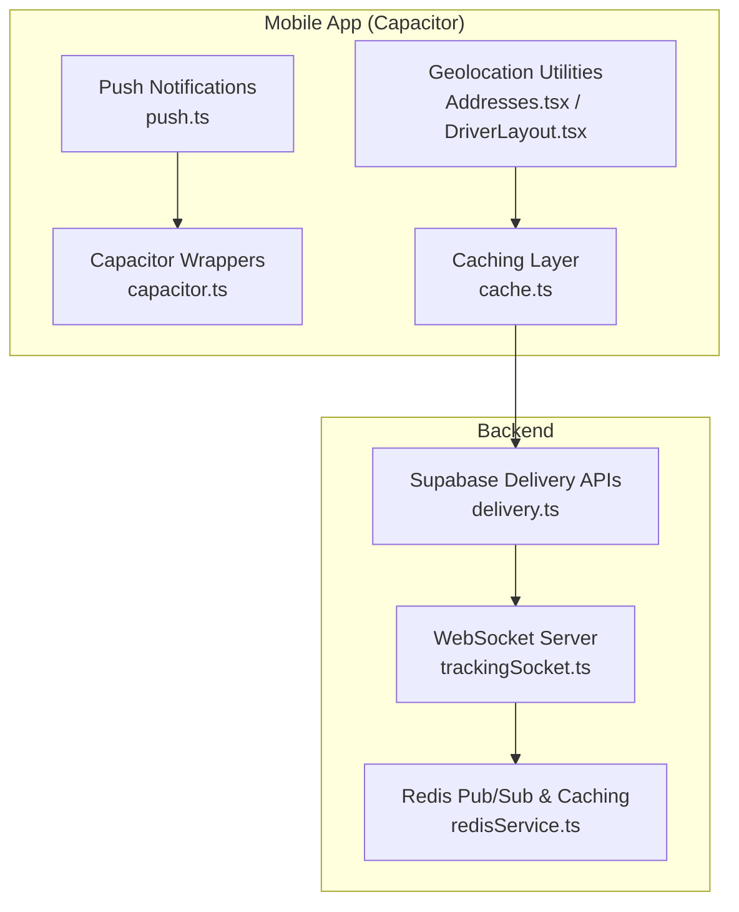
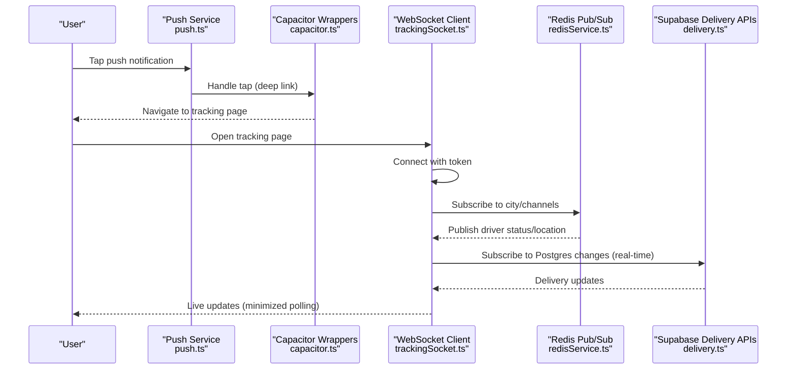
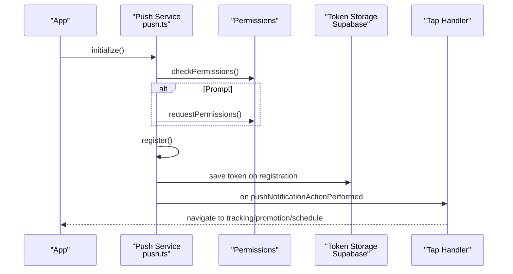
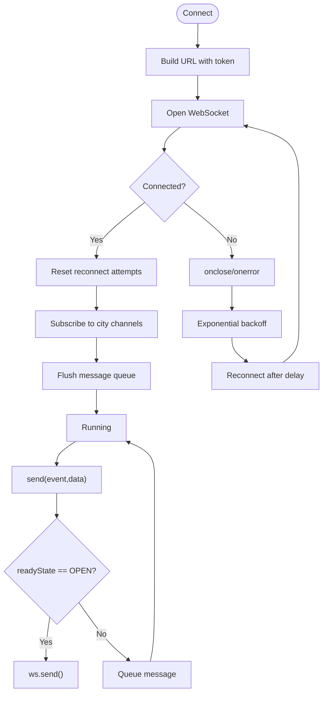
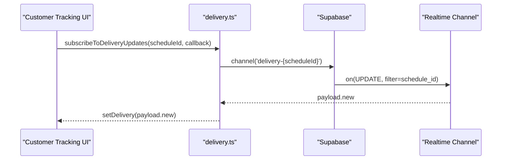
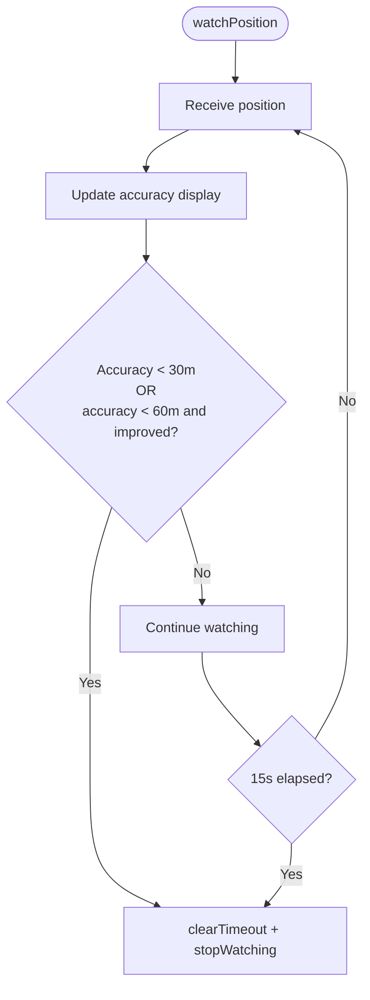
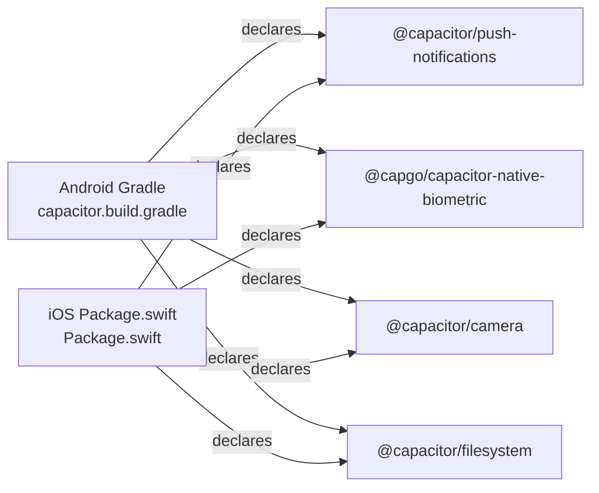
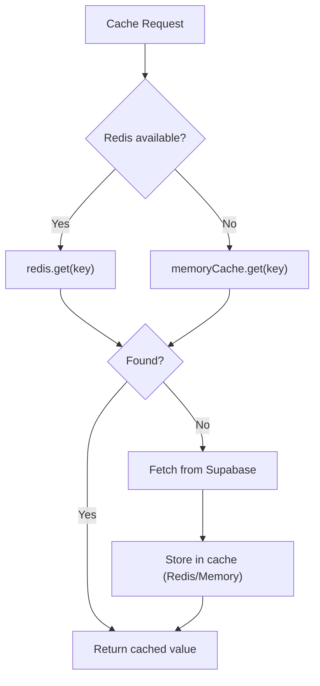
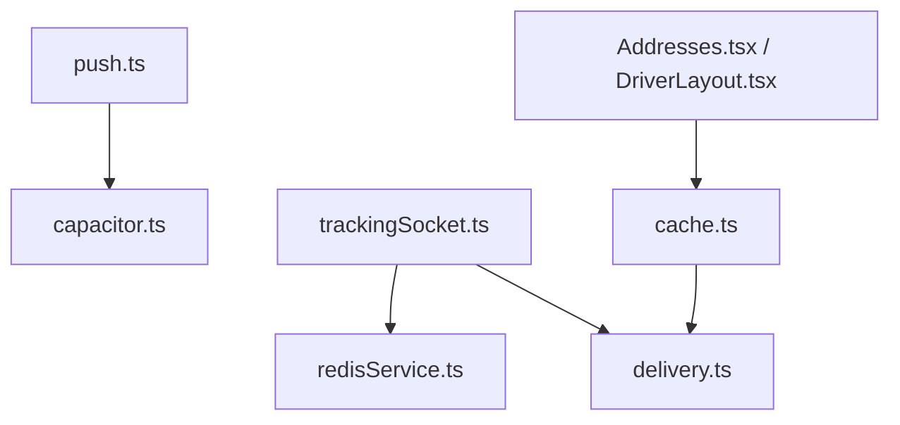

# Battery Performance

<cite>
**Referenced Files in This Document**
- [push.ts](file://src/lib/notifications/push.ts)
- [capacitor.ts](file://src/lib/capacitor.ts)
- [trackingSocket.ts](file://src/fleet/services/trackingSocket.ts)
- [redisService.ts](file://websocket-server/src/services/redisService.ts)
- [delivery.ts](file://src/integrations/supabase/delivery.ts)
- [CustomerDeliveryTracker.tsx](file://src/components/customer/CustomerDeliveryTracker.tsx)
- [Addresses.tsx](file://src/pages/Addresses.tsx)
- [DriverLayout.tsx](file://src/components/driver/DriverLayout.tsx)
- [cache.ts](file://src/lib/cache.ts)
- [AndroidManifest.xml](file://android/app/src/main/AndroidManifest.xml)
- [capacitor.plugins.json](file://android/app/src/main/assets/capacitor.plugins.json)
- [Package.swift](file://ios/App/CapApp-SPM/Package.swift)
- [realtime.spec.ts](file://e2e/system/realtime.spec.ts)
</cite>

## Table of Contents
1. [Introduction](#introduction)
2. [Project Structure](#project-structure)
3. [Core Components](#core-components)
4. [Architecture Overview](#architecture-overview)
5. [Detailed Component Analysis](#detailed-component-analysis)
6. [Dependency Analysis](#dependency-analysis)
7. [Performance Considerations](#performance-considerations)
8. [Troubleshooting Guide](#troubleshooting-guide)
9. [Conclusion](#conclusion)

## Introduction
This document focuses on optimizing battery performance for Nutrio’s hybrid mobile app. It covers background process management (push notifications, WebSocket connections, and periodic data synchronization), network request optimization, geolocation service tuning, Capacitor plugin power consumption, and battery usage analysis techniques. Practical examples demonstrate efficient background sync strategies for order tracking and delivery updates.

## Project Structure
The hybrid app leverages Capacitor to bridge web technologies with native device features. Key areas relevant to battery optimization include:
- Push notification service and Capacitor wrappers
- WebSocket-based real-time delivery tracking
- Supabase integration for delivery updates
- Geolocation utilities for address selection and driver tracking
- Caching layer to reduce network and CPU work
- Android/iOS manifest and plugin configurations affecting power usage

**Diagram sources**
- [push.ts:1-137](file://src/lib/notifications/push.ts#L1-L137)
- [capacitor.ts:1-640](file://src/lib/capacitor.ts#L1-L640)
- [Addresses.tsx:231-272](file://src/pages/Addresses.tsx#L231-L272)
- [DriverLayout.tsx:93-166](file://src/components/driver/DriverLayout.tsx#L93-L166)
- [cache.ts:1-199](file://src/lib/cache.ts#L1-L199)
- [delivery.ts:639-699](file://src/integrations/supabase/delivery.ts#L639-L699)
- [trackingSocket.ts:36-214](file://src/fleet/services/trackingSocket.ts#L36-L214)
- [redisService.ts:1-264](file://websocket-server/src/services/redisService.ts#L1-L264)

**Section sources**
- [push.ts:1-137](file://src/lib/notifications/push.ts#L1-L137)
- [capacitor.ts:1-640](file://src/lib/capacitor.ts#L1-L640)
- [trackingSocket.ts:36-214](file://src/fleet/services/trackingSocket.ts#L36-L214)
- [redisService.ts:1-264](file://websocket-server/src/services/redisService.ts#L1-L264)
- [delivery.ts:639-699](file://src/integrations/supabase/delivery.ts#L639-L699)
- [Addresses.tsx:231-272](file://src/pages/Addresses.tsx#L231-L272)
- [DriverLayout.tsx:93-166](file://src/components/driver/DriverLayout.tsx#L93-L166)
- [cache.ts:1-199](file://src/lib/cache.ts#L1-L199)

## Core Components
- Push notification service initializes permissions, registers tokens, and handles taps to deep-link into order tracking.
- Capacitor wrappers encapsulate native features (push, local notifications, biometric auth, haptics) with graceful web fallbacks.
- WebSocket client manages persistent connections for live delivery updates with exponential backoff and message queuing.
- Redis-backed caching and pub/sub scale WebSocket updates across multiple servers.
- Geolocation utilities balance accuracy and battery life using watchPosition with early termination and timeouts.
- Supabase delivery APIs provide real-time channels and driver/location queries for tracking.

**Section sources**
- [push.ts:25-75](file://src/lib/notifications/push.ts#L25-L75)
- [capacitor.ts:321-405](file://src/lib/capacitor.ts#L321-L405)
- [trackingSocket.ts:36-95](file://src/fleet/services/trackingSocket.ts#L36-L95)
- [redisService.ts:84-146](file://websocket-server/src/services/redisService.ts#L84-L146)
- [Addresses.tsx:231-272](file://src/pages/Addresses.tsx#L231-L272)
- [delivery.ts:647-699](file://src/integrations/supabase/delivery.ts#L647-L699)

## Architecture Overview
The order tracking pipeline combines push notifications, WebSocket updates, and Supabase real-time channels to keep the UI fresh with minimal battery drain.

**Diagram sources**
- [push.ts:110-125](file://src/lib/notifications/push.ts#L110-L125)
- [capacitor.ts:321-405](file://src/lib/capacitor.ts#L321-L405)
- [trackingSocket.ts:36-95](file://src/fleet/services/trackingSocket.ts#L36-L95)
- [redisService.ts:63-82](file://websocket-server/src/services/redisService.ts#L63-L82)
- [delivery.ts:695-699](file://src/integrations/supabase/delivery.ts#L695-L699)

## Detailed Component Analysis

### Push Notification Handling
- Initializes only on native platforms, checks and requests permissions, registers for tokens, and persists tokens to the database.
- Listens for notification taps and navigates to appropriate screens (order tracking, promotions, reminders).
- Uses Capacitor’s push wrapper to avoid redundant native code duplication.

**Diagram sources**
- [push.ts:25-75](file://src/lib/notifications/push.ts#L25-L75)
- [push.ts:110-125](file://src/lib/notifications/push.ts#L110-L125)

**Section sources**
- [push.ts:25-75](file://src/lib/notifications/push.ts#L25-L75)
- [push.ts:110-125](file://src/lib/notifications/push.ts#L110-L125)
- [capacitor.ts:321-405](file://src/lib/capacitor.ts#L321-L405)

### WebSocket Connections and Reconnection Strategy
- Establishes a WebSocket connection with token authentication, subscribes to city-specific channels, and flushes queued messages upon connect.
- Implements exponential backoff with capped attempts and automatic reconnection on close/error.
- Queues outbound messages when offline to avoid missed events.

**Diagram sources**
- [trackingSocket.ts:36-95](file://src/fleet/services/trackingSocket.ts#L36-L95)
- [trackingSocket.ts:168-178](file://src/fleet/services/trackingSocket.ts#L168-L178)
- [trackingSocket.ts:180-198](file://src/fleet/services/trackingSocket.ts#L180-L198)

**Section sources**
- [trackingSocket.ts:36-95](file://src/fleet/services/trackingSocket.ts#L36-L95)
- [trackingSocket.ts:168-178](file://src/fleet/services/trackingSocket.ts#L168-L178)
- [trackingSocket.ts:180-198](file://src/fleet/services/trackingSocket.ts#L180-L198)

### Supabase Real-Time Delivery Updates
- Provides a real-time subscription to delivery job updates via Postgres changes.
- Retrieves driver location and delivery tracking details for the customer view.

**Diagram sources**
- [delivery.ts:695-699](file://src/integrations/supabase/delivery.ts#L695-L699)

**Section sources**
- [delivery.ts:647-699](file://src/integrations/supabase/delivery.ts#L647-L699)
- [CustomerDeliveryTracker.tsx:198-216](file://src/components/customer/CustomerDeliveryTracker.tsx#L198-L216)

### Geolocation Service Optimization
- Address selection uses watchPosition with aggressive early termination thresholds (accuracy < 30m or significant improvement) and a hard timeout to minimize GPS runtime.
- Driver location tracking runs on an interval with retry logic for timeouts and explicit permission handling.

**Diagram sources**
- [Addresses.tsx:231-272](file://src/pages/Addresses.tsx#L231-L272)

**Section sources**
- [Addresses.tsx:231-272](file://src/pages/Addresses.tsx#L231-L272)
- [DriverLayout.tsx:93-166](file://src/components/driver/DriverLayout.tsx#L93-L166)

### Capacitor Plugin Power Consumption
- Push notifications and local notifications are enabled on both Android and iOS via Gradle and Swift manifests.
- Biometric authentication, camera, and filesystem plugins are declared for native platforms.
- Capacitor wrappers centralize native calls and provide safe web fallbacks.

**Diagram sources**
- [capacitor.build.gradle:10-26](file://android/app/capacitor.build.gradle#L10-L26)
- [capacitor.plugins.json:6-53](file://android/app/src/main/assets/capacitor.plugins.json#L6-L53)
- [Package.swift:43-47](file://ios/App/CapApp-SPM/Package.swift#L43-L47)

**Section sources**
- [capacitor.build.gradle:10-26](file://android/app/capacitor.build.gradle#L10-L26)
- [capacitor.plugins.json:6-53](file://android/app/src/main/assets/capacitor.plugins.json#L6-L53)
- [Package.swift:43-47](file://ios/App/CapApp-SPM/Package.swift#L43-L47)
- [capacitor.ts:1-640](file://src/lib/capacitor.ts#L1-L640)

### Network Request Optimization and Caching
- A caching layer reduces repeated network calls by storing frequently accessed data in memory (with TTL) and deferring to Redis when available.
- Cache keys are scoped to specific entities (restaurants, meals, challenges) to minimize invalidation overhead.

**Diagram sources**
- [cache.ts:37-86](file://src/lib/cache.ts#L37-L86)

**Section sources**
- [cache.ts:1-199](file://src/lib/cache.ts#L1-L199)

## Dependency Analysis
- Push notifications depend on Capacitor push plugin and Supabase for token persistence.
- WebSocket client depends on Redis pub/sub for horizontal scaling and Supabase for real-time Postgres changes.
- Geolocation utilities depend on browser APIs and are optimized to terminate early.
- Capacitor wrappers decouple UI from native specifics, enabling battery-conscious usage patterns.

**Diagram sources**
- [push.ts:1-137](file://src/lib/notifications/push.ts#L1-L137)
- [capacitor.ts:1-640](file://src/lib/capacitor.ts#L1-L640)
- [trackingSocket.ts:36-95](file://src/fleet/services/trackingSocket.ts#L36-L95)
- [redisService.ts:63-82](file://websocket-server/src/services/redisService.ts#L63-L82)
- [delivery.ts:695-699](file://src/integrations/supabase/delivery.ts#L695-L699)
- [Addresses.tsx:231-272](file://src/pages/Addresses.tsx#L231-L272)
- [DriverLayout.tsx:93-166](file://src/components/driver/DriverLayout.tsx#L93-L166)
- [cache.ts:1-199](file://src/lib/cache.ts#L1-L199)

**Section sources**
- [push.ts:1-137](file://src/lib/notifications/push.ts#L1-L137)
- [capacitor.ts:1-640](file://src/lib/capacitor.ts#L1-L640)
- [trackingSocket.ts:36-95](file://src/fleet/services/trackingSocket.ts#L36-L95)
- [redisService.ts:63-82](file://websocket-server/src/services/redisService.ts#L63-L82)
- [delivery.ts:695-699](file://src/integrations/supabase/delivery.ts#L695-L699)
- [Addresses.tsx:231-272](file://src/pages/Addresses.tsx#L231-L272)
- [DriverLayout.tsx:93-166](file://src/components/driver/DriverLayout.tsx#L93-L166)
- [cache.ts:1-199](file://src/lib/cache.ts#L1-L199)

## Performance Considerations
- Prefer real-time channels and WebSocket updates over frequent polling to reduce CPU wake-ups and network overhead.
- Use exponential backoff and connection reuse to minimize repeated TCP handshakes.
- Apply caching for static or semi-static data to avoid redundant API calls.
- Tune geolocation accuracy and timeouts to balance precision and battery life.
- Centralize native feature access via Capacitor wrappers to ensure consistent power-conscious behavior across platforms.

## Troubleshooting Guide
- Push notifications not received:
  - Verify platform checks and permission flows.
  - Confirm token registration and database upsert.
  - Ensure tap handlers navigate to correct routes.

- WebSocket disconnections:
  - Inspect exponential backoff and reconnect delays.
  - Validate message queue flushing on connect.
  - Confirm Redis pub/sub connectivity and channel subscriptions.

- Geolocation issues:
  - Review accuracy thresholds and timeout logic.
  - Handle permission denials gracefully and inform users.

- Capacitor plugin mismatches:
  - Confirm plugin declarations in Gradle and Swift packages.
  - Ensure only native platforms initialize sensitive plugins.

**Section sources**
- [push.ts:25-75](file://src/lib/notifications/push.ts#L25-L75)
- [trackingSocket.ts:168-178](file://src/fleet/services/trackingSocket.ts#L168-L178)
- [Addresses.tsx:231-272](file://src/pages/Addresses.tsx#L231-L272)
- [capacitor.build.gradle:10-26](file://android/app/capacitor.build.gradle#L10-L26)
- [Package.swift:43-47](file://ios/App/CapApp-SPM/Package.swift#L43-L47)

## Conclusion
By combining real-time updates, conservative polling, intelligent caching, and battery-aware geolocation and native plugin usage, the hybrid app can deliver responsive order tracking and delivery updates while minimizing battery drain. The documented components and strategies provide a foundation for further optimization and measurement.