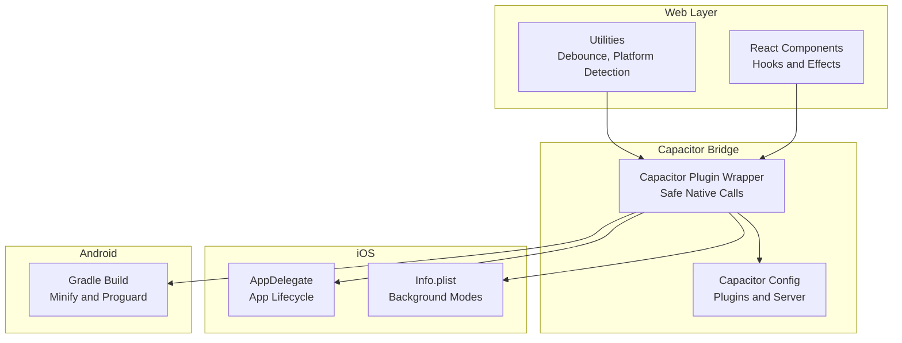
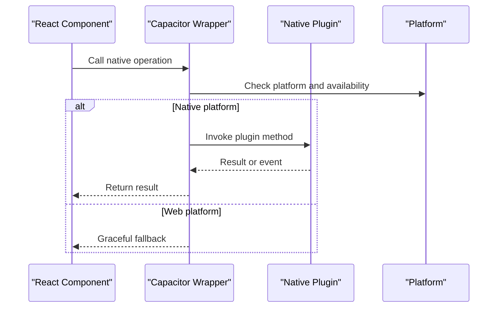
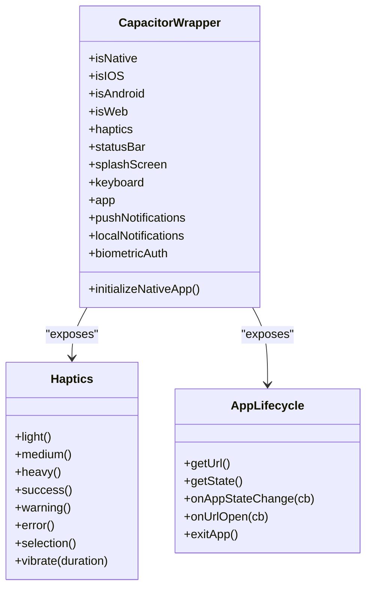
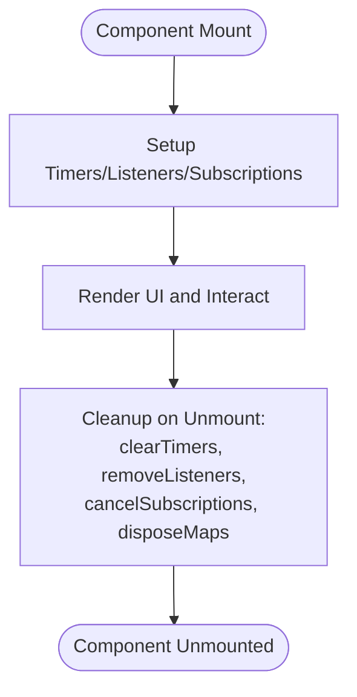
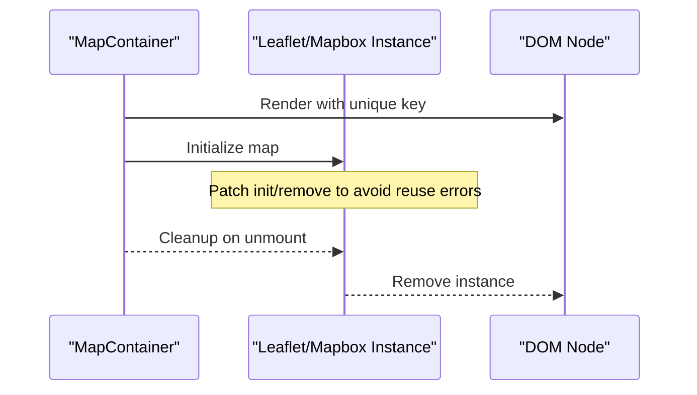
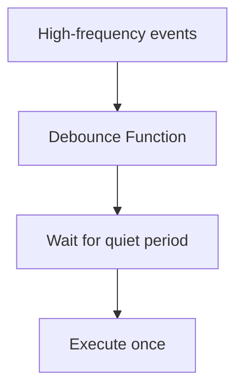
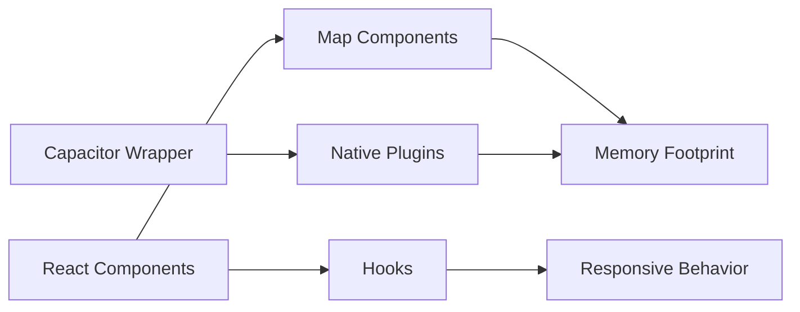

# Memory Optimization

<cite>
**Referenced Files in This Document**
- [capacitor.config.ts](file://capacitor.config.ts)
- [AppDelegate.swift](file://ios\App\App\AppDelegate.swift)
- [Info.plist](file://ios\App\App\Info.plist)
- [build.gradle](file://android\app\build.gradle)
- [capacitor.ts](file://src\lib\capacitor.ts)
- [SessionTimeoutManager.tsx](file://src\components\SessionTimeoutManager.tsx)
- [use-mobile.tsx](file://src\hooks\use-mobile.tsx)
- [MapContainer.tsx](file://src\components\maps\MapContainer.tsx)
- [MapboxMap.tsx](file://src\components\maps\mapbox\MapboxMap.tsx)
- [debounce.ts](file://src\lib\debounce.ts)
- [web-CqwUYSjD.js](file://android\app\src\main\assets\public\assets\web-CqwUYSjD.js)
- [web-CqwUYSjD.js](file://ios\App\App\public\assets\web-CqwUYSjD.js)
</cite>

## Table of Contents
1. [Introduction](#introduction)
2. [Project Structure](#project-structure)
3. [Core Components](#core-components)
4. [Architecture Overview](#architecture-overview)
5. [Detailed Component Analysis](#detailed-component-analysis)
6. [Dependency Analysis](#dependency-analysis)
7. [Performance Considerations](#performance-considerations)
8. [Troubleshooting Guide](#troubleshooting-guide)
9. [Conclusion](#conclusion)
10. [Appendices](#appendices)

## Introduction
This document provides comprehensive guidance for mobile memory optimization in Nutrio’s Capacitor-based implementation. It focuses on:
- Heap monitoring using Xcode Instruments and Android Profiler
- Detecting and preventing memory leaks in React components, event listeners, and Capacitor plugin usage
- Garbage collection optimization via proper cleanup of timers, subscriptions, and native references
- Platform-specific memory constraints on iOS and Android
- Practical profiling workflows and bottleneck identification across the customer, partner, and driver portals

## Project Structure
Nutrio’s mobile stack is a hybrid app using Capacitor to bridge web technologies to native platforms. The repository includes:
- Capacitor configuration defining plugins and server behavior
- iOS and Android build configurations
- React components and hooks that manage lifecycle and memory-sensitive operations
- Capacitor plugin wrappers that encapsulate native capabilities with safe fallbacks

**Diagram sources**
- [capacitor.config.ts:1-45](file://capacitor.config.ts#L1-L45)
- [AppDelegate.swift:1-43](file://ios\App\App\AppDelegate.swift#L1-L43)
- [Info.plist:39-55](file://ios\App\App\Info.plist#L39-L55)
- [build.gradle:34-44](file://android\app\build.gradle#L34-L44)
- [capacitor.ts:1-640](file://src\lib\capacitor.ts#L1-L640)

**Section sources**
- [capacitor.config.ts:1-45](file://capacitor.config.ts#L1-L45)
- [build.gradle:1-75](file://android\app\build.gradle#L1-L75)
- [AppDelegate.swift:1-43](file://ios\App\App\AppDelegate.swift#L1-L43)
- [Info.plist:39-55](file://ios\App\App\Info.plist#L39-L55)

## Core Components
- Capacitor configuration defines plugin usage and server behavior, impacting memory footprint and network-related allocations.
- Capacitor plugin wrapper centralizes native calls with platform checks, ensuring resources are only accessed when applicable.
- React hooks and components manage lifecycle events and subscriptions that can leak if not cleaned up properly.
- Platform-specific build settings enable minification and optimization that reduce memory overhead.

Key areas for memory optimization:
- Proper effect cleanup in React components
- Event listener removal and subscription cancellation
- Minimizing retained references to DOM nodes and native objects
- Leveraging platform lifecycle hooks to pause or clean up resources

**Section sources**
- [capacitor.config.ts:18-42](file://capacitor.config.ts#L18-L42)
- [capacitor.ts:27-43](file://src\lib\capacitor.ts#L27-L43)
- [use-mobile.tsx:1-20](file://src\hooks\use-mobile.tsx#L1-L20)

## Architecture Overview
The memory optimization architecture centers on safe native access, lifecycle-aware components, and platform-specific build optimizations.

**Diagram sources**
- [capacitor.ts:27-43](file://src\lib\capacitor.ts#L27-L43)
- [capacitor.ts:590-608](file://src\lib\capacitor.ts#L590-L608)

## Detailed Component Analysis

### Capacitor Plugin Wrapper and Memory Safety
The Capacitor wrapper ensures native calls are only executed on native platforms and provides safe fallbacks on the web. This prevents unnecessary allocations and retains references to unavailable APIs.

**Diagram sources**
- [capacitor.ts:27-43](file://src\lib\capacitor.ts#L27-L43)
- [capacitor.ts:49-122](file://src\lib\capacitor.ts#L49-L122)
- [capacitor.ts:268-315](file://src\lib\capacitor.ts#L268-L315)

**Section sources**
- [capacitor.ts:27-43](file://src\lib\capacitor.ts#L27-L43)
- [capacitor.ts:49-122](file://src\lib\capacitor.ts#L49-L122)
- [capacitor.ts:268-315](file://src\lib\capacitor.ts#L268-L315)

### React Component Lifecycle and Cleanup
Components must clean up timers, subscriptions, and event listeners to prevent memory leaks. Examples include:
- Removing media query listeners on resize
- Cleaning up real-time subscriptions and visibility change handlers
- Ensuring map instances are properly removed when components unmount

**Diagram sources**
- [use-mobile.tsx:8-16](file://src\hooks\use-mobile.tsx#L8-L16)
- [SessionTimeoutManager.tsx:326-343](file://src\components\SessionTimeoutManager.tsx#L326-L343)
- [MapContainer.tsx:82-89](file://src\components\maps\MapContainer.tsx#L82-L89)

**Section sources**
- [use-mobile.tsx:8-16](file://src\hooks\use-mobile.tsx#L8-L16)
- [SessionTimeoutManager.tsx:326-343](file://src\components\SessionTimeoutManager.tsx#L326-L343)
- [MapContainer.tsx:82-89](file://src\components\maps\MapContainer.tsx#L82-L89)

### Map Components and Memory Management
Map containers require careful handling to avoid retaining references and to prevent reinitialization issues under React StrictMode. The implementation includes:
- Patching map initialization to avoid “already initialized” errors
- Using keys to force fresh DOM subtrees and avoid stale references
- Cleaning up map instances and event listeners on unmount

**Diagram sources**
- [MapContainer.tsx:25-47](file://src\components\maps\MapContainer.tsx#L25-L47)
- [MapContainer.tsx:82-89](file://src\components\maps\MapContainer.tsx#L82-L89)
- [MapboxMap.tsx:50-76](file://src\components\maps\mapbox\MapboxMap.tsx#L50-L76)

**Section sources**
- [MapContainer.tsx:25-47](file://src\components\maps\MapContainer.tsx#L25-L47)
- [MapContainer.tsx:82-89](file://src\components\maps\MapContainer.tsx#L82-L89)
- [MapboxMap.tsx:50-76](file://src\components\maps\mapbox\MapboxMap.tsx#L50-L76)

### Debounce Utility and Memory Pressure
The debounce utility reduces repeated function invocations, lowering CPU and memory pressure during rapid user interactions (e.g., resizing, scrolling).

**Diagram sources**
- [debounce.ts:1-16](file://src\lib\debounce.ts#L1-L16)

**Section sources**
- [debounce.ts:1-16](file://src\lib\debounce.ts#L1-L16)

### Platform-Specific Build Optimizations
Android build settings enable minification and ProGuard optimization, reducing memory overhead and binary size. These settings help mitigate memory pressure in production builds.

**Section sources**
- [build.gradle:34-44](file://android\app\build.gradle#L34-L44)

## Dependency Analysis
Memory-sensitive dependencies and their impact:
- Capacitor plugins: Haptics, Status Bar, Splash Screen, Keyboard, App, Push Notifications, Local Notifications, Native Biometric
- React components: MapContainer, MapboxMap, SessionTimeoutManager
- Hooks: use-mobile for responsive behavior

**Diagram sources**
- [capacitor.ts:49-122](file://src\lib\capacitor.ts#L49-L122)
- [MapContainer.tsx:69-115](file://src\components\maps\MapContainer.tsx#L69-L115)
- [MapboxMap.tsx:88-100](file://src\components\maps\mapbox\MapboxMap.tsx#L88-L100)
- [use-mobile.tsx:5-19](file://src\hooks\use-mobile.tsx#L5-L19)

**Section sources**
- [capacitor.ts:49-122](file://src\lib\capacitor.ts#L49-L122)
- [MapContainer.tsx:69-115](file://src\components\maps\MapContainer.tsx#L69-L115)
- [MapboxMap.tsx:88-100](file://src\components\maps\mapbox\MapboxMap.tsx#L88-L100)
- [use-mobile.tsx:5-19](file://src\hooks\use-mobile.tsx#L5-L19)

## Performance Considerations
- Prefer lazy initialization for heavy components (e.g., maps) and dispose them on unmount.
- Use debounced handlers for resize and scroll events to reduce frequent re-renders.
- Avoid retaining references to DOM nodes or native objects beyond component lifetimes.
- Leverage platform lifecycle hooks to pause or clean up resources when the app enters the background.

[No sources needed since this section provides general guidance]

## Troubleshooting Guide
Common memory leak scenarios and fixes:
- Event listeners not removed: Ensure cleanup functions remove event listeners in useEffect return statements.
- Subscriptions not canceled: Cancel Supabase or WebSocket subscriptions on unmount.
- Map instances not disposed: Remove map instances and off event listeners when components unmount.
- Platform checks missing: Use the Capacitor wrapper to guard native calls and avoid unnecessary allocations.

Practical steps:
- Use Xcode Instruments Allocations and Leaks instruments to detect retain cycles and leaked objects.
- Use Android Studio Profiler to monitor heap growth and identify excessive allocations.
- Verify background app lifecycle behavior and ensure timers and listeners are cleared when the app goes to background.

**Section sources**
- [SessionTimeoutManager.tsx:326-343](file://src\components\SessionTimeoutManager.tsx#L326-L343)
- [MapContainer.tsx:82-89](file://src\components\maps\MapContainer.tsx#L82-L89)
- [MapboxMap.tsx:70-76](file://src\components\maps\mapbox\MapboxMap.tsx#L70-L76)

## Conclusion
By centralizing native access through the Capacitor wrapper, carefully managing React component lifecycles, and leveraging platform-specific build optimizations, Nutrio can achieve robust memory performance across iOS and Android. Regular profiling with Xcode Instruments and Android Profiler, combined with disciplined cleanup practices, will sustain low memory footprints and smooth user experiences across the customer, partner, and driver portals.

[No sources needed since this section summarizes without analyzing specific files]

## Appendices

### Platform-Specific Memory Constraints
- iOS background app termination: Apps are suspended shortly after moving to the background; ensure timers and listeners are cleared to avoid background execution penalties.
- Android background app termination: Android may terminate background processes to reclaim memory; minimize retained references and pause non-essential work.

**Section sources**
- [AppDelegate.swift:14-34](file://ios\App\App\AppDelegate.swift#L14-L34)
- [Info.plist:48-51](file://ios\App\App\Info.plist#L48-L51)

### Practical Profiling Workflows
- iOS:
  - Open Xcode > Windows > Devices and Simulators > select device > click “Open System Memory Graph Debugger”
  - Record allocations during typical user journeys (e.g., navigating between portals)
  - Inspect retained objects and resolve retain cycles
- Android:
  - Open Android Studio > Profiler > select device and app process
  - Monitor heap size, GC activity, and allocation rate during user flows
  - Focus on high-frequency screens (e.g., maps, lists) to identify bottlenecks

[No sources needed since this section provides general guidance]

### Example Screens to Target for Memory Bottlenecks
- Customer portal: Order history, meal browsing, map-based scheduling
- Partner portal: Analytics dashboards, menu editing, real-time order feeds
- Driver portal: Live tracking, delivery route maps, notifications

[No sources needed since this section provides general guidance]