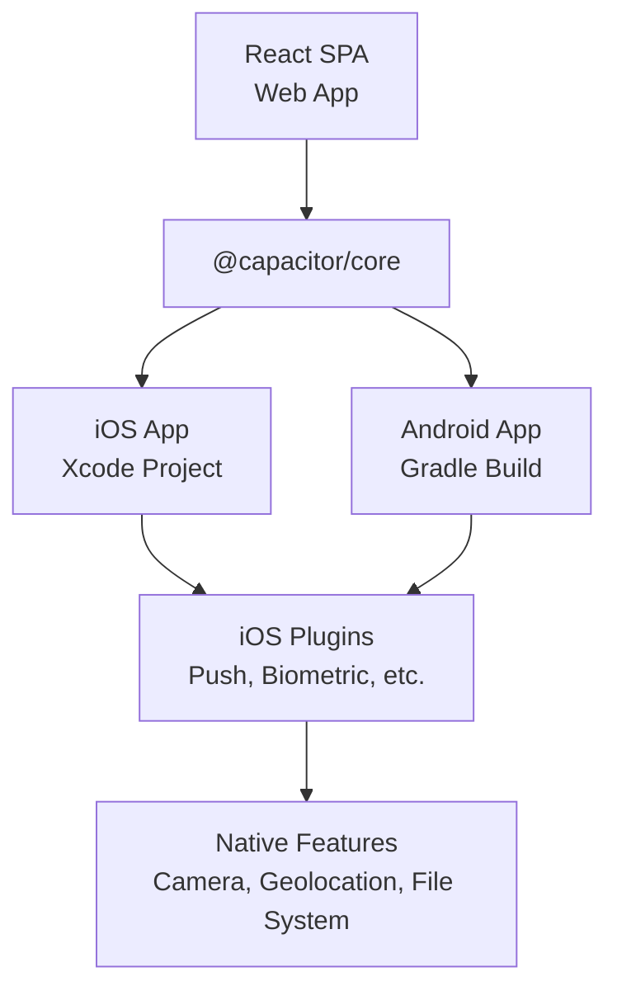
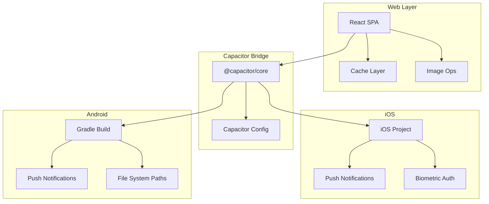
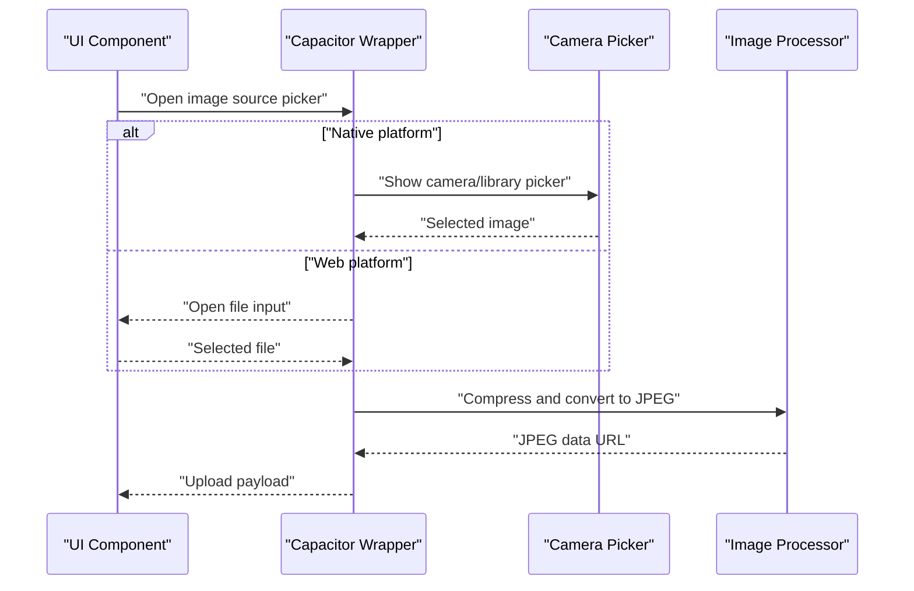
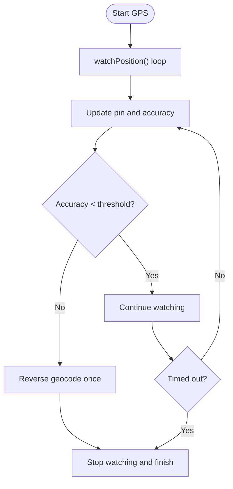
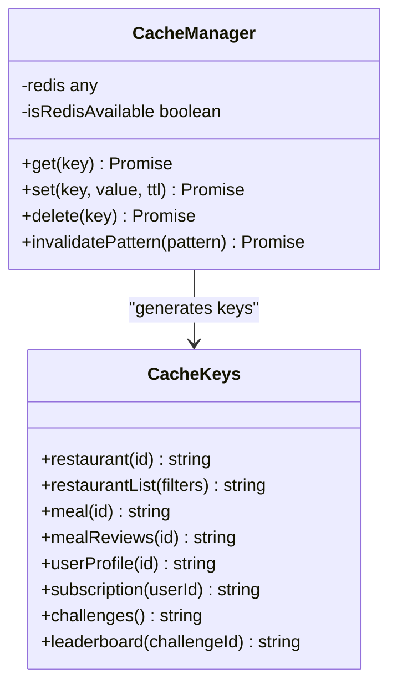
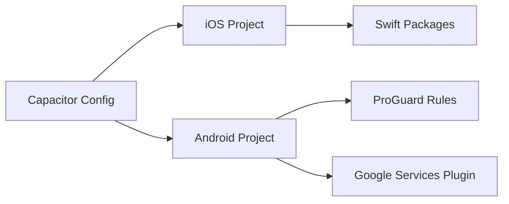

# Mobile Application Performance

<cite>
**Referenced Files in This Document**
- [capacitor.config.ts](file://capacitor.config.ts)
- [capacitor.ts](file://src/lib/capacitor.ts)
- [cache.ts](file://src/lib/cache.ts)
- [meal-plan-generator.ts](file://src/lib/meal-plan-generator.ts)
- [performance-benchmark.ts](file://scripts/performance-benchmark.ts)
- [build.gradle](file://android/app/build.gradle)
- [project.pbxproj](file://ios/App/App.xcodeproj/project.pbxproj)
- [file_paths.xml](file://android/app/src/main/res/xml/file_paths.xml)
- [Addresses.tsx](file://src/pages/Addresses.tsx)
- [AvatarUpload.tsx](file://src/components/AvatarUpload.tsx)
- [DriverLayout.tsx](file://src/components/driver/DriverLayout.tsx)
</cite>

## Table of Contents
1. [Introduction](#introduction)
2. [Project Structure](#project-structure)
3. [Core Components](#core-components)
4. [Architecture Overview](#architecture-overview)
5. [Detailed Component Analysis](#detailed-component-analysis)
6. [Dependency Analysis](#dependency-analysis)
7. [Performance Considerations](#performance-considerations)
8. [Troubleshooting Guide](#troubleshooting-guide)
9. [Conclusion](#conclusion)

## Introduction
This document provides a comprehensive guide to mobile application performance profiling for Nutrio's Capacitor-based implementation. It focuses on memory usage analysis for iOS and Android, battery optimization strategies, native feature performance (camera, geolocation, file system), and mobile-specific optimizations (image compression, offline caching, network efficiency). It also includes practical guidance for using Xcode Instruments, Android Profiler, and Capacitor-specific debugging tools.

## Project Structure
Nutrio uses Capacitor to wrap a React SPA into native iOS and Android applications. The configuration and platform-specific build settings are centralized in Capacitor configuration and platform build files. Native capabilities are exposed through a unified wrapper that detects platform and provides safe fallbacks for web environments.

**Diagram sources**
- [capacitor.config.ts:1-45](file://capacitor.config.ts#L1-L45)
- [project.pbxproj:1-377](file://ios/App/App.xcodeproj/project.pbxproj#L1-L377)
- [build.gradle:1-75](file://android/app/build.gradle#L1-L75)

**Section sources**
- [capacitor.config.ts:1-45](file://capacitor.config.ts#L1-L45)
- [build.gradle:1-75](file://android/app/build.gradle#L1-L75)
- [project.pbxproj:1-377](file://ios/App/App.xcodeproj/project.pbxproj#L1-L377)

## Core Components
- Capacitor configuration defines server behavior, allowed navigation, and plugin presets for splash, push notifications, local notifications, and biometrics.
- The Capacitor wrapper centralizes native feature access with platform checks and graceful web fallbacks.
- Caching utilities provide a Redis-backed cache with in-memory fallback for frequently accessed data.
- Performance benchmarking script measures RPC and query latencies to identify bottlenecks.

**Section sources**
- [capacitor.config.ts:1-45](file://capacitor.config.ts#L1-L45)
- [capacitor.ts:1-640](file://src/lib/capacitor.ts#L1-L640)
- [cache.ts:1-199](file://src/lib/cache.ts#L1-L199)
- [performance-benchmark.ts:1-280](file://scripts/performance-benchmark.ts#L1-L280)

## Architecture Overview
The mobile architecture integrates a React SPA with Capacitor plugins. Platform-specific builds (iOS and Android) embed the web assets and expose native APIs through Capacitor plugins. The configuration controls security, navigation, and plugin behavior.

**Diagram sources**
- [capacitor.config.ts:1-45](file://capacitor.config.ts#L1-L45)
- [capacitor.ts:1-640](file://src/lib/capacitor.ts#L1-L640)
- [cache.ts:1-199](file://src/lib/cache.ts#L1-L199)
- [meal-plan-generator.ts:267-340](file://src/lib/meal-plan-generator.ts#L267-L340)
- [build.gradle:1-75](file://android/app/build.gradle#L1-L75)
- [project.pbxproj:1-377](file://ios/App/App.xcodeproj/project.pbxproj#L1-L377)
- [file_paths.xml:1-5](file://android/app/src/main/res/xml/file_paths.xml#L1-L5)

## Detailed Component Analysis

### Memory Usage Analysis and Heap Monitoring
- Platform detection and native initialization:
  - The wrapper determines platform and initializes native settings such as status bar style and splash screen behavior. This reduces unnecessary overhead on web and ensures consistent native UX.
- Memory leak prevention:
  - Use platform-aware listeners and lifecycle hooks. For example, ensure timers and intervals are cleared when components unmount or app state changes.
  - Avoid retaining references to DOM nodes or large images beyond their lifecycle.
- Garbage collection optimization:
  - Minimize object churn in tight loops and avoid closures that capture large scopes.
  - Reuse arrays and buffers where possible; promptly revoke object URLs after image processing.

Practical steps:
- Use Xcode Instruments Allocations and Leaks instruments to profile iOS memory.
- Use Android Profiler Allocation Tracker and Memory Profiler to inspect Android heap usage.
- Monitor memory pressure callbacks and reduce retained memory during background transitions.

**Section sources**
- [capacitor.ts:590-608](file://src/lib/capacitor.ts#L590-L608)

### Battery Optimization Techniques
- Background processes:
  - Limit background tasks; use Capacitor app state listeners to pause or throttle non-essential work when the app becomes inactive.
- Network requests:
  - Batch and debounce network calls; use caching to minimize redundant requests.
  - Apply exponential backoff for retry logic to avoid excessive wake-ups.
- Push notifications:
  - Configure presentation options appropriately to avoid unnecessary UI updates.
  - Avoid requesting permissions repeatedly; check current status before prompting.

**Section sources**
- [capacitor.ts:292-315](file://src/lib/capacitor.ts#L292-L315)
- [capacitor.config.ts:30-35](file://capacitor.config.ts#L30-L35)

### Native Feature Performance

#### Camera Access
- Platform-aware image selection:
  - On native platforms, present a picker to choose between camera and library; on web, use a file input.
  - Enforce file type and size limits early to prevent large uploads.
- Image compression:
  - Convert images to JPEG with controlled quality and dimensions before upload.
  - Revoke object URLs after processing to free memory.

**Diagram sources**
- [AvatarUpload.tsx:124-132](file://src/components/AvatarUpload.tsx#L124-L132)
- [meal-plan-generator.ts:267-340](file://src/lib/meal-plan-generator.ts#L267-L340)

**Section sources**
- [AvatarUpload.tsx:99-132](file://src/components/AvatarUpload.tsx#L99-L132)
- [meal-plan-generator.ts:267-340](file://src/lib/meal-plan-generator.ts#L267-L340)

#### Geolocation Services
- Accuracy-first strategy:
  - Watch position and progressively refine until acceptable accuracy is achieved or a hard timeout elapses.
  - Reverse geocode once sufficient accuracy is reached to avoid unnecessary network calls.
- Error handling:
  - Distinguish permission denials, position unavailable, and timeouts; provide actionable user feedback.

**Diagram sources**
- [Addresses.tsx:247-272](file://src/pages/Addresses.tsx#L247-L272)

**Section sources**
- [Addresses.tsx:231-272](file://src/pages/Addresses.tsx#L231-L272)
- [DriverLayout.tsx:97-127](file://src/components/driver/DriverLayout.tsx#L97-L127)

#### File System Operations
- Android file paths:
  - Define file paths for external storage and cache to enable native file access patterns.
- iOS file handling:
  - Use Capacitor file system APIs for secure and efficient file operations.

**Section sources**
- [file_paths.xml:1-5](file://android/app/src/main/res/xml/file_paths.xml#L1-L5)
- [capacitor.ts:1-640](file://src/lib/capacitor.ts#L1-L640)

### Offline Caching Strategies
- Multi-tier caching:
  - Prefer Redis-backed cache in production; fall back to in-memory cache when unavailable.
  - Cache keys are scoped by entity type and identifiers to enable targeted invalidation.
- Cache invalidation:
  - Invalidate patterns for restaurant and meal data to keep stale content from persisting.

**Diagram sources**
- [cache.ts:16-107](file://src/lib/cache.ts#L16-L107)

**Section sources**
- [cache.ts:1-199](file://src/lib/cache.ts#L1-L199)

### Network Efficiency
- Image loading strategies:
  - Prefer Supabase SDK downloads to bypass CORS issues, then fall back to direct fetch and finally to cross-origin image rendering.
  - Apply timeouts per strategy to bound total latency.
- Compression pipeline:
  - Resize canvas to target dimensions and encode as JPEG with fixed quality to reduce payload size.

**Section sources**
- [meal-plan-generator.ts:307-340](file://src/lib/meal-plan-generator.ts#L307-L340)

## Dependency Analysis
The mobile app depends on Capacitor core and platform-specific build configurations. The iOS project references Swift packages and build settings; the Android project applies ProGuard optimization and Google Services plugin conditionally.

**Diagram sources**
- [capacitor.config.ts:1-45](file://capacitor.config.ts#L1-L45)
- [project.pbxproj:1-377](file://ios/App/App.xcodeproj/project.pbxproj#L1-L377)
- [build.gradle:1-75](file://android/app/build.gradle#L1-L75)

**Section sources**
- [capacitor.config.ts:1-45](file://capacitor.config.ts#L1-L45)
- [build.gradle:34-44](file://android/app/build.gradle#L34-L44)
- [project.pbxproj:184-292](file://ios/App/App.xcodeproj/project.pbxproj#L184-L292)

## Performance Considerations
- Benchmarking:
  - Use the performance benchmarking script to measure RPC and query latencies across iterations, capturing average, min, max, and percentile timings.
  - Establish targets for P95/P99 thresholds and flag failures for optimization.
- Memory and CPU:
  - Profile on-device using Instruments and Android Profiler; focus on allocation hotspots and long GC pauses.
- Network:
  - Monitor request frequency and payload sizes; leverage caching and compression to reduce bandwidth and improve responsiveness.
- Battery:
  - Reduce background activity, batch network operations, and limit push notification noise.

**Section sources**
- [performance-benchmark.ts:23-98](file://scripts/performance-benchmark.ts#L23-L98)
- [performance-benchmark.ts:166-205](file://scripts/performance-benchmark.ts#L166-L205)

## Troubleshooting Guide
- Geolocation issues:
  - Inspect permission errors, timeouts, and position availability messages; adjust accuracy thresholds and retry logic accordingly.
- Image upload problems:
  - Validate file type and size limits; ensure compression pipeline handles errors gracefully and revokes object URLs.
- Push notifications:
  - Verify permission checks and registration flows; ensure listeners are attached only on native platforms.

**Section sources**
- [DriverLayout.tsx:104-127](file://src/components/driver/DriverLayout.tsx#L104-L127)
- [AvatarUpload.tsx:99-132](file://src/components/AvatarUpload.tsx#L99-L132)
- [capacitor.ts:325-404](file://src/lib/capacitor.ts#L325-L404)

## Conclusion
By leveraging Capacitor's platform abstraction, implementing robust caching, optimizing image processing, and applying disciplined profiling practices, Nutrio can achieve strong mobile performance across iOS and Android. Use the provided tools and patterns to continuously monitor and improve memory usage, battery life, and network efficiency.