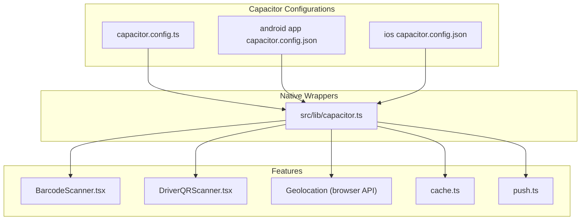
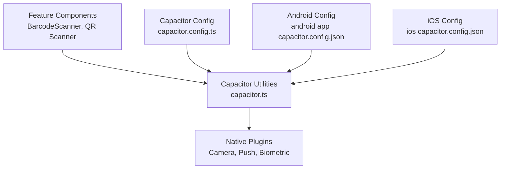
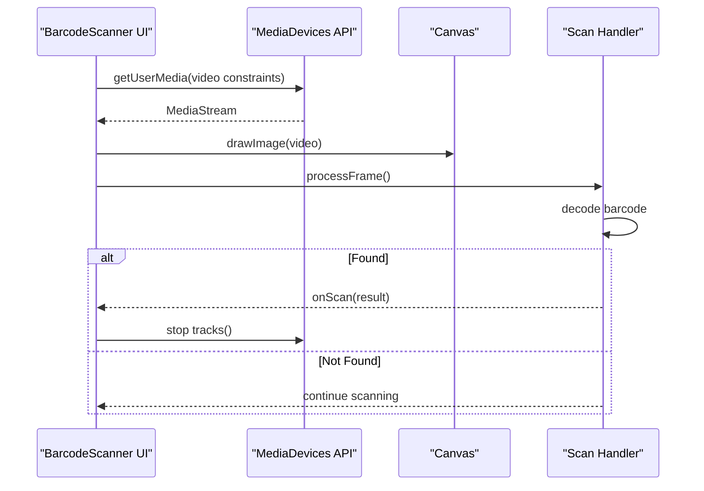
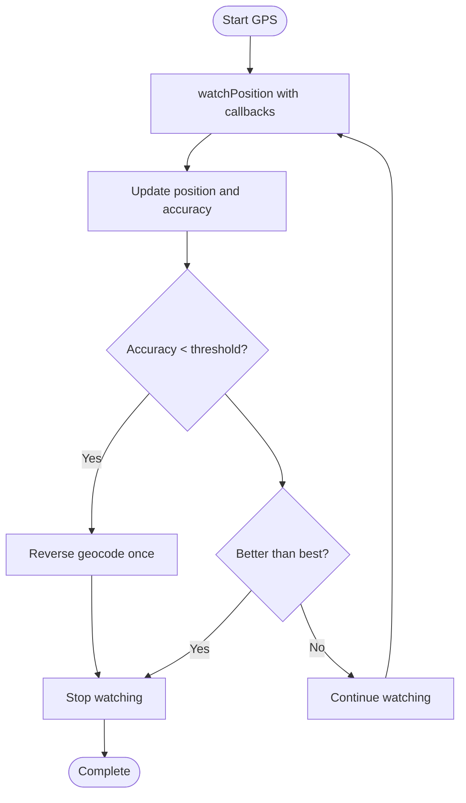
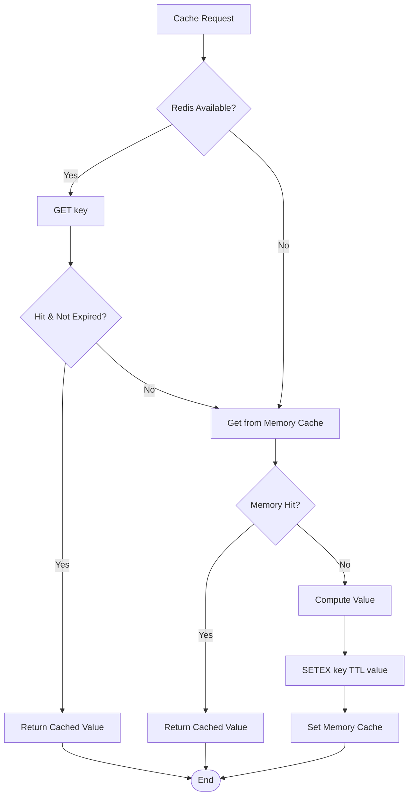
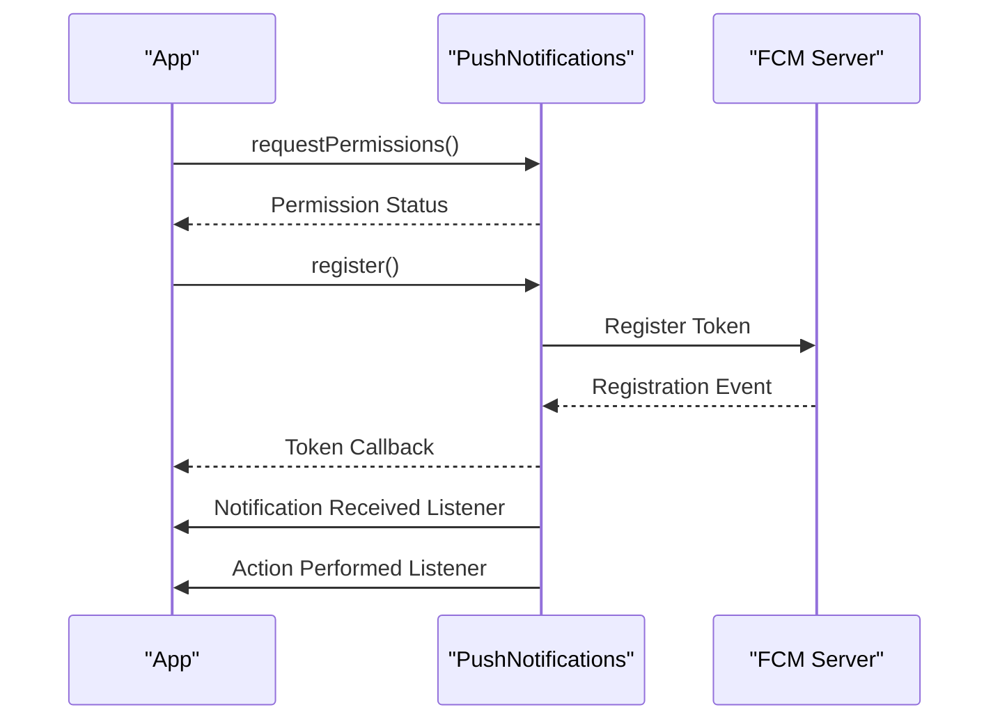
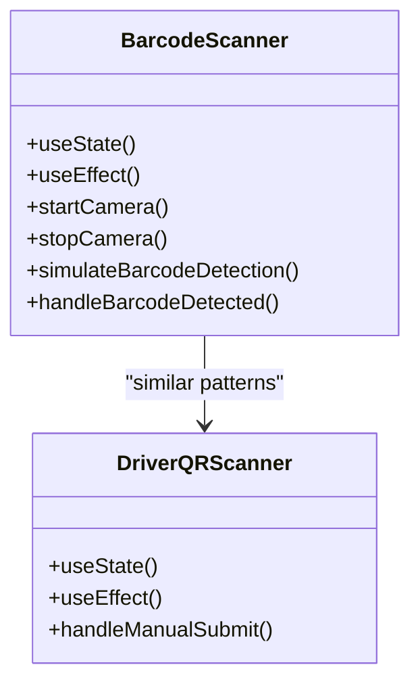
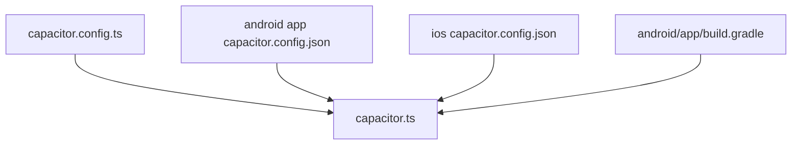

# Native Feature Optimization

<cite>
**Referenced Files in This Document**
- [capacitor.config.ts](file://capacitor.config.ts)
- [android app capacitor.config.json](file://android\app\src\main\assets\capacitor.config.json)
- [ios capacitor.config.json](file://ios\App\App\capacitor.config.json)
- [capacitor.ts](file://src\lib\capacitor.ts)
- [BarcodeScanner.tsx](file://src\components\BarcodeScanner.tsx)
- [DriverQRScanner.tsx](file://src\components\driver\DriverQRScanner.tsx)
- [push.ts](file://src\lib\notifications\push.ts)
- [push.test.ts](file://src\lib\notifications\push.test.ts)
- [cache.ts](file://src\lib\cache.ts)
- [build.gradle](file://android\app\build.gradle)
</cite>

## Table of Contents
1. [Introduction](#introduction)
2. [Project Structure](#project-structure)
3. [Core Components](#core-components)
4. [Architecture Overview](#architecture-overview)
5. [Detailed Component Analysis](#detailed-component-analysis)
6. [Dependency Analysis](#dependency-analysis)
7. [Performance Considerations](#performance-considerations)
8. [Troubleshooting Guide](#troubleshooting-guide)
9. [Conclusion](#conclusion)

## Introduction
This document provides a comprehensive guide to optimizing native mobile features in Nutrio's Capacitor implementation. It focuses on:
- Camera access optimization for image capture quality, compression, and memory-efficient processing
- Geolocation service optimization balancing accuracy and battery life, update intervals, and background tracking
- File system operations optimization including asset caching, offline storage, and efficient persistence
- Push notification performance covering batching, silent notifications, and background fetch optimization
- Platform-specific considerations for iOS background modes and Android foreground services
- Practical examples for efficient barcode scanning and QR code functionality

## Project Structure
The native mobile features are primarily configured via Capacitor configuration files and wrapped through a unified Capacitor utilities module. Key areas:
- Capacitor configuration defines plugin settings for splash screen, push notifications, local notifications, and biometric authentication
- A centralized wrapper module abstracts native capabilities with graceful fallbacks for web
- Platform-specific Gradle configuration enables release builds and optional Google Services integration for push

**Diagram sources**
- [capacitor.config.ts:1-45](file://capacitor.config.ts#L1-L45)
- [android app capacitor.config.json:1-41](file://android\app\src\main\assets\capacitor.config.json#L1-L41)
- [ios capacitor.config.json:1-56](file://ios\App\App\capacitor.config.json#L1-L56)
- [capacitor.ts:1-640](file://src\lib\capacitor.ts#L1-L640)
- [BarcodeScanner.tsx:1-172](file://src\components\BarcodeScanner.tsx#L1-L172)
- [DriverQRScanner.tsx:207-254](file://src\components\driver\DriverQRScanner.tsx#L207-L254)
- [cache.ts:47-99](file://src\lib\cache.ts#L47-L99)
- [push.ts:40-80](file://src\lib\notifications\push.ts#L40-L80)

**Section sources**
- [capacitor.config.ts:1-45](file://capacitor.config.ts#L1-L45)
- [android app capacitor.config.json:1-41](file://android\app\src\main\assets\capacitor.config.json#L1-L41)
- [ios capacitor.config.json:1-56](file://ios\App\App\capacitor.config.json#L1-L56)
- [capacitor.ts:1-640](file://src\lib\capacitor.ts#L1-L640)

## Core Components
- Capacitor configuration centralizes plugin settings for splash screen, push notifications, local notifications, and biometric authentication
- The Capacitor utilities module provides a unified interface to native features with platform checks and graceful web fallbacks
- Platform-specific Gradle configuration supports release builds and Google Services integration for push notifications

Key configuration highlights:
- Splash screen optimized for fast startup and immersive experience
- Push notifications configured with badge, sound, and alert presentation options
- Local notifications configured with a default sound
- Biometric authentication configured with localized prompts
- Package class list ensures required Capacitor plugins are included on iOS

**Section sources**
- [capacitor.config.ts:18-41](file://capacitor.config.ts#L18-L41)
- [android app capacitor.config.json:13-39](file://android\app\src\main\assets\capacitor.config.json#L13-L39)
- [ios capacitor.config.json:40-54](file://ios\App\App\capacitor.config.json#L40-L54)
- [capacitor.ts:317-405](file://src\lib\capacitor.ts#L317-L405)

## Architecture Overview
The native feature architecture follows a layered approach:
- Configuration layer: Capacitor config files define plugin behavior
- Abstraction layer: Capacitor utilities module wraps native APIs with platform checks
- Feature layer: UI components and services consume the abstraction layer
- Platform layer: Android/iOS native implementations via Capacitor plugins

**Diagram sources**
- [capacitor.ts:1-640](file://src\lib\capacitor.ts#L1-L640)
- [capacitor.config.ts:1-45](file://capacitor.config.ts#L1-L45)
- [android app capacitor.config.json:1-41](file://android\app\src\main\assets\capacitor.config.json#L1-L41)
- [ios capacitor.config.json:1-56](file://ios\App\App\capacitor.config.json#L1-L56)

## Detailed Component Analysis

### Camera Access Optimization
The camera implementation uses the browser's MediaDevices API with environment-facing camera preference and fixed resolution targeting. To optimize:
- Image capture quality settings: Use constraints for width/height ideal values and optionally specify frameRate for smoother capture
- Compression strategies: Implement canvas-based resizing and JPEG quality tuning before upload
- Memory-efficient processing: Stop streams promptly, avoid retaining image buffers unnecessarily, and use OffscreenCanvas on supported platforms

**Diagram sources**
- [BarcodeScanner.tsx:24-93](file://src\components\BarcodeScanner.tsx#L24-L93)

Practical recommendations:
- Add frameRate constraints to reduce CPU usage on low-end devices
- Implement debounced scanning to avoid repeated detections
- Use OffscreenCanvas for decoding to keep UI thread responsive
- Apply JPEG quality reduction for uploads (e.g., quality 0.6–0.8) and dimension limits (e.g., max 1280×720)

**Section sources**
- [BarcodeScanner.tsx:24-93](file://src\components\BarcodeScanner.tsx#L24-L93)
- [DriverQRScanner.tsx:207-254](file://src\components\driver\DriverQRScanner.tsx#L207-L254)

### Geolocation Service Optimization
The geolocation implementation demonstrates a battery-conscious approach:
- Uses watchPosition with progressive accuracy thresholds
- Stops watching when accuracy improves beyond thresholds
- Applies a hard timeout to prevent indefinite waits
- Provides user feedback on GPS loading and accuracy

**Diagram sources**
- [Addresses.tsx:247-272](file://src\pages\Addresses.tsx#L247-L272)

Optimization strategies:
- Use higher timeout and maximumAge for background tracking to reduce wake-ups
- Implement exponential backoff for polling intervals when accuracy is poor
- Leverage background geolocation plugins (platform-specific) for extended tracking
- Cache coordinates locally with timestamps to minimize network calls

**Section sources**
- [Addresses.tsx:231-272](file://src\pages\Addresses.tsx#L231-L272)
- [capacitor.ts:97-127](file://src\lib\capacitor.ts#L97-L127)

### File System Operations and Asset Caching
The caching layer provides a hybrid approach:
- Redis-backed cache with TTL for distributed environments
- Fallback to in-memory cache for local-only scenarios
- Pattern-based invalidation for targeted cache updates

**Diagram sources**
- [cache.ts:47-99](file://src\lib\cache.ts#L47-L99)

Offline storage strategies:
- Persist frequently accessed assets to IndexedDB or FileSystem Access API
- Implement cache-first with background sync for updates
- Use service workers for advanced caching on web; leverage Capacitor plugins for native file operations

**Section sources**
- [cache.ts:47-99](file://src\lib\cache.ts#L47-L99)

### Push Notification Performance
The push notification service initializes on native platforms and registers listeners for tokens and actions. Recommendations:
- Batch notifications to reduce UI churn and system overhead
- Use silent notifications for background updates and defer UI rendering
- Implement background fetch with appropriate intervals to refresh data

**Diagram sources**
- [push.ts:40-80](file://src\lib\notifications\push.ts#L40-L80)
- [capacitor.ts:321-405](file://src\lib\capacitor.ts#L321-L405)

Platform-specific considerations:
- iOS: Configure background modes for location and remote notifications in Info.plist
- Android: Use foreground services for long-running tasks and proper channel configuration

**Section sources**
- [push.ts:40-80](file://src\lib\notifications\push.ts#L40-L80)
- [push.test.ts:42-241](file://src\lib\notifications\push.test.ts#L42-L241)
- [capacitor.ts:317-405](file://src\lib\capacitor.ts#L317-L405)

### Barcode and QR Code Functionality
The barcode scanner component demonstrates:
- Environment-facing camera selection for mobile
- Permission handling and error messaging
- Manual entry fallback for reliability
- Proper cleanup of media streams and timers

**Diagram sources**
- [BarcodeScanner.tsx:14-172](file://src\components\BarcodeScanner.tsx#L14-L172)
- [DriverQRScanner.tsx:207-254](file://src\components\driver\DriverQRScanner.tsx#L207-L254)

Best practices:
- Integrate a robust barcode library (e.g., ZXing) for production
- Debounce detection callbacks to avoid duplicate submissions
- Provide visual feedback and haptic responses for successful scans

**Section sources**
- [BarcodeScanner.tsx:14-172](file://src\components\BarcodeScanner.tsx#L14-L172)
- [DriverQRScanner.tsx:207-254](file://src\components\driver\DriverQRScanner.tsx#L207-L254)

## Dependency Analysis
The native feature stack depends on Capacitor configurations and the unified wrapper module. Android build configuration integrates Google Services for push notifications.

**Diagram sources**
- [capacitor.config.ts:1-45](file://capacitor.config.ts#L1-L45)
- [android app capacitor.config.json:1-41](file://android\app\src\main\assets\capacitor.config.json#L1-L41)
- [ios capacitor.config.json:1-56](file://ios\App\App\capacitor.config.json#L1-L56)
- [capacitor.ts:1-640](file://src\lib\capacitor.ts#L1-L640)
- [build.gradle:1-75](file://android\app\build.gradle#L1-L75)

**Section sources**
- [capacitor.ts:1-640](file://src\lib\capacitor.ts#L1-L640)
- [build.gradle:67-75](file://android\app\build.gradle#L67-L75)

## Performance Considerations
- Camera
  - Use environment-facing camera and fixed resolution targets
  - Apply canvas-based compression and dimension limits
  - Stop streams immediately after use
- Geolocation
  - Implement progressive accuracy thresholds and timeouts
  - Use higher maximumAge for background tracking
  - Cache coordinates with timestamps
- File System
  - Prefer Redis-backed cache with TTL for distributed systems
  - Fallback to in-memory cache for local-only scenarios
  - Invalidate caches by pattern for targeted updates
- Push Notifications
  - Batch notifications and use silent notifications for background updates
  - Register listeners conditionally on native platforms
  - Configure platform-specific background modes and services

[No sources needed since this section provides general guidance]

## Troubleshooting Guide
Common issues and resolutions:
- Camera permission denied: Prompt users to enable camera permissions and provide retry mechanism
- Geolocation errors: Handle PERMISSION_DENIED, POSITION_UNAVAILABLE, and TIMEOUT with user-friendly messages
- Push notification registration failures: Log registration errors and retry gracefully
- Platform differences: Verify Capacitor plugin inclusion and configuration for iOS and Android

**Section sources**
- [BarcodeScanner.tsx:40-45](file://src\components\BarcodeScanner.tsx#L40-L45)
- [Addresses.tsx:104-127](file://src\pages\Addresses.tsx#L104-L127)
- [push.ts:59-61](file://src\lib\notifications\push.ts#L59-L61)
- [capacitor.ts:468-581](file://src\lib\capacitor.ts#L468-L581)

## Conclusion
By leveraging Capacitor's configuration layer, a unified wrapper module, and platform-specific optimizations, Nutrio can achieve efficient native mobile features. Prioritize battery-conscious geolocation, memory-efficient camera processing, robust caching strategies, and platform-aware push notification handling to deliver a smooth user experience across iOS and Android.

[No sources needed since this section summarizes without analyzing specific files]