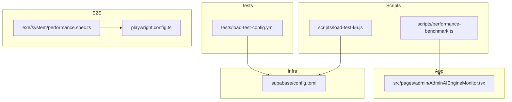
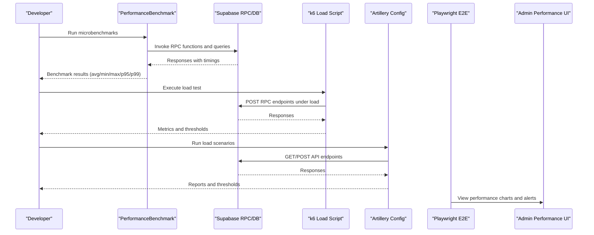
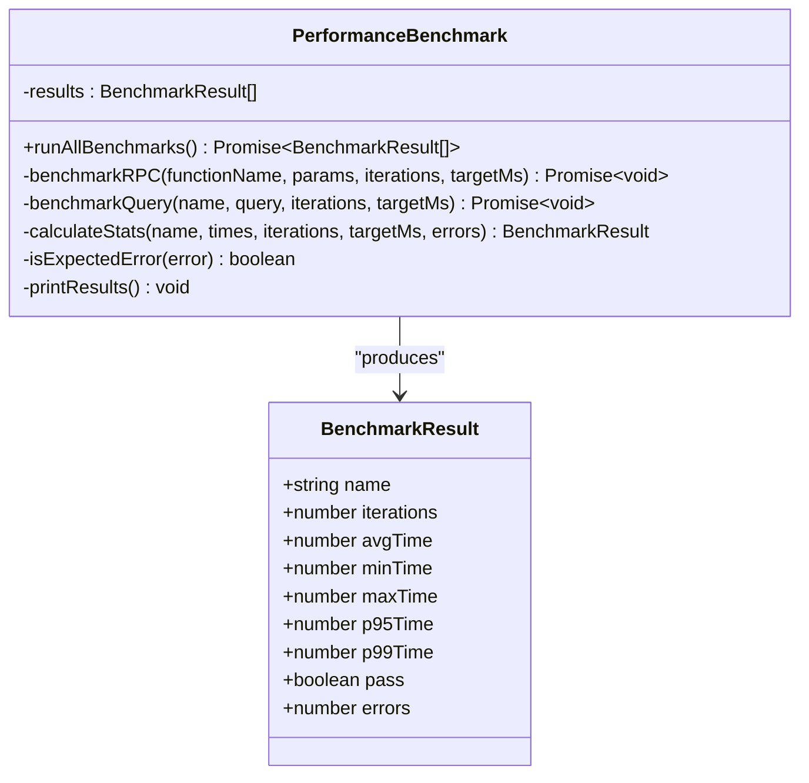
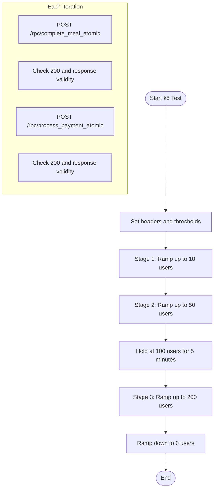
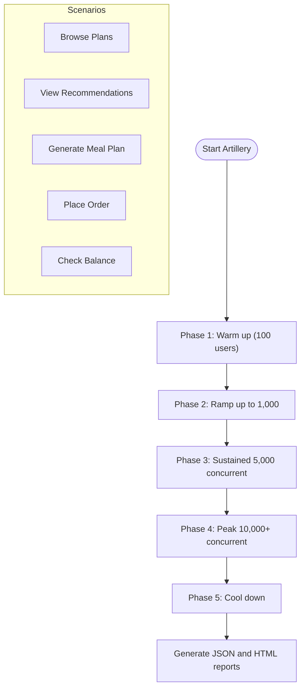
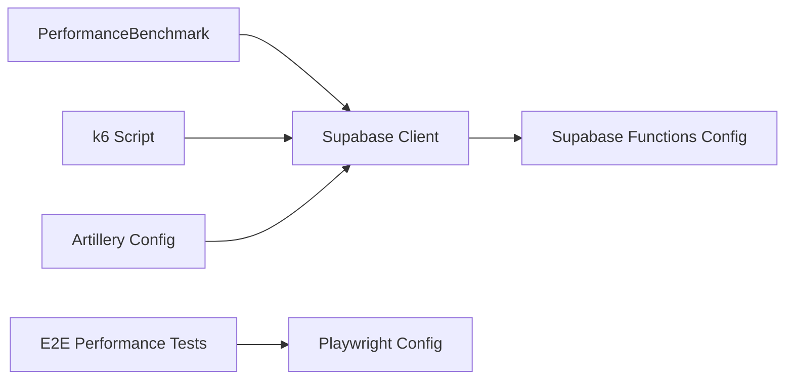

# Performance Benchmarking Tools

<cite>
**Referenced Files in This Document**
- [performance-benchmark.ts](file://scripts/performance-benchmark.ts)
- [load-test-k6.js](file://scripts/load-test-k6.js)
- [load-test-config.yml](file://tests/load-test-config.yml)
- [performance.spec.ts](file://e2e/system/performance.spec.ts)
- [playwright.config.ts](file://playwright.config.ts)
- [package.json](file://package.json)
- [AdminAIEngineMonitor.tsx](file://src/pages/admin/AdminAIEngineMonitor.tsx)
- [config.toml](file://supabase/config.toml)
</cite>

## Table of Contents
1. [Introduction](#introduction)
2. [Project Structure](#project-structure)
3. [Core Components](#core-components)
4. [Architecture Overview](#architecture-overview)
5. [Detailed Component Analysis](#detailed-component-analysis)
6. [Dependency Analysis](#dependency-analysis)
7. [Performance Considerations](#performance-considerations)
8. [Troubleshooting Guide](#troubleshooting-guide)
9. [Conclusion](#conclusion)
10. [Appendices](#appendices)

## Introduction
This document describes the performance benchmarking tools and techniques implemented in Nutrio. It covers automated performance testing via a dedicated benchmarking class, load/stress testing with k6 and Artillery, manual profiling approaches, continuous performance monitoring, and benchmarking methodologies across front-end, API, and database layers. It also provides practical guidance for setting performance budgets, building test suites, and integrating performance checks into CI/CD.

## Project Structure
Performance testing artifacts are organized across scripts, tests, and E2E test suites:
- Automated microbenchmarks: scripts/performance-benchmark.ts
- k6 load tests: scripts/load-test-k6.js
- Artillery load test configuration: tests/load-test-config.yml
- E2E performance tests: e2e/system/performance.spec.ts
- Playwright configuration for E2E: playwright.config.ts
- Package scripts for invoking tests: package.json
- Admin monitoring UI for performance insights: src/pages/admin/AdminAIEngineMonitor.tsx
- Supabase function configuration affecting performance: supabase/config.toml

**Diagram sources**
- [performance-benchmark.ts](file://scripts/performance-benchmark.ts)
- [load-test-k6.js](file://scripts/load-test-k6.js)
- [load-test-config.yml](file://tests/load-test-config.yml)
- [performance.spec.ts](file://e2e/system/performance.spec.ts)
- [playwright.config.ts](file://playwright.config.ts)
- [AdminAIEngineMonitor.tsx](file://src/pages/admin/AdminAIEngineMonitor.tsx)
- [config.toml](file://supabase/config.toml)

**Section sources**
- [performance-benchmark.ts](file://scripts/performance-benchmark.ts)
- [load-test-k6.js](file://scripts/load-test-k6.js)
- [load-test-config.yml](file://tests/load-test-config.yml)
- [performance.spec.ts](file://e2e/system/performance.spec.ts)
- [playwright.config.ts](file://playwright.config.ts)
- [package.json](file://package.json)
- [AdminAIEngineMonitor.tsx](file://src/pages/admin/AdminAIEngineMonitor.tsx)
- [config.toml](file://supabase/config.toml)

## Core Components
- PerformanceBenchmark class: Runs targeted microbenchmarks against Supabase RPC functions and queries, computing averages, min/max, and percentiles, and enforcing per-function latency targets.
- k6 load test: Exercises Supabase RPC endpoints under increasing concurrency with thresholds for p95 response time and error rate.
- Artillery load configuration: Defines multi-phase load scenarios targeting real user journeys and enforces response time and error-rate thresholds.
- E2E performance tests: Placeholder tests for page load, concurrent user handling, database performance, and API response times.
- Admin monitoring UI: Visual dashboard showing layer health and performance metrics for AI engines.

**Section sources**
- [performance-benchmark.ts](file://scripts/performance-benchmark.ts)
- [load-test-k6.js](file://scripts/load-test-k6.js)
- [load-test-config.yml](file://tests/load-test-config.yml)
- [performance.spec.ts](file://e2e/system/performance.spec.ts)
- [AdminAIEngineMonitor.tsx](file://src/pages/admin/AdminAIEngineMonitor.tsx)

## Architecture Overview
The performance testing stack integrates microbenchmarks, load testing, and monitoring:

**Diagram sources**
- [performance-benchmark.ts](file://scripts/performance-benchmark.ts)
- [load-test-k6.js](file://scripts/load-test-k6.js)
- [load-test-config.yml](file://tests/load-test-config.yml)
- [performance.spec.ts](file://e2e/system/performance.spec.ts)
- [AdminAIEngineMonitor.tsx](file://src/pages/admin/AdminAIEngineMonitor.tsx)

## Detailed Component Analysis

### Automated Microbenchmarks with PerformanceBenchmark
The PerformanceBenchmark class encapsulates:
- RPC function benchmarking with configurable iterations and per-function targets.
- Query benchmarking against Supabase tables with similar iteration and target controls.
- Statistics computation (average, min, max, p95, p99) and pass/fail determination based on p95 thresholds.
- Expected error filtering to distinguish transient vs. unexpected failures.
- Console reporting with summary statistics and failure highlights.

**Diagram sources**
- [performance-benchmark.ts](file://scripts/performance-benchmark.ts)

**Section sources**
- [performance-benchmark.ts](file://scripts/performance-benchmark.ts)

### Load Testing with k6
The k6 script defines:
- Staged concurrency ramp-up and ramp-down.
- Custom metrics for RPC endpoints and error rates.
- Thresholds for p95 response time and error rate.
- Supabase RPC endpoint calls with randomized identifiers per virtual user.

**Diagram sources**
- [load-test-k6.js](file://scripts/load-test-k6.js)

**Section sources**
- [load-test-k6.js](file://scripts/load-test-k6.js)

### Load Testing with Artillery
The Artillery configuration defines:
- Multi-phase load (warm-up, ramp-up, sustained, peak, cool-down).
- Scenarios for browsing plans, viewing recommendations, generating AI plans, placing orders, and checking balances.
- Response-time and error-rate thresholds.
- Reporting to JSON and HTML outputs.

**Diagram sources**
- [load-test-config.yml](file://tests/load-test-config.yml)

**Section sources**
- [load-test-config.yml](file://tests/load-test-config.yml)

### E2E Performance Tests
The E2E performance suite includes placeholders for:
- Page load performance and concurrent user handling.
- Database query performance and API response time monitoring.

These tests currently contain TODOs and can be extended to capture timing metrics and enforce thresholds.

**Section sources**
- [performance.spec.ts](file://e2e/system/performance.spec.ts)

### Continuous Performance Monitoring
The Admin AI Engine Monitor displays:
- Layer health indicators and success rates.
- Visual performance charts and alerts for high response times.

This provides ongoing visibility into performance trends and anomalies.

**Section sources**
- [AdminAIEngineMonitor.tsx](file://src/pages/admin/AdminAIEngineMonitor.tsx)

## Dependency Analysis
Key dependencies and relationships:
- PerformanceBenchmark depends on Supabase client to execute RPCs and queries.
- k6 and Artillery both target Supabase endpoints; thresholds enforce performance budgets.
- E2E tests rely on Playwright configuration for timeouts and reporters.
- Supabase function configuration affects edge function performance and scaling.

**Diagram sources**
- [performance-benchmark.ts](file://scripts/performance-benchmark.ts)
- [load-test-k6.js](file://scripts/load-test-k6.js)
- [load-test-config.yml](file://tests/load-test-config.yml)
- [performance.spec.ts](file://e2e/system/performance.spec.ts)
- [playwright.config.ts](file://playwright.config.ts)
- [config.toml](file://supabase/config.toml)

**Section sources**
- [performance-benchmark.ts](file://scripts/performance-benchmark.ts)
- [load-test-k6.js](file://scripts/load-test-k6.js)
- [load-test-config.yml](file://tests/load-test-config.yml)
- [performance.spec.ts](file://e2e/system/performance.spec.ts)
- [playwright.config.ts](file://playwright.config.ts)
- [config.toml](file://supabase/config.toml)

## Performance Considerations
- Database and edge function scaling: Ensure Supabase functions and connection pooling are tuned for peak loads.
- Response-time budgets: Enforce p95 thresholds for RPCs and API endpoints.
- Error-rate budgets: Keep error rates below defined thresholds to maintain reliability.
- Monitoring and alerting: Use the Admin UI to track layer health and set up alerts for high response times.
- CI integration: Add performance checks to CI jobs to prevent regressions.

[No sources needed since this section provides general guidance]

## Troubleshooting Guide
- Unexpected errors in benchmarks: The benchmarking class filters expected errors (e.g., not found, foreign key violations). Investigate non-expected errors to identify real issues.
- k6 threshold failures: Review p95 response times and error rates; adjust concurrency stages or optimize slow RPCs.
- Artillery report discrepancies: Validate thresholds and scenario weights; ensure the target environment matches configuration.
- E2E performance gaps: Extend placeholder tests to capture and assert on page load and API response times.

**Section sources**
- [performance-benchmark.ts](file://scripts/performance-benchmark.ts)
- [load-test-k6.js](file://scripts/load-test-k6.js)
- [load-test-config.yml](file://tests/load-test-config.yml)
- [performance.spec.ts](file://e2e/system/performance.spec.ts)

## Conclusion
Nutrio’s performance testing stack combines microbenchmarks, load/stress tests, and monitoring to ensure responsiveness and reliability across layers. By enforcing performance budgets, extending E2E coverage, and integrating checks into CI/CD, teams can sustain performance over time.

[No sources needed since this section summarizes without analyzing specific files]

## Appendices

### Practical Examples

- Setting performance budgets
  - Define p95 targets for RPCs and API endpoints.
  - Set error-rate thresholds and throughput minimums.
  - Reference thresholds in k6 and Artillery configurations.

- Creating performance test suites
  - Use PerformanceBenchmark for microbenchmarks.
  - Build Artillery scenarios aligned with user journeys.
  - Extend E2E tests to assert on timing metrics.

- Integrating into CI/CD
  - Add npm scripts to run benchmarks and load tests.
  - Incorporate performance checks into CI jobs to gate merges.

**Section sources**
- [package.json](file://package.json)
- [load-test-k6.js](file://scripts/load-test-k6.js)
- [load-test-config.yml](file://tests/load-test-config.yml)
- [performance-benchmark.ts](file://scripts/performance-benchmark.ts)