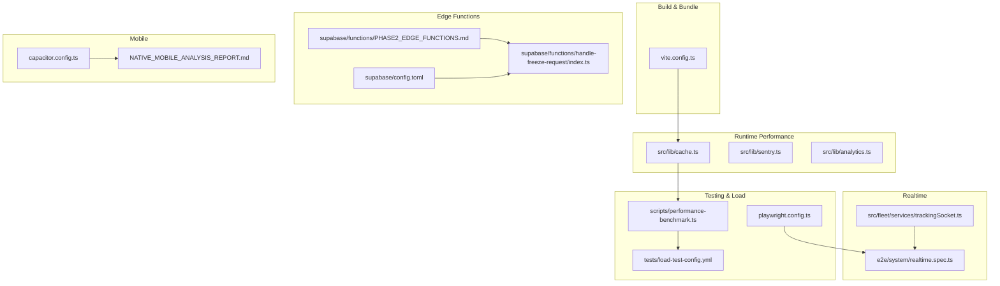
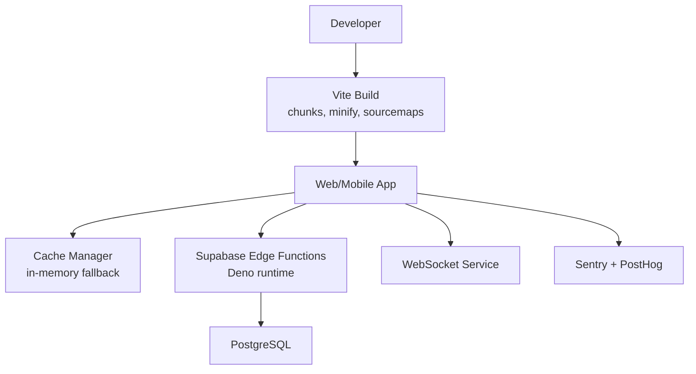
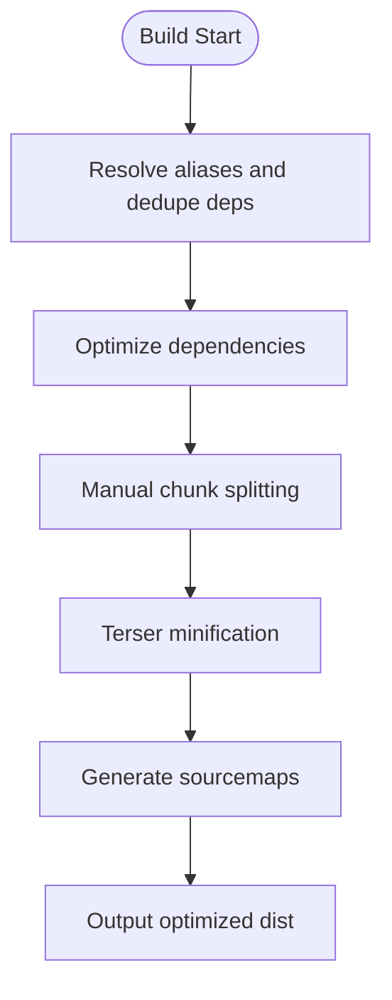
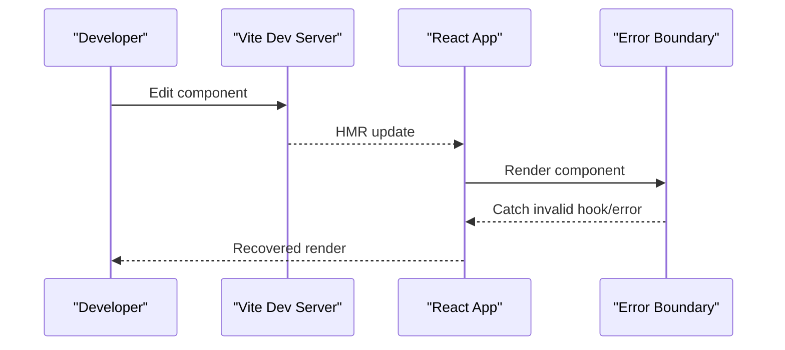
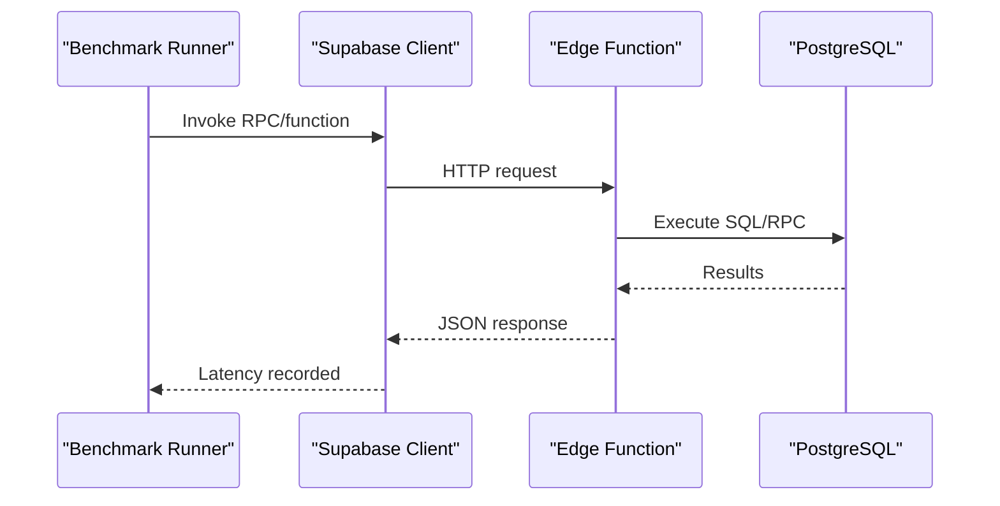
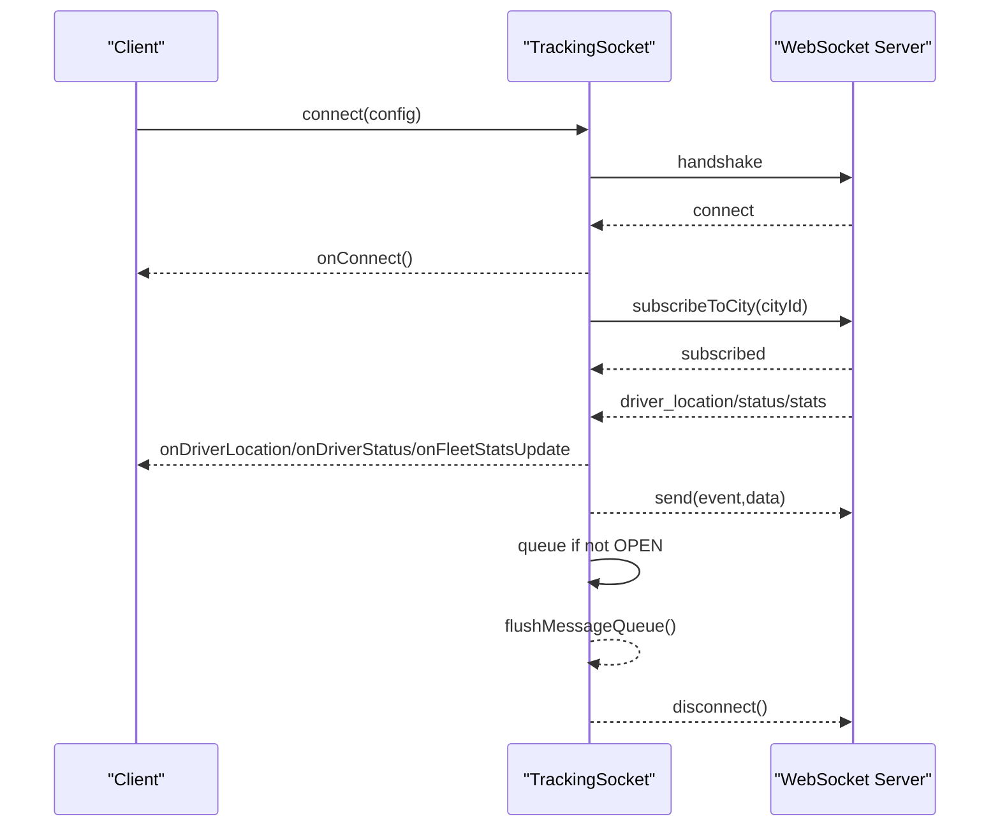
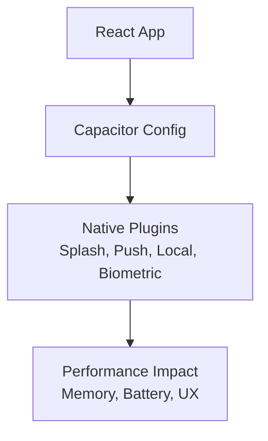
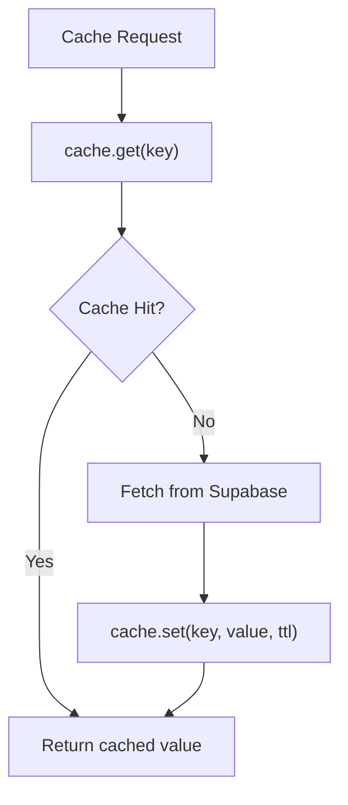
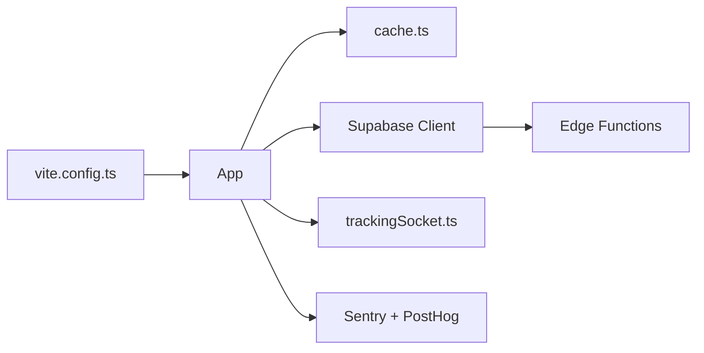

# Performance Profiling

<cite>
**Referenced Files in This Document**
- [performance-benchmark.ts](file://scripts/performance-benchmark.ts)
- [vite.config.ts](file://vite.config.ts)
- [cache.ts](file://src/lib/cache.ts)
- [PHASE2_EDGE_FUNCTIONS.md](file://supabase/functions/PHASE2_EDGE_FUNCTIONS.md)
- [config.toml](file://supabase/config.toml)
- [capacitor.config.ts](file://capacitor.config.ts)
- [sentry.ts](file://src/lib/sentry.ts)
- [analytics.ts](file://src/lib/analytics.ts)
- [playwright.config.ts](file://playwright.config.ts)
- [realtime.spec.ts](file://e2e/system/realtime.spec.ts)
- [trackingSocket.ts](file://src/fleet/services/trackingSocket.ts)
- [load-test-config.yml](file://tests/load-test-config.yml)
- [handle-freeze-request/index.ts](file://supabase/functions/handle-freeze-request/index.ts)
- [20260303013000_add_updated_at_to_subscriptions.sql](file://supabase/migrations/20260303013000_add_updated_at_to_subscriptions.sql)
- [NATIVE_MOBILE_ANALYSIS_REPORT.md](file://NATIVE_MOBILE_ANALYSIS_REPORT.md)
</cite>

## Table of Contents
1. [Introduction](#introduction)
2. [Project Structure](#project-structure)
3. [Core Components](#core-components)
4. [Architecture Overview](#architecture-overview)
5. [Detailed Component Analysis](#detailed-component-analysis)
6. [Dependency Analysis](#dependency-analysis)
7. [Performance Considerations](#performance-considerations)
8. [Troubleshooting Guide](#troubleshooting-guide)
9. [Conclusion](#conclusion)
10. [Appendices](#appendices)

## Introduction
This document explains performance profiling techniques implemented and recommended for the Nutrio application. It covers:
- Web application performance: bundle analysis, lazy loading evaluation, and component rendering performance
- Database performance: query optimization, edge function execution times, and real-time subscription efficiency
- Mobile app performance: memory usage analysis, battery optimization, and native feature performance
- Real-time feature performance: WebSocket connection optimization and data synchronization efficiency
- Practical examples of using profiling tools, identifying bottlenecks, and implementing improvements
- Caching strategies and their impact on application performance

## Project Structure
The repository organizes performance-related capabilities across build configuration, caching utilities, edge functions, analytics and observability, and real-time communication layers.

**Diagram sources**
- [vite.config.ts:1-77](file://vite.config.ts#L1-L77)
- [cache.ts:1-199](file://src/lib/cache.ts#L1-L199)
- [PHASE2_EDGE_FUNCTIONS.md:1-411](file://supabase/functions/PHASE2_EDGE_FUNCTIONS.md#L1-L411)
- [config.toml:1-59](file://supabase/config.toml#L1-L59)
- [handle-freeze-request/index.ts:1-42](file://supabase/functions/handle-freeze-request/index.ts#L1-L42)
- [trackingSocket.ts:78-214](file://src/fleet/services/trackingSocket.ts#L78-L214)
- [realtime.spec.ts:1-37](file://e2e/system/realtime.spec.ts#L1-L37)
- [capacitor.config.ts:1-45](file://capacitor.config.ts#L1-L45)
- [NATIVE_MOBILE_ANALYSIS_REPORT.md:140-598](file://NATIVE_MOBILE_ANALYSIS_REPORT.md#L140-L598)
- [performance-benchmark.ts:1-280](file://scripts/performance-benchmark.ts#L1-L280)
- [load-test-config.yml:154-172](file://tests/load-test-config.yml#L154-L172)
- [playwright.config.ts:1-92](file://playwright.config.ts#L1-L92)

**Section sources**
- [vite.config.ts:1-77](file://vite.config.ts#L1-L77)
- [cache.ts:1-199](file://src/lib/cache.ts#L1-L199)
- [PHASE2_EDGE_FUNCTIONS.md:1-411](file://supabase/functions/PHASE2_EDGE_FUNCTIONS.md#L1-L411)
- [config.toml:1-59](file://supabase/config.toml#L1-L59)
- [handle-freeze-request/index.ts:1-42](file://supabase/functions/handle-freeze-request/index.ts#L1-L42)
- [trackingSocket.ts:78-214](file://src/fleet/services/trackingSocket.ts#L78-L214)
- [realtime.spec.ts:1-37](file://e2e/system/realtime.spec.ts#L1-L37)
- [capacitor.config.ts:1-45](file://capacitor.config.ts#L1-L45)
- [NATIVE_MOBILE_ANALYSIS_REPORT.md:140-598](file://NATIVE_MOBILE_ANALYSIS_REPORT.md#L140-L598)
- [performance-benchmark.ts:1-280](file://scripts/performance-benchmark.ts#L1-L280)
- [load-test-config.yml:154-172](file://tests/load-test-config.yml#L154-L172)
- [playwright.config.ts:1-92](file://playwright.config.ts#L1-L92)

## Core Components
- Build-time bundling and chunking for web performance
- Caching layer for database query results
- Edge functions for offloading work from the main app
- Real-time WebSocket service for live updates
- Analytics and error monitoring for performance insights
- Mobile configuration for native performance and UX

**Section sources**
- [vite.config.ts:51-75](file://vite.config.ts#L51-L75)
- [cache.ts:16-107](file://src/lib/cache.ts#L16-L107)
- [PHASE2_EDGE_FUNCTIONS.md:34-171](file://supabase/functions/PHASE2_EDGE_FUNCTIONS.md#L34-L171)
- [trackingSocket.ts:78-214](file://src/fleet/services/trackingSocket.ts#L78-L214)
- [sentry.ts:3-37](file://src/lib/sentry.ts#L3-L37)
- [analytics.ts:3-35](file://src/lib/analytics.ts#L3-L35)
- [capacitor.config.ts:19-41](file://capacitor.config.ts#L19-L41)

## Architecture Overview
The performance architecture integrates build-time optimizations, caching, edge functions, and real-time communication with observability and testing.

**Diagram sources**
- [vite.config.ts:51-75](file://vite.config.ts#L51-L75)
- [cache.ts:16-107](file://src/lib/cache.ts#L16-L107)
- [PHASE2_EDGE_FUNCTIONS.md:34-171](file://supabase/functions/PHASE2_EDGE_FUNCTIONS.md#L34-L171)
- [trackingSocket.ts:78-214](file://src/fleet/services/trackingSocket.ts#L78-L214)
- [sentry.ts:3-37](file://src/lib/sentry.ts#L3-L37)
- [analytics.ts:3-35](file://src/lib/analytics.ts#L3-L35)

## Detailed Component Analysis

### Web Application Performance: Bundle Analysis and Lazy Loading
- Manual chunk splitting separates vendor bundles and UI libraries for improved caching and parallel loading.
- Minification and sourcemaps are enabled for production builds to balance performance and debugging.
- Chunk groups include React vendor libraries, UI components, and charting libraries.

**Diagram sources**
- [vite.config.ts:41-75](file://vite.config.ts#L41-L75)

Practical tips:
- Use the generated sourcemaps with Sentry for accurate error attribution.
- Monitor bundle sizes and adjust chunk boundaries to reduce initial payload.
- Evaluate route-based code splitting for heavy pages to improve TTI.

**Section sources**
- [vite.config.ts:41-75](file://vite.config.ts#L41-L75)

### Component Rendering Performance
- The application uses React with SWC for faster JSX transforms and HMR tuning.
- Error boundaries help isolate rendering issues without full page reloads during development.

**Diagram sources**
- [vite.config.ts:29-33](file://vite.config.ts#L29-L33)
- [DevelopmentErrorBoundary.tsx:20-96](file://src/components/DevelopmentErrorBoundary.tsx#L20-L96)

**Section sources**
- [vite.config.ts:29-33](file://vite.config.ts#L29-L33)
- [DevelopmentErrorBoundary.tsx:20-96](file://src/components/DevelopmentErrorBoundary.tsx#L20-L96)

### Database Performance Profiling: Query Optimization and Edge Function Execution
- A dedicated benchmark suite measures RPC function and query latencies, computing averages, min/max, and percentiles.
- Targets are defined per operation to detect regressions early.
- Edge functions are documented with environment variables, triggers, and logging guidance.

**Diagram sources**
- [performance-benchmark.ts:23-98](file://scripts/performance-benchmark.ts#L23-L98)
- [PHASE2_EDGE_FUNCTIONS.md:224-254](file://supabase/functions/PHASE2_EDGE_FUNCTIONS.md#L224-L254)

Operational guidance:
- Use percentile targets (e.g., p95) to flag outliers.
- Validate expected errors to avoid false positives in failure counts.
- Monitor edge function logs and deployment status for availability.

**Section sources**
- [performance-benchmark.ts:23-98](file://scripts/performance-benchmark.ts#L23-L98)
- [PHASE2_EDGE_FUNCTIONS.md:325-351](file://supabase/functions/PHASE2_EDGE_FUNCTIONS.md#L325-L351)
- [config.toml:1-59](file://supabase/config.toml#L1-L59)

### Real-Time Feature Performance: WebSocket Optimization and Data Sync
- The WebSocket service handles connection lifecycle, message parsing, queueing, and exponential backoff reconnection.
- Tests verify WebSocket connectivity and status update reception.
- Fleet scaling guidance includes sticky sessions and pub/sub clustering.

**Diagram sources**
- [trackingSocket.ts:78-214](file://src/fleet/services/trackingSocket.ts#L78-L214)
- [realtime.spec.ts:8-37](file://e2e/system/realtime.spec.ts#L8-L37)
- [fleet-management-portal-design.md:1715-1805](file://docs/fleet-management-portal-design.md#L1715-L1805)

**Section sources**
- [trackingSocket.ts:78-214](file://src/fleet/services/trackingSocket.ts#L78-L214)
- [realtime.spec.ts:8-37](file://e2e/system/realtime.spec.ts#L8-L37)
- [fleet-management-portal-design.md:2511-2585](file://docs/fleet-management-portal-design.md#L2511-L2585)

### Mobile App Performance: Memory, Battery, and Native Features
- Capacitor configuration enables splash screen, push/local notifications, and native biometric auth.
- A native feasibility report outlines UI component portability and platform parity.

**Diagram sources**
- [capacitor.config.ts:19-41](file://capacitor.config.ts#L19-L41)
- [NATIVE_MOBILE_ANALYSIS_REPORT.md:140-598](file://NATIVE_MOBILE_ANALYSIS_REPORT.md#L140-L598)

**Section sources**
- [capacitor.config.ts:19-41](file://capacitor.config.ts#L19-L41)
- [NATIVE_MOBILE_ANALYSIS_REPORT.md:140-598](file://NATIVE_MOBILE_ANALYSIS_REPORT.md#L140-L598)

### Caching Strategies and Impact
- A cache manager supports Redis-backed storage with an in-memory fallback and TTL-based entries.
- Cache keys are centralized for restaurants, meals, reviews, profiles, and challenges.
- Cached fetchers wrap Supabase queries to reduce round-trips and latency.

**Diagram sources**
- [cache.ts:37-107](file://src/lib/cache.ts#L37-L107)
- [cache.ts:124-177](file://src/lib/cache.ts#L124-L177)

**Section sources**
- [cache.ts:16-107](file://src/lib/cache.ts#L16-L107)
- [cache.ts:111-121](file://src/lib/cache.ts#L111-L121)
- [cache.ts:124-177](file://src/lib/cache.ts#L124-L177)

## Dependency Analysis
- Build pipeline depends on Vite and React ecosystem; chunking affects runtime performance.
- Runtime depends on Supabase client for queries and functions; caching reduces database load.
- Real-time depends on WebSocket service and fleet documentation for scaling.
- Observability depends on Sentry and PostHog for error and behavioral insights.

**Diagram sources**
- [vite.config.ts:41-75](file://vite.config.ts#L41-L75)
- [cache.ts:16-107](file://src/lib/cache.ts#L16-L107)
- [PHASE2_EDGE_FUNCTIONS.md:224-254](file://supabase/functions/PHASE2_EDGE_FUNCTIONS.md#L224-L254)
- [trackingSocket.ts:78-214](file://src/fleet/services/trackingSocket.ts#L78-L214)
- [sentry.ts:3-37](file://src/lib/sentry.ts#L3-L37)
- [analytics.ts:3-35](file://src/lib/analytics.ts#L3-L35)

**Section sources**
- [vite.config.ts:41-75](file://vite.config.ts#L41-L75)
- [cache.ts:16-107](file://src/lib/cache.ts#L16-L107)
- [PHASE2_EDGE_FUNCTIONS.md:224-254](file://supabase/functions/PHASE2_EDGE_FUNCTIONS.md#L224-L254)
- [trackingSocket.ts:78-214](file://src/fleet/services/trackingSocket.ts#L78-L214)
- [sentry.ts:3-37](file://src/lib/sentry.ts#L3-L37)
- [analytics.ts:3-35](file://src/lib/analytics.ts#L3-L35)

## Performance Considerations
- Use p95/p99 targets to surface tail latency issues in database and edge functions.
- Monitor edge function execution times and external service SLAs.
- Leverage caching for frequently accessed data and invalidate on mutations.
- Optimize WebSocket message sizes and frequency; implement backpressure and throttling.
- Track memory and CPU usage on mobile; minimize background work and unnecessary wake-ups.
- Instrument critical paths with Sentry and PostHog to correlate performance with user journeys.

[No sources needed since this section provides general guidance]

## Troubleshooting Guide
- Benchmark failures: review percentile thresholds and expected errors; ensure test data exists.
- Edge function errors: verify environment variables, JWT verification settings, and function logs.
- WebSocket disconnections: confirm exponential backoff and message queue flushing; test fallback polling.
- Mobile initialization: validate Capacitor plugin configuration and native permissions.
- Analytics and error reporting: check API keys and opt-out behavior in development.

**Section sources**
- [performance-benchmark.ts:207-219](file://scripts/performance-benchmark.ts#L207-L219)
- [PHASE2_EDGE_FUNCTIONS.md:325-351](file://supabase/functions/PHASE2_EDGE_FUNCTIONS.md#L325-L351)
- [config.toml:1-59](file://supabase/config.toml#L1-L59)
- [trackingSocket.ts:164-178](file://src/fleet/services/trackingSocket.ts#L164-L178)
- [capacitor.config.ts:19-41](file://capacitor.config.ts#L19-L41)
- [analytics.ts:3-35](file://src/lib/analytics.ts#L3-L35)
- [sentry.ts:3-37](file://src/lib/sentry.ts#L3-L37)

## Conclusion
Nutrio’s performance profile combines build-time optimizations, caching, edge functions, and robust real-time infrastructure. By leveraging the provided tools and patterns—benchmarking, chunking, caching, observability, and mobile configuration—you can continuously monitor and improve responsiveness, scalability, and user experience across web and mobile platforms.

[No sources needed since this section summarizes without analyzing specific files]

## Appendices

### Practical Examples and Tools
- Run performance benchmarks to measure RPC and query latencies and identify slow paths.
- Use Playwright configuration to record traces and videos for UI performance analysis.
- Enable Sentry tracing and replays for end-to-end performance monitoring.
- Use PostHog to track page views, feature adoption, and conversion funnels.

**Section sources**
- [performance-benchmark.ts:23-98](file://scripts/performance-benchmark.ts#L23-L98)
- [playwright.config.ts:36-54](file://playwright.config.ts#L36-L54)
- [sentry.ts:9-37](file://src/lib/sentry.ts#L9-L37)
- [analytics.ts:3-35](file://src/lib/analytics.ts#L3-L35)

### Load Testing and Validation Criteria
- Pre-deployment checklist includes database indexes, connection pooling, CDN caching, and monitoring readiness.
- Post-deployment targets include response times, error rates, and stability metrics.

**Section sources**
- [load-test-config.yml:154-172](file://tests/load-test-config.yml#L154-L172)

### Database Migration Notes for Edge Functions
- Migrations may add columns or indexes to support edge function workflows; ensure compatibility during transitions.

**Section sources**
- [20260303013000_add_updated_at_to_subscriptions.sql:1-11](file://supabase/migrations/20260303013000_add_updated_at_to_subscriptions.sql#L1-L11)