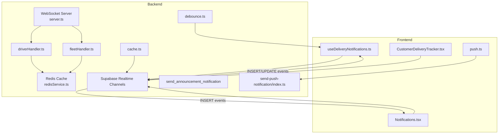
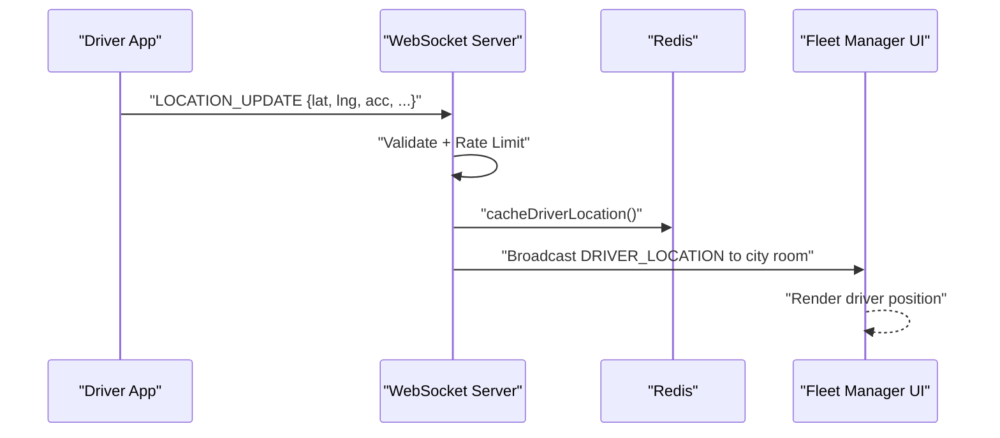
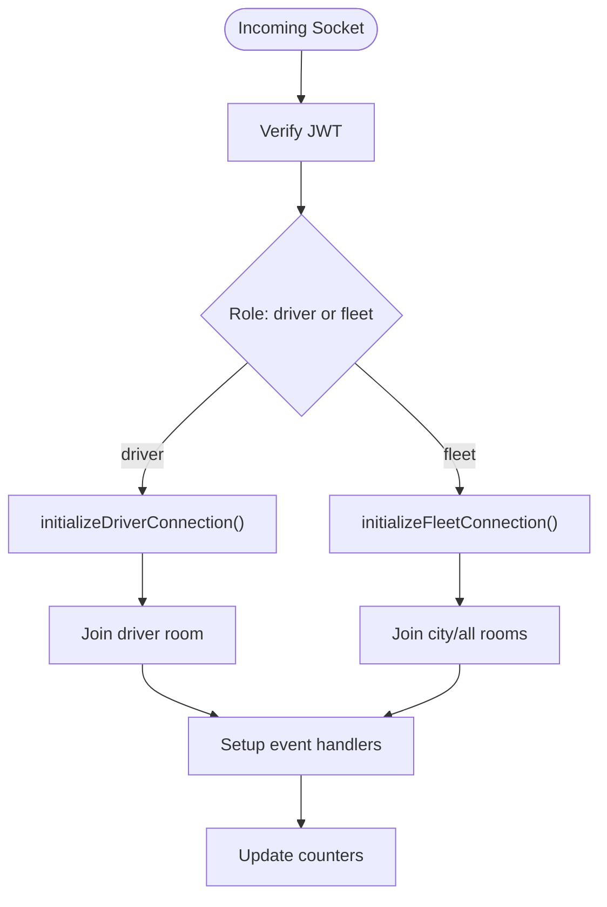
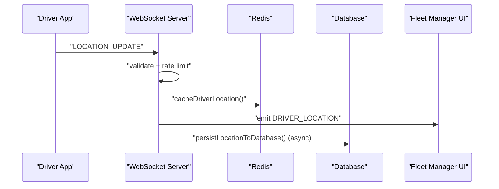
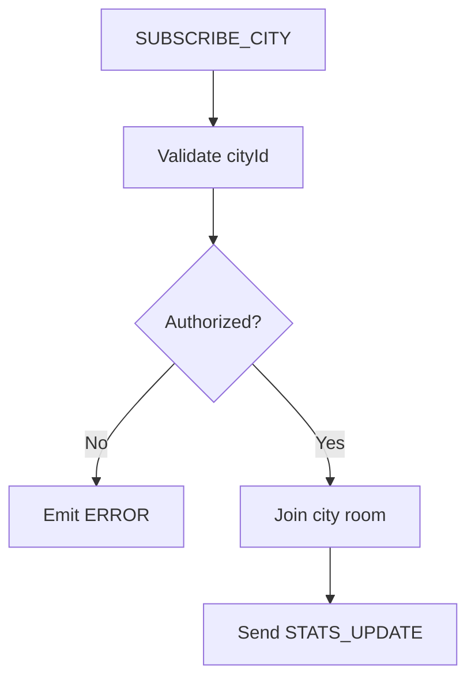
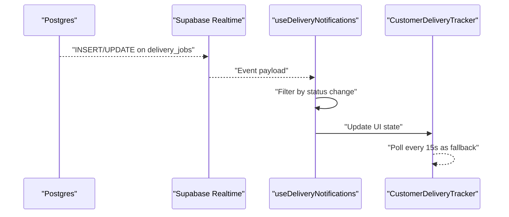
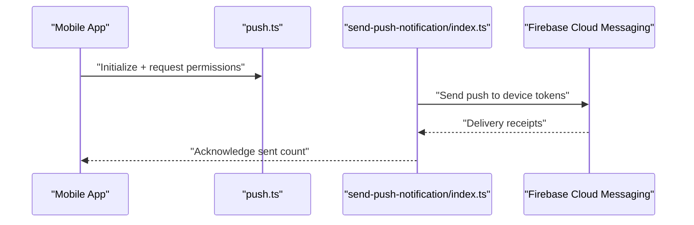
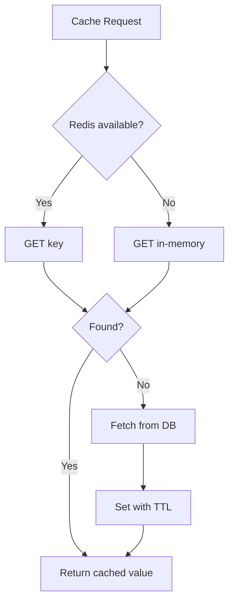
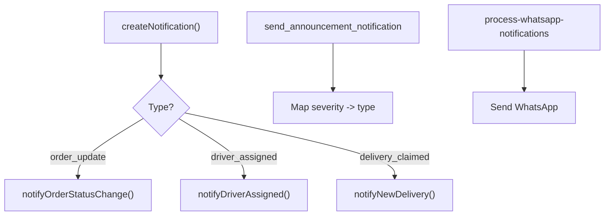
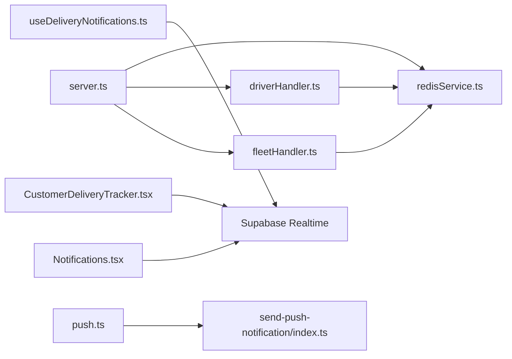

# Data Synchronization Efficiency

<cite>
**Referenced Files in This Document**
- [server.ts](file://websocket-server/src/server.ts)
- [driverHandler.ts](file://websocket-server/src/handlers/driverHandler.ts)
- [fleetHandler.ts](file://websocket-server/src/handlers/fleetHandler.ts)
- [redisService.ts](file://websocket-server/src/services/redisService.ts)
- [notifications.ts](file://src/lib/notifications.ts)
- [useDeliveryNotifications.ts](file://src/hooks/useDeliveryNotifications.ts)
- [useDeliveredMealNotifications.ts](file://src/hooks/useDeliveredMealNotifications.ts)
- [CustomerDeliveryTracker.tsx](file://src/components/customer/CustomerDeliveryTracker.tsx)
- [Notifications.tsx](file://src/pages/Notifications.tsx)
- [debounce.ts](file://src/lib/debounce.ts)
- [cache.ts](file://src/lib/cache.ts)
- [push.ts](file://src/lib/notifications/push.ts)
- [send-push-notification/index.ts](file://supabase/functions/send-push-notification/index.ts)
- [20260303143000_fix_send_announcement_notification_function.sql](file://supabase/migrations/20260303143000_fix_send_announcement_notification_function.sql)
- [20240103_whatsapp_notifications.sql](file://supabase/migrations/20240103_whatsapp_notifications.sql)
- [CONCERNS.md](file://.planning/codebase/CONCERNS.md)
- [delivery_analysis.md](file://delivery_analysis.md)
</cite>

## Table of Contents
1. [Introduction](#introduction)
2. [Project Structure](#project-structure)
3. [Core Components](#core-components)
4. [Architecture Overview](#architecture-overview)
5. [Detailed Component Analysis](#detailed-component-analysis)
6. [Dependency Analysis](#dependency-analysis)
7. [Performance Considerations](#performance-considerations)
8. [Troubleshooting Guide](#troubleshooting-guide)
9. [Conclusion](#conclusion)

## Introduction
This document focuses on data synchronization efficiency in Nutrio’s real-time notifications system. It covers subscription management optimization, selective data broadcasting, efficient event filtering, update frequency controls, debouncing for rapid changes, bandwidth reduction, caching strategies, message batching, and delta synchronization. It also provides examples of smart subscription patterns, notification delivery frequency optimization, handling high-frequency data streams, and balancing data consistency and conflict resolution across strategies.

## Project Structure
The real-time notifications system spans:
- Frontend React hooks and components subscribing to Supabase Realtime channels and managing browser push notifications
- A WebSocket server (Socket.IO with Redis adapter) for driver location/status broadcasts to fleet managers
- Backend Supabase functions and migrations orchestrating push/email/WhatsApp notifications and queueing
- Caching utilities and debouncing helpers to reduce load and optimize bandwidth

**Diagram sources**
- [server.ts:1-256](file://websocket-server/src/server.ts#L1-L256)
- [driverHandler.ts:1-318](file://websocket-server/src/handlers/driverHandler.ts#L1-L318)
- [fleetHandler.ts:1-247](file://websocket-server/src/handlers/fleetHandler.ts#L1-L247)
- [redisService.ts:38-238](file://websocket-server/src/services/redisService.ts#L38-L238)
- [useDeliveryNotifications.ts:1-139](file://src/hooks/useDeliveryNotifications.ts#L1-L139)
- [CustomerDeliveryTracker.tsx:158-196](file://src/components/customer/CustomerDeliveryTracker.tsx#L158-L196)
- [Notifications.tsx:66-107](file://src/pages/Notifications.tsx#L66-L107)
- [push.ts:1-44](file://src/lib/notifications/push.ts#L1-L44)
- [send-push-notification/index.ts:1-240](file://supabase/functions/send-push-notification/index.ts#L1-L240)
- [20260303143000_fix_send_announcement_notification_function.sql:1-48](file://supabase/migrations/20260303143000_fix_send_announcement_notification_function.sql#L1-L48)
- [cache.ts:1-199](file://src/lib/cache.ts#L1-L199)
- [debounce.ts:1-16](file://src/lib/debounce.ts#L1-L16)

**Section sources**
- [server.ts:1-256](file://websocket-server/src/server.ts#L1-L256)
- [driverHandler.ts:1-318](file://websocket-server/src/handlers/driverHandler.ts#L1-L318)
- [fleetHandler.ts:1-247](file://websocket-server/src/handlers/fleetHandler.ts#L1-L247)
- [redisService.ts:38-238](file://websocket-server/src/services/redisService.ts#L38-L238)
- [useDeliveryNotifications.ts:1-139](file://src/hooks/useDeliveryNotifications.ts#L1-L139)
- [CustomerDeliveryTracker.tsx:158-196](file://src/components/customer/CustomerDeliveryTracker.tsx#L158-L196)
- [Notifications.tsx:66-107](file://src/pages/Notifications.tsx#L66-L107)
- [push.ts:1-44](file://src/lib/notifications/push.ts#L1-L44)
- [send-push-notification/index.ts:1-240](file://supabase/functions/send-push-notification/index.ts#L1-L240)
- [20260303143000_fix_send_announcement_notification_function.sql:1-48](file://supabase/migrations/20260303143000_fix_send_announcement_notification_function.sql#L1-L48)
- [cache.ts:1-199](file://src/lib/cache.ts#L1-L199)
- [debounce.ts:1-16](file://src/lib/debounce.ts#L1-L16)

## Core Components
- WebSocket server with Redis adapter for scalable, multi-instance broadcasting
- Driver handler for rate-limiting, validation, caching, and targeted broadcasts
- Fleet handler for city-based subscriptions, access control, and stats
- Supabase Realtime channels for browser and mobile push notifications
- Push notification function for Firebase Cloud Messaging dispatch
- Caching utilities and debounce helpers for bandwidth and CPU efficiency
- Delivery tracker component with polling fallback and location updates

**Section sources**
- [server.ts:1-256](file://websocket-server/src/server.ts#L1-L256)
- [driverHandler.ts:1-318](file://websocket-server/src/handlers/driverHandler.ts#L1-L318)
- [fleetHandler.ts:1-247](file://websocket-server/src/handlers/fleetHandler.ts#L1-L247)
- [redisService.ts:38-238](file://websocket-server/src/services/redisService.ts#L38-L238)
- [useDeliveryNotifications.ts:1-139](file://src/hooks/useDeliveryNotifications.ts#L1-L139)
- [CustomerDeliveryTracker.tsx:158-196](file://src/components/customer/CustomerDeliveryTracker.tsx#L158-L196)
- [Notifications.tsx:66-107](file://src/pages/Notifications.tsx#L66-L107)
- [push.ts:1-44](file://src/lib/notifications/push.ts#L1-L44)
- [send-push-notification/index.ts:1-240](file://supabase/functions/send-push-notification/index.ts#L1-L240)
- [cache.ts:1-199](file://src/lib/cache.ts#L1-L199)
- [debounce.ts:1-16](file://src/lib/debounce.ts#L1-L16)

## Architecture Overview
The system combines two complementary real-time paths:
- WebSockets for driver location/status to fleet managers with city-scoped rooms and Redis caching
- Supabase Realtime channels for customer notifications and browser/mobile push delivery

**Diagram sources**
- [driverHandler.ts:105-207](file://websocket-server/src/handlers/driverHandler.ts#L105-L207)
- [redisService.ts:84-114](file://websocket-server/src/services/redisService.ts#L84-L114)
- [server.ts:34-51](file://websocket-server/src/server.ts#L34-L51)

**Section sources**
- [server.ts:1-256](file://websocket-server/src/server.ts#L1-L256)
- [driverHandler.ts:1-318](file://websocket-server/src/handlers/driverHandler.ts#L1-L318)
- [fleetHandler.ts:1-247](file://websocket-server/src/handlers/fleetHandler.ts#L1-L247)
- [redisService.ts:38-238](file://websocket-server/src/services/redisService.ts#L38-L238)

## Detailed Component Analysis

### WebSocket Server and Room Management
- Authentication via JWT with role-based access
- Redis adapter for multi-instance scaling
- Ping intervals and buffer limits for stability
- Metrics and readiness probes

**Diagram sources**
- [server.ts:65-150](file://websocket-server/src/server.ts#L65-L150)
- [driverHandler.ts:48-100](file://websocket-server/src/handlers/driverHandler.ts#L48-L100)
- [fleetHandler.ts:36-82](file://websocket-server/src/handlers/fleetHandler.ts#L36-L82)

**Section sources**
- [server.ts:1-256](file://websocket-server/src/server.ts#L1-L256)
- [driverHandler.ts:1-318](file://websocket-server/src/handlers/driverHandler.ts#L1-L318)
- [fleetHandler.ts:1-247](file://websocket-server/src/handlers/fleetHandler.ts#L1-L247)

### Driver Location and Status Handling
- Payload validation with Zod schemas
- Rate limiting per driver to prevent flooding
- Redis caching for location/status with TTLs
- Broadcast to city-specific rooms and super admin room
- Asynchronous persistence to database

**Diagram sources**
- [driverHandler.ts:105-207](file://websocket-server/src/handlers/driverHandler.ts#L105-L207)
- [redisService.ts:84-114](file://websocket-server/src/services/redisService.ts#L84-L114)

**Section sources**
- [driverHandler.ts:1-318](file://websocket-server/src/handlers/driverHandler.ts#L1-L318)
- [redisService.ts:84-146](file://websocket-server/src/services/redisService.ts#L84-L146)

### Fleet City Subscriptions and Access Control
- Validate city access based on manager roles and assigned cities
- Join appropriate rooms and emit initial stats
- Enforce authorization for history requests and broadcasts

**Diagram sources**
- [fleetHandler.ts:87-140](file://websocket-server/src/handlers/fleetHandler.ts#L87-L140)

**Section sources**
- [fleetHandler.ts:1-247](file://websocket-server/src/handlers/fleetHandler.ts#L1-L247)

### Supabase Realtime Channels for Notifications
- Customer delivery updates via channels on delivery_jobs
- Browser notifications and toast feedback
- Realtime insertion of notifications into the UI
- Delivery tracker polling fallback for resilience

**Diagram sources**
- [useDeliveryNotifications.ts:37-135](file://src/hooks/useDeliveryNotifications.ts#L37-L135)
- [CustomerDeliveryTracker.tsx:158-196](file://src/components/customer/CustomerDeliveryTracker.tsx#L158-L196)

**Section sources**
- [useDeliveryNotifications.ts:1-139](file://src/hooks/useDeliveryNotifications.ts#L1-L139)
- [CustomerDeliveryTracker.tsx:158-196](file://src/components/customer/CustomerDeliveryTracker.tsx#L158-L196)
- [Notifications.tsx:66-107](file://src/pages/Notifications.tsx#L66-L107)

### Push Notifications Delivery Pipeline
- Capacitor push notification service for native apps
- Supabase Edge Function to send Firebase Cloud Messaging notifications
- Fallback to saving unread notifications when no tokens exist

**Diagram sources**
- [push.ts:13-44](file://src/lib/notifications/push.ts#L13-L44)
- [send-push-notification/index.ts:178-240](file://supabase/functions/send-push-notification/index.ts#L178-L240)

**Section sources**
- [push.ts:1-44](file://src/lib/notifications/push.ts#L1-L44)
- [send-push-notification/index.ts:1-240](file://supabase/functions/send-push-notification/index.ts#L1-L240)

### Caching and Debouncing for Efficiency
- In-memory and Redis-backed cache with TTLs and invalidation patterns
- Debounce utility to coalesce rapid updates

**Diagram sources**
- [cache.ts:37-106](file://src/lib/cache.ts#L37-L106)

**Section sources**
- [cache.ts:1-199](file://src/lib/cache.ts#L1-L199)
- [debounce.ts:1-16](file://src/lib/debounce.ts#L1-L16)

### Notification Types and Templates
- Centralized notification creation and helper functions
- Announcement notification mapping by severity
- WhatsApp notification queuing and processing

**Diagram sources**
- [notifications.ts:18-114](file://src/lib/notifications.ts#L18-L114)
- [20260303143000_fix_send_announcement_notification_function.sql:1-48](file://supabase/migrations/20260303143000_fix_send_announcement_notification_function.sql#L1-L48)
- [20240103_whatsapp_notifications.sql:92-342](file://supabase/migrations/20240103_whatsapp_notifications.sql#L92-L342)

**Section sources**
- [notifications.ts:1-114](file://src/lib/notifications.ts#L1-L114)
- [20260303143000_fix_send_announcement_notification_function.sql:1-48](file://supabase/migrations/20260303143000_fix_send_announcement_notification_function.sql#L1-L48)
- [20240103_whatsapp_notifications.sql:92-342](file://supabase/migrations/20240103_whatsapp_notifications.sql#L92-L342)

## Dependency Analysis
- WebSocket server depends on Redis adapter for clustering and event fan-out
- Driver handler depends on Redis for caching and database for persistence
- Fleet handler depends on Redis for stats and database for access checks
- Frontend hooks depend on Supabase Realtime channels and push service
- Push function depends on Firebase credentials and Supabase auth tokens

**Diagram sources**
- [server.ts:1-256](file://websocket-server/src/server.ts#L1-L256)
- [driverHandler.ts:1-318](file://websocket-server/src/handlers/driverHandler.ts#L1-L318)
- [fleetHandler.ts:1-247](file://websocket-server/src/handlers/fleetHandler.ts#L1-L247)
- [redisService.ts:38-238](file://websocket-server/src/services/redisService.ts#L38-L238)
- [useDeliveryNotifications.ts:1-139](file://src/hooks/useDeliveryNotifications.ts#L1-L139)
- [CustomerDeliveryTracker.tsx:158-196](file://src/components/customer/CustomerDeliveryTracker.tsx#L158-L196)
- [Notifications.tsx:66-107](file://src/pages/Notifications.tsx#L66-L107)
- [push.ts:1-44](file://src/lib/notifications/push.ts#L1-L44)
- [send-push-notification/index.ts:1-240](file://supabase/functions/send-push-notification/index.ts#L1-L240)

**Section sources**
- [server.ts:1-256](file://websocket-server/src/server.ts#L1-L256)
- [driverHandler.ts:1-318](file://websocket-server/src/handlers/driverHandler.ts#L1-L318)
- [fleetHandler.ts:1-247](file://websocket-server/src/handlers/fleetHandler.ts#L1-L247)
- [redisService.ts:38-238](file://websocket-server/src/services/redisService.ts#L38-L238)
- [useDeliveryNotifications.ts:1-139](file://src/hooks/useDeliveryNotifications.ts#L1-L139)
- [CustomerDeliveryTracker.tsx:158-196](file://src/components/customer/CustomerDeliveryTracker.tsx#L158-L196)
- [Notifications.tsx:66-107](file://src/pages/Notifications.tsx#L66-L107)
- [push.ts:1-44](file://src/lib/notifications/push.ts#L1-L44)
- [send-push-notification/index.ts:1-240](file://supabase/functions/send-push-notification/index.ts#L1-L240)

## Performance Considerations
- Bandwidth reduction
  - WebSocket compression threshold and capped message sizes
  - Selective room-based broadcasting instead of global fan-out
  - Realtime filters on channels to minimize payload volume
- Update frequency optimization
  - Driver location rate limiting enforced by server-side throttling
  - Debounce rapid UI updates in frontend hooks
  - Polling fallback for resilience with conservative intervals
- Caching and batching
  - Redis hash-based caching for driver location/status with TTLs
  - Batched retrieval helpers for fleet stats and driver counts
- Delta synchronization
  - Use incremental updates (e.g., last update timestamps) to avoid redundant payloads
  - Prefer targeted room broadcasts over full dataset replays
- Consistency and conflict resolution
  - Last-write-wins for status changes with explicit timestamps
  - Authorization checks per city and driver to prevent noisy broadcasts
  - Database writes deferred to async persistence to maintain responsiveness

[No sources needed since this section provides general guidance]

## Troubleshooting Guide
- WebSocket connection issues
  - Verify JWT token validity and role claims
  - Check Redis health and adapter connectivity
  - Review max connections and ping timeouts
- Driver location flooding
  - Confirm rate-limiting thresholds and validation schemas
  - Inspect Redis cache TTLs and offline marking logic
- Fleet unauthorized access
  - Ensure manager assigned cities match driver city
  - Validate subscription payloads and room joins
- Supabase Realtime channel failures
  - Confirm channel filters and event types
  - Check browser notification permissions and toast triggers
- Push notification delivery
  - Validate FCM tokens existence and activity flag
  - Inspect function logs for missing secrets or token fetch errors

**Section sources**
- [server.ts:28-103](file://websocket-server/src/server.ts#L28-L103)
- [driverHandler.ts:24-44](file://websocket-server/src/handlers/driverHandler.ts#L24-L44)
- [fleetHandler.ts:87-140](file://websocket-server/src/handlers/fleetHandler.ts#L87-L140)
- [useDeliveryNotifications.ts:31-135](file://src/hooks/useDeliveryNotifications.ts#L31-L135)
- [send-push-notification/index.ts:178-240](file://supabase/functions/send-push-notification/index.ts#L178-L240)

## Conclusion
Nutrio’s real-time notifications system balances scalability, efficiency, and reliability through:
- WebSocket-based driver location/status with Redis caching and room-based broadcasting
- Supabase Realtime channels for customer-centric updates and push delivery
- Caching, debouncing, and rate limiting to reduce bandwidth and CPU usage
- Clear authorization and filtering to ensure only relevant data reaches recipients
- Practical fallbacks (polling) and robust error handling for resilient operation