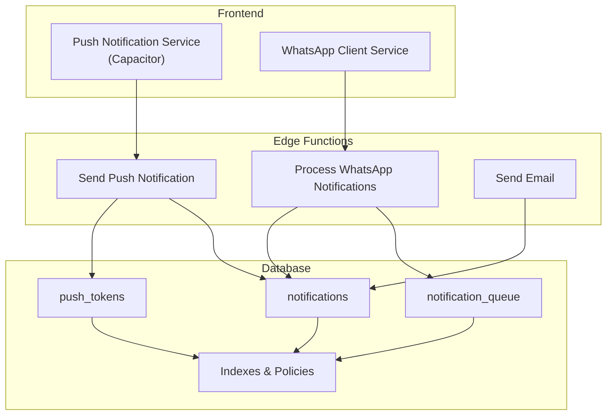
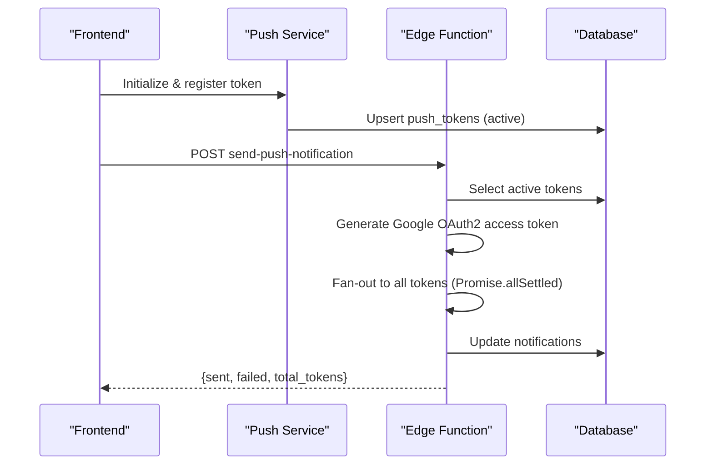
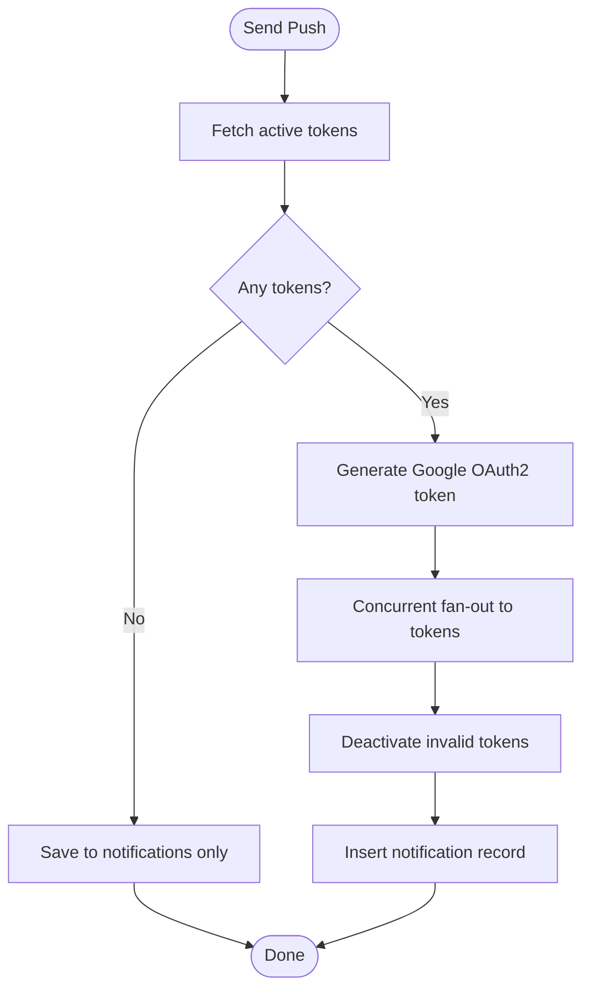
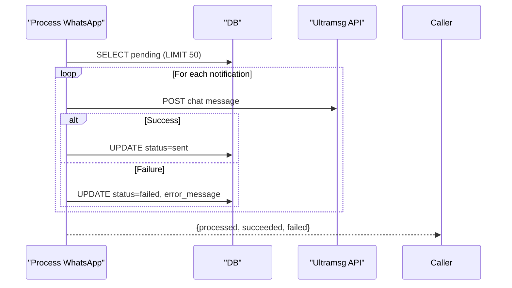
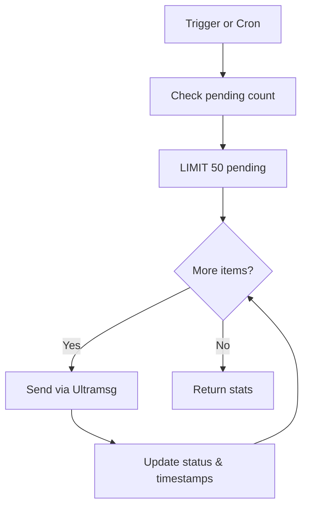
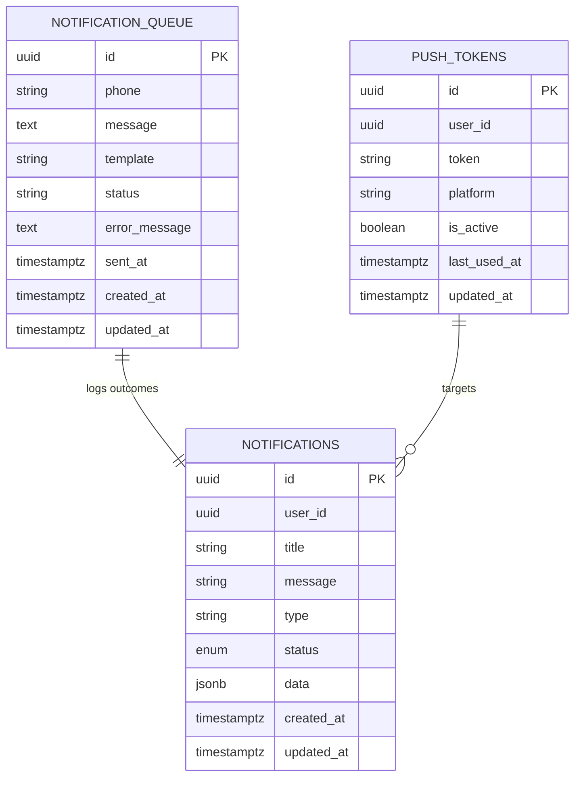
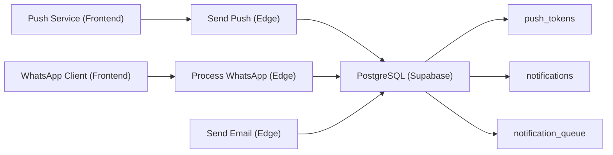

# Notification Delivery Performance

<cite>
**Referenced Files in This Document**
- [src/lib/notifications.ts](file://src/lib/notifications.ts)
- [src/lib/notifications/push.ts](file://src/lib/notifications/push.ts)
- [src/lib/notifications/push.test.ts](file://src/lib/notifications/push.test.ts)
- [src/lib/whatsapp.ts](file://src/lib/whatsapp.ts)
- [supabase/functions/send-push-notification/index.ts](file://supabase/functions/send-push-notification/index.ts)
- [supabase/functions/process-whatsapp-notifications/index.ts](file://supabase/functions/process-whatsapp-notifications/index.ts)
- [supabase/functions/send-email/index.ts](file://supabase/functions/send-email/index.ts)
- [supabase/migrations/20240103_whatsapp_notifications.sql](file://supabase/migrations/20240103_whatsapp_notifications.sql)
- [supabase/migrations/20260226_create_whatsapp_processor_trigger.sql](file://supabase/migrations/20260226_create_whatsapp_processor_trigger.sql)
- [supabase/migrations/20260223000005_fix_homepage_errors.sql](file://supabase/migrations/20260223000005_fix_homepage_errors.sql)
- [src/integrations/supabase/types.ts](file://src/integrations/supabase/types.ts)
</cite>

## Table of Contents
1. [Introduction](#introduction)
2. [Project Structure](#project-structure)
3. [Core Components](#core-components)
4. [Architecture Overview](#architecture-overview)
5. [Detailed Component Analysis](#detailed-component-analysis)
6. [Dependency Analysis](#dependency-analysis)
7. [Performance Considerations](#performance-considerations)
8. [Troubleshooting Guide](#troubleshooting-guide)
9. [Conclusion](#conclusion)

## Introduction
This document provides a comprehensive guide to optimizing notification delivery performance across Nutrio's multi-channel notification system. It covers push notification delivery rate optimization, retry mechanisms, delivery confirmation tracking, WhatsApp notification processing efficiency, batch processing strategies, webhook delivery optimization, notification queuing systems, priority-based delivery scheduling, throttling mechanisms, deduplication strategies, rate limiting, and graceful failure handling. The goal is to help teams achieve reliable, scalable, and high-performance notification delivery while preventing system overload.

## Project Structure
Nutrio's notification system spans three primary areas:
- Frontend SDK for push notifications (Capacitor-based)
- Supabase Edge Functions for push/email/WhatsApp delivery orchestration
- Database schema and triggers for queuing and status tracking

**Diagram sources**
- [src/lib/notifications/push.ts:13-136](file://src/lib/notifications/push.ts#L13-L136)
- [src/lib/whatsapp.ts:1-197](file://src/lib/whatsapp.ts#L1-L197)
- [supabase/functions/send-push-notification/index.ts:178-299](file://supabase/functions/send-push-notification/index.ts#L178-L299)
- [supabase/functions/process-whatsapp-notifications/index.ts:164-214](file://supabase/functions/process-whatsapp-notifications/index.ts#L164-L214)
- [supabase/migrations/20240103_whatsapp_notifications.sql:59-90](file://supabase/migrations/20240103_whatsapp_notifications.sql#L59-L90)

**Section sources**
- [src/lib/notifications.ts:1-114](file://src/lib/notifications.ts#L1-L114)
- [src/lib/notifications/push.ts:1-137](file://src/lib/notifications/push.ts#L1-L137)
- [src/lib/whatsapp.ts:1-197](file://src/lib/whatsapp.ts#L1-L197)
- [supabase/functions/send-push-notification/index.ts:1-300](file://supabase/functions/send-push-notification/index.ts#L1-L300)
- [supabase/functions/process-whatsapp-notifications/index.ts:1-215](file://supabase/functions/process-whatsapp-notifications/index.ts#L1-L215)
- [supabase/functions/send-email/index.ts:1-120](file://supabase/functions/send-email/index.ts#L1-L120)
- [supabase/migrations/20240103_whatsapp_notifications.sql:1-343](file://supabase/migrations/20240103_whatsapp_notifications.sql#L1-L343)
- [supabase/migrations/20260226_create_whatsapp_processor_trigger.sql:1-47](file://supabase/migrations/20260226_create_whatsapp_processor_trigger.sql#L1-L47)
- [supabase/migrations/20260223000005_fix_homepage_errors.sql:63-103](file://supabase/migrations/20260223000005_fix_homepage_errors.sql#L63-L103)
- [src/integrations/supabase/types.ts:3545-3577](file://src/integrations/supabase/types.ts#L3545-L3577)

## Core Components
- Push Notification Service (frontend): Handles token registration, permission checks, foreground/background actions, and deep-link navigation.
- Send Push Notification Edge Function: Fetches active tokens, authenticates with Firebase Cloud Messaging via Google OAuth2, sends notifications concurrently, deactivates invalid tokens, and records delivery outcomes.
- WhatsApp Notification Service (frontend): Sends templated and custom WhatsApp messages via Ultramsg API.
- Process WhatsApp Notifications Edge Function: Pulls pending notifications from the queue, processes a bounded batch, updates statuses, and returns statistics.
- Database Schema: Maintains notifications, push_tokens, and notification_queue with row-level security and indexes optimized for pending queries.
- Email Delivery Edge Function: Provides a reusable pattern for outbound email delivery via Resend.

**Section sources**
- [src/lib/notifications/push.ts:13-136](file://src/lib/notifications/push.ts#L13-L136)
- [supabase/functions/send-push-notification/index.ts:178-299](file://supabase/functions/send-push-notification/index.ts#L178-L299)
- [src/lib/whatsapp.ts:26-60](file://src/lib/whatsapp.ts#L26-L60)
- [supabase/functions/process-whatsapp-notifications/index.ts:88-162](file://supabase/functions/process-whatsapp-notifications/index.ts#L88-L162)
- [supabase/migrations/20240103_whatsapp_notifications.sql:59-90](file://supabase/migrations/20240103_whatsapp_notifications.sql#L59-L90)
- [supabase/functions/send-email/index.ts:19-119](file://supabase/functions/send-email/index.ts#L19-L119)

## Architecture Overview
The system separates concerns across channels:
- Push: Real-time delivery via FCM with concurrent fan-out and token lifecycle management.
- WhatsApp: Asynchronous queuing with scheduled processing and bounded batch sizes.
- Email: Outbound delivery via Resend with validation and error reporting.

**Diagram sources**
- [src/lib/notifications/push.ts:25-108](file://src/lib/notifications/push.ts#L25-L108)
- [supabase/functions/send-push-notification/index.ts:213-281](file://supabase/functions/send-push-notification/index.ts#L213-L281)

**Section sources**
- [src/lib/notifications/push.ts:13-136](file://src/lib/notifications/push.ts#L13-L136)
- [supabase/functions/send-push-notification/index.ts:178-299](file://supabase/functions/send-push-notification/index.ts#L178-L299)

## Detailed Component Analysis

### Push Notification Delivery Optimization
- Token Management: Tokens are saved upon registration and updated with platform and timestamps. Invalid tokens are deactivated when receiving UNREGISTERED/NOT_FOUND responses.
- Concurrent Fan-out: Uses Promise.allSettled to maximize throughput while capturing individual failures.
- Platform-specific Payloads: Includes APNs and Android configurations for optimal delivery.
- Database Persistence: Ensures notification records are created regardless of token availability.

**Diagram sources**
- [supabase/functions/send-push-notification/index.ts:213-281](file://supabase/functions/send-push-notification/index.ts#L213-L281)

**Section sources**
- [src/lib/notifications/push.ts:77-108](file://src/lib/notifications/push.ts#L77-L108)
- [supabase/functions/send-push-notification/index.ts:244-271](file://supabase/functions/send-push-notification/index.ts#L244-L271)

### Retry Mechanisms and Exponential Backoff
Current implementation:
- Push notifications: Immediate concurrent fan-out; no built-in retries within the Edge Function.
- WhatsApp notifications: Batch processing with bounded limit per run; no explicit retry loop in the Edge Function.

Recommended enhancements:
- Implement retry queues for transient failures (rate limits, network timeouts).
- Use exponential backoff with jitter for retry intervals.
- Separate immediate vs delayed retry paths based on error classification.

[No sources needed since this section provides general guidance]

### Delivery Confirmation Tracking
- Push notifications: Returns counts of sent/failed/total tokens and logs outcomes.
- WhatsApp notifications: Updates status to sent/failed and captures error messages.
- Email notifications: Returns message ID on success and logs errors.

**Diagram sources**
- [supabase/functions/process-whatsapp-notifications/index.ts:88-162](file://supabase/functions/process-whatsapp-notifications/index.ts#L88-L162)

**Section sources**
- [supabase/functions/process-whatsapp-notifications/index.ts:127-159](file://supabase/functions/process-whatsapp-notifications/index.ts#L127-L159)

### WhatsApp Notification Processing Efficiency
- Queuing Strategy: Uses a dedicated notification_queue table with RLS and an index on (status, created_at) for pending items.
- Batch Processing: Processes a fixed-size batch per run to avoid long-running transactions.
- Status Tracking: Updates sent_at and error_message for observability.

**Diagram sources**
- [supabase/migrations/20240103_whatsapp_notifications.sql:59-90](file://supabase/migrations/20240103_whatsapp_notifications.sql#L59-L90)
- [supabase/functions/process-whatsapp-notifications/index.ts:98-162](file://supabase/functions/process-whatsapp-notifications/index.ts#L98-L162)

**Section sources**
- [supabase/migrations/20240103_whatsapp_notifications.sql:59-90](file://supabase/migrations/20240103_whatsapp_notifications.sql#L59-L90)
- [supabase/functions/process-whatsapp-notifications/index.ts:88-162](file://supabase/functions/process-whatsapp-notifications/index.ts#L88-L162)

### Webhook Delivery Optimization
- Edge Function Pattern: Standardized CORS handling, environment validation, request parsing, and error responses.
- Modular Design: Separate functions for push, WhatsApp, and email enable independent scaling and monitoring.

**Section sources**
- [supabase/functions/send-push-notification/index.ts:178-186](file://supabase/functions/send-push-notification/index.ts#L178-L186)
- [supabase/functions/process-whatsapp-notifications/index.ts:164-168](file://supabase/functions/process-whatsapp-notifications/index.ts#L164-L168)
- [supabase/functions/send-email/index.ts:19-23](file://supabase/functions/send-email/index.ts#L19-L23)

### Notification Queuing Systems and Priority Scheduling
- Queue Table: notification_queue supports pending, sent, failed states with timestamps and error tracking.
- Indexing: Pending items indexed by status and created_at for efficient polling.
- Scheduling: A schedule table enables periodic invocation when pg_cron is unavailable.

**Diagram sources**
- [supabase/migrations/20240103_whatsapp_notifications.sql:59-90](file://supabase/migrations/20240103_whatsapp_notifications.sql#L59-L90)
- [src/integrations/supabase/types.ts:3545-3577](file://src/integrations/supabase/types.ts#L3545-L3577)

**Section sources**
- [supabase/migrations/20240103_whatsapp_notifications.sql:59-90](file://supabase/migrations/20240103_whatsapp_notifications.sql#L59-L90)
- [supabase/migrations/20260226_create_whatsapp_processor_trigger.sql:30-47](file://supabase/migrations/20260226_create_whatsapp_processor_trigger.sql#L30-L47)
- [src/integrations/supabase/types.ts:3545-3577](file://src/integrations/supabase/types.ts#L3545-L3577)

### Throttling Mechanisms and Rate Limiting
- Push Notifications: Concurrency controlled by Promise.allSettled fan-out; consider adding upstream rate limiting to FCM and token deactivation for invalid tokens.
- WhatsApp Notifications: Batch size capped at 50 per run; consider per-minute invocation cadence and per-phone rate limiting at the API level.
- Email Notifications: Validate recipients and implement provider-side rate limits; consider batching requests.

**Section sources**
- [supabase/functions/send-push-notification/index.ts:244-249](file://supabase/functions/send-push-notification/index.ts#L244-L249)
- [supabase/functions/process-whatsapp-notifications/index.ts:98-104](file://supabase/functions/process-whatsapp-notifications/index.ts#L98-L104)

### Deduplication Strategies
- Push tokens: Upsert on conflict avoids duplicates keyed by user_id and token.
- Notification deduplication: Consider adding a composite deduplication key (e.g., user_id, title, message hash) before inserting notifications.

**Section sources**
- [src/lib/notifications/push.ts:88-98](file://src/lib/notifications/push.ts#L88-L98)

### Graceful Failure Handling
- Push notifications: Logs errors and continues processing remaining tokens; invalid tokens are deactivated.
- WhatsApp notifications: Captures error messages and updates status for observability.
- Email notifications: Validates inputs and returns structured errors.

**Section sources**
- [supabase/functions/send-push-notification/index.ts:292-298](file://supabase/functions/send-push-notification/index.ts#L292-L298)
- [supabase/functions/process-whatsapp-notifications/index.ts:143-158](file://supabase/functions/process-whatsapp-notifications/index.ts#L143-L158)
- [supabase/functions/send-email/index.ts:42-62](file://supabase/functions/send-email/index.ts#L42-L62)

## Dependency Analysis

**Diagram sources**
- [src/lib/notifications/push.ts:13-136](file://src/lib/notifications/push.ts#L13-L136)
- [src/lib/whatsapp.ts:1-197](file://src/lib/whatsapp.ts#L1-L197)
- [supabase/functions/send-push-notification/index.ts:1-300](file://supabase/functions/send-push-notification/index.ts#L1-L300)
- [supabase/functions/process-whatsapp-notifications/index.ts:1-215](file://supabase/functions/process-whatsapp-notifications/index.ts#L1-L215)
- [supabase/functions/send-email/index.ts:1-120](file://supabase/functions/send-email/index.ts#L1-L120)

**Section sources**
- [src/lib/notifications/push.ts:13-136](file://src/lib/notifications/push.ts#L13-L136)
- [src/lib/whatsapp.ts:1-197](file://src/lib/whatsapp.ts#L1-L197)
- [supabase/functions/send-push-notification/index.ts:1-300](file://supabase/functions/send-push-notification/index.ts#L1-L300)
- [supabase/functions/process-whatsapp-notifications/index.ts:1-215](file://supabase/functions/process-whatsapp-notifications/index.ts#L1-L215)
- [supabase/functions/send-email/index.ts:1-120](file://supabase/functions/send-email/index.ts#L1-L120)

## Performance Considerations
- Push Delivery Rate Optimization
  - Use Promise.allSettled for fan-out to minimize tail latency.
  - Pre-generate Google OAuth2 tokens with appropriate TTL to reduce overhead.
  - Monitor UNREGISTERED/NOT_FOUND responses and proactively deactivate tokens.
  - Consider batching user notifications by device platform to optimize payload construction.

- WhatsApp Batch Processing
  - Keep batch size balanced (e.g., 50) to avoid timeouts and maintain responsiveness.
  - Implement per-minute invocation cadence aligned with provider SLAs.
  - Add jitter to cron schedules to prevent thundering herd effects.

- Database Indexes and Policies
  - Maintain indexes on notification_queue(status, created_at) for efficient polling.
  - Enforce RLS policies to restrict access to service roles only.

- Monitoring and Metrics
  - Track sent/failed/total counts per push request.
  - Record processed/succeeded/failed counts per WhatsApp run.
  - Log error messages and stack traces for failures.

[No sources needed since this section provides general guidance]

## Troubleshooting Guide
- Push Notifications
  - Symptoms: No delivery despite active tokens.
  - Actions: Verify token activation, check UNREGISTERED/NOT_FOUND responses, confirm Google OAuth2 configuration, and inspect notification insert outcomes.

- WhatsApp Notifications
  - Symptoms: Messages stuck in pending.
  - Actions: Confirm Ultramsg credentials, verify phone number formatting, check API responses, and review error_message updates.

- Email Notifications
  - Symptoms: 400/500 errors.
  - Actions: Validate required fields, check email format, confirm API key presence, and review provider error responses.

**Section sources**
- [supabase/functions/send-push-notification/index.ts:292-298](file://supabase/functions/send-push-notification/index.ts#L292-L298)
- [supabase/functions/process-whatsapp-notifications/index.ts:170-184](file://supabase/functions/process-whatsapp-notifications/index.ts#L170-L184)
- [supabase/functions/send-email/index.ts:25-62](file://supabase/functions/send-email/index.ts#L25-L62)

## Conclusion
Nutrio’s notification system leverages a clean separation of concerns across push, WhatsApp, and email channels. By optimizing push fan-out, implementing robust queuing and status tracking for WhatsApp, standardizing Edge Function patterns, and enforcing throttling and deduplication, teams can achieve high delivery rates while maintaining system stability. The recommended enhancements around retries, metrics, and graceful failure handling will further improve reliability and operability.