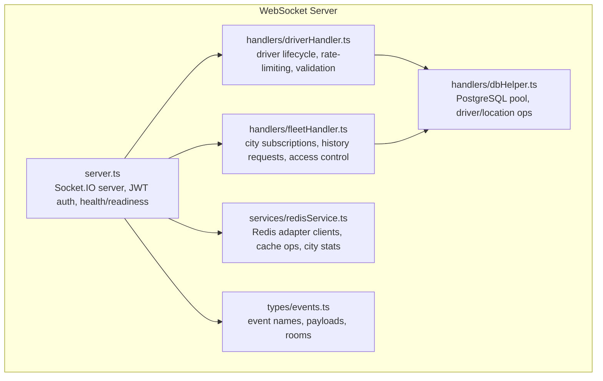
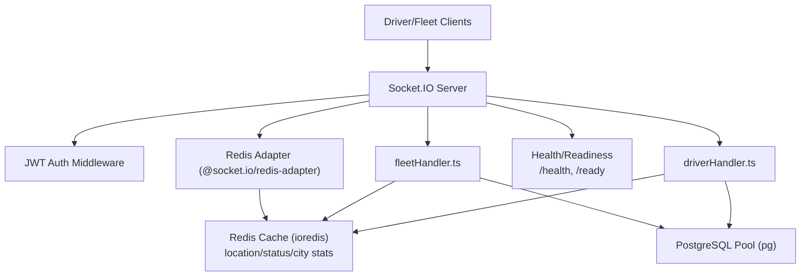
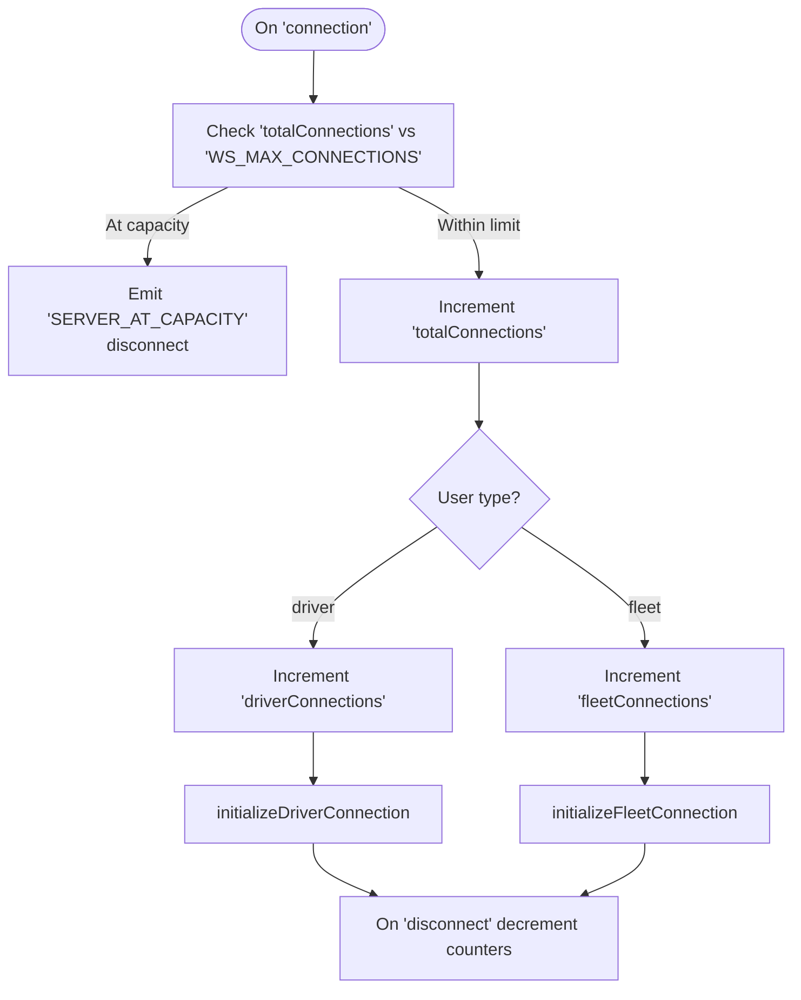
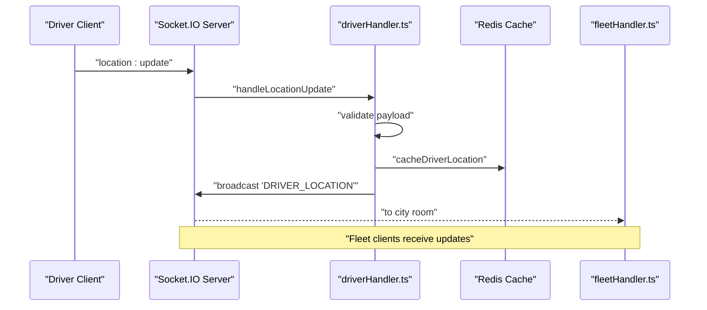
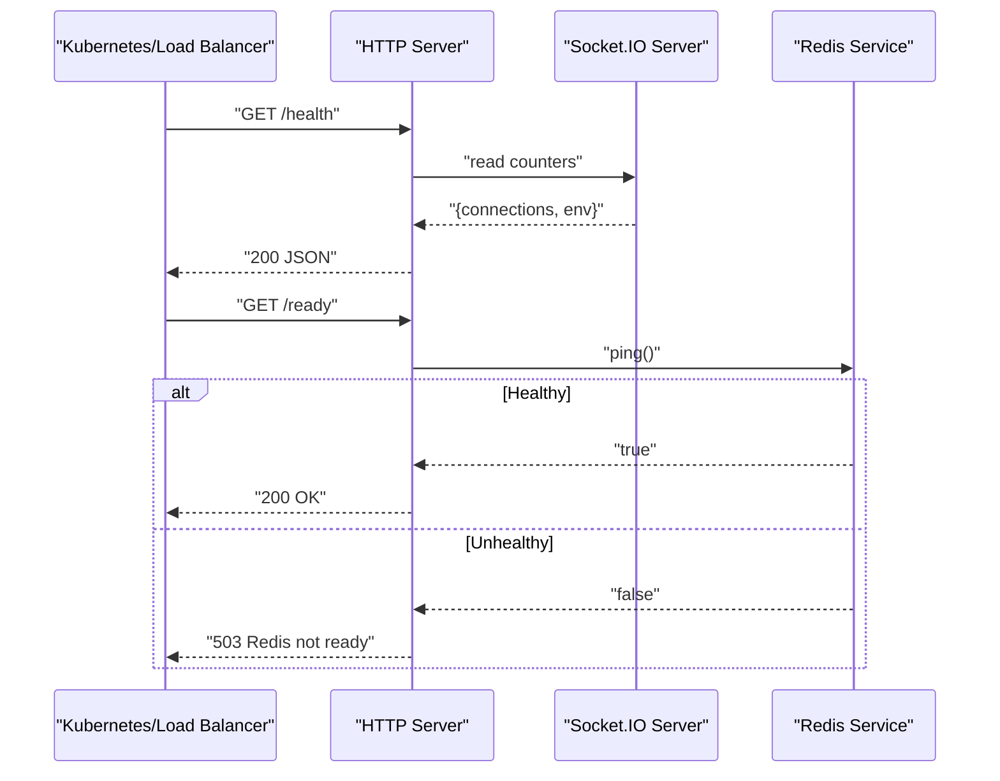
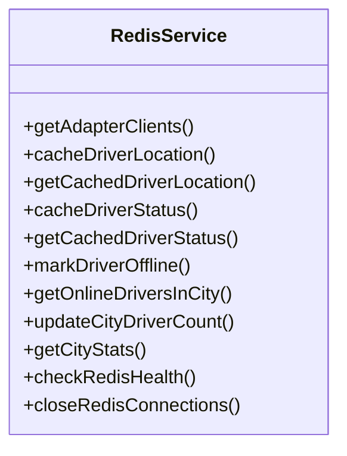
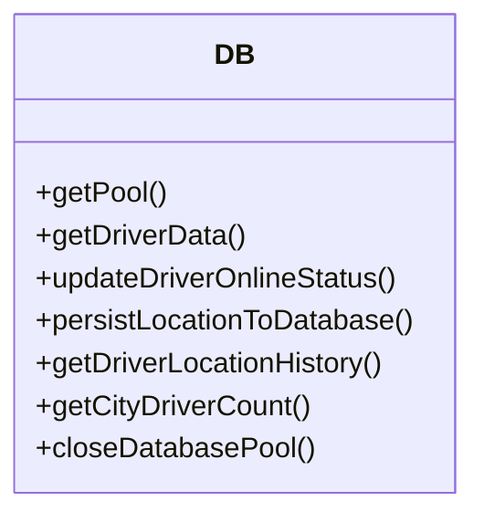
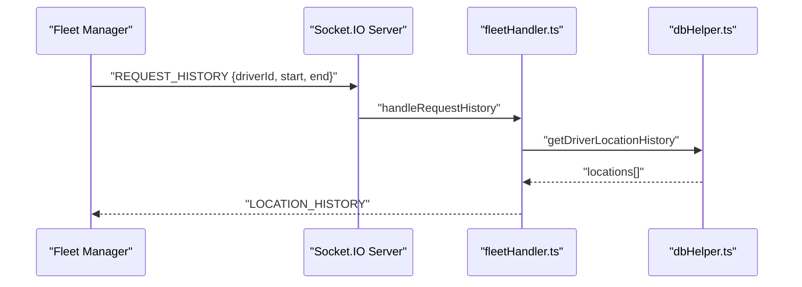
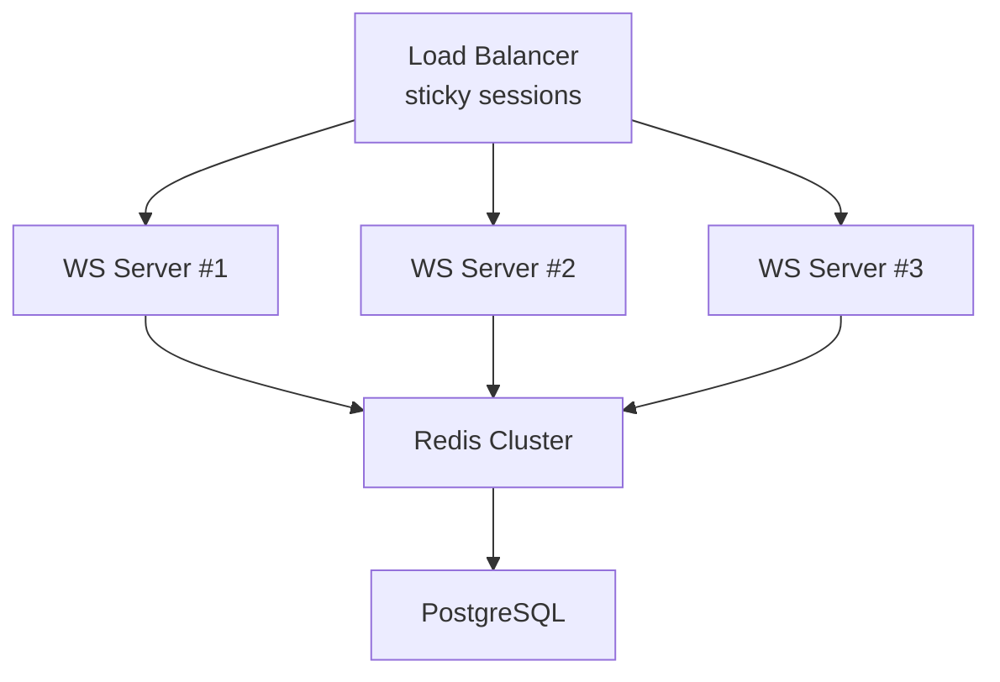
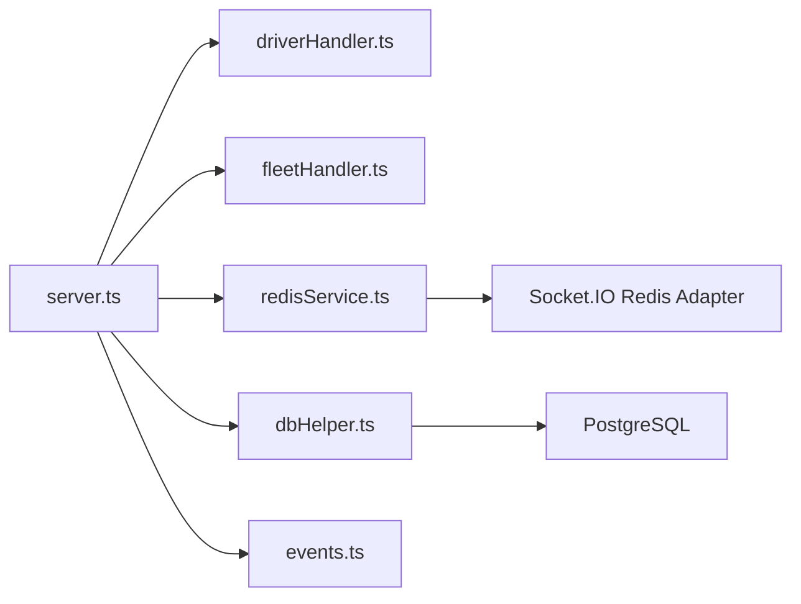

# Performance Monitoring and Metrics

<cite>
**Referenced Files in This Document**
- [server.ts](file://websocket-server/src/server.ts)
- [redisService.ts](file://websocket-server/src/services/redisService.ts)
- [dbHelper.ts](file://websocket-server/src/handlers/dbHelper.ts)
- [driverHandler.ts](file://websocket-server/src/handlers/driverHandler.ts)
- [fleetHandler.ts](file://websocket-server/src/handlers/fleetHandler.ts)
- [events.ts](file://websocket-server/src/types/events.ts)
- [Dockerfile](file://websocket-server/Dockerfile)
- [fleet-management-portal-design.md](file://docs/fleet-management-portal-design.md)
</cite>

## Table of Contents
1. [Introduction](#introduction)
2. [Project Structure](#project-structure)
3. [Core Components](#core-components)
4. [Architecture Overview](#architecture-overview)
5. [Detailed Component Analysis](#detailed-component-analysis)
6. [Dependency Analysis](#dependency-analysis)
7. [Performance Considerations](#performance-considerations)
8. [Troubleshooting Guide](#troubleshooting-guide)
9. [Conclusion](#conclusion)
10. [Appendices](#appendices)

## Introduction
This document provides a comprehensive guide to real-time performance monitoring and metrics collection for Nutrio’s WebSocket infrastructure. It focuses on connection count monitoring, message throughput measurement, latency tracking, server health checks, Redis adapter performance metrics, and database connection pool monitoring. It also covers real-time analytics collection, bottleneck identification, automated alerting, custom metrics implementation, dashboard setup, performance baselines, capacity planning, degradation pattern recognition, and proactive scaling strategies.

## Project Structure
The WebSocket server is implemented as a standalone service with clear separation of concerns:
- Server orchestration and transport configuration
- Redis adapter and caching utilities
- Database pooling and persistence helpers
- Event-driven handlers for drivers and fleet managers
- Strongly typed event contracts
- Containerized production deployment with health checks

**Diagram sources**
- [server.ts:1-256](file://websocket-server/src/server.ts#L1-L256)
- [driverHandler.ts:1-318](file://websocket-server/src/handlers/driverHandler.ts#L1-L318)
- [fleetHandler.ts:1-247](file://websocket-server/src/handlers/fleetHandler.ts#L1-L247)
- [redisService.ts:1-264](file://websocket-server/src/services/redisService.ts#L1-L264)
- [dbHelper.ts:1-204](file://websocket-server/src/handlers/dbHelper.ts#L1-L204)
- [events.ts:1-210](file://websocket-server/src/types/events.ts#L1-L210)

**Section sources**
- [server.ts:1-256](file://websocket-server/src/server.ts#L1-L256)
- [redisService.ts:1-264](file://websocket-server/src/services/redisService.ts#L1-L264)
- [dbHelper.ts:1-204](file://websocket-server/src/handlers/dbHelper.ts#L1-L204)
- [driverHandler.ts:1-318](file://websocket-server/src/handlers/driverHandler.ts#L1-L318)
- [fleetHandler.ts:1-247](file://websocket-server/src/handlers/fleetHandler.ts#L1-L247)
- [events.ts:1-210](file://websocket-server/src/types/events.ts#L1-L210)

## Core Components
- Socket.IO server with Redis adapter for horizontal scaling and pub/sub synchronization
- JWT authentication middleware enforcing role-based access
- Connection metrics counters for total, driver, and fleet connections
- Health and readiness endpoints for operational probes
- Redis-backed caching for driver location/status and city statistics
- PostgreSQL connection pool with transactional persistence for driver/location history
- Typed event contracts and room-based broadcasting

Key metrics and monitoring hooks:
- Connection counts: maintained in-memory and exposed via health endpoint
- Redis connectivity: health check endpoint and adapter clients
- Database pool: pool creation, error handling, and graceful shutdown
- Driver location updates: rate limiting and validation
- Fleet history queries: access control and pagination limits

**Section sources**
- [server.ts:57-192](file://websocket-server/src/server.ts#L57-L192)
- [redisService.ts:254-263](file://websocket-server/src/services/redisService.ts#L254-L263)
- [dbHelper.ts:15-29](file://websocket-server/src/handlers/dbHelper.ts#L15-L29)
- [driverHandler.ts:24-43](file://websocket-server/src/handlers/driverHandler.ts#L24-L43)
- [events.ts:157-186](file://websocket-server/src/types/events.ts#L157-L186)

## Architecture Overview
The WebSocket server integrates Socket.IO with a Redis adapter for multi-node synchronization and uses a PostgreSQL pool for durable storage. Handlers manage driver and fleet workflows, while Redis caches frequently accessed state.

**Diagram sources**
- [server.ts:37-55](file://websocket-server/src/server.ts#L37-L55)
- [driverHandler.ts:105-207](file://websocket-server/src/handlers/driverHandler.ts#L105-L207)
- [fleetHandler.ts:87-212](file://websocket-server/src/handlers/fleetHandler.ts#L87-L212)
- [redisService.ts:63-82](file://websocket-server/src/services/redisService.ts#L63-L82)
- [dbHelper.ts:15-29](file://websocket-server/src/handlers/dbHelper.ts#L15-L29)

## Detailed Component Analysis

### Connection Count Monitoring
- Global counters track total, driver, and fleet connections.
- Incremented on connect and decremented on disconnect.
- Exposed via a health endpoint for monitoring and readiness probes.

**Diagram sources**
- [server.ts:108-150](file://websocket-server/src/server.ts#L108-L150)

**Section sources**
- [server.ts:57-150](file://websocket-server/src/server.ts#L57-L150)

### Message Throughput Measurement
- Socket.IO transport configuration supports WebSocket and polling with compression thresholds.
- Message size limits and ping intervals/tolerances influence throughput and latency characteristics.
- Handlers broadcast driver location/status updates to city-specific rooms, enabling scalable fan-out.

**Diagram sources**
- [driverHandler.ts:105-183](file://websocket-server/src/handlers/driverHandler.ts#L105-L183)
- [events.ts:157-178](file://websocket-server/src/types/events.ts#L157-L178)

**Section sources**
- [server.ts:38-51](file://websocket-server/src/server.ts#L38-L51)
- [driverHandler.ts:105-183](file://websocket-server/src/handlers/driverHandler.ts#L105-L183)
- [events.ts:157-178](file://websocket-server/src/types/events.ts#L157-L178)

### Latency Tracking Across Components
- Ping interval and timeout are configurable and impact perceived latency and connection stability.
- Redis operations (hset/hgetall/expire) and database transactions introduce latency; monitor via external metrics and logs.
- Recommendations:
  - Track per-event processing duration around handlers.
  - Measure round-trip latency from driver to fleet subscribers.
  - Monitor Redis and DB latency independently.

**Section sources**
- [server.ts:23-26](file://websocket-server/src/server.ts#L23-L26)
- [redisService.ts:90-146](file://websocket-server/src/services/redisService.ts#L90-L146)
- [dbHelper.ts:83-125](file://websocket-server/src/handlers/dbHelper.ts#L83-L125)

### WebSocket Server Health Checks
- Health endpoint returns current connection counts and environment metadata.
- Readiness endpoint pings Redis to verify adapter connectivity.

**Diagram sources**
- [server.ts:162-192](file://websocket-server/src/server.ts#L162-L192)
- [redisService.ts:254-263](file://websocket-server/src/services/redisService.ts#L254-L263)

**Section sources**
- [server.ts:162-192](file://websocket-server/src/server.ts#L162-L192)
- [redisService.ts:254-263](file://websocket-server/src/services/redisService.ts#L254-L263)

### Redis Adapter Performance Metrics
- Adapter clients are created once and reused for pub/sub.
- Redis cluster mode supported via environment flags.
- Cache TTLs and key prefixes are configurable.
- City-level stats and online driver enumeration leverage hash operations and pattern scanning.

**Diagram sources**
- [redisService.ts:63-263](file://websocket-server/src/services/redisService.ts#L63-L263)

**Section sources**
- [redisService.ts:14-18](file://websocket-server/src/services/redisService.ts#L14-L18)
- [redisService.ts:63-82](file://websocket-server/src/services/redisService.ts#L63-L82)
- [redisService.ts:165-224](file://websocket-server/src/services/redisService.ts#L165-L224)

### Database Connection Pool Monitoring
- Centralized pool creation with configurable max size and SSL options.
- Handlers acquire/release clients per operation; errors logged centrally.
- Graceful shutdown ends the pool to prevent leaks.

**Diagram sources**
- [dbHelper.ts:15-203](file://websocket-server/src/handlers/dbHelper.ts#L15-L203)

**Section sources**
- [dbHelper.ts:15-29](file://websocket-server/src/handlers/dbHelper.ts#L15-L29)
- [dbHelper.ts:197-203](file://websocket-server/src/handlers/dbHelper.ts#L197-L203)

### Real-Time Analytics Collection
- Fleet managers can request historical location data with time bounds and point limits.
- City statistics are available via Redis; handlers can emit stats updates to subscribed clients.
- Access control ensures fleet managers only query data for assigned cities.

**Diagram sources**
- [fleetHandler.ts:145-212](file://websocket-server/src/handlers/fleetHandler.ts#L145-L212)
- [dbHelper.ts:130-163](file://websocket-server/src/handlers/dbHelper.ts#L130-L163)

**Section sources**
- [fleetHandler.ts:145-212](file://websocket-server/src/handlers/fleetHandler.ts#L145-L212)
- [dbHelper.ts:130-163](file://websocket-server/src/handlers/dbHelper.ts#L130-L163)

### Performance Bottleneck Identification
- Driver location updates are rate-limited by in-memory tracking; consider moving to Redis for distributed rate limiting.
- Database writes are asynchronous in the driver handler; ensure DB latency SLAs are monitored externally.
- Redis pattern scanning across driver status keys can be expensive at scale; consider indexed sets or sorted sets for online drivers.

**Section sources**
- [driverHandler.ts:24-26](file://websocket-server/src/handlers/driverHandler.ts#L24-L26)
- [driverHandler.ts:184-198](file://websocket-server/src/handlers/driverHandler.ts#L184-L198)
- [redisService.ts:165-187](file://websocket-server/src/services/redisService.ts#L165-L187)

### Automated Alerting Systems
- Use health and readiness endpoints for Kubernetes probes.
- Integrate with external monitoring systems to alert on:
  - Connection saturation near WS_MAX_CONNECTIONS
  - Elevated Redis ping times or failures
  - Database pool exhaustion or slow queries
  - Increased error rates (VALIDATION_ERROR, INTERNAL_ERROR)

**Section sources**
- [server.ts:162-192](file://websocket-server/src/server.ts#L162-L192)
- [redisService.ts:254-263](file://websocket-server/src/services/redisService.ts#L254-L263)
- [dbHelper.ts:23-25](file://websocket-server/src/handlers/dbHelper.ts#L23-L25)

### Implementing Custom Metrics Collection
- Add instrumentation around:
  - Driver location update processing time
  - Redis cache operations (latency, misses)
  - Database transaction durations
  - Room broadcast fan-out counts
- Emit metrics to your telemetry backend (Prometheus, OpenTelemetry, etc.) and surface via dashboards.

[No sources needed since this section provides general guidance]

### Setting Up Monitoring Dashboards
- Dashboards should include:
  - Live connection counts (total, driver, fleet)
  - Capacity utilization vs. WS_MAX_CONNECTIONS
  - Redis connectivity and latency
  - Database pool usage and query latency
  - Error rates by event type
  - Driver location update frequency and success rates

[No sources needed since this section provides general guidance]

### Establishing Performance Baselines
- Baseline metrics:
  - Normal connection growth curves
  - Typical Redis and DB latencies under load
  - Acceptable error rates and reconnection patterns
- Use historical data to set SLOs and alert thresholds.

[No sources needed since this section provides general guidance]

### Capacity Planning Based on Real-Time Metrics
- Horizontal scaling:
  - Sticky sessions for consistent routing
  - Redis Pub/Sub for cross-instance messaging
  - HPA targeting websocket_connections metric
- Vertical scaling:
  - Increase DB pool size and Redis cluster nodes
  - Tune Socket.IO ping intervals and buffer sizes

**Diagram sources**
- [fleet-management-portal-design.md:2518-2584](file://docs/fleet-management-portal-design.md#L2518-L2584)

**Section sources**
- [fleet-management-portal-design.md:2518-2584](file://docs/fleet-management-portal-design.md#L2518-L2584)

### Identifying Performance Degradation Patterns
- Monitor trends in:
  - Connection drop-off during peak hours
  - Rising Redis and DB latencies
  - Increased rate-limiting and validation errors
- Correlate with fleet manager activity and driver density per city.

**Section sources**
- [server.ts:108-150](file://websocket-server/src/server.ts#L108-L150)
- [driverHandler.ts:111-135](file://websocket-server/src/handlers/driverHandler.ts#L111-L135)
- [redisService.ts:254-263](file://websocket-server/src/services/redisService.ts#L254-L263)
- [dbHelper.ts:118-124](file://websocket-server/src/handlers/dbHelper.ts#L118-L124)

### Proactive Scaling Strategies
- Scale out when:
  - Connection count approaches WS_MAX_CONNECTIONS
  - Redis latency exceeds threshold
  - DB pool utilization nears max
- Scale in when:
  - Utilization consistently below thresholds for sustained periods

**Section sources**
- [server.ts:22-26](file://websocket-server/src/server.ts#L22-L26)
- [server.ts:110-117](file://websocket-server/src/server.ts#L110-L117)
- [redisService.ts:254-263](file://websocket-server/src/services/redisService.ts#L254-L263)
- [dbHelper.ts:19-21](file://websocket-server/src/handlers/dbHelper.ts#L19-L21)
- [fleet-management-portal-design.md:2562-2579](file://docs/fleet-management-portal-design.md#L2562-L2579)

## Dependency Analysis
- server.ts depends on:
  - redisService.ts for adapter clients and health checks
  - dbHelper.ts for database operations
  - driverHandler.ts and fleetHandler.ts for event lifecycles
  - events.ts for type-safe event names and payloads
- dockerfile defines production runtime, health checks, and environment defaults

**Diagram sources**
- [server.ts:11-16](file://websocket-server/src/server.ts#L11-L16)
- [redisService.ts:63-82](file://websocket-server/src/services/redisService.ts#L63-L82)
- [dbHelper.ts:15-29](file://websocket-server/src/handlers/dbHelper.ts#L15-L29)
- [driverHandler.ts:1-23](file://websocket-server/src/handlers/driverHandler.ts#L1-L23)
- [fleetHandler.ts:1-18](file://websocket-server/src/handlers/fleetHandler.ts#L1-L18)
- [events.ts:1-20](file://websocket-server/src/types/events.ts#L1-L20)

**Section sources**
- [server.ts:11-16](file://websocket-server/src/server.ts#L11-L16)
- [Dockerfile:62-70](file://websocket-server/Dockerfile#L62-L70)

## Performance Considerations
- Optimize Redis operations:
  - Prefer atomic operations and avoid excessive KEYS scans
  - Use field-level updates for status and incremental counters
- Improve database efficiency:
  - Batch writes where possible
  - Index frequently queried columns (driver_id, recorded_at)
- Tune Socket.IO:
  - Adjust ping intervals and timeouts for your latency targets
  - Monitor maxHttpBufferSize and compression thresholds

[No sources needed since this section provides general guidance]

## Troubleshooting Guide
- Connection saturation:
  - Verify WS_MAX_CONNECTIONS and observe SERVER_AT_CAPACITY errors
- Authentication failures:
  - Check JWT_SECRET and token validity
- Redis connectivity:
  - Use /ready endpoint and check Redis client error logs
- Database pool exhaustion:
  - Inspect pool error logs and adjust max size
- Graceful shutdown:
  - Confirm HTTP server, Socket.IO server, Redis, and DB pools are closed

**Section sources**
- [server.ts:29-32](file://websocket-server/src/server.ts#L29-L32)
- [server.ts:110-117](file://websocket-server/src/server.ts#L110-L117)
- [server.ts:177-187](file://websocket-server/src/server.ts#L177-L187)
- [redisService.ts:44-54](file://websocket-server/src/services/redisService.ts#L44-L54)
- [dbHelper.ts:23-25](file://websocket-server/src/handlers/dbHelper.ts#L23-L25)
- [server.ts:197-224](file://websocket-server/src/server.ts#L197-L224)

## Conclusion
Nutrio’s WebSocket infrastructure provides robust primitives for real-time tracking with built-in connection metrics, health checks, Redis adapter integration, and database persistence. By instrumenting handler timings, externalizing Redis and DB latency, and leveraging readiness/health endpoints, teams can establish comprehensive monitoring, identify bottlenecks, and implement proactive scaling aligned with traffic patterns and capacity targets.

[No sources needed since this section summarizes without analyzing specific files]

## Appendices

### Appendix A: Health and Readiness Endpoints
- GET /health: Returns status, timestamp, connection counts, and environment
- GET /ready: Returns OK if Redis ping succeeds; otherwise 503

**Section sources**
- [server.ts:162-192](file://websocket-server/src/server.ts#L162-L192)
- [redisService.ts:254-263](file://websocket-server/src/services/redisService.ts#L254-L263)

### Appendix B: Deployment and Health Checks
- Docker HEALTHCHECK probes /health
- Production defaults and non-root user

**Section sources**
- [Dockerfile:62-70](file://websocket-server/Dockerfile#L62-L70)