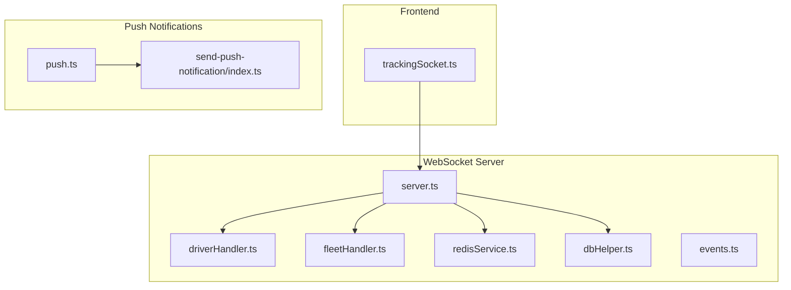
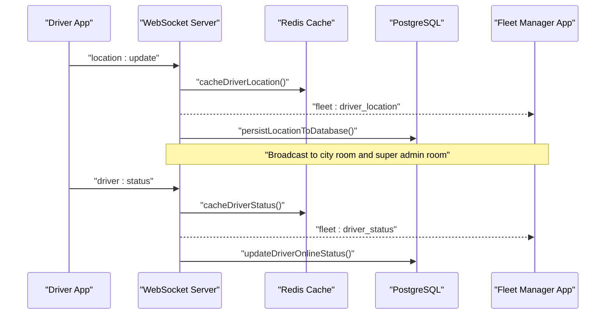
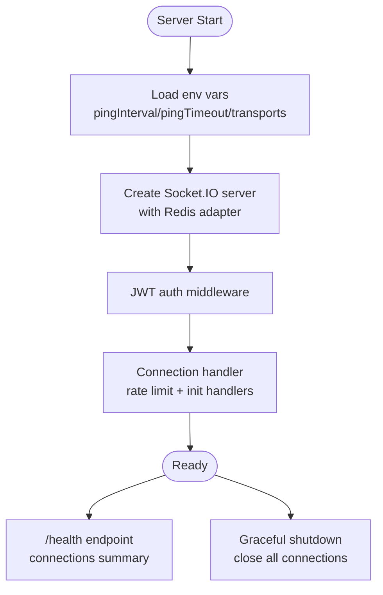
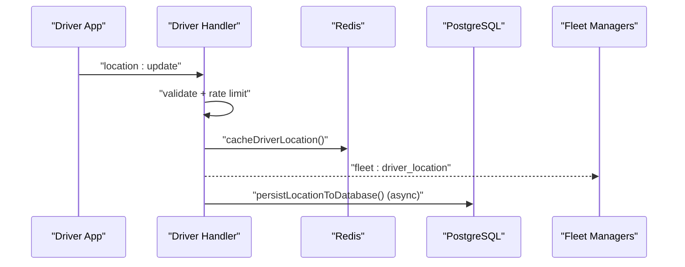
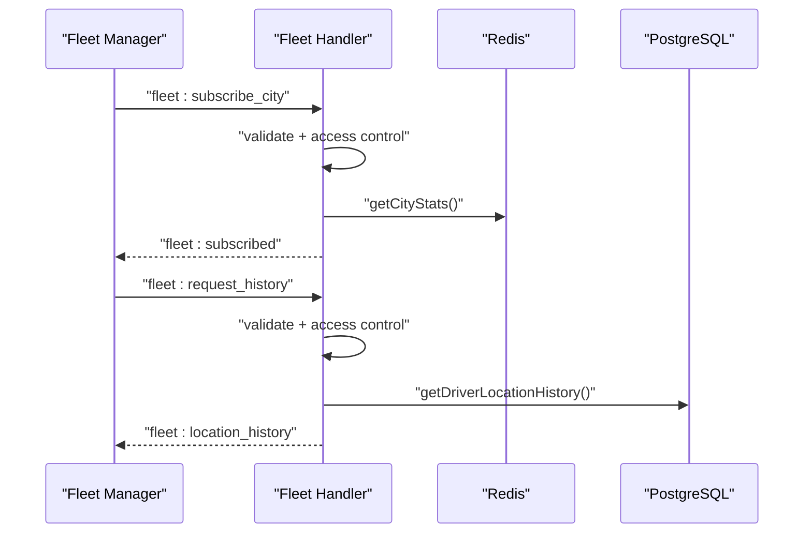
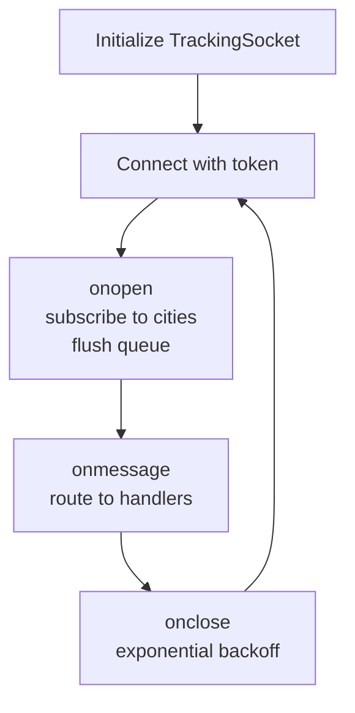
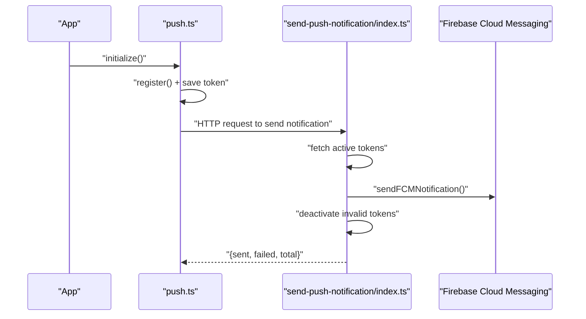
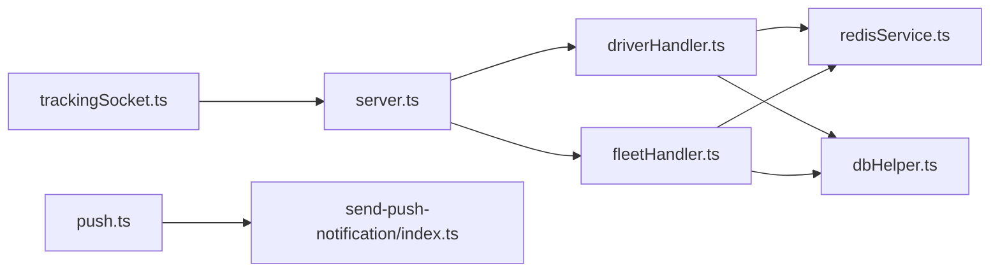

# Real-time Features Performance

<cite>
**Referenced Files in This Document**
- [server.ts](file://websocket-server/src/server.ts)
- [driverHandler.ts](file://websocket-server/src/handlers/driverHandler.ts)
- [fleetHandler.ts](file://websocket-server/src/handlers/fleetHandler.ts)
- [redisService.ts](file://websocket-server/src/services/redisService.ts)
- [dbHelper.ts](file://websocket-server/src/handlers/dbHelper.ts)
- [events.ts](file://websocket-server/src/types/events.ts)
- [trackingSocket.ts](file://src/fleet/services/trackingSocket.ts)
- [push.ts](file://src/lib/notifications/push.ts)
- [send-push-notification/index.ts](file://supabase/functions/send-push-notification/index.ts)
- [realtime.spec.ts](file://e2e/system/realtime.spec.ts)
- [fleet-management-portal-design.md](file://docs/fleet-management-portal-design.md)
</cite>

## Table of Contents
1. [Introduction](#introduction)
2. [Project Structure](#project-structure)
3. [Core Components](#core-components)
4. [Architecture Overview](#architecture-overview)
5. [Detailed Component Analysis](#detailed-component-analysis)
6. [Dependency Analysis](#dependency-analysis)
7. [Performance Considerations](#performance-considerations)
8. [Troubleshooting Guide](#troubleshooting-guide)
9. [Conclusion](#conclusion)

## Introduction
This document provides a comprehensive guide to real-time feature performance in Nutrio’s WebSocket implementation. It focuses on WebSocket connection optimization, message batching, efficient event handling, data synchronization efficiency, real-time notification delivery, and server performance monitoring. It also includes practical examples for optimizing real-time data flows, implementing efficient caching strategies, and handling connection failures gracefully.

## Project Structure
The real-time system spans three primary areas:
- WebSocket server (Node.js + Socket.IO) with Redis adapter for horizontal scaling
- Frontend tracking service using native WebSocket for driver/fleet communications
- Push notification pipeline via Supabase Edge Functions and Firebase Cloud Messaging

**Diagram sources**
- [server.ts:37-51](file://websocket-server/src/server.ts#L37-L51)
- [driverHandler.ts:48-100](file://websocket-server/src/handlers/driverHandler.ts#L48-L100)
- [fleetHandler.ts:36-82](file://websocket-server/src/handlers/fleetHandler.ts#L36-L82)
- [redisService.ts:87-146](file://websocket-server/src/services/redisService.ts#L87-L146)
- [dbHelper.ts:83-125](file://websocket-server/src/handlers/dbHelper.ts#L83-L125)
- [events.ts:157-186](file://websocket-server/src/types/events.ts#L157-L186)
- [trackingSocket.ts:34-95](file://src/fleet/services/trackingSocket.ts#L34-L95)
- [push.ts:25-75](file://src/lib/notifications/push.ts#L25-L75)
- [send-push-notification/index.ts:178-299](file://supabase/functions/send-push-notification/index.ts#L178-L299)

**Section sources**
- [server.ts:37-51](file://websocket-server/src/server.ts#L37-L51)
- [trackingSocket.ts:34-95](file://src/fleet/services/trackingSocket.ts#L34-L95)
- [push.ts:25-75](file://src/lib/notifications/push.ts#L25-L75)
- [send-push-notification/index.ts:178-299](file://supabase/functions/send-push-notification/index.ts#L178-L299)

## Core Components
- WebSocket server with Socket.IO and Redis adapter for multi-server scaling
- Driver and fleet handlers for event processing and room-based broadcasting
- Redis caching for location/status and city stats
- PostgreSQL helpers for persistence and historical queries
- Frontend tracking service with exponential backoff and message queuing
- Push notification service with token registration and FCM delivery

**Section sources**
- [server.ts:65-150](file://websocket-server/src/server.ts#L65-L150)
- [driverHandler.ts:48-207](file://websocket-server/src/handlers/driverHandler.ts#L48-L207)
- [fleetHandler.ts:36-212](file://websocket-server/src/handlers/fleetHandler.ts#L36-L212)
- [redisService.ts:87-224](file://websocket-server/src/services/redisService.ts#L87-L224)
- [dbHelper.ts:34-163](file://websocket-server/src/handlers/dbHelper.ts#L34-L163)
- [trackingSocket.ts:25-214](file://src/fleet/services/trackingSocket.ts#L25-L214)
- [push.ts:25-134](file://src/lib/notifications/push.ts#L25-L134)
- [send-push-notification/index.ts:178-299](file://supabase/functions/send-push-notification/index.ts#L178-L299)

## Architecture Overview
The system uses a hybrid real-time architecture:
- WebSocket server handles live events and broadcasts
- Redis caches hot-path data (location/status) and synchronizes across servers
- PostgreSQL persists immutable history and supports analytics queries
- Frontend connects via native WebSocket with robust reconnection
- Push notifications are delivered via Supabase Edge Functions to Firebase

**Diagram sources**
- [driverHandler.ts:105-207](file://websocket-server/src/handlers/driverHandler.ts#L105-L207)
- [redisService.ts:87-146](file://websocket-server/src/services/redisService.ts#L87-L146)
- [dbHelper.ts:83-125](file://websocket-server/src/handlers/dbHelper.ts#L83-L125)
- [events.ts:157-178](file://websocket-server/src/types/events.ts#L157-L178)

## Detailed Component Analysis

### WebSocket Server
- Authentication middleware validates JWT and sets user metadata on socket
- Connection handler enforces max connections and initializes driver/fleet handlers
- Health endpoint exposes connection counts and environment info
- Graceful shutdown closes HTTP server, Socket.IO, Redis, and DB connections

**Diagram sources**
- [server.ts:37-51](file://websocket-server/src/server.ts#L37-L51)
- [server.ts:65-150](file://websocket-server/src/server.ts#L65-L150)
- [server.ts:162-192](file://websocket-server/src/server.ts#L162-L192)
- [server.ts:197-224](file://websocket-server/src/server.ts#L197-L224)

**Section sources**
- [server.ts:28-51](file://websocket-server/src/server.ts#L28-L51)
- [server.ts:65-150](file://websocket-server/src/server.ts#L65-L150)
- [server.ts:162-192](file://websocket-server/src/server.ts#L162-L192)
- [server.ts:197-224](file://websocket-server/src/server.ts#L197-L224)

### Driver Handler
- Validates and rate-limits location updates
- Caches driver location and status in Redis with TTL
- Broadcasts location/status to city/all rooms
- Persists updates asynchronously to PostgreSQL

**Diagram sources**
- [driverHandler.ts:105-207](file://websocket-server/src/handlers/driverHandler.ts#L105-L207)
- [redisService.ts:87-96](file://websocket-server/src/services/redisService.ts#L87-L96)
- [dbHelper.ts:83-125](file://websocket-server/src/handlers/dbHelper.ts#L83-L125)
- [events.ts:157-178](file://websocket-server/src/types/events.ts#L157-L178)

**Section sources**
- [driverHandler.ts:24-44](file://websocket-server/src/handlers/driverHandler.ts#L24-L44)
- [driverHandler.ts:105-207](file://websocket-server/src/handlers/driverHandler.ts#L105-L207)
- [redisService.ts:87-146](file://websocket-server/src/services/redisService.ts#L87-L146)
- [dbHelper.ts:83-125](file://websocket-server/src/handlers/dbHelper.ts#L83-L125)

### Fleet Handler
- Manages city subscriptions with access control
- Validates history requests and limits points per request
- Sends initial stats for subscribed cities
- Emits city stats and location history responses

**Diagram sources**
- [fleetHandler.ts:87-212](file://websocket-server/src/handlers/fleetHandler.ts#L87-L212)
- [redisService.ts:212-224](file://websocket-server/src/services/redisService.ts#L212-L224)
- [dbHelper.ts:130-163](file://websocket-server/src/handlers/dbHelper.ts#L130-L163)
- [events.ts:157-178](file://websocket-server/src/types/events.ts#L157-L178)

**Section sources**
- [fleetHandler.ts:19-32](file://websocket-server/src/handlers/fleetHandler.ts#L19-L32)
- [fleetHandler.ts:87-212](file://websocket-server/src/handlers/fleetHandler.ts#L87-L212)
- [redisService.ts:212-224](file://websocket-server/src/services/redisService.ts#L212-L224)
- [dbHelper.ts:130-163](file://websocket-server/src/handlers/dbHelper.ts#L130-L163)

### Frontend Tracking Service
- Establishes WebSocket connection with token query param
- Implements exponential backoff and message queueing
- Handles driver location/status events and subscription requests
- Provides request/response pattern for location history

**Diagram sources**
- [trackingSocket.ts:34-95](file://src/fleet/services/trackingSocket.ts#L34-L95)
- [trackingSocket.ts:162-178](file://src/fleet/services/trackingSocket.ts#L162-L178)

**Section sources**
- [trackingSocket.ts:34-95](file://src/fleet/services/trackingSocket.ts#L34-L95)
- [trackingSocket.ts:162-178](file://src/fleet/services/trackingSocket.ts#L162-L178)
- [trackingSocket.ts:180-198](file://src/fleet/services/trackingSocket.ts#L180-L198)

### Push Notification Pipeline
- Frontend registers device token and saves to Supabase
- Supabase Edge Function retrieves active tokens and sends to FCM
- Function deactivates tokens on UNREGISTERED/NOT_FOUND errors
- Saves notification record regardless of delivery outcome

**Diagram sources**
- [push.ts:25-108](file://src/lib/notifications/push.ts#L25-L108)
- [send-push-notification/index.ts:178-299](file://supabase/functions/send-push-notification/index.ts#L178-L299)

**Section sources**
- [push.ts:25-108](file://src/lib/notifications/push.ts#L25-L108)
- [send-push-notification/index.ts:178-299](file://supabase/functions/send-push-notification/index.ts#L178-L299)

## Dependency Analysis
- Server depends on Redis adapter for cross-instance pub/sub and Socket.IO
- Handlers depend on Redis for caching and dbHelper for persistence
- Frontend depends on server for real-time events and on Supabase for push token storage
- Push pipeline depends on Supabase for token retrieval and FCM for delivery

**Diagram sources**
- [trackingSocket.ts:34-95](file://src/fleet/services/trackingSocket.ts#L34-L95)
- [server.ts:37-51](file://websocket-server/src/server.ts#L37-L51)
- [driverHandler.ts:48-100](file://websocket-server/src/handlers/driverHandler.ts#L48-L100)
- [fleetHandler.ts:36-82](file://websocket-server/src/handlers/fleetHandler.ts#L36-L82)
- [redisService.ts:87-146](file://websocket-server/src/services/redisService.ts#L87-L146)
- [dbHelper.ts:34-78](file://websocket-server/src/handlers/dbHelper.ts#L34-L78)
- [push.ts:25-108](file://src/lib/notifications/push.ts#L25-L108)
- [send-push-notification/index.ts:178-299](file://supabase/functions/send-push-notification/index.ts#L178-L299)

**Section sources**
- [server.ts:37-55](file://websocket-server/src/server.ts#L37-L55)
- [driverHandler.ts:16-21](file://websocket-server/src/handlers/driverHandler.ts#L16-L21)
- [fleetHandler.ts:14-16](file://websocket-server/src/handlers/fleetHandler.ts#L14-L16)
- [redisService.ts:63-82](file://websocket-server/src/services/redisService.ts#L63-L82)
- [dbHelper.ts:6-29](file://websocket-server/src/handlers/dbHelper.ts#L6-L29)
- [push.ts:25-108](file://src/lib/notifications/push.ts#L25-L108)
- [send-push-notification/index.ts:178-299](file://supabase/functions/send-push-notification/index.ts#L178-L299)

## Performance Considerations
- Connection pooling and scaling
  - Use sticky sessions and Redis pub/sub adapter for horizontal scaling
  - Limit connections per server and auto-scale based on metrics
  - Reference: [server.ts:23-26](file://websocket-server/src/server.ts#L23-L26), [server.ts:53-55](file://websocket-server/src/server.ts#L53-L55), [fleet-management-portal-design.md:2540-2585](file://docs/fleet-management-portal-design.md#L2540-L2585)

- Message batching and compression
  - Enable perMessageDeflate threshold to compress large messages
  - Reference: [server.ts:47-49](file://websocket-server/src/server.ts#L47-L49)

- Efficient event handling
  - Validate payloads with Zod schemas and rate-limit updates
  - Reference: [driverHandler.ts:28-44](file://websocket-server/src/handlers/driverHandler.ts#L28-L44), [driverHandler.ts:111-123](file://websocket-server/src/handlers/driverHandler.ts#L111-L123)

- Data synchronization efficiency
  - Cache hot-path data in Redis with TTL; persist to PostgreSQL asynchronously
  - Reference: [redisService.ts:87-96](file://websocket-server/src/services/redisService.ts#L87-L96), [dbHelper.ts:184-198](file://websocket-server/src/handlers/dbHelper.ts#L184-L198)

- Bandwidth usage
  - Use room-based broadcasting to minimize redundant messages
  - Reference: [driverHandler.ts:172-182](file://websocket-server/src/handlers/driverHandler.ts#L172-L182), [events.ts:182-186](file://websocket-server/src/types/events.ts#L182-L186)

- Real-time notification delivery
  - Batch token sends and deactivate invalid tokens
  - Reference: [send-push-notification/index.ts:245-271](file://supabase/functions/send-push-notification/index.ts#L245-L271)

- Monitoring and observability
  - Expose health endpoint with connection counts
  - Reference: [server.ts:162-192](file://websocket-server/src/server.ts#L162-L192)

## Troubleshooting Guide
- Connection failures and reconnection
  - Frontend implements exponential backoff and queues messages until connected
  - Reference: [trackingSocket.ts:162-178](file://src/fleet/services/trackingSocket.ts#L162-L178), [trackingSocket.ts:180-198](file://src/fleet/services/trackingSocket.ts#L180-L198)

- Authentication and authorization
  - Server rejects missing/expired/invalid tokens; handlers enforce access control
  - Reference: [server.ts:65-103](file://websocket-server/src/server.ts#L65-L103), [fleetHandler.ts:108-116](file://websocket-server/src/handlers/fleetHandler.ts#L108-L116)

- Rate limiting and validation
  - Driver location updates are rate-limited and validated; errors are emitted
  - Reference: [driverHandler.ts:111-135](file://websocket-server/src/handlers/driverHandler.ts#L111-L135)

- Redis connectivity
  - Health checks and graceful shutdown close connections
  - Reference: [server.ts:177-187](file://websocket-server/src/server.ts#L177-L187), [redisService.ts:254-263](file://websocket-server/src/services/redisService.ts#L254-L263), [redisService.ts:229-249](file://websocket-server/src/services/redisService.ts#L229-L249)

- Push notification delivery issues
  - Function deactivates invalid tokens and logs errors; still persists notification
  - Reference: [send-push-notification/index.ts:245-299](file://supabase/functions/send-push-notification/index.ts#L245-L299)

**Section sources**
- [trackingSocket.ts:162-198](file://src/fleet/services/trackingSocket.ts#L162-L198)
- [server.ts:65-103](file://websocket-server/src/server.ts#L65-L103)
- [fleetHandler.ts:108-116](file://websocket-server/src/handlers/fleetHandler.ts#L108-L116)
- [driverHandler.ts:111-135](file://websocket-server/src/handlers/driverHandler.ts#L111-L135)
- [redisService.ts:254-263](file://websocket-server/src/services/redisService.ts#L254-L263)
- [send-push-notification/index.ts:245-299](file://supabase/functions/send-push-notification/index.ts#L245-L299)

## Conclusion
Nutrio’s real-time stack combines a scalable WebSocket server with Redis caching and PostgreSQL persistence, complemented by a resilient frontend tracking service and a robust push notification pipeline. By leveraging room-based broadcasting, payload validation, rate limiting, and efficient caching, the system achieves strong performance and reliability. The included monitoring endpoints and graceful shutdown procedures further enhance operational stability.