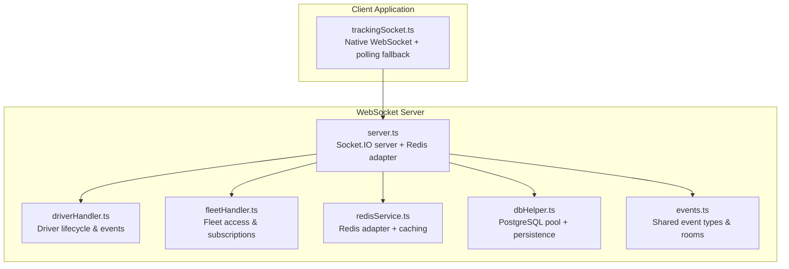
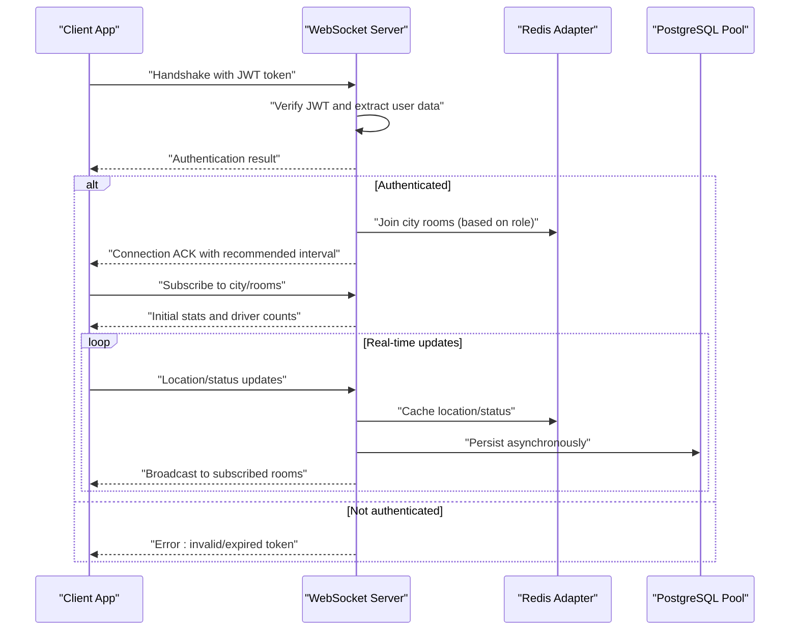
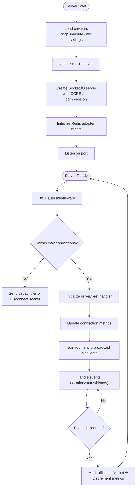
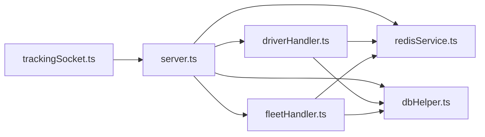

# WebSocket Connection Optimization

<cite>
**Referenced Files in This Document**
- [server.ts](file://websocket-server/src/server.ts)
- [redisService.ts](file://websocket-server/src/services/redisService.ts)
- [dbHelper.ts](file://websocket-server/src/handlers/dbHelper.ts)
- [events.ts](file://websocket-server/src/types/events.ts)
- [driverHandler.ts](file://websocket-server/src/handlers/driverHandler.ts)
- [fleetHandler.ts](file://websocket-server/src/handlers/fleetHandler.ts)
- [trackingSocket.ts](file://src/fleet/services/trackingSocket.ts)
- [realtime.spec.ts](file://e2e/system/realtime.spec.ts)
- [fleet-management-portal-design.md](file://docs/fleet-management-portal-design.md)
</cite>

## Table of Contents
1. [Introduction](#introduction)
2. [Project Structure](#project-structure)
3. [Core Components](#core-components)
4. [Architecture Overview](#architecture-overview)
5. [Detailed Component Analysis](#detailed-component-analysis)
6. [Dependency Analysis](#dependency-analysis)
7. [Performance Considerations](#performance-considerations)
8. [Troubleshooting Guide](#troubleshooting-guide)
9. [Conclusion](#conclusion)

## Introduction
This document provides comprehensive guidance for optimizing WebSocket connections in Nutrio's real-time fleet management system. It covers connection pooling strategies, transport protocol selection (WebSocket vs polling), connection lifecycle management, JWT authentication overhead reduction, connection limits enforcement, automatic disconnection handling, Redis adapter configuration for horizontal scaling, connection metrics tracking, performance monitoring, and robust reconnection strategies with graceful degradation.

## Project Structure
The WebSocket optimization spans three primary areas:
- WebSocket server with Socket.IO, Redis adapter, and JWT authentication
- Client-side tracking service with native WebSocket and polling fallback
- Shared event types and room management for scalable broadcasting

**Diagram sources**
- [server.ts:34-51](file://websocket-server/src/server.ts#L34-L51)
- [redisService.ts:63-82](file://websocket-server/src/services/redisService.ts#L63-L82)
- [dbHelper.ts:15-29](file://websocket-server/src/handlers/dbHelper.ts#L15-L29)
- [events.ts:157-187](file://websocket-server/src/types/events.ts#L157-L187)
- [driverHandler.ts:48-80](file://websocket-server/src/handlers/driverHandler.ts#L48-L80)
- [fleetHandler.ts:36-62](file://websocket-server/src/handlers/fleetHandler.ts#L36-L62)
- [trackingSocket.ts:34-53](file://src/fleet/services/trackingSocket.ts#L34-L53)

**Section sources**
- [server.ts:34-51](file://websocket-server/src/server.ts#L34-L51)
- [redisService.ts:63-82](file://websocket-server/src/services/redisService.ts#L63-L82)
- [dbHelper.ts:15-29](file://websocket-server/src/handlers/dbHelper.ts#L15-L29)
- [events.ts:157-187](file://websocket-server/src/types/events.ts#L157-L187)
- [driverHandler.ts:48-80](file://websocket-server/src/handlers/driverHandler.ts#L48-L80)
- [fleetHandler.ts:36-62](file://websocket-server/src/handlers/fleetHandler.ts#L36-L62)
- [trackingSocket.ts:34-53](file://src/fleet/services/trackingSocket.ts#L34-L53)

## Core Components
- Socket.IO server with Redis adapter for multi-node horizontal scaling
- JWT authentication middleware with role-based access
- Room-based broadcasting for city-scoped visibility
- Redis-backed caching for driver status and location
- PostgreSQL connection pooling for reliable persistence
- Client-side tracking service with exponential backoff and polling fallback

Key configuration highlights:
- Transport protocols: WebSocket and HTTP long/polling fallback
- Ping intervals and timeouts for connection health
- Per-message compression threshold
- Max message size and buffer limits
- Connection limits enforcement with graceful capacity handling

**Section sources**
- [server.ts:38-51](file://websocket-server/src/server.ts#L38-L51)
- [server.ts:65-103](file://websocket-server/src/server.ts#L65-L103)
- [server.ts:108-150](file://websocket-server/src/server.ts#L108-L150)
- [redisService.ts:14-17](file://websocket-server/src/services/redisService.ts#L14-L17)
- [redisService.ts:63-82](file://websocket-server/src/services/redisService.ts#L63-L82)
- [dbHelper.ts:15-29](file://websocket-server/src/handlers/dbHelper.ts#L15-L29)
- [events.ts:157-187](file://websocket-server/src/types/events.ts#L157-L187)

## Architecture Overview
The system uses Socket.IO with Redis adapter to enable horizontal scaling across multiple WebSocket server instances. Clients connect via WebSocket with optional polling fallback. Authentication is performed via JWT verification during the handshake. Rooms segment broadcasts by city for fleet managers, while driver-specific rooms isolate individual driver streams.

**Diagram sources**
- [server.ts:65-103](file://websocket-server/src/server.ts#L65-L103)
- [server.ts:108-150](file://websocket-server/src/server.ts#L108-L150)
- [driverHandler.ts:105-207](file://websocket-server/src/handlers/driverHandler.ts#L105-L207)
- [fleetHandler.ts:87-140](file://websocket-server/src/handlers/fleetHandler.ts#L87-L140)
- [redisService.ts:87-114](file://websocket-server/src/services/redisService.ts#L87-L114)
- [dbHelper.ts:83-125](file://websocket-server/src/handlers/dbHelper.ts#L83-L125)

## Detailed Component Analysis

### WebSocket Server Configuration and Lifecycle
- Transport selection: supports WebSocket and polling with automatic fallback
- Connection limits: enforced via a global counter and capacity threshold
- Metrics: tracks total, driver, and fleet connections
- Health endpoints: readiness probe checks Redis connectivity
- Graceful shutdown: closes HTTP server, Socket.IO server, disconnects clients, and tears down Redis and DB pools

**Diagram sources**
- [server.ts:18-51](file://websocket-server/src/server.ts#L18-L51)
- [server.ts:108-150](file://websocket-server/src/server.ts#L108-L150)
- [server.ts:162-192](file://websocket-server/src/server.ts#L162-L192)
- [server.ts:197-224](file://websocket-server/src/server.ts#L197-L224)

**Section sources**
- [server.ts:18-51](file://websocket-server/src/server.ts#L18-L51)
- [server.ts:108-150](file://websocket-server/src/server.ts#L108-L150)
- [server.ts:162-192](file://websocket-server/src/server.ts#L162-L192)
- [server.ts:197-224](file://websocket-server/src/server.ts#L197-L224)

### JWT Authentication Overhead Reduction
- Token verification occurs once during handshake; user data is attached to the socket for subsequent operations
- Role-based routing minimizes unnecessary processing for super admins versus city-limited managers
- Recommended client update interval returned to drivers reduces redundant updates

Optimization strategies:
- Keep JWT secret secure and rotate periodically
- Validate token early to fail fast
- Attach minimal user metadata to socket to avoid repeated lookups

**Section sources**
- [server.ts:65-103](file://websocket-server/src/server.ts#L65-L103)
- [driverHandler.ts:48-80](file://websocket-server/src/handlers/driverHandler.ts#L48-L80)

### Connection Limits Enforcement and Automatic Disconnection
- Global connection counter prevents exceeding WS_MAX_CONNECTIONS
- On capacity breach, server emits an error and disconnects the socket gracefully
- Disconnect handlers update metrics and mark driver offline in Redis/DB

Operational guidance:
- Monitor /health endpoint for connection counts
- Scale out horizontally when approaching limits
- Use readiness probe (/ready) to gate traffic during Redis unavailability

**Section sources**
- [server.ts:108-150](file://websocket-server/src/server.ts#L108-L150)
- [server.ts:162-192](file://websocket-server/src/server.ts#L162-L192)
- [driverHandler.ts:280-317](file://websocket-server/src/handlers/driverHandler.ts#L280-L317)

### Redis Adapter Configuration for Horizontal Scaling
- Separate Redis clients for pub/sub to decouple publishing from subscribing
- Cluster mode support for high availability and throughput
- TTL-based caching for location and status to reduce DB load
- City-level stats and online driver enumeration for efficient broadcasting

Scaling tips:
- Use sticky sessions at the load balancer to maintain session affinity
- Leverage Redis Pub/Sub for cross-instance message propagation
- Monitor Redis latency and memory usage under load

**Section sources**
- [redisService.ts:63-82](file://websocket-server/src/services/redisService.ts#L63-L82)
- [redisService.ts:26-42](file://websocket-server/src/services/redisService.ts#L26-L42)
- [redisService.ts:87-114](file://websocket-server/src/services/redisService.ts#L87-L114)
- [redisService.ts:165-187](file://websocket-server/src/services/redisService.ts#L165-L187)
- [fleet-management-portal-design.md:2542-2558](file://docs/fleet-management-portal-design.md#L2542-L2558)

### Connection Metrics Tracking and Performance Monitoring
- Total, driver, and fleet connection counters updated on connect/disconnect
- Health endpoint exposes current connection counts and environment
- Readiness probe validates Redis connectivity before traffic admission
- Consider adding metrics for ping intervals, message sizes, and error rates

Monitoring recommendations:
- Track connection growth trends and correlate with scaling events
- Alert on sustained high ping timeouts or frequent reconnections
- Monitor Redis cluster health and replication lag

**Section sources**
- [server.ts:57-61](file://websocket-server/src/server.ts#L57-L61)
- [server.ts:162-192](file://websocket-server/src/server.ts#L162-L192)
- [server.ts:197-224](file://websocket-server/src/server.ts#L197-L224)

### Client-Side Connection Optimization
- Native WebSocket with token passed as query parameter
- Exponential backoff reconnection with capped attempts
- Message queueing during reconnection to prevent data loss
- Polling fallback when WebSocket fails, ensuring continuous operation
- Role-aware city subscriptions for targeted updates

Client optimization examples:
- Establish connection on app startup and reuse across views
- Debounce location updates to respect recommended intervals
- Implement local caching of recent driver positions to reduce server load
- Gracefully degrade to polling if WebSocket remains unstable

**Section sources**
- [trackingSocket.ts:34-53](file://src/fleet/services/trackingSocket.ts#L34-L53)
- [trackingSocket.ts:55-95](file://src/fleet/services/trackingSocket.ts#L55-L95)
- [trackingSocket.ts:162-178](file://src/fleet/services/trackingSocket.ts#L162-L178)
- [trackingSocket.ts:180-198](file://src/fleet/services/trackingSocket.ts#L180-L198)
- [trackingSocket.ts:228-269](file://src/fleet/services/trackingSocket.ts#L228-L269)

### Connection Failure Recovery and Graceful Degradation
- Server-side: capacity-based rejection, graceful shutdown, and Redis/DB cleanup
- Client-side: exponential backoff, message queuing, and polling fallback
- Fleet managers receive degraded updates when drivers go offline due to missed updates

Recovery patterns:
- On disconnect, client schedules reconnection with exponential backoff
- Polling fallback ensures periodic location updates when WebSocket is unavailable
- Graceful degradation allows continued monitoring with eventual consistency

**Section sources**
- [server.ts:108-150](file://websocket-server/src/server.ts#L108-L150)
- [server.ts:197-224](file://websocket-server/src/server.ts#L197-L224)
- [trackingSocket.ts:76-85](file://src/fleet/services/trackingSocket.ts#L76-L85)
- [trackingSocket.ts:162-178](file://src/fleet/services/trackingSocket.ts#L162-L178)
- [trackingSocket.ts:173-178](file://src/fleet/services/trackingSocket.ts#L173-L178)

## Dependency Analysis
The WebSocket server orchestrates multiple subsystems with clear boundaries:
- server.ts depends on Redis adapter clients, database pool, and handler modules
- Handlers rely on Redis caching and DB persistence for state management
- Client service depends on server endpoints and event schemas

**Diagram sources**
- [server.ts:11-16](file://websocket-server/src/server.ts#L11-L16)
- [driverHandler.ts:16-21](file://websocket-server/src/handlers/driverHandler.ts#L16-L21)
- [fleetHandler.ts:14-17](file://websocket-server/src/handlers/fleetHandler.ts#L14-L17)
- [redisService.ts:63-82](file://websocket-server/src/services/redisService.ts#L63-L82)
- [dbHelper.ts:15-29](file://websocket-server/src/handlers/dbHelper.ts#L15-L29)
- [trackingSocket.ts:34-53](file://src/fleet/services/trackingSocket.ts#L34-L53)

**Section sources**
- [server.ts:11-16](file://websocket-server/src/server.ts#L11-L16)
- [driverHandler.ts:16-21](file://websocket-server/src/handlers/driverHandler.ts#L16-L21)
- [fleetHandler.ts:14-17](file://websocket-server/src/handlers/fleetHandler.ts#L14-L17)
- [redisService.ts:63-82](file://websocket-server/src/services/redisService.ts#L63-L82)
- [dbHelper.ts:15-29](file://websocket-server/src/handlers/dbHelper.ts#L15-L29)
- [trackingSocket.ts:34-53](file://src/fleet/services/trackingSocket.ts#L34-L53)

## Performance Considerations
- Transport optimization: prefer WebSocket; enable polling fallback for unreliable networks
- Compression: leverage perMessageDeflate threshold to compress larger messages
- Buffer sizing: cap message sizes to balance responsiveness and bandwidth
- Authentication: minimize token verification cost by verifying only once per connection
- Caching: use Redis TTL for location/status to reduce DB pressure
- Persistence: persist asynchronously to avoid blocking real-time updates
- Scaling: use sticky sessions and Redis Pub/Sub for multi-instance deployments

[No sources needed since this section provides general guidance]

## Troubleshooting Guide
Common issues and resolutions:
- Authentication failures: verify JWT secret and token validity; check error codes emitted during handshake
- Capacity exceeded: monitor /health endpoint; scale out or increase WS_MAX_CONNECTIONS
- Redis connectivity: use /ready endpoint to validate; inspect Redis logs for reconnection events
- Frequent reconnections: review client-side exponential backoff; investigate network instability
- Missing updates: confirm city subscriptions; ensure client flushes queued messages after reconnect

**Section sources**
- [server.ts:65-103](file://websocket-server/src/server.ts#L65-L103)
- [server.ts:108-150](file://websocket-server/src/server.ts#L108-L150)
- [server.ts:162-192](file://websocket-server/src/server.ts#L162-L192)
- [trackingSocket.ts:162-178](file://src/fleet/services/trackingSocket.ts#L162-L178)

## Conclusion
Nutrio's WebSocket infrastructure combines Socket.IO with Redis for scalable, real-time fleet tracking. By enforcing connection limits, optimizing transport protocols, minimizing JWT overhead, leveraging caching, and implementing robust reconnection strategies, the system achieves high reliability and performance. The documented patterns enable horizontal scaling, graceful degradation, and effective monitoring to support growing operational demands.