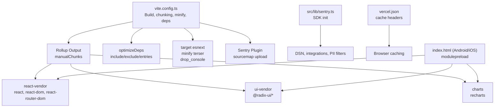
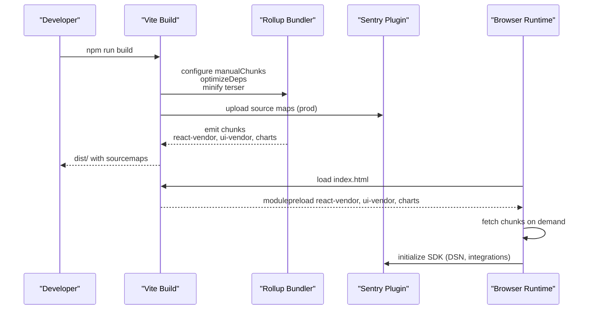
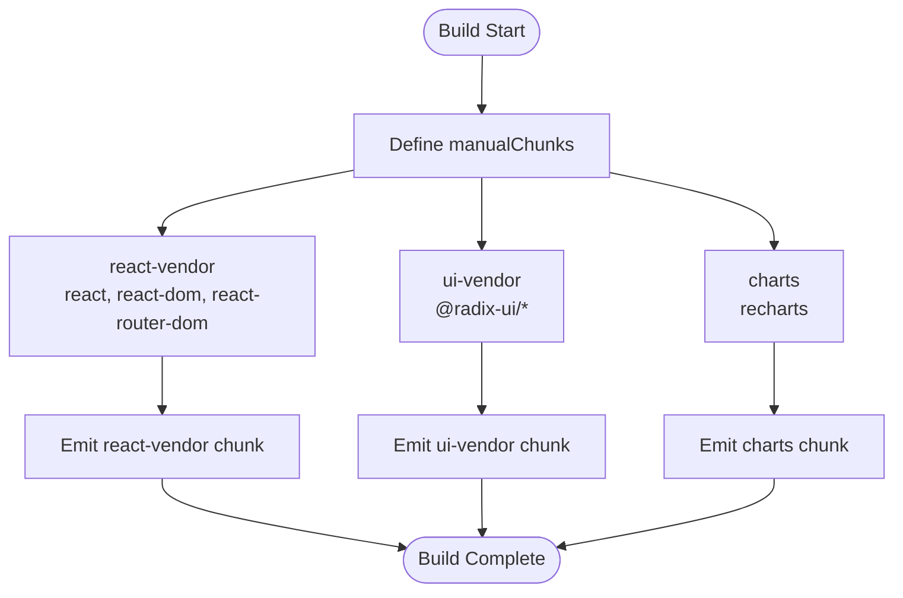
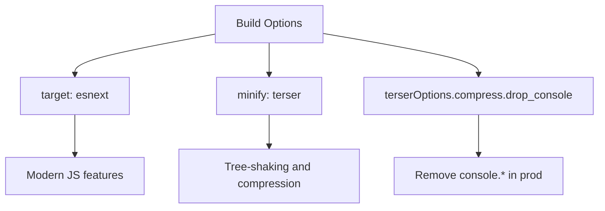
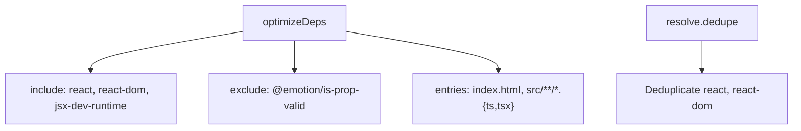
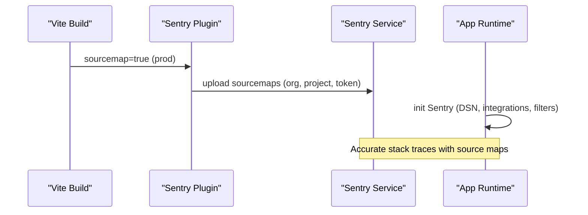
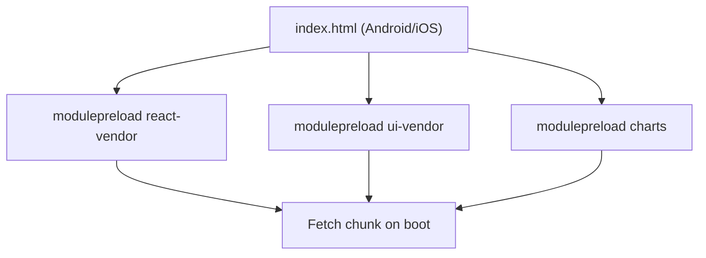
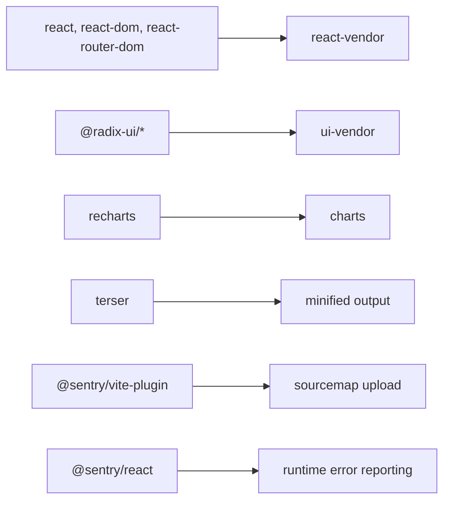

# Bundle Optimization

<cite>
**Referenced Files in This Document**
- [vite.config.ts](file://vite.config.ts)
- [package.json](file://package.json)
- [sentry.ts](file://src/lib/sentry.ts)
- [vercel.json](file://vercel.json)
- [index.html (Android)](file://android/app/src/main/assets/public/index.html)
- [index.html (iOS)](file://ios/App/App/public/index.html)
- [DEPLOYMENT.md](file://DEPLOYMENT.md)
</cite>

## Table of Contents
1. [Introduction](#introduction)
2. [Project Structure](#project-structure)
3. [Core Components](#core-components)
4. [Architecture Overview](#architecture-overview)
5. [Detailed Component Analysis](#detailed-component-analysis)
6. [Dependency Analysis](#dependency-analysis)
7. [Performance Considerations](#performance-considerations)
8. [Troubleshooting Guide](#troubleshooting-guide)
9. [Conclusion](#conclusion)
10. [Appendices](#appendices)

## Introduction
This document explains how Nutrio’s web application optimizes bundles using Vite. It covers chunk splitting strategies, target browser selection, minification and Terser configuration, source map generation for Sentry, console removal in production, dependency optimization, and practical approaches to analyze bundle size. It also provides guidance for maintaining optimal bundle sizes across environments.

## Project Structure
The build and optimization pipeline centers around Vite’s configuration, with supporting runtime initialization for Sentry and platform-specific asset loading. The repository includes:
- Vite configuration for bundling, chunking, and minification
- Package scripts for building and previewing
- Sentry SDK initialization for error reporting and replay
- Platform-specific HTML entry points that preload optimized chunks
- Deployment guidance and environment variables

**Diagram sources**
- [vite.config.ts:54-77](file://vite.config.ts#L54-L77)
- [vite.config.ts:47-52](file://vite.config.ts#L47-L52)
- [vite.config.ts:34-39](file://vite.config.ts#L34-L39)
- [sentry.ts:9-36](file://src/lib/sentry.ts#L9-L36)
- [vercel.json:9-36](file://vercel.json#L9-L36)
- [index.html (Android):31-34](file://android/app/src/main/assets/public/index.html#L31-L34)
- [index.html (iOS):31-34](file://ios/App/App/public/index.html#L31-L34)

**Section sources**
- [vite.config.ts:1-79](file://vite.config.ts#L1-L79)
- [package.json:7-43](file://package.json#L7-L43)
- [sentry.ts:1-73](file://src/lib/sentry.ts#L1-L73)
- [vercel.json:1-38](file://vercel.json#L1-L38)
- [index.html (Android):26-41](file://android/app/src/main/assets/public/index.html#L26-L41)
- [index.html (iOS):26-41](file://ios/App/App/public/index.html#L26-L41)

## Core Components
- Vite configuration defines chunk splitting, dependency optimization, minification, and source maps.
- Sentry plugin uploads source maps during production builds for accurate stack traces.
- Sentry SDK initializes in the app with privacy filters and sampling controls.
- Platform entry points preload vendor chunks to improve first load performance.
- Deployment and caching headers improve long-term caching and security.

**Section sources**
- [vite.config.ts:54-77](file://vite.config.ts#L54-L77)
- [vite.config.ts:47-52](file://vite.config.ts#L47-L52)
- [vite.config.ts:34-39](file://vite.config.ts#L34-L39)
- [sentry.ts:9-36](file://src/lib/sentry.ts#L9-L36)
- [vercel.json:9-36](file://vercel.json#L9-L36)
- [index.html (Android):31-34](file://android/app/src/main/assets/public/index.html#L31-L34)
- [index.html (iOS):31-34](file://ios/App/App/public/index.html#L31-L34)

## Architecture Overview
The build pipeline integrates Vite, Rollup, and Sentry to produce optimized bundles with reliable error reporting.

**Diagram sources**
- [vite.config.ts:54-77](file://vite.config.ts#L54-L77)
- [vite.config.ts:34-39](file://vite.config.ts#L34-L39)
- [sentry.ts:9-36](file://src/lib/sentry.ts#L9-L36)
- [index.html (Android):31-34](file://android/app/src/main/assets/public/index.html#L31-L34)
- [index.html (iOS):31-34](file://ios/App/App/public/index.html#L31-L34)

## Detailed Component Analysis

### Vite Chunk Splitting Strategy
Manual chunk groups are defined to separate frequently shared dependencies:
- react-vendor: react, react-dom, react-router-dom
- ui-vendor: @radix-ui/* packages
- charts: recharts

These groups are designed to maximize cache hits across navigations and reduce duplicated code.

**Diagram sources**
- [vite.config.ts:68-76](file://vite.config.ts#L68-L76)

**Section sources**
- [vite.config.ts:68-76](file://vite.config.ts#L68-L76)

### Target Browser Optimization and Minification
- Target: ESNext enables modern JavaScript features for smaller and faster bundles on capable browsers.
- Minifier: Terser reduces bundle size and improves runtime performance.
- Console removal: drop_console is enabled in production to remove console statements.

**Diagram sources**
- [vite.config.ts:56-66](file://vite.config.ts#L56-L66)

**Section sources**
- [vite.config.ts:56-66](file://vite.config.ts#L56-L66)

### Dependency Optimization
- optimizeDeps.include: Ensures react, react-dom, and jsx-dev-runtime are pre-bundled and resolved early.
- optimizeDeps.exclude: Excludes problematic packages (e.g., @emotion/is-prop-valid) from optimization.
- optimizeDeps.entries: Scans index.html and src/**/*.{ts,tsx} to discover dynamic imports and pre-bundle dependencies accordingly.
- resolve.dedupe: Deduplicates react and react-dom to avoid multiple instances.

**Diagram sources**
- [vite.config.ts:47-52](file://vite.config.ts#L47-L52)
- [vite.config.ts:41-46](file://vite.config.ts#L41-L46)

**Section sources**
- [vite.config.ts:47-52](file://vite.config.ts#L47-L52)
- [vite.config.ts:41-46](file://vite.config.ts#L41-L46)

### Source Map Generation for Sentry Integration
- sourcemap: true generates source maps for error tracking.
- Sentry plugin: Uploads source maps to Sentry during production builds using environment variables for org, project, and auth token.
- Sentry SDK: Initializes in the app with DSN, browser tracing, session replay, and PII filtering.

**Diagram sources**
- [vite.config.ts:58-59](file://vite.config.ts#L58-L59)
- [vite.config.ts:34-39](file://vite.config.ts#L34-L39)
- [sentry.ts:9-36](file://src/lib/sentry.ts#L9-L36)

**Section sources**
- [vite.config.ts:58-59](file://vite.config.ts#L58-L59)
- [vite.config.ts:34-39](file://vite.config.ts#L34-L39)
- [sentry.ts:9-36](file://src/lib/sentry.ts#L9-L36)

### Practical Examples: Analyzing Bundle Size
- Vite built-in analyzer: Use the official Vite analyzer plugin to visualize bundle composition and identify oversized modules.
- webpack-bundle-analyzer: Alternative analyzer compatible with Vite’s Rollup pipeline; useful for deeper insight into chunk sizes and dependencies.

Guidance:
- Add the analyzer plugin to your Vite configuration locally to inspect chunk sizes.
- Compare before/after after applying chunk splits or removing unused dependencies.
- Focus on reducing duplication across react-vendor, ui-vendor, and charts chunks.

[No sources needed since this section provides general guidance]

### Platform-Specific Preloading
Platform entry points preload vendor chunks to improve first load performance:
- Android and iOS entry HTML files include modulepreload links for react-vendor, ui-vendor, and charts.

**Diagram sources**
- [index.html (Android):31-34](file://android/app/src/main/assets/public/index.html#L31-L34)
- [index.html (iOS):31-34](file://ios/App/App/public/index.html#L31-L34)

**Section sources**
- [index.html (Android):26-41](file://android/app/src/main/assets/public/index.html#L26-L41)
- [index.html (iOS):26-41](file://ios/App/App/public/index.html#L26-L41)

## Dependency Analysis
Key external dependencies and their roles in bundle optimization:
- react, react-dom, react-router-dom: grouped into react-vendor
- @radix-ui/*: grouped into ui-vendor
- recharts: grouped into charts
- terser: minification and compression
- @sentry/vite-plugin: source map upload
- @sentry/react: runtime error reporting and replay

**Diagram sources**
- [package.json:113-126](file://package.json#L113-L126)
- [package.json:152](file://package.json#L152)
- [package.json:91-92](file://package.json#L91-L92)

**Section sources**
- [package.json:113-126](file://package.json#L113-L126)
- [package.json:152](file://package.json#L152)
- [package.json:91-92](file://package.json#L91-L92)

## Performance Considerations
- Modern target (ESNext) reduces bundle size and improves runtime performance on capable browsers.
- Manual chunking increases long-term caching effectiveness by isolating stable vendor code.
- Minification and drop_console reduce payload size and remove noisy logs in production.
- Preloading vendor chunks decreases time-to-interactive on mobile platforms.
- Long-lived cache headers for assets improve repeat visits; ensure cache-busting via filenames.

[No sources needed since this section provides general guidance]

## Troubleshooting Guide
- Missing or broken source maps in production:
  - Verify Sentry plugin configuration and environment variables (org, project, auth token).
  - Confirm sourcemap generation is enabled in production builds.
- Sentry errors without source maps:
  - Ensure uploaded releases match deployed versions and filenames.
  - Check that modulepreload does not block chunk fetching.
- Unexpected large chunks:
  - Inspect manual chunk boundaries and consider splitting large dependencies further.
  - Remove unused features and lazy-load heavy modules.
- Mobile performance regressions:
  - Validate that optimizeDeps entries cover dynamic imports.
  - Confirm dedupe resolves duplicate React instances.

**Section sources**
- [vite.config.ts:34-39](file://vite.config.ts#L34-L39)
- [vite.config.ts:58-59](file://vite.config.ts#L58-L59)
- [index.html (Android):31-34](file://android/app/src/main/assets/public/index.html#L31-L34)
- [index.html (iOS):31-34](file://ios/App/App/public/index.html#L31-L34)

## Conclusion
Nutrio’s Vite configuration implements targeted chunk splitting, modern JavaScript targeting, and robust minification with Terser. Combined with Sentry-powered source maps and platform-specific preloading, the build pipeline achieves fast, maintainable, and observable bundles. Use the analyzer tools to monitor bundle composition and iterate on chunk boundaries and dependency choices across environments.

[No sources needed since this section summarizes without analyzing specific files]

## Appendices

### Environment Variables for Production
- VITE_SUPABASE_URL, VITE_SUPABASE_ANON_KEY, VITE_POSTHOG_KEY, VITE_SENTRY_DSN, RESEND_API_KEY

**Section sources**
- [DEPLOYMENT.md:71-78](file://DEPLOYMENT.md#L71-L78)

### Vercel Caching Headers
- Assets under /assets/ receive immutable cache policies to maximize long-term caching.

**Section sources**
- [vercel.json:10-18](file://vercel.json#L10-L18)