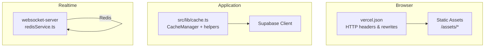
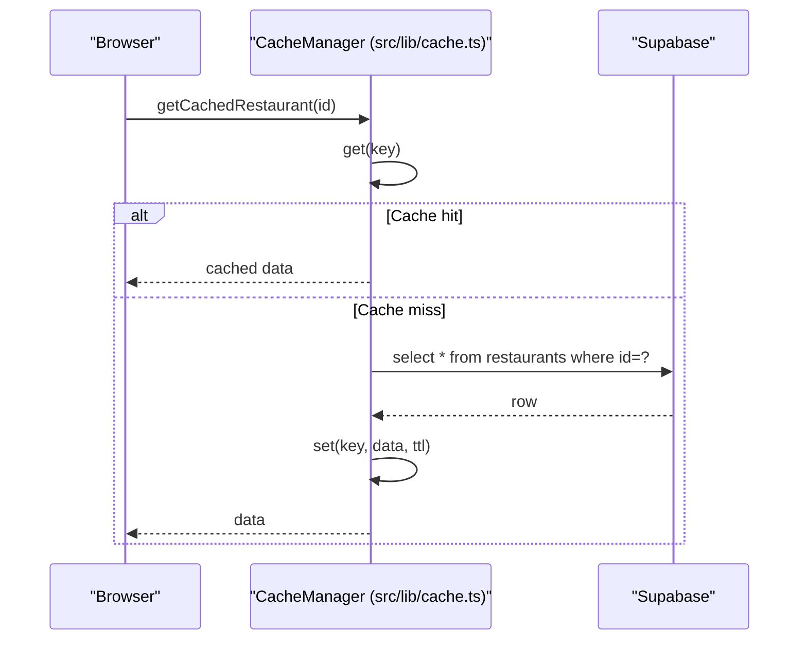
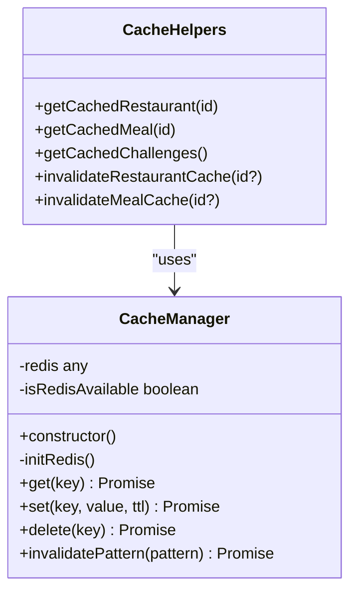
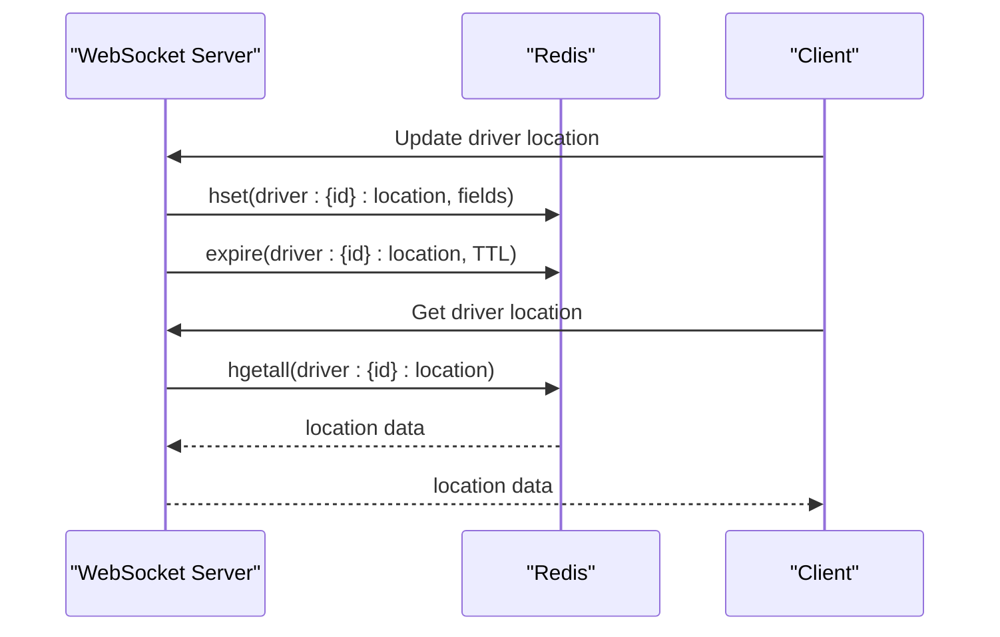
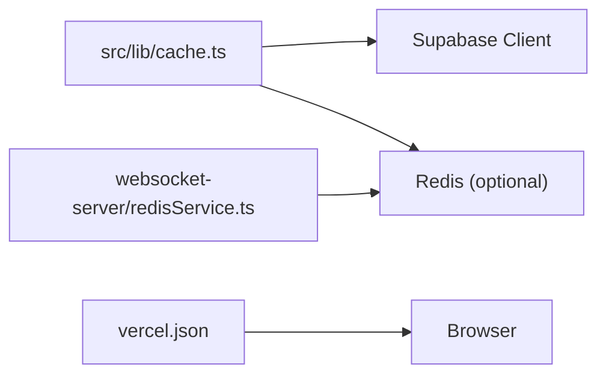

# Caching Strategies

<cite>
**Referenced Files in This Document**
- [cache.ts](file://src/lib/cache.ts)
- [vercel.json](file://vercel.json)
- [redisService.ts](file://websocket-server/src/services/redisService.ts)
- [fleet-management-portal-design.md](file://docs/fleet-management-portal-design.md)
- [SessionTimeoutManager.tsx](file://src/components/SessionTimeoutManager.tsx)
</cite>

## Table of Contents
1. [Introduction](#introduction)
2. [Project Structure](#project-structure)
3. [Core Components](#core-components)
4. [Architecture Overview](#architecture-overview)
5. [Detailed Component Analysis](#detailed-component-analysis)
6. [Dependency Analysis](#dependency-analysis)
7. [Performance Considerations](#performance-considerations)
8. [Troubleshooting Guide](#troubleshooting-guide)
9. [Conclusion](#conclusion)

## Introduction
This document explains the caching strategies implemented in Nutrio’s web application. It covers:
- Browser caching via HTTP headers and asset immutability
- Application-level caching with Redis-compatible abstraction and in-memory fallback
- Cache invalidation patterns for dynamic data such as menus and user preferences
- Practical patterns for API responses, session data, and configuration
- Debugging and monitoring approaches to maintain high cache hit rates

## Project Structure
The caching implementation spans three primary areas:
- Browser-level caching configuration for static assets
- Application-level caching abstraction for database-heavy reads
- Real-time caching for streaming services (WebSocket server)

**Diagram sources**
- [vercel.json:1-37](file://vercel.json#L1-L37)
- [cache.ts:1-199](file://src/lib/cache.ts#L1-L199)
- [redisService.ts:83-140](file://websocket-server/src/services/redisService.ts#L83-L140)

**Section sources**
- [vercel.json:1-37](file://vercel.json#L1-L37)
- [cache.ts:1-199](file://src/lib/cache.ts#L1-L199)
- [redisService.ts:83-140](file://websocket-server/src/services/redisService.ts#L83-L140)

## Core Components
- CacheManager: Provides a unified interface for getting, setting, deleting, and pattern-based invalidation of cached entries. It supports a Redis-compatible backend with an in-memory fallback.
- Cache helpers: Functions that encapsulate cache-aware reads for restaurants, meals, and challenges, with explicit TTLs.
- Browser cache policy: Vercel configuration sets long-lived immutable caching for assets and universal security headers.

Key capabilities:
- TTL-based caching with automatic expiration
- Pattern-based invalidation for bulk cache updates
- Graceful degradation when Redis is unavailable
- Predictable cache keys for consistent invalidation

**Section sources**
- [cache.ts:16-107](file://src/lib/cache.ts#L16-L107)
- [cache.ts:111-195](file://src/lib/cache.ts#L111-L195)
- [vercel.json:9-37](file://vercel.json#L9-L37)

## Architecture Overview
The caching architecture combines browser-level immutability, application-level cache abstraction, and real-time cache primitives.

**Diagram sources**
- [cache.ts:124-142](file://src/lib/cache.ts#L124-L142)

## Detailed Component Analysis

### Browser Caching (HTTP Headers and Asset Immutability)
- Static assets under /assets receive long-lived caching with immutable semantics, minimizing network requests and leveraging CDN effectiveness.
- Universal security headers are applied to all routes to harden the application against common threats.

Practical impact:
- First-load performance improves significantly for repeat visits.
- CDN offloads bandwidth and latency for static resources.

**Section sources**
- [vercel.json:11-17](file://vercel.json#L11-L17)
- [vercel.json:20-35](file://vercel.json#L20-L35)

### Application-Level Caching Abstraction
The CacheManager offers:
- get(key): Returns cached data if present and not expired; otherwise returns null
- set(key, value, ttl): Stores serialized data with TTL; falls back to in-memory cache when Redis is unavailable
- delete(key): Removes a single key
- invalidatePattern(pattern): Deletes keys matching a pattern across Redis and in-memory cache

Cache-aware helpers:
- getCachedRestaurant(id): Reads/writes restaurant data with ~10-minute TTL
- getCachedMeal(id): Reads/writes meal data with ~10-minute TTL
- getCachedChallenges(): Reads/writes active challenges with ~5-minute TTL
- invalidateRestaurantCache(id?): Deletes a specific restaurant key or all restaurant keys
- invalidateMealCache(id?): Deletes a specific meal and reviews keys or all meal keys

**Diagram sources**
- [cache.ts:16-107](file://src/lib/cache.ts#L16-L107)
- [cache.ts:124-195](file://src/lib/cache.ts#L124-L195)

**Section sources**
- [cache.ts:16-107](file://src/lib/cache.ts#L16-L107)
- [cache.ts:124-195](file://src/lib/cache.ts#L124-L195)

### Real-Time Caching (WebSocket Server)
The WebSocket server implements Redis-backed caching for driver location and status with explicit TTLs and batch operations. This demonstrates:
- Structured key naming conventions
- Hash-based storage for structured data
- TTL enforcement and batch retrieval

**Diagram sources**
- [redisService.ts:83-140](file://websocket-server/src/services/redisService.ts#L83-L140)

**Section sources**
- [redisService.ts:83-140](file://websocket-server/src/services/redisService.ts#L83-L140)
- [fleet-management-portal-design.md:2389-2509](file://docs/fleet-management-portal-design.md#L2389-L2509)

### Cache Invalidation Patterns
- Specific invalidation: Delete a single key when data changes (e.g., restaurant/meal updates)
- Pattern-based invalidation: Delete all keys matching a pattern (e.g., all restaurants or meals)
- TTL-based invalidation: Automatic expiry after a configured time window

These patterns ensure correctness for dynamic data while maintaining performance.

**Section sources**
- [cache.ts:77-106](file://src/lib/cache.ts#L77-L106)
- [cache.ts:179-195](file://src/lib/cache.ts#L179-L195)

### Cache Keys and TTL Strategy
- Restaurant: short TTL (~10 minutes)
- Meal: short TTL (~10 minutes)
- Challenges: medium TTL (~5 minutes)
- Leaderboard: depends on challenge lifecycle
- Real-time driver location/status: short TTL (e.g., minutes)

These TTLs balance freshness and performance for different data categories.

**Section sources**
- [cache.ts:112-121](file://src/lib/cache.ts#L112-L121)
- [cache.ts:124-177](file://src/lib/cache.ts#L124-L177)
- [fleet-management-portal-design.md:2440-2448](file://docs/fleet-management-portal-design.md#L2440-L2448)

## Dependency Analysis
- CacheManager depends on Supabase for cache misses and on Redis (when available) for persistence.
- Cache helpers depend on CacheManager and Supabase.
- Vercel configuration governs browser caching behavior for static assets.
- WebSocket server depends on Redis for real-time cache primitives.

**Diagram sources**
- [cache.ts:6-6](file://src/lib/cache.ts#L6-L6)
- [vercel.json:1-37](file://vercel.json#L1-L37)
- [redisService.ts:83-140](file://websocket-server/src/services/redisService.ts#L83-L140)

**Section sources**
- [cache.ts:6-6](file://src/lib/cache.ts#L6-L6)
- [vercel.json:1-37](file://vercel.json#L1-L37)
- [redisService.ts:83-140](file://websocket-server/src/services/redisService.ts#L83-L140)

## Performance Considerations
- Prefer cache-first reads for frequently accessed data (restaurants, meals, challenges) to reduce database load.
- Use stale-while-revalidate for high-value data: serve cached content immediately and refresh in the background to keep subsequent requests fresh.
- Apply cache expiration judiciously: shorter TTLs for rapidly changing data, longer TTLs for stable configuration.
- Monitor cache hit rates and adjust TTLs and invalidation patterns based on observed usage.

[No sources needed since this section provides general guidance]

## Troubleshooting Guide
Common issues and remedies:
- Cache not warming: Verify cache helpers are invoked for reads and that TTLs are set appropriately.
- Stale data after edits: Ensure invalidate helpers are called after mutations (e.g., restaurant/meal updates).
- Redis unavailability: Confirm fallback to in-memory cache is functioning; monitor logs for Redis connection errors.
- Browser cache not updating assets: Check Vercel headers for /assets/* immutability and ensure cache-busting filenames are used.

Operational tips:
- Use invalidate helpers to target specific records or broad patterns.
- For real-time data, rely on TTL-based invalidation and event-driven updates in the WebSocket server.

**Section sources**
- [cache.ts:179-195](file://src/lib/cache.ts#L179-L195)
- [cache.ts:37-56](file://src/lib/cache.ts#L37-L56)
- [vercel.json:11-17](file://vercel.json#L11-L17)
- [redisService.ts:83-140](file://websocket-server/src/services/redisService.ts#L83-L140)

## Conclusion
Nutrio’s caching strategy blends browser-level immutability, application-level cache abstraction with Redis compatibility, and real-time cache primitives. By combining cache-first reads, stale-while-revalidate patterns, and targeted invalidation, the system achieves strong performance and correctness. Monitoring cache hit rates and tuning TTLs will further optimize user experience across varied usage scenarios.