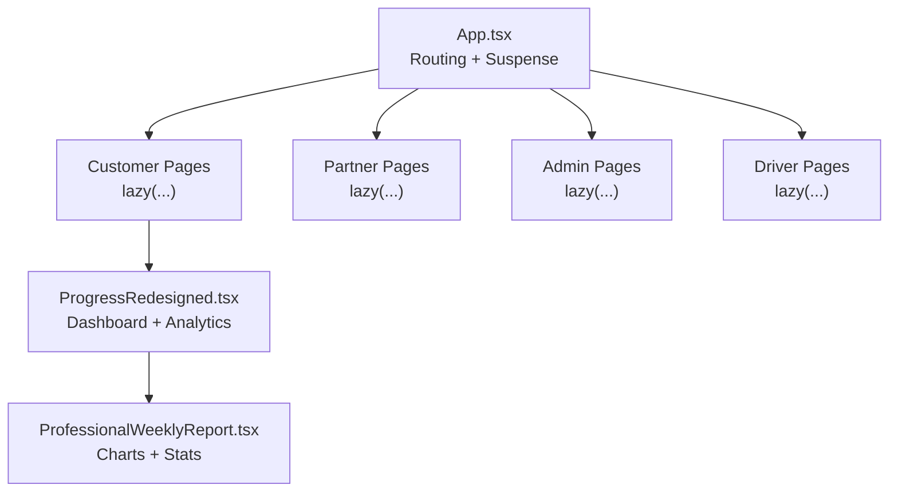
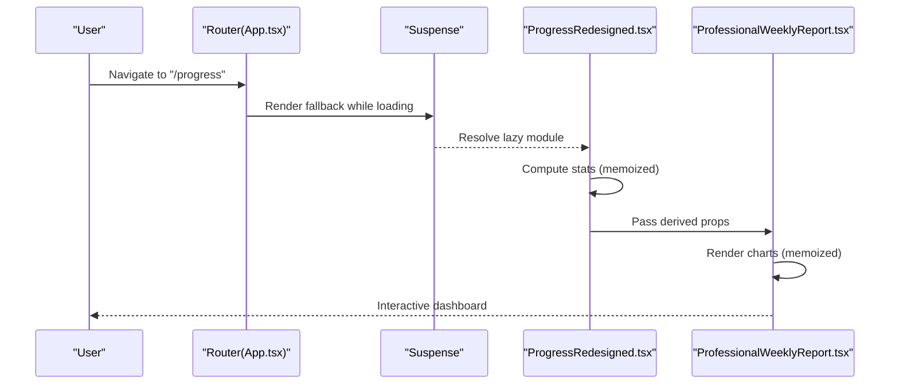
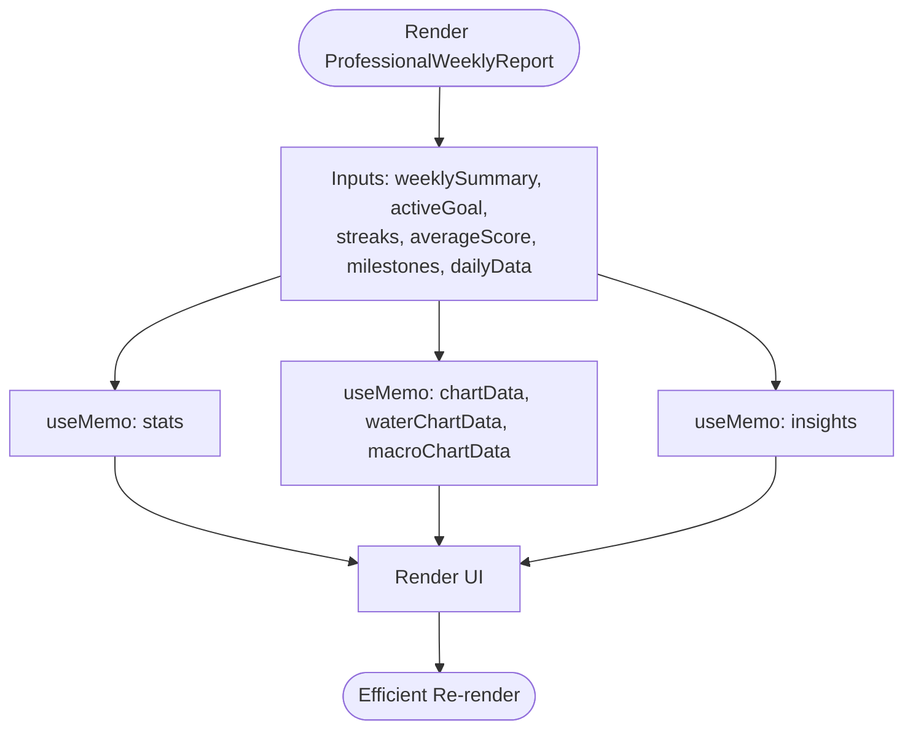
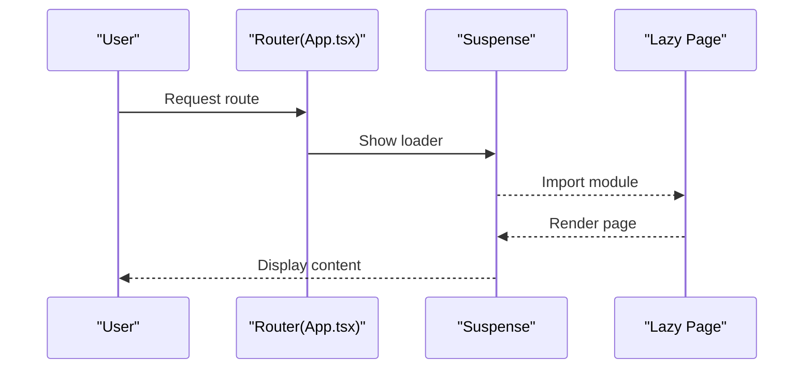
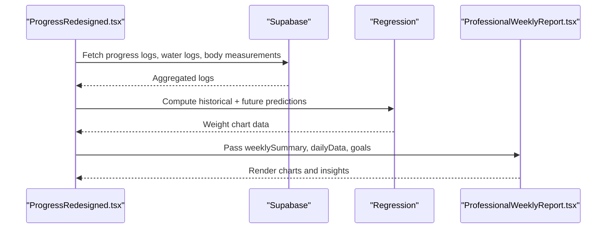
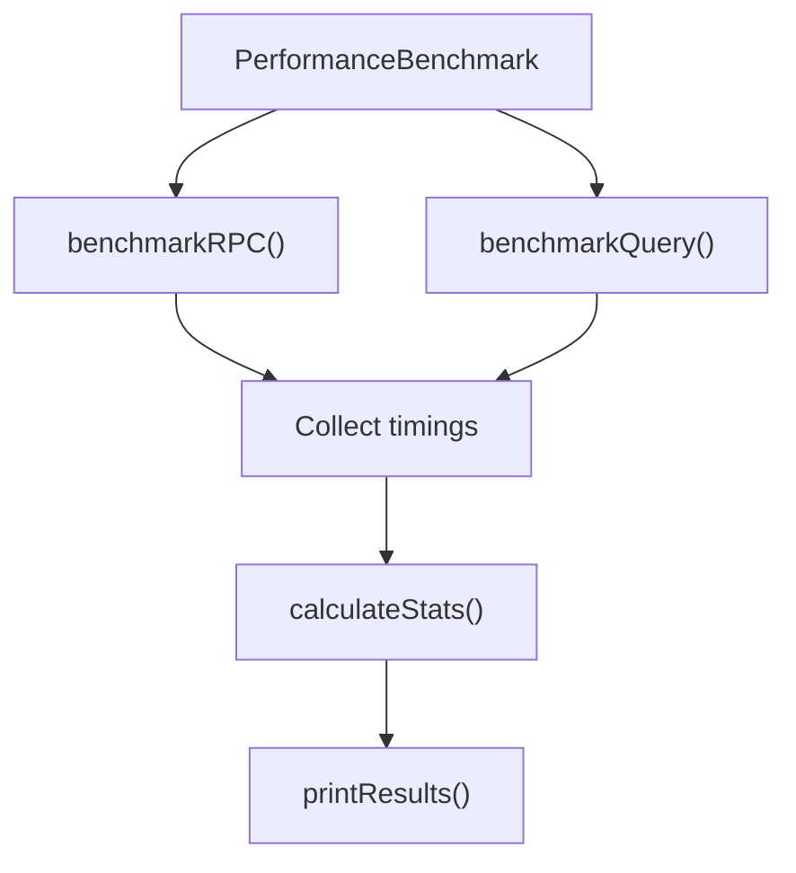
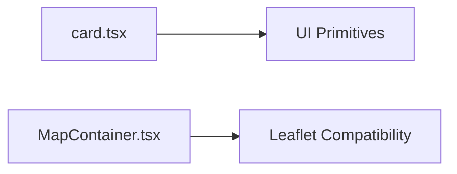

# Component Performance

<cite>
**Referenced Files in This Document**
- [App.tsx](file://src/App.tsx)
- [ProfessionalWeeklyReport.tsx](file://src/components/progress/ProfessionalWeeklyReport.tsx)
- [ProgressRedesigned.tsx](file://src/pages/ProgressRedesigned.tsx)
- [performance-benchmark.ts](file://scripts/performance-benchmark.ts)
- [card.tsx](file://src/components/ui/card.tsx)
- [MapContainer.tsx](file://src/components/maps/MapContainer.tsx)
- [performance.spec.ts](file://e2e/system/performance.spec.ts)
</cite>

## Table of Contents
1. [Introduction](#introduction)
2. [Project Structure](#project-structure)
3. [Core Components](#core-components)
4. [Architecture Overview](#architecture-overview)
5. [Detailed Component Analysis](#detailed-component-analysis)
6. [Dependency Analysis](#dependency-analysis)
7. [Performance Considerations](#performance-considerations)
8. [Troubleshooting Guide](#troubleshooting-guide)
9. [Conclusion](#conclusion)

## Introduction
This document focuses on component performance optimization in Nutrio’s React application. It covers React.memo patterns, useMemo and useCallback usage, virtualization techniques, lazy loading and code splitting, performance monitoring, and best practices for data-intensive components such as progress dashboards and analytics displays.

## Project Structure
The application uses route-based code splitting with React.lazy and Suspense to defer loading of non-critical pages. This reduces initial bundle size and improves first paint performance.

**Diagram sources**
- [App.tsx:16-124](file://src/App.tsx#L16-L124)
- [App.tsx:21-117](file://src/App.tsx#L21-L117)
- [ProgressRedesigned.tsx:64-732](file://src/pages/ProgressRedesigned.tsx#L64-L732)
- [ProfessionalWeeklyReport.tsx:74-88](file://src/components/progress/ProfessionalWeeklyReport.tsx#L74-L88)

**Section sources**
- [App.tsx:16-124](file://src/App.tsx#L16-L124)
- [App.tsx:21-117](file://src/App.tsx#L21-L117)

## Core Components
- Route-based lazy loading with Suspense fallback ensures fast initial load and smooth navigation.
- Data-heavy dashboard components compute derived stats and charts using memoized computations to avoid redundant work.
- UI primitives are optimized with minimal re-renders and efficient class composition.

**Section sources**
- [App.tsx:139-150](file://src/App.tsx#L139-L150)
- [ProfessionalWeeklyReport.tsx:96-154](file://src/components/progress/ProfessionalWeeklyReport.tsx#L96-L154)
- [card.tsx:27-35](file://src/components/ui/card.tsx#L27-L35)

## Architecture Overview
The routing layer defers heavy pages until needed. Dashboard pages orchestrate data fetching and derive statistics, while reusable components encapsulate rendering logic and memoization.

**Diagram sources**
- [App.tsx:149-150](file://src/App.tsx#L149-L150)
- [App.tsx:37-37](file://src/App.tsx#L37-L37)
- [ProgressRedesigned.tsx:64-732](file://src/pages/ProgressRedesigned.tsx#L64-L732)
- [ProfessionalWeeklyReport.tsx:74-88](file://src/components/progress/ProfessionalWeeklyReport.tsx#L74-L88)

## Detailed Component Analysis

### Memoization Patterns in Analytics Components
- The weekly report component computes derived stats and chart data via useMemo. This prevents recalculations when upstream inputs are unchanged.
- Recommendations and insights are computed once per stats change, reducing repeated work during renders.

**Diagram sources**
- [ProfessionalWeeklyReport.tsx:96-154](file://src/components/progress/ProfessionalWeeklyReport.tsx#L96-L154)
- [ProfessionalWeeklyReport.tsx:156-179](file://src/components/progress/ProfessionalWeeklyReport.tsx#L156-L179)
- [ProfessionalWeeklyReport.tsx:200-246](file://src/components/progress/ProfessionalWeeklyReport.tsx#L200-L246)

**Section sources**
- [ProfessionalWeeklyReport.tsx:96-154](file://src/components/progress/ProfessionalWeeklyReport.tsx#L96-L154)
- [ProfessionalWeeklyReport.tsx:156-179](file://src/components/progress/ProfessionalWeeklyReport.tsx#L156-L179)
- [ProfessionalWeeklyReport.tsx:200-246](file://src/components/progress/ProfessionalWeeklyReport.tsx#L200-L246)

### Route-Based Code Splitting and Lazy Loading
- Non-critical pages are lazy-loaded with Suspense fallback to improve initial load performance.
- Scroll restoration is handled on route changes to maintain a clean UX.

**Diagram sources**
- [App.tsx:149-150](file://src/App.tsx#L149-L150)
- [App.tsx:127-135](file://src/App.tsx#L127-L135)

**Section sources**
- [App.tsx:127-135](file://src/App.tsx#L127-L135)
- [App.tsx:149-150](file://src/App.tsx#L149-L150)

### Data-Intensive Dashboard Rendering
- The redesigned progress dashboard orchestrates multiple data sources and performs linear regression for predictive visuals. Derived data is prepared efficiently to minimize recomputation.
- The weekly report component receives precomputed daily data and renders charts and summaries.

**Diagram sources**
- [ProgressRedesigned.tsx:80-162](file://src/pages/ProgressRedesigned.tsx#L80-L162)
- [ProgressRedesigned.tsx:164-172](file://src/pages/ProgressRedesigned.tsx#L164-L172)
- [ProfessionalWeeklyReport.tsx:690-705](file://src/components/progress/ProfessionalWeeklyReport.tsx#L690-L705)

**Section sources**
- [ProgressRedesigned.tsx:80-162](file://src/pages/ProgressRedesigned.tsx#L80-L162)
- [ProgressRedesigned.tsx:164-172](file://src/pages/ProgressRedesigned.tsx#L164-L172)
- [ProfessionalWeeklyReport.tsx:690-705](file://src/components/progress/ProfessionalWeeklyReport.tsx#L690-L705)

### Virtualization Techniques
- The codebase includes a virtualizer dependency, indicating readiness to adopt virtualized lists or grids for large datasets.
- Recommendation: Use a virtualization library to render long lists and tables in dashboards and analytics.

[No sources needed since this section provides general guidance]

### Component Lazy Loading Strategies
- Pages are grouped by feature area and lazily imported. This reduces initial JavaScript payload and improves perceived performance.
- Critical pages (home, auth, not-found) are eagerly loaded to ensure fast navigation to essential routes.

**Section sources**
- [App.tsx:16-19](file://src/App.tsx#L16-L19)
- [App.tsx:21-117](file://src/App.tsx#L21-L117)

### Performance Monitoring and Measurement
- A dedicated benchmarking script measures Supabase RPC and query latencies, computing averages, min/max, and percentiles to detect regressions.
- End-to-end performance tests verify API responsiveness and page visibility.

**Diagram sources**
- [performance-benchmark.ts:20-98](file://scripts/performance-benchmark.ts#L20-L98)
- [performance-benchmark.ts:100-164](file://scripts/performance-benchmark.ts#L100-L164)
- [performance-benchmark.ts:166-205](file://scripts/performance-benchmark.ts#L166-L205)

**Section sources**
- [performance-benchmark.ts:20-98](file://scripts/performance-benchmark.ts#L20-L98)
- [performance-benchmark.ts:100-164](file://scripts/performance-benchmark.ts#L100-L164)
- [performance-benchmark.ts:166-205](file://scripts/performance-benchmark.ts#L166-L205)
- [performance.spec.ts:114-127](file://e2e/system/performance.spec.ts#L114-L127)

### Best Practices for Data-Intensive Components
- Prefer useMemo for derived data and chart datasets.
- Use useCallback for event handlers and callbacks passed to children to prevent unnecessary re-renders.
- Keep heavy computations off the render path; compute once and reuse via memoization.
- For large lists/tables, implement virtualization to limit DOM nodes.
- Monitor render times and API latency regularly using the provided benchmarking suite and E2E tests.

[No sources needed since this section provides general guidance]

## Dependency Analysis
- UI primitives are lightweight and use forwardRef with minimal props, aiding re-render predictability.
- Map components include patches for strict mode compatibility to avoid double-initialization pitfalls.

**Diagram sources**
- [card.tsx:27-35](file://src/components/ui/card.tsx#L27-L35)
- [MapContainer.tsx:20-35](file://src/components/maps/MapContainer.tsx#L20-L35)

**Section sources**
- [card.tsx:27-35](file://src/components/ui/card.tsx#L27-L35)
- [MapContainer.tsx:20-35](file://src/components/maps/MapContainer.tsx#L20-L35)

## Performance Considerations
- Use React DevTools Profiler to identify expensive renders and long tasks.
- Measure component render times using the benchmarking suite and E2E tests.
- Apply memoization to derived data and callbacks; virtualize large lists.
- Keep chart libraries’ data updates minimal and controlled.

[No sources needed since this section provides general guidance]

## Troubleshooting Guide
- If charts flicker or reinitialize unexpectedly, verify that memoized data arrays are stable and keys are unique.
- For slow dashboard loads, confirm that data fetching is parallelized and that derived computations are memoized.
- Use the benchmarking suite to isolate slow RPCs or queries and address backend bottlenecks.

**Section sources**
- [ProfessionalWeeklyReport.tsx:96-154](file://src/components/progress/ProfessionalWeeklyReport.tsx#L96-L154)
- [ProgressRedesigned.tsx:88-104](file://src/pages/ProgressRedesigned.tsx#L88-L104)
- [performance-benchmark.ts:20-98](file://scripts/performance-benchmark.ts#L20-L98)

## Conclusion
By combining route-based code splitting, memoized computations, and structured performance monitoring, Nutrio’s React application achieves responsive data-intensive experiences. Extending virtualization for large datasets and maintaining strict memoization discipline will further enhance performance across dashboards and analytics.