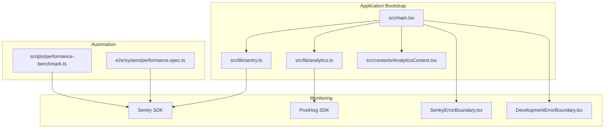
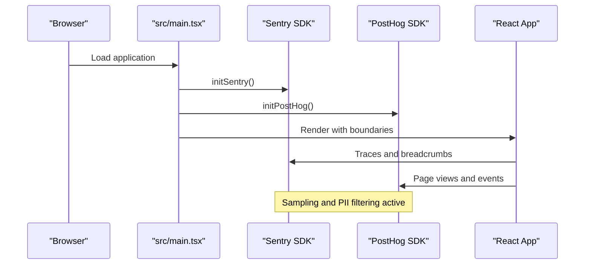
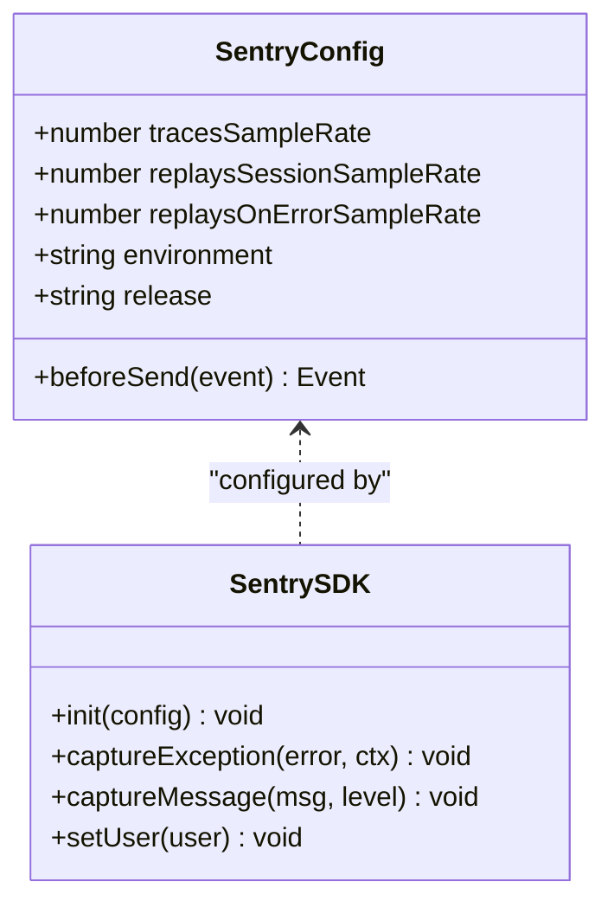
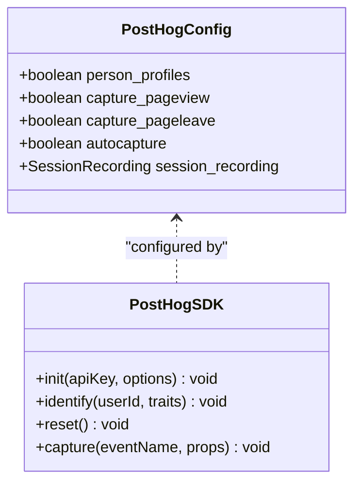
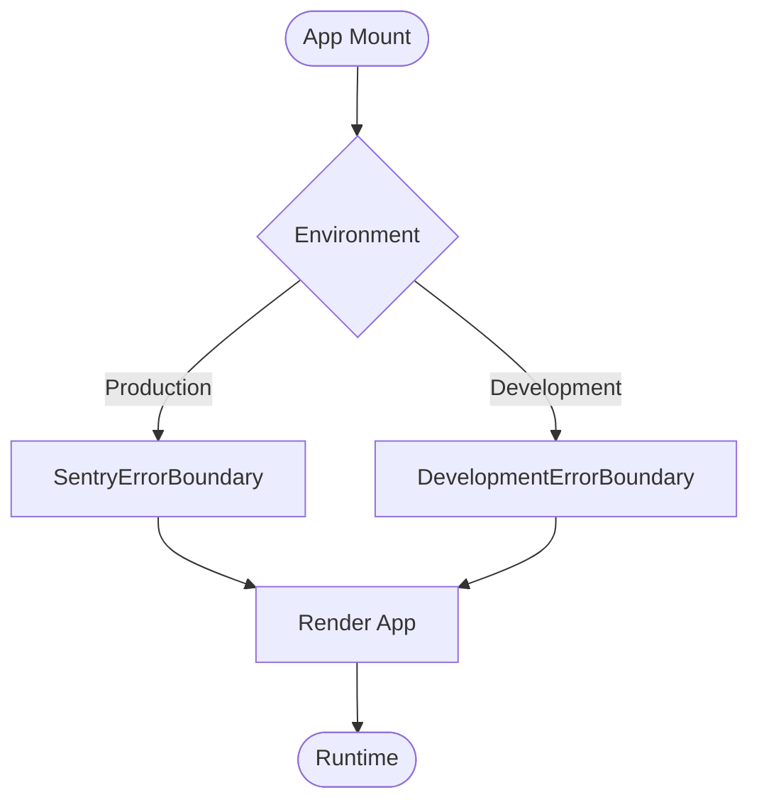
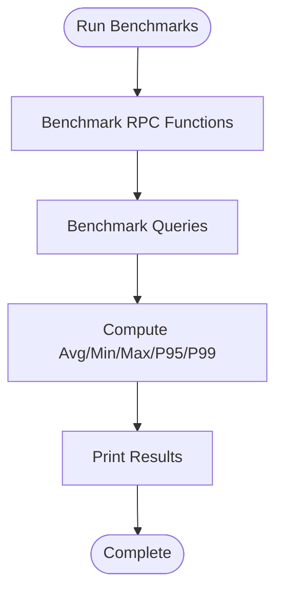
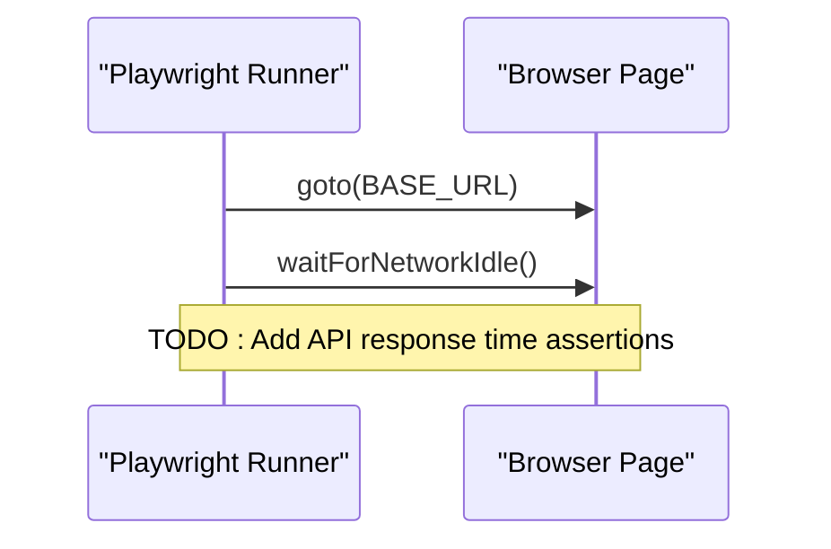
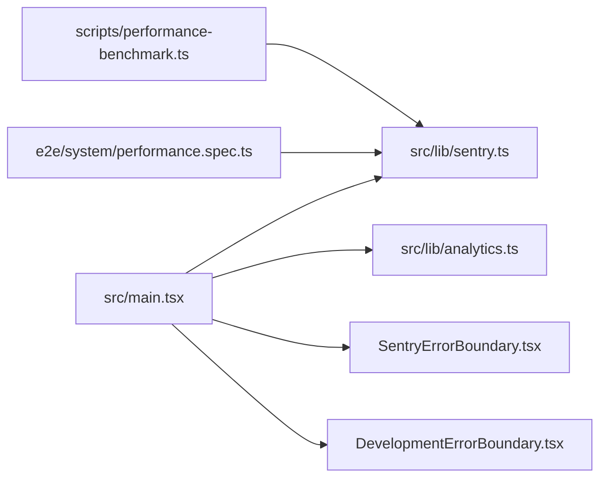

# Performance Monitoring

<cite>
**Referenced Files in This Document**
- [src/main.tsx](file://src/main.tsx)
- [src/lib/sentry.ts](file://src/lib/sentry.ts)
- [src/contexts/AnalyticsContext.tsx](file://src/contexts/AnalyticsContext.tsx)
- [src/lib/analytics.ts](file://src/lib/analytics.ts)
- [scripts/performance-benchmark.ts](file://scripts/performance-benchmark.ts)
- [e2e/system/performance.spec.ts](file://e2e/system/performance.spec.ts)
- [src/components/SentryErrorBoundary.tsx](file://src/components/SentryErrorBoundary.tsx)
- [src/components/DevelopmentErrorBoundary.tsx](file://src/components/DevelopmentErrorBoundary.tsx)
- [capacitor.config.ts](file://capacitor.config.ts)
- [package.json](file://package.json)
</cite>

## Table of Contents
1. [Introduction](#introduction)
2. [Project Structure](#project-structure)
3. [Core Components](#core-components)
4. [Architecture Overview](#architecture-overview)
5. [Detailed Component Analysis](#detailed-component-analysis)
6. [Dependency Analysis](#dependency-analysis)
7. [Performance Considerations](#performance-considerations)
8. [Troubleshooting Guide](#troubleshooting-guide)
9. [Conclusion](#conclusion)

## Introduction
This document provides a comprehensive guide to performance monitoring and profiling in the Nutrio web application. It covers Web Vitals measurement strategies, Chrome DevTools profiling techniques for React applications, Sentry-based performance tracking and error detection, and practical examples for custom metrics, user timing marks, and navigation timing. It also outlines performance budget establishment, alerting thresholds, and continuous monitoring strategies tailored for diverse devices and network conditions.

## Project Structure
The performance monitoring stack integrates at the application bootstrap level and spans analytics, error tracking, and automated testing:
- Application initialization wires Sentry and PostHog analytics.
- Sentry captures performance traces and session replays.
- PostHog tracks product analytics and engagement metrics.
- Automated scripts and Playwright tests measure API response times and validate performance expectations.

**Diagram sources**
- [src/main.tsx:13-15](file://src/main.tsx#L13-L15)
- [src/lib/sentry.ts:3-37](file://src/lib/sentry.ts#L3-L37)
- [src/lib/analytics.ts:3-35](file://src/lib/analytics.ts#L3-L35)
- [src/contexts/AnalyticsContext.tsx:22-39](file://src/contexts/AnalyticsContext.tsx#L22-L39)
- [scripts/performance-benchmark.ts:23-98](file://scripts/performance-benchmark.ts#L23-L98)
- [e2e/system/performance.spec.ts:114-127](file://e2e/system/performance.spec.ts#L114-L127)

**Section sources**
- [src/main.tsx:13-15](file://src/main.tsx#L13-L15)
- [src/lib/sentry.ts:3-37](file://src/lib/sentry.ts#L3-L37)
- [src/lib/analytics.ts:3-35](file://src/lib/analytics.ts#L3-L35)
- [src/contexts/AnalyticsContext.tsx:22-39](file://src/contexts/AnalyticsContext.tsx#L22-L39)

## Core Components
- Sentry initialization and performance monitoring:
  - Browser tracing and session replay integrations.
  - Sampling rates for traces and replays.
  - Environment and release tagging.
  - PII filtering before sending events.
- PostHog analytics:
  - Initialization with opt-out in development.
  - Session recording with masking.
  - Event and page view tracking.
  - User identification and sanitization.
- Application error boundaries:
  - Production Sentry boundary and development fallback.
- Performance benchmarking:
  - RPC and query latency measurement with percentile reporting.
- E2E performance tests:
  - Network idle waits and placeholders for API response validations.

**Section sources**
- [src/lib/sentry.ts:9-37](file://src/lib/sentry.ts#L9-L37)
- [src/lib/analytics.ts:3-35](file://src/lib/analytics.ts#L3-L35)
- [src/main.tsx:8-11](file://src/main.tsx#L8-L11)
- [scripts/performance-benchmark.ts:20-98](file://scripts/performance-benchmark.ts#L20-L98)
- [e2e/system/performance.spec.ts:114-127](file://e2e/system/performance.spec.ts#L114-L127)

## Architecture Overview
The runtime performance architecture ties together initialization, monitoring, and observability:

**Diagram sources**
- [src/main.tsx:13-15](file://src/main.tsx#L13-L15)
- [src/lib/sentry.ts:9-37](file://src/lib/sentry.ts#L9-L37)
- [src/lib/analytics.ts:17-34](file://src/lib/analytics.ts#L17-L34)

## Detailed Component Analysis

### Sentry Performance Monitoring
Sentry is initialized with browser tracing and session replay. Sampling rates and environment/release metadata are configured. PII is removed before events are sent.

**Diagram sources**
- [src/lib/sentry.ts:9-37](file://src/lib/sentry.ts#L9-L37)

**Section sources**
- [src/lib/sentry.ts:9-37](file://src/lib/sentry.ts#L9-L37)
- [src/lib/sentry.ts:59-72](file://src/lib/sentry.ts#L59-L72)

### PostHog Analytics
PostHog is initialized with session recording, masking, and opt-out in development. User identification and event/page view tracking are supported with property sanitization.

**Diagram sources**
- [src/lib/analytics.ts:17-34](file://src/lib/analytics.ts#L17-L34)

**Section sources**
- [src/lib/analytics.ts:17-34](file://src/lib/analytics.ts#L17-L34)
- [src/lib/analytics.ts:147-160](file://src/lib/analytics.ts#L147-L160)

### Application Error Boundaries
Error boundaries wrap the application in production and development modes to ensure robust error handling and reporting.

**Diagram sources**
- [src/main.tsx:25-37](file://src/main.tsx#L25-L37)
- [src/components/SentryErrorBoundary.tsx](file://src/components/SentryErrorBoundary.tsx)
- [src/components/DevelopmentErrorBoundary.tsx](file://src/components/DevelopmentErrorBoundary.tsx)

**Section sources**
- [src/main.tsx:8-11](file://src/main.tsx#L8-L11)
- [src/main.tsx:25-37](file://src/main.tsx#L25-L37)

### Performance Benchmarking Script
The benchmark suite measures RPC and query latencies, computes statistics, and prints pass/fail outcomes against targets.

**Diagram sources**
- [scripts/performance-benchmark.ts:23-98](file://scripts/performance-benchmark.ts#L23-L98)
- [scripts/performance-benchmark.ts:166-205](file://scripts/performance-benchmark.ts#L166-L205)

**Section sources**
- [scripts/performance-benchmark.ts:20-98](file://scripts/performance-benchmark.ts#L20-L98)
- [scripts/performance-benchmark.ts:166-205](file://scripts/performance-benchmark.ts#L166-L205)

### E2E Performance Test
The Playwright test navigates to the base URL, waits for network idle, and includes placeholders for API response time assertions.

**Diagram sources**
- [e2e/system/performance.spec.ts:114-127](file://e2e/system/performance.spec.ts#L114-L127)

**Section sources**
- [e2e/system/performance.spec.ts:114-127](file://e2e/system/performance.spec.ts#L114-L127)

## Dependency Analysis
- Application bootstrap depends on Sentry and PostHog initialization modules.
- Analytics provider initializes PostHog and exposes tracking hooks.
- Error boundaries depend on Sentry SDK for production error handling.
- Performance benchmarking relies on Supabase client and uses browser performance APIs.
- E2E tests rely on Playwright and network idle utilities.

**Diagram sources**
- [src/main.tsx:6-11](file://src/main.tsx#L6-L11)
- [src/lib/sentry.ts:1-3](file://src/lib/sentry.ts#L1-L3)
- [src/lib/analytics.ts:1](file://src/lib/analytics.ts#L1)
- [scripts/performance-benchmark.ts:6](file://scripts/performance-benchmark.ts#L6)
- [e2e/system/performance.spec.ts:114-127](file://e2e/system/performance.spec.ts#L114-L127)

**Section sources**
- [src/main.tsx:6-11](file://src/main.tsx#L6-L11)
- [src/lib/sentry.ts:1-3](file://src/lib/sentry.ts#L1-L3)
- [src/lib/analytics.ts:1](file://src/lib/analytics.ts#L1)
- [scripts/performance-benchmark.ts:6](file://scripts/performance-benchmark.ts#L6)
- [e2e/system/performance.spec.ts:114-127](file://e2e/system/performance.spec.ts#L114-L127)

## Performance Considerations
- Web Vitals measurement:
  - Use the web-vitals library to collect LCP, FID, INP, CLS, FCP, and TTFB.
  - Integrate with Google Analytics via the existing analytics pipeline or Sentry’s performance ingestion.
  - Emit user timing marks and navigation timing for custom metrics aligned with user journeys.
- Chrome DevTools profiling for React:
  - Use the Performance panel to record interactions and identify long tasks.
  - Leverage the Profiler tab to analyze component render costs and re-renders.
  - Focus on minimizing expensive work on the main thread and optimizing heavy computations.
- Performance budgets and thresholds:
  - Establish P95 thresholds for critical RPCs and queries (e.g., <100ms for atomic operations).
  - Define acceptable Web Vitals targets (e.g., LCP < 2.5s, FID < 100ms, CLS < 0.1).
  - Set alerting for sustained degradation across devices and network conditions.
- Continuous monitoring:
  - Run periodic performance benchmarks in CI to detect regressions.
  - Monitor Sentry performance traces and PostHog funnel conversions.
  - Maintain E2E tests that assert responsiveness and page load characteristics.

[No sources needed since this section provides general guidance]

## Troubleshooting Guide
- Sentry not capturing in development:
  - Verify environment checks and ensure Sentry is initialized only in non-development mode.
  - Confirm environment variables for DSN and release are present.
- PostHog disabled in development:
  - Confirm opt-out logic and that the SDK is initialized conditionally.
  - Check that API key and host are configured.
- Error boundaries not catching errors:
  - Ensure the production boundary wraps the application and that development fallback is used during local runs.
- Performance benchmark failures:
  - Review percentile thresholds and expected error categories.
  - Validate database connectivity and RPC/query correctness in test environments.
- E2E performance flakiness:
  - Use network idle waits and stabilize selectors.
  - Add explicit waits for critical resource loads.

**Section sources**
- [src/lib/sentry.ts:4-7](file://src/lib/sentry.ts#L4-L7)
- [src/lib/sentry.ts:28-35](file://src/lib/sentry.ts#L28-L35)
- [src/lib/analytics.ts:4-7](file://src/lib/analytics.ts#L4-L7)
- [src/lib/analytics.ts:31-33](file://src/lib/analytics.ts#L31-L33)
- [src/main.tsx:25-37](file://src/main.tsx#L25-L37)
- [scripts/performance-benchmark.ts:207-219](file://scripts/performance-benchmark.ts#L207-L219)
- [e2e/system/performance.spec.ts:114-127](file://e2e/system/performance.spec.ts#L114-L127)

## Conclusion
Nutrio’s performance monitoring stack integrates Sentry for performance and error tracking, PostHog for product analytics, and automated tooling for benchmarking and E2E validation. By establishing budgets, thresholds, and continuous monitoring practices, the team can maintain a high-quality user experience across devices and network conditions while leveraging custom metrics and navigation timing to align performance with user-centric goals.