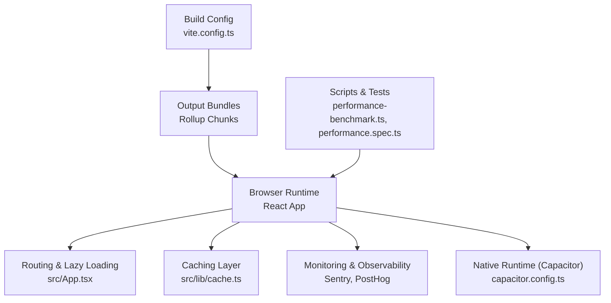
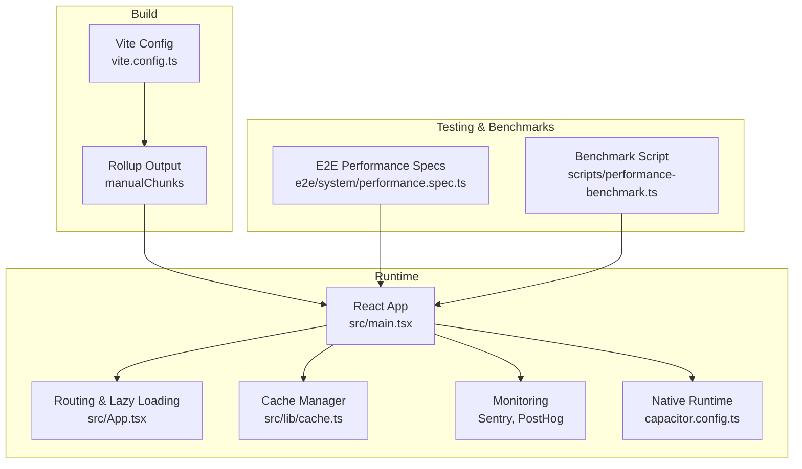
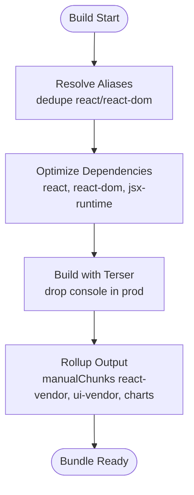
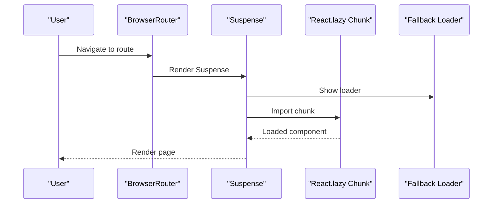
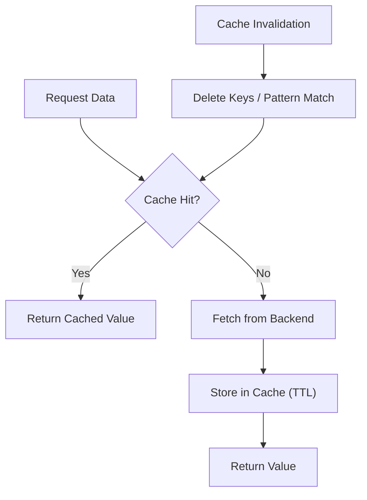
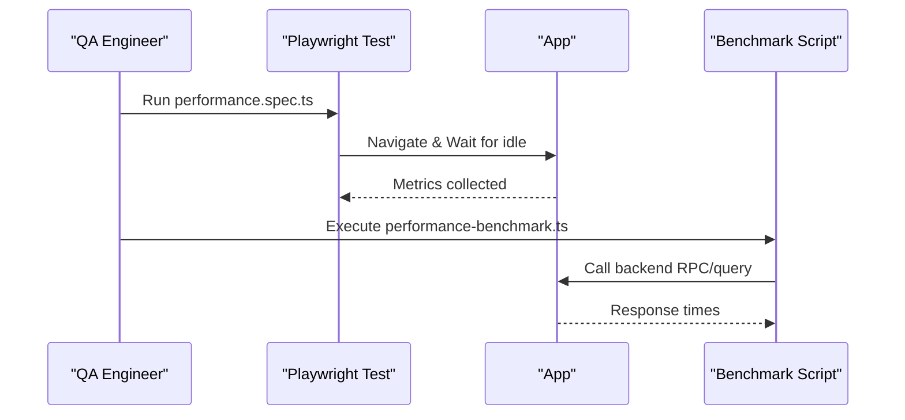
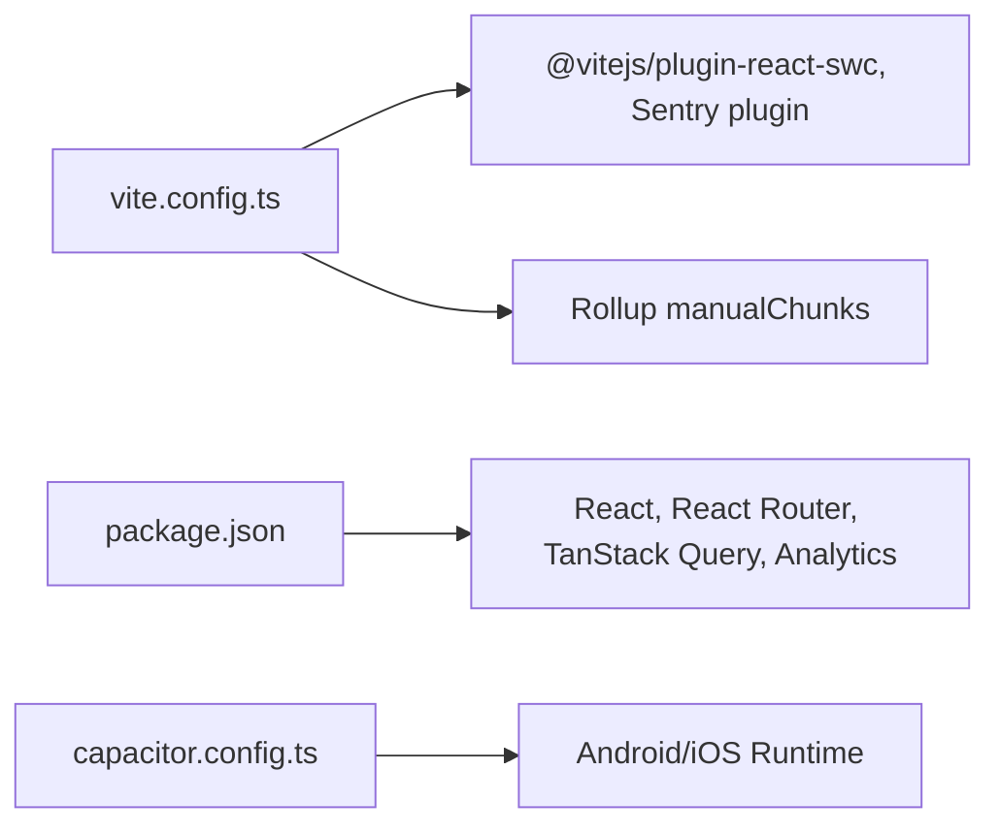

# Web Application Performance

<cite>
**Referenced Files in This Document**
- [vite.config.ts](file://vite.config.ts)
- [package.json](file://package.json)
- [capacitor.config.ts](file://capacitor.config.ts)
- [src/main.tsx](file://src/main.tsx)
- [src/App.tsx](file://src/App.tsx)
- [src/lib/cache.ts](file://src/lib/cache.ts)
- [e2e/system/performance.spec.ts](file://e2e/system/performance.spec.ts)
- [scripts/performance-benchmark.ts](file://scripts/performance-benchmark.ts)
</cite>

## Table of Contents
1. [Introduction](#introduction)
2. [Project Structure](#project-structure)
3. [Core Components](#core-components)
4. [Architecture Overview](#architecture-overview)
5. [Detailed Component Analysis](#detailed-component-analysis)
6. [Dependency Analysis](#dependency-analysis)
7. [Performance Considerations](#performance-considerations)
8. [Troubleshooting Guide](#troubleshooting-guide)
9. [Conclusion](#conclusion)
10. [Appendices](#appendices)

## Introduction
This document provides a comprehensive guide to web application performance profiling for Nutrio. It covers build-time bundle analysis using Vite’s built-in capabilities and optional third-party tools, route-based code splitting and lazy loading strategies, React rendering optimizations, caching strategies (browser, service worker, and application-level), performance monitoring with Lighthouse, Web Vitals, and Chrome DevTools, performance budgeting, asset optimization, and CDN integration strategies. The guidance is grounded in the repository’s current configuration and implementation patterns.

## Project Structure
Nutrio is a Vite-powered React application with TypeScript. The build pipeline, routing, and caching layers are configured centrally and used across portals (customer, partner, admin, driver, fleet). The structure supports:
- Modern JavaScript target and minification for performance
- Manual chunking for vendor separation and improved caching
- Route-based lazy loading via React.lazy and Suspense
- Application-level caching with an in-memory fallback
- E2E and benchmarking utilities for performance validation

**Diagram sources**
- [vite.config.ts](file://vite.config.ts)
- [src/App.tsx](file://src/App.tsx)
- [src/lib/cache.ts](file://src/lib/cache.ts)
- [capacitor.config.ts](file://capacitor.config.ts)
- [scripts/performance-benchmark.ts](file://scripts/performance-benchmark.ts)
- [e2e/system/performance.spec.ts](file://e2e/system/performance.spec.ts)

**Section sources**
- [vite.config.ts](file://vite.config.ts)
- [package.json](file://package.json)
- [src/App.tsx](file://src/App.tsx)
- [src/lib/cache.ts](file://src/lib/cache.ts)
- [capacitor.config.ts](file://capacitor.config.ts)
- [scripts/performance-benchmark.ts](file://scripts/performance-benchmark.ts)
- [e2e/system/performance.spec.ts](file://e2e/system/performance.spec.ts)

## Core Components
- Build and bundling: Vite configuration defines targets, minification, source maps, and manual chunking for vendor libraries and UI components.
- Routing and lazy loading: Route-based code splitting using React.lazy and Suspense to defer heavy pages until navigation.
- Caching: Application-level cache manager with in-memory fallback and cache key patterns for frequently accessed data.
- Monitoring and observability: Sentry initialization and PostHog analytics initialization in the root entry.
- Native runtime: Capacitor configuration for Android/iOS, including server and plugin settings.

**Section sources**
- [vite.config.ts](file://vite.config.ts)
- [src/App.tsx](file://src/App.tsx)
- [src/lib/cache.ts](file://src/lib/cache.ts)
- [src/main.tsx](file://src/main.tsx)
- [capacitor.config.ts](file://capacitor.config.ts)

## Architecture Overview
The runtime architecture integrates build-time optimizations with client-side performance strategies and monitoring.

**Diagram sources**
- [vite.config.ts](file://vite.config.ts)
- [src/main.tsx](file://src/main.tsx)
- [src/App.tsx](file://src/App.tsx)
- [src/lib/cache.ts](file://src/lib/cache.ts)
- [capacitor.config.ts](file://capacitor.config.ts)
- [e2e/system/performance.spec.ts](file://e2e/system/performance.spec.ts)
- [scripts/performance-benchmark.ts](file://scripts/performance-benchmark.ts)

## Detailed Component Analysis

### Bundle Analysis and Code Splitting
- Manual chunking separates vendor libraries and UI components to improve caching and reduce initial payload.
- Target modern browsers and enable minification for smaller bundles.
- Source maps are enabled for production builds to support error tracking while balancing privacy and performance.

**Diagram sources**
- [vite.config.ts](file://vite.config.ts)

**Section sources**
- [vite.config.ts](file://vite.config.ts)

### Route-Based Code Splitting and Lazy Loading
- Critical-first pages are eagerly loaded; others are lazy-loaded per feature area.
- Suspense provides a consistent loading fallback during chunk downloads.
- Scroll restoration is handled on route changes to avoid WebView scroll persistence artifacts.

**Diagram sources**
- [src/App.tsx](file://src/App.tsx)

**Section sources**
- [src/App.tsx](file://src/App.tsx)

### React Rendering Performance Patterns
- Memoization and stable references: Prefer useMemo/useCallback for derived data and event handlers to prevent unnecessary re-renders.
- Component memoization: Wrap expensive components with React.memo to skip renders when props are unchanged.
- Virtualization: For large lists, use windowing/virtualization libraries to render only visible items.
- Avoid excessive re-renders: Keep heavy computations outside render or memoize them.

[No sources needed since this section provides general guidance]

### Caching Strategies
- Browser caching: Configure long-lived cache headers for static assets and leverage Vite’s output hashing for cache busting.
- Service worker integration: Register a service worker to cache critical assets and enable offline readiness.
- Application-level caching: Use the cache manager to cache frequent queries with TTL and invalidation patterns.

**Diagram sources**
- [src/lib/cache.ts](file://src/lib/cache.ts)

**Section sources**
- [src/lib/cache.ts](file://src/lib/cache.ts)

### Performance Monitoring and Measurement
- Lighthouse: Audit performance, accessibility, and best practices using Lighthouse in CI or locally.
- Web Vitals: Track Core Web Vitals (LCP, FID, CLS) in production via analytics or SDKs.
- Chrome DevTools: Use Performance, Memory, and Lighthouse panels for profiling and identifying bottlenecks.
- E2E and benchmarks: Use Playwright specs and the benchmark script to measure page load and query performance.

**Diagram sources**
- [e2e/system/performance.spec.ts](file://e2e/system/performance.spec.ts)
- [scripts/performance-benchmark.ts](file://scripts/performance-benchmark.ts)

**Section sources**
- [e2e/system/performance.spec.ts](file://e2e/system/performance.spec.ts)
- [scripts/performance-benchmark.ts](file://scripts/performance-benchmark.ts)

### Asset Optimization and CDN Integration
- Minification and compression: Enable Terser and gzip/Brotli compression on the server.
- Image optimization: Use modern formats (AVIF/WebP) and responsive images.
- CDN: Serve static assets via a CDN to reduce latency and offload origin bandwidth.
- Cache headers: Set appropriate Cache-Control and immutable headers for hashed assets.

[No sources needed since this section provides general guidance]

## Dependency Analysis
- Build-time dependencies: Vite, React plugins, Terser, Sentry plugin.
- Runtime dependencies: React, React Router, TanStack Query, analytics providers.
- Capacitor runtime: Android/iOS integration with configurable server and plugins.

**Diagram sources**
- [vite.config.ts](file://vite.config.ts)
- [package.json](file://package.json)
- [capacitor.config.ts](file://capacitor.config.ts)

**Section sources**
- [vite.config.ts](file://vite.config.ts)
- [package.json](file://package.json)
- [capacitor.config.ts](file://capacitor.config.ts)

## Performance Considerations
- Keep initial bundle small by deferring non-critical routes and features.
- Use React.memo, useMemo, and useCallback judiciously to avoid premature optimization.
- Prefer virtualization for large lists and pagination for infinite scrolling.
- Monitor and enforce budgets for bundle sizes and asset counts.
- Continuously measure and track Web Vitals in production.

[No sources needed since this section provides general guidance]

## Troubleshooting Guide
- Build issues: Verify Vite configuration for aliases, dedupe, and manualChunks; ensure Terser options align with environment.
- Lazy loading delays: Confirm Suspense fallback is present and routes are properly lazy-imported.
- Caching problems: Validate cache keys, TTL values, and invalidation patterns; monitor for silent failures.
- Monitoring gaps: Ensure Sentry and analytics are initialized early in the app lifecycle.

**Section sources**
- [vite.config.ts](file://vite.config.ts)
- [src/App.tsx](file://src/App.tsx)
- [src/lib/cache.ts](file://src/lib/cache.ts)
- [src/main.tsx](file://src/main.tsx)

## Conclusion
Nutrio’s performance strategy combines modern build tooling, route-based code splitting, application-level caching, and robust monitoring. By leveraging Vite’s manual chunking, React.memo/useMemo/useCallback patterns, and a structured caching layer, the application can achieve fast initial loads and smooth interactions. Continuous measurement via Lighthouse, Web Vitals, and E2E benchmarks ensures sustained performance over time.

[No sources needed since this section summarizes without analyzing specific files]

## Appendices

### Practical Examples and References
- Bundle analysis: Inspect generated chunks and their sizes after building with Vite.
- Lazy loading: Observe network requests for lazy routes and verify Suspense fallback behavior.
- Caching: Use cache manager APIs to store and invalidate data with appropriate TTLs.
- Performance monitoring: Integrate Lighthouse, Web Vitals, and Chrome DevTools into CI and local workflows.
- Budgeting: Define and enforce limits for bundle size, asset count, and query response times.

[No sources needed since this section provides general guidance]