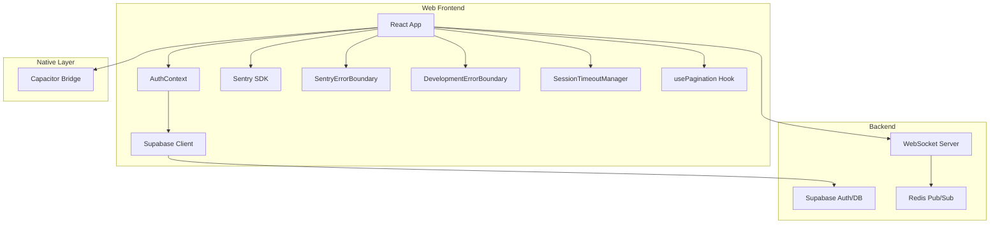
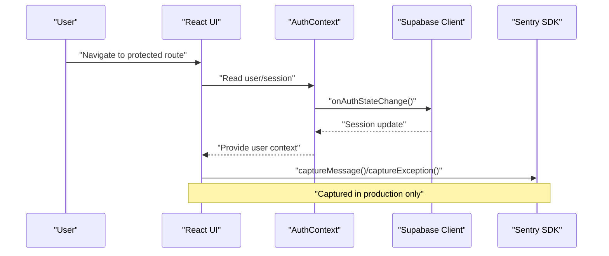
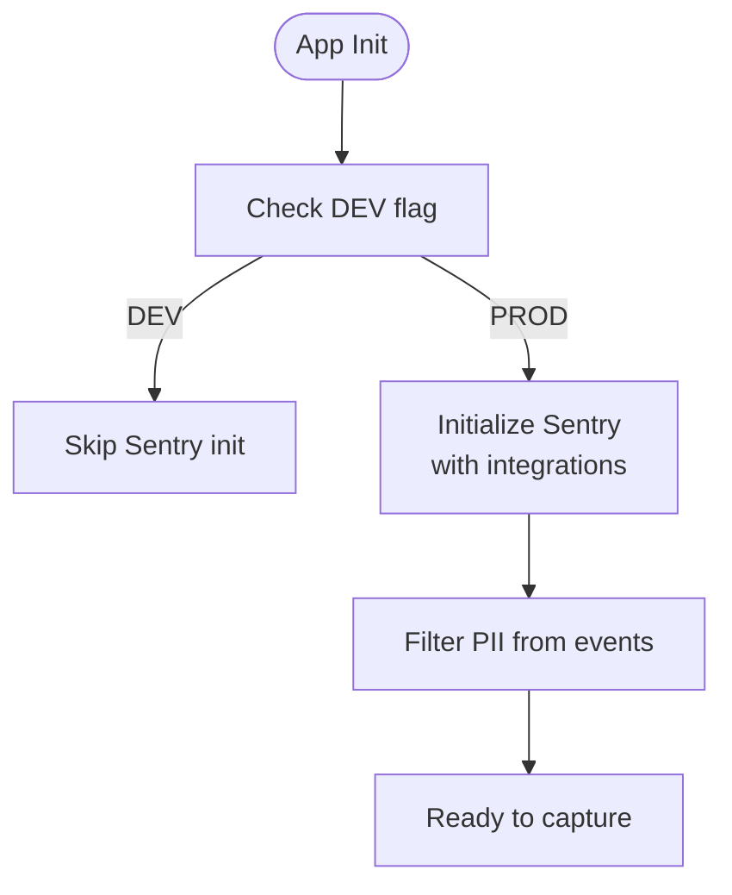
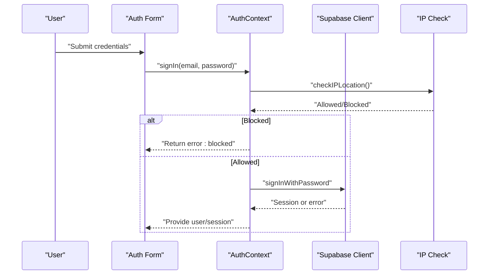
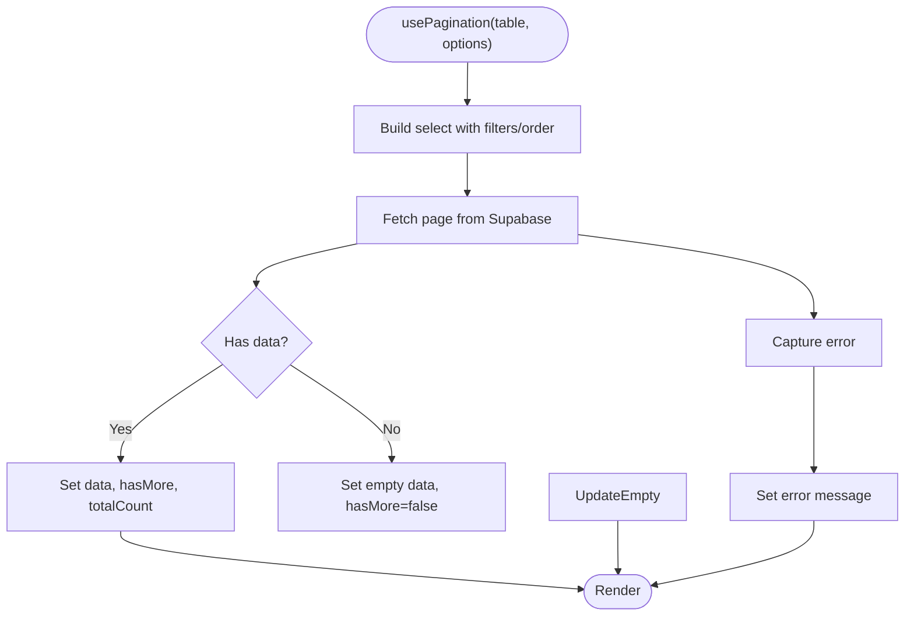
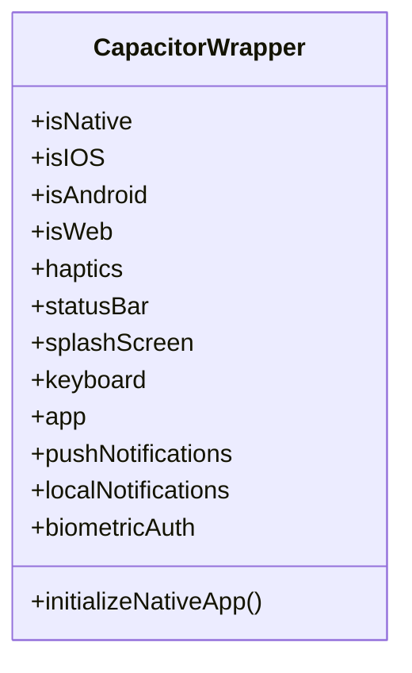
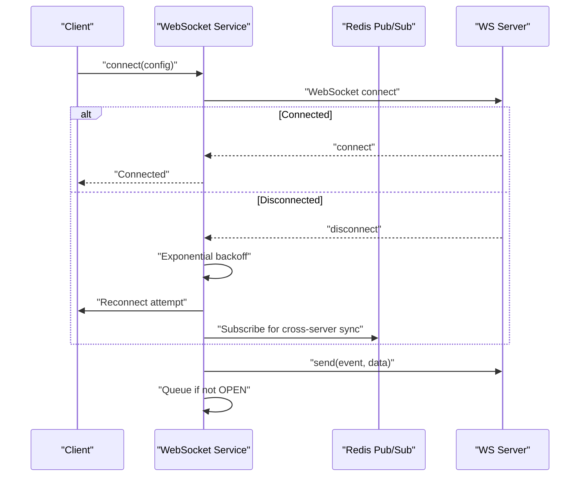

# Troubleshooting & Debugging

<cite>
**Referenced Files in This Document**
- [sentry.ts](file://src/lib/sentry.ts)
- [SentryErrorBoundary.tsx](file://src/components/SentryErrorBoundary.tsx)
- [DevelopmentErrorBoundary.tsx](file://src/components/DevelopmentErrorBoundary.tsx)
- [AuthContext.tsx](file://src/contexts/AuthContext.tsx)
- [client.ts](file://src/integrations/supabase/client.ts)
- [SessionTimeoutManager.tsx](file://src/components/SessionTimeoutManager.tsx)
- [usePagination.ts](file://src/hooks/usePagination.ts)
- [server.ts](file://src/test/server.ts)
- [check-env.js](file://check-env.js)
- [check-env.mjs](file://check-env.mjs)
- [performance-benchmark.ts](file://scripts/performance-benchmark.ts)
- [trackingSocket.ts](file://src/fleet/services/trackingSocket.ts)
- [redisService.ts](file://websocket-server/src/services/redisService.ts)
- [realtime.spec.ts](file://e2e/system/realtime.spec.ts)
- [performance.spec.ts](file://e2e/system/performance.spec.ts)
- [auth.spec.ts](file://e2e/customer/auth.spec.ts)
- [capacitor.ts](file://src/lib/capacitor.ts)
- [system-architecture.html](file://docs/plans/system-architecture.html)
</cite>

## Table of Contents
1. [Introduction](#introduction)
2. [Project Structure](#project-structure)
3. [Core Components](#core-components)
4. [Architecture Overview](#architecture-overview)
5. [Detailed Component Analysis](#detailed-component-analysis)
6. [Dependency Analysis](#dependency-analysis)
7. [Performance Considerations](#performance-considerations)
8. [Troubleshooting Guide](#troubleshooting-guide)
9. [Conclusion](#conclusion)
10. [Appendices](#appendices)

## Introduction
This document provides comprehensive troubleshooting and debugging guidance for the Nutrio application. It covers authentication issues, database connectivity, mobile app crashes, error tracking via Sentry, performance profiling, logging strategies, and network troubleshooting for both web and mobile platforms. Practical examples and diagrams illustrate how components interact and where to focus diagnostic efforts.

## Project Structure
The application integrates Supabase for authentication and database, Sentry for error tracking, and a fleet WebSocket service for real-time updates. The frontend uses React with React Router, React Query, and Capacitor for native capabilities. End-to-end tests validate authentication, performance, and real-time features.

**Diagram sources**
- [AuthContext.tsx:36-61](file://src/contexts/AuthContext.tsx#L36-L61)
- [client.ts:47-57](file://src/integrations/supabase/client.ts#L47-L57)
- [sentry.ts:3-37](file://src/lib/sentry.ts#L3-L37)
- [SentryErrorBoundary.tsx:14-63](file://src/components/SentryErrorBoundary.tsx#L14-L63)
- [DevelopmentErrorBoundary.tsx:20-94](file://src/components/DevelopmentErrorBoundary.tsx#L20-L94)
- [SessionTimeoutManager.tsx:170-208](file://src/components/SessionTimeoutManager.tsx#L170-L208)
- [usePagination.ts:30-50](file://src/hooks/usePagination.ts#L30-L50)
- [trackingSocket.ts:164-214](file://src/fleet/services/trackingSocket.ts#L164-L214)
- [redisService.ts:63-82](file://websocket-server/src/services/redisService.ts#L63-L82)

**Section sources**
- [system-architecture.html:934-958](file://docs/plans/system-architecture.html#L934-L958)

## Core Components
- Error tracking and boundaries:
  - Sentry initialization and capture utilities
  - Error boundaries for graceful degradation
- Authentication and session management:
  - Auth provider with Supabase
  - Session timeout manager
- Data access and caching:
  - Supabase client with Capacitor storage adapter
  - Pagination hook for offset-based queries
- Real-time connectivity:
  - WebSocket service with exponential backoff and message queue
  - Redis-backed pub/sub for scaling
- Testing and validation:
  - MSW mock server for API testing
  - E2E tests for auth, performance, and real-time features

**Section sources**
- [sentry.ts:3-72](file://src/lib/sentry.ts#L3-L72)
- [SentryErrorBoundary.tsx:14-77](file://src/components/SentryErrorBoundary.tsx#L14-L77)
- [DevelopmentErrorBoundary.tsx:20-96](file://src/components/DevelopmentErrorBoundary.tsx#L20-L96)
- [AuthContext.tsx:36-118](file://src/contexts/AuthContext.tsx#L36-L118)
- [SessionTimeoutManager.tsx:170-287](file://src/components/SessionTimeoutManager.tsx#L170-L287)
- [client.ts:18-57](file://src/integrations/supabase/client.ts#L18-L57)
- [usePagination.ts:30-50](file://src/hooks/usePagination.ts#L30-L50)
- [server.ts:5-24](file://src/test/server.ts#L5-L24)
- [trackingSocket.ts:164-214](file://src/fleet/services/trackingSocket.ts#L164-L214)
- [redisService.ts:63-82](file://websocket-server/src/services/redisService.ts#L63-L82)

## Architecture Overview
The system initializes Sentry early, wraps providers, and mounts error boundaries. Authentication state changes trigger Supabase listeners and optional native push notification initialization. Real-time updates use WebSocket with Redis pub/sub and fallback polling.

**Diagram sources**
- [AuthContext.tsx:36-61](file://src/contexts/AuthContext.tsx#L36-L61)
- [sentry.ts:39-57](file://src/lib/sentry.ts#L39-L57)

**Section sources**
- [system-architecture.html:934-958](file://docs/plans/system-architecture.html#L934-L958)

## Detailed Component Analysis

### Error Tracking with Sentry
- Initialization:
  - Disabled in development; enabled in production with tracing and replay integrations.
  - Environment and release metadata included; PII filtered before sending.
- Capture utilities:
  - Error and message capture with context; user context setters for correlation.
- Boundaries:
  - Error boundary captures unhandled exceptions and optionally renders a fallback.
  - Development boundary handles hot reload/HMR hook errors gracefully.

**Diagram sources**
- [sentry.ts:3-37](file://src/lib/sentry.ts#L3-L37)

**Section sources**
- [sentry.ts:3-72](file://src/lib/sentry.ts#L3-L72)
- [SentryErrorBoundary.tsx:14-77](file://src/components/SentryErrorBoundary.tsx#L14-L77)
- [DevelopmentErrorBoundary.tsx:20-96](file://src/components/DevelopmentErrorBoundary.tsx#L20-L96)

### Authentication Troubleshooting
Common issues:
- Missing Supabase configuration in build environment.
- IP blocking during sign-in.
- Session persistence and token refresh failures.
- Native push notification initialization errors.

Resolution steps:
- Verify environment variables for Supabase URL and key.
- Confirm IP location checks and fallback behavior.
- Inspect auth state listener and session retrieval.
- Check native platform initialization for push notifications.

**Diagram sources**
- [AuthContext.tsx:87-112](file://src/contexts/AuthContext.tsx#L87-L112)

**Section sources**
- [client.ts:10-16](file://src/integrations/supabase/client.ts#L10-L16)
- [AuthContext.tsx:87-112](file://src/contexts/AuthContext.tsx#L87-L112)
- [AuthContext.tsx:36-61](file://src/contexts/AuthContext.tsx#L36-L61)

### Database Connectivity and Pagination
- Supabase client guards missing configuration with console warnings.
- Uses Capacitor Preferences for native storage; falls back to localStorage on web.
- Pagination hook manages loading, error, and offset-based fetching.

**Diagram sources**
- [usePagination.ts:30-50](file://src/hooks/usePagination.ts#L30-L50)

**Section sources**
- [client.ts:18-57](file://src/integrations/supabase/client.ts#L18-L57)
- [usePagination.ts:30-50](file://src/hooks/usePagination.ts#L30-L50)

### Mobile App Crashes and Native Integration
- Capacitor wrapper provides safe access to native features with graceful fallbacks.
- Native initialization logs errors without crashing the app.
- Biometric authentication and push notifications are guarded behind platform checks.

**Diagram sources**
- [capacitor.ts:27-640](file://src/lib/capacitor.ts#L27-L640)

**Section sources**
- [capacitor.ts:27-640](file://src/lib/capacitor.ts#L27-L640)

### Real-Time WebSocket and Scaling
- WebSocket service implements exponential backoff and a message queue.
- Redis pub/sub clients log connection and error events.
- Fallback polling strategy ensures location updates when WS fails.

**Diagram sources**
- [trackingSocket.ts:164-214](file://src/fleet/services/trackingSocket.ts#L164-L214)
- [redisService.ts:63-82](file://websocket-server/src/services/redisService.ts#L63-L82)

**Section sources**
- [trackingSocket.ts:164-214](file://src/fleet/services/trackingSocket.ts#L164-L214)
- [redisService.ts:44-82](file://websocket-server/src/services/redisService.ts#L44-L82)

## Dependency Analysis
- Providers chain initializes Sentry, native app, language provider, error boundaries, query client, tooltips, router, auth, analytics, and routes.
- AuthContext depends on Supabase client and optional native push notification service.
- Real-time service depends on WebSocket and Redis pub/sub.

```mermaid
graph LR
Init["initSentry()"] --> PostHog["initPostHog()"]
PostHog --> Native["initializeNativeApp()"]
Native --> Lang["LanguageProvider"]
Lang --> ErrBound["SentryErrorBoundary"]
ErrBound --> Query["QueryClientProvider"]
Query --> Tooltip["TooltipProvider"]
Tooltip --> Router["BrowserRouter"]
Router --> AuthProv["AuthProvider"]
AuthProv --> Analytics["AnalyticsProvider"]
Analytics --> Routes["Routes"]
```

**Diagram sources**
- [system-architecture.html:934-958](file://docs/plans/system-architecture.html#L934-L958)

**Section sources**
- [system-architecture.html:934-958](file://docs/plans/system-architecture.html#L934-L958)

## Performance Considerations
- Use the performance benchmark script to measure RPC functions and queries:
  - Iterations, average/min/max/P95/P99 timings, and pass/fail thresholds.
  - Expected errors are filtered to avoid skewing results.
- E2E tests validate API response time and real-time WebSocket behavior.

Practical tips:
- Run benchmarks locally to identify slow RPCs or queries.
- Monitor P95/P99 metrics for tail latency; optimize indexes and queries accordingly.
- Use E2E tests to simulate real-world load and detect regressions.

**Section sources**
- [performance-benchmark.ts:23-98](file://scripts/performance-benchmark.ts#L23-L98)
- [performance-benchmark.ts:166-205](file://scripts/performance-benchmark.ts#L166-L205)
- [performance.spec.ts:114-127](file://e2e/system/performance.spec.ts#L114-L127)
- [realtime.spec.ts:8-37](file://e2e/system/realtime.spec.ts#L8-L37)

## Troubleshooting Guide

### Authentication Problems
Symptoms:
- Login fails immediately or after IP check.
- Session not persisting across reloads.
- Native push notifications not initializing.

Checklist:
- Confirm Supabase URL and publishable key are set in the build environment.
- Review IP location check behavior and error handling.
- Verify auth state listener and session retrieval.
- Ensure native platform detection and push notification initialization.

Actions:
- Re-run environment verification script to detect missing critical variables.
- Inspect console for IP check warnings and Supabase client errors.
- Validate redirect URLs and session persistence settings.

**Section sources**
- [client.ts:10-16](file://src/integrations/supabase/client.ts#L10-L16)
- [AuthContext.tsx:87-112](file://src/contexts/AuthContext.tsx#L87-L112)
- [AuthContext.tsx:36-61](file://src/contexts/AuthContext.tsx#L36-L61)
- [check-env.js:31-53](file://check-env.js#L31-L53)
- [check-env.mjs:29-51](file://check-env.mjs#L29-L51)

### Database Connectivity Issues
Symptoms:
- Queries fail with missing configuration errors.
- Pagination returns empty or errors unexpectedly.

Checklist:
- Verify Supabase URL and key are present.
- Confirm Capacitor storage adapter is functioning on native.
- Inspect query builder and filters in pagination hook.

Actions:
- Add console logs around Supabase client creation.
- Use mock server to validate API responses during testing.
- Increase query limits temporarily to isolate filtering issues.

**Section sources**
- [client.ts:18-57](file://src/integrations/supabase/client.ts#L18-L57)
- [usePagination.ts:30-50](file://src/hooks/usePagination.ts#L30-L50)
- [server.ts:5-24](file://src/test/server.ts#L5-L24)

### Mobile App Crashes
Symptoms:
- App crashes when accessing native features.
- Biometric authentication or push notifications fail.

Checklist:
- Ensure platform detection is correct.
- Wrap native calls in try/catch and log errors.
- Verify Capacitor plugin availability.

Actions:
- Use Capacitor wrapper methods to safely access features.
- Implement fallbacks for unsupported platforms.
- Check device logs for underlying plugin errors.

**Section sources**
- [capacitor.ts:27-640](file://src/lib/capacitor.ts#L27-L640)

### Network Troubleshooting (API and WebSocket)
Symptoms:
- WebSocket disconnects frequently.
- Real-time updates stop working.
- Polling fallback not triggered.

Checklist:
- Monitor WebSocket connection lifecycle and reconnection attempts.
- Verify Redis pub/sub connectivity and error logs.
- Ensure fallback polling starts on disconnect.

Actions:
- Enable console logs for reconnection delays and attempts.
- Validate transport fallback to polling.
- Scale WebSocket servers horizontally with sticky sessions and Redis pub/sub.

**Section sources**
- [trackingSocket.ts:164-214](file://src/fleet/services/trackingSocket.ts#L164-L214)
- [redisService.ts:44-82](file://websocket-server/src/services/redisService.ts#L44-L82)

### Error Tracking and Stack Traces (Sentry)
What to look for:
- Environment and release tags.
- User context (id/email) with PII removed.
- Component stack traces in error boundaries.
- Replay sessions for on-error sampling.

How to interpret:
- Filter by environment to separate dev/prod noise.
- Correlate user ids to reproduce issues.
- Use component stack to locate failing components.

Actions:
- Initialize Sentry only in production.
- Capture messages for non-critical issues.
- Set user context after successful auth.

**Section sources**
- [sentry.ts:3-37](file://src/lib/sentry.ts#L3-L37)
- [sentry.ts:39-72](file://src/lib/sentry.ts#L39-L72)
- [SentryErrorBoundary.tsx:23-33](file://src/components/SentryErrorBoundary.tsx#L23-L33)

### Logging Strategies and Debug Modes
- Development vs production:
  - Sentry capture is disabled in development; logs are printed to console.
  - Production captures errors and messages to Sentry.
- Console logging:
  - Supabase client logs missing configuration.
  - WebSocket service logs reconnection attempts and errors.
  - Redis clients log connection and error events.

Enablement:
- Ensure environment variables are set for production builds.
- Use development error boundary to recover from hot reload errors.

**Section sources**
- [sentry.ts:40-57](file://src/lib/sentry.ts#L40-L57)
- [client.ts:12-16](file://src/integrations/supabase/client.ts#L12-L16)
- [trackingSocket.ts:164-214](file://src/fleet/services/trackingSocket.ts#L164-L214)
- [redisService.ts:44-82](file://websocket-server/src/services/redisService.ts#L44-L82)
- [DevelopmentErrorBoundary.tsx:44-75](file://src/components/DevelopmentErrorBoundary.tsx#L44-L75)

### Performance Profiling Techniques
- Use the performance benchmark script to:
  - Measure RPC functions and queries.
  - Calculate percentiles and pass/fail thresholds.
  - Identify bottlenecks and expected error filtering.
- Validate performance in E2E tests:
  - API response time checks.
  - Real-time WebSocket connectivity and status updates.

Actions:
- Run benchmarks before and after changes.
- Focus on P95/P99 metrics for user impact.
- Optimize slow queries and reduce payload sizes.

**Section sources**
- [performance-benchmark.ts:23-98](file://scripts/performance-benchmark.ts#L23-L98)
- [performance.spec.ts:114-127](file://e2e/system/performance.spec.ts#L114-L127)
- [realtime.spec.ts:8-37](file://e2e/system/realtime.spec.ts#L8-L37)

### Practical Examples
- Authentication flow:
  - Simulate blocked IP and verify error handling.
  - Test redirect URLs and session persistence.
- Database operations:
  - Mock Supabase endpoints to validate UI behavior.
  - Use pagination hook to test loading and error states.
- Real-time connectivity:
  - Observe exponential backoff and polling fallback.
  - Verify Redis pub/sub logs for cross-server messaging.

**Section sources**
- [auth.spec.ts:191-225](file://e2e/customer/auth.spec.ts#L191-L225)
- [server.ts:5-24](file://src/test/server.ts#L5-L24)
- [trackingSocket.ts:164-214](file://src/fleet/services/trackingSocket.ts#L164-L214)
- [redisService.ts:44-82](file://websocket-server/src/services/redisService.ts#L44-L82)

## Conclusion
By leveraging Sentry for error tracking, robust authentication and database integrations, and comprehensive real-time connectivity with fallbacks, Nutrio’s debugging toolkit enables rapid identification and resolution of issues across web and mobile platforms. Use the provided scripts, boundaries, and tests to maintain reliability and performance.

## Appendices

### Quick Reference: Where to Look
- Authentication: [AuthContext.tsx:36-118](file://src/contexts/AuthContext.tsx#L36-L118), [client.ts:10-16](file://src/integrations/supabase/client.ts#L10-L16)
- Database: [client.ts:18-57](file://src/integrations/supabase/client.ts#L18-L57), [usePagination.ts:30-50](file://src/hooks/usePagination.ts#L30-L50)
- Errors: [sentry.ts:3-72](file://src/lib/sentry.ts#L3-L72), [SentryErrorBoundary.tsx:14-77](file://src/components/SentryErrorBoundary.tsx#L14-L77)
- Real-time: [trackingSocket.ts:164-214](file://src/fleet/services/trackingSocket.ts#L164-L214), [redisService.ts:63-82](file://websocket-server/src/services/redisService.ts#L63-L82)
- Performance: [performance-benchmark.ts:23-98](file://scripts/performance-benchmark.ts#L23-L98), [performance.spec.ts:114-127](file://e2e/system/performance.spec.ts#L114-L127)
- Tests: [auth.spec.ts:191-225](file://e2e/customer/auth.spec.ts#L191-L225), [realtime.spec.ts:8-37](file://e2e/system/realtime.spec.ts#L8-L37)