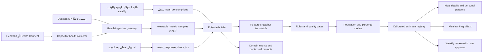

# خطة Nutrio لمحرك الاستجابة الشخصية للوجبات

**التاريخ:** 20 يوليو 2026  
**الحالة:** خطة تنفيذ وبحث قبل التطوير  
**النطاق الأول:** مستخدمو العافية العامة في قطر، وليس التشخيص أو العلاج الطبي

## 1. القرار التنفيذي

يمكن لـ Nutrio بناء رحلة تبدأ من الوجبة الفعلية وتنتهي بتحسين الاختيارات في
الأسبوع التالي، لكن لا يجوز أن يزعم أن وجبة منفردة سببت تحسن السكر أو النوم من
ملاحظة واحدة. أفضل مسار تقني هو محرك هجين من أربع طبقات:

1. **حقائق الوجبة وجودتها الغذائية:** حساب حتمي من لقطة المغذيات والكمية التي
   تناولها العميل فعليًا.
2. **الاستجابة المقاسة:** ربط الوجبة بقياسات فعلية، مثل منحنى السكر من CGM أو
   إجابات قصيرة عن الشبع والطاقة والهضم.
3. **النمط الشخصي المتكرر:** استنتاج إحصائي بعد تكرار ملاحظات مؤهلة مع إظهار
   نطاق عدم اليقين وعدد مرات التكرار.
4. **تجربة شخصية N-of-1:** مقارنة وجبتين أو نمطين بترتيب متوازن ومتكرر عندما
   نحتاج دليلًا أقرب إلى السببية.

الخيار الموصى به هو البدء بالقواعد والإحصاء القابل للتدقيق، ثم إضافة نموذج
سكاني للبدء البارد ونموذج هرمي للتخصيص. لا يُستخدم نموذج لغوي لحساب التأثير أو
اختراع السبب؛ دوره محصور في صياغة نتيجة مهيكلة ومعتمدة بالعربية أو الإنجليزية.

## 2. ماذا تعني «نتائج شبه دقيقة»؟

الدقة هنا ليست رقمًا واحدًا. يجب قياس أربعة أبعاد منفصلة:

| البعد | السؤال | ما نستطيع تحقيقه |
|---|---|---|
| دقة القياس | هل القراءة نفسها موثوقة؟ | تتحسن مع CGM موثوق، تغطية جيدة، وحفظ المصدر والجهاز |
| صحة الإسناد | هل التغير مرتبط بهذه الوجبة؟ | متوسطة في الحياة اليومية، وأعلى مع التكرار وتجربة N-of-1 |
| دقة التنبؤ | هل نتوقع الاستجابة القادمة ضمن نطاق صحيح؟ | تُقاس على مستخدمين وأزمنة لم يرها النموذج، مع معايرة وعدم إصدار نتيجة عند الشك |
| فائدة القرار | هل أدى الاقتراح إلى اختيار أفضل من خط الأساس؟ | تُثبت باختبار مستقبلي، لا بمؤشر تقني فقط |

لذلك لا نعتمد عبارة مثل «دقة 95%». نعتمد بدلًا منها:

- خطأ متوقع ونطاق تنبؤ لكل نتيجة.
- تغطية فعلية لنطاقات الثقة على بيانات مستقبلية.
- نسبة امتناع النظام عن الإجابة عند نقص البيانات.
- مقارنة مباشرة مع قاعدة بسيطة مثل الكربوهيدرات أو السعرات وحدها.
- عرض نوع الدليل: **مقاس، ملاحظ، متنبأ، أو مدعوم بتجربة شخصية**.

## 3. ما تدعمه الأدلة وما لا تدعمه

أظهرت دراسات التغذية الدقيقة اختلافًا كبيرًا بين الأشخاص بعد الوجبة نفسها،
وأن تركيب الوجبة وحده لا يفسر كل الاستجابة. في PREDICT 1 بلغ حجم العينة 1,002
شخص، وكانت الاستجابة للسكر فردية بدرجة مهمة، لكن أداء نموذج منشور في دراسة لا
يعني أنه صالح مباشرة لسكان Nutrio في قطر. كما أن الدراسات التي كررت الوجبة
أظهرت أن ترتيب الوجبات اعتمادًا على قراءة CGM واحدة قد يكون غير ثابت.

النتيجة العملية:

- **الجلوكوز:** أفضل نتيجة حادة قابلة للربط بوجبة عند وجود CGM وتوقيت دقيق.
- **الشبع والطاقة والهضم:** قابلة للقياس باستبيان لحظي قصير، لكنها ذاتية ويجب
  إظهار ذلك.
- **النوم والتعافي:** تُحلل أولًا كنتيجة يومية مرتبطة بنمط اليوم وتوقيت آخر
  وجبة، ولا تُنسب إلى كل وجبة منفردة إلا بعد تكرار مضبوط.
- **الوزن والمؤشرات المخبرية:** نتائج أسبوعية أو شهرية، وليست استجابة فورية
  لوجبة واحدة.
- **السببية:** تحتاج توزيعًا عشوائيًا أو متوازنًا وتكرارًا داخل الشخص، وليس مجرد
  ارتباط زمني.

## 4. الوضع الحالي في Nutrio

### 4.1 ما يمكن إعادة استخدامه

Nutrio يملك أساسًا جيدًا ولا يحتاج نظامًا موازيًا:

- `meal_consumptions` يسجل ما تم تناوله فعليًا، نسبة الحصة، الحالة، ولقطة
  مغذيات غير قابلة للتبدل.
- `meal_consumption_events` يوفر سجل أحداث وإصدارات وطلبات idempotent.
- `wearable_sync_sources` و`wearable_metric_samples` يحفظان المصدر، الجهاز،
  مفتاح إزالة التكرار، والتوقيت.
- `health_context_preferences` وسجل الموافقات يمكن تطويرهما لموافقة صحية
  دقيقة حسب الغرض.
- `meal_ranking_audits` يدعم تفسير ترتيب الوجبات ومراجعة نسخة المحرك.
- المراجعة الأسبوعية الحالية تقترح تغييرات وتطلب موافقة المستخدم قبل تطبيق
  أهداف الماكروز.
- خط domain events والتنبيهات يدعم القوالب الثنائية، quiet hours، retries،
  وdead-letter.

### 4.2 الفجوات الحالية

1. `meal_consumptions` يحفظ `log_date` فقط ولا يحفظ وقت بدء/انتهاء الأكل بدقة.
2. دورة `meal_consumptions` الحالية تغطي الطلب والجدول فقط. الوجبات المسجلة
   يدويًا والباركود والطعام المخصص وخطة المدرب يجب أن تمر بالعقد نفسه قبل أن
   تصبح نتائج الاستجابة شاملة لكل رحلة العميل. كما يجب إغلاق أي مسار قديم في
   Schedule يتجاوز سجل الاستهلاك versioned.
3. أنواع المزامنة الظاهرة في `src/lib/healthKit.ts` لا تشمل الجلوكوز.
4. نسخة `@capgo/capacitor-health@8.6.8` المثبتة تدعم `bloodGlucose`، لكن طبقة
   Nutrio لا تطلب صلاحيتها ولا تطبعها ولا ترفعها إلى Supabase.
5. `readSamples()` في الإضافة لا يعرض cursor لتغييرات القياسات أو عمليات الحذف؛
   المزامنة الإنتاجية تحتاج امتدادًا Native أو موصل CGM مباشرًا.
6. `wearable_metric_samples` لا يسمح حاليًا بنوع `blood_glucose` ولا يميز
   القياس اللحظي من التجميع اليومي.
7. لا يوجد episode builder يربط نافذة فسيولوجية باستهلاك محدد.
8. لا توجد جولات قصيرة بعد الوجبة لتسجيل الشبع والطاقة والهضم والعوامل المشوشة.
9. لا توجد طبقة feature snapshots أو model registry أو معايرة ثقة.
10. بيانات النوم وHRV اليومية لا تكفي وحدها لإسناد نتيجة إلى وجبة بعينها.

## 5. نطاق المنتج

### 5.1 أوضاع الاستخدام

| الوضع | البيانات | ما يظهر للعميل | الثقة الممكنة |
|---|---|---|---|
| بدون جهاز | الوجبة، الحصة، واستبيان بعد الوجبة | جودة غذائية واستجابة ذاتية | منخفضة إلى متوسطة |
| ساعة/HealthKit/Health Connect | السابق + نشاط، نبض، HRV، نوم | سياق يومي وأنماط نوم/تعافٍ | متوسطة للأنماط، وليست قياس سكر |
| CGM عبر منصة الصحة | السابق + عينات جلوكوز ومصدرها | استجابة جلوكوز مقاسة لكل episode | تعتمد على التغطية والمصدر والتكرار |
| CGM مباشر | API رسمي مثل Dexcom مع OAuth | مزامنة أوثق ومراقبة تأخر المصدر | الأعلى تقنيًا بعد اعتماد الشراكة |
| تجربة شخصية | وجبتان أو نمطان متكرران بترتيب متوازن | مقارنة شخصية أقرب للسببية | الأعلى للاستنتاج المحدد |

### 5.2 ما لن يفعله الإصدار الأول

- تشخيص السكري أو مقاومة الإنسولين.
- إعطاء جرعات دواء أو إنسولين أو تغيير علاج.
- اعتبار قراءة CGM حالة طارئة أو بديلًا عن جهاز/طبيب المستخدم.
- إسناد نوم ليلة كاملة آليًا إلى وجبة واحدة.
- تطبيق تغيير في السعرات أو الماكروز دون موافقة المستخدم.
- تدريب نموذج عميق على بيانات غير كافية أو الادعاء بأن الارتباط سببية.
- إرسال القياسات الخام أو الملاحظات الحرة إلى LLM.

## 6. تعريف النتائج والنوافذ الزمنية

### 6.1 نقطة الصفر

نقطة الصفر هي `consumed_at` التي يؤكدها المستخدم، لا وقت الطلب أو التوصيل.
يضاف إلى `meal_consumptions`:

- `started_consuming_at`
- `finished_consuming_at`
- `time_precision` بقيم `exact`, `estimated_15m`, `estimated_30m`, `date_only`
- `portion_confirmed_at`
- `timezone_name` و`utc_offset_minutes`

لا يُنشأ تحليل حاد إذا كانت الدقة `date_only`، وتُخفض الأهلية إذا تجاوز عدم
اليقين 10 إلى 15 دقيقة.

### 6.2 نوافذ الإصدار الأول

| النتيجة | خط الأساس | نافذة ما بعد الوجبة | المقاييس |
|---|---|---|---|
| الجلوكوز | median من -30 إلى -5 دقائق | 0 إلى 120 دقيقة، وتمتد إلى 180 للوجبات المختلطة | iAUC، أعلى ارتفاع، وقت الذروة، زمن العودة |
| النبض | median من -30 إلى -5 دقائق | 0 إلى 120 دقيقة | تغير median/peak، مع وسمها exploratory |
| الشبع | قبل الوجبة | +90 و+180 دقيقة | تغير الشبع وAUC ذاتي |
| الطاقة | قبل الوجبة | +90 و+180 دقيقة | تغير الطاقة والاستقرار |
| الهضم | لا يلزم | +120 دقيقة وخيار +24 ساعة | نوع العرض وشدته |
| النوم | baseline متحرك 14 يومًا | الليلة التالية | مدة، كفاءة، استيقاظ، deep/REM عند توفرها |
| التعافي | baseline متحرك 14 يومًا | الصباح التالي | HRV وresting HR كـ z-score شخصي |

هذه النوافذ إعدادات versioned وليست أرقامًا مبعثرة داخل الواجهة. يعتمد التعديل
النهائي على بروتوكول الدراسة ونتائج pilot.

### 6.3 قواعد أهلية episode

يُصنف episode إلى `eligible`, `descriptive_only`, أو `excluded`. القواعد الأولية:

- اكتمال لقطة المغذيات الأساسية بنسبة لا تقل عن 80%.
- تأكيد الحصة وتوقيت الوجبة.
- تغطية CGM لا تقل عن 80% من نافذة الجلوكوز، مع baseline كافٍ.
- لا توجد وجبة أو مشروب بسعرات داخل نافذة القياس؛ وإلا توسم `overlapping_meal`.
- وسم تمرين من -60 إلى +120 دقيقة، وكافيين، كحول، مرض، قلة نوم، سفر، صيام،
  تغير دواء، ودورة شهرية عند موافقة المستخدم.
- استبعاد warm-up، فجوات المستشعر، القيم المكررة، أو مصدر مجهول.
- حفظ provenance: التطبيق، الجهاز، platform ID، الوحدة الأصلية، ونسخة التطبيع.
- عدم دمج مصدرين للجلوكوز دون قاعدة precedence واختبار توافق.

الاستبعاد لا يحذف البيانات. يحتفظ النظام بالسبب حتى يمكن تدقيقه وإعادة البناء.

## 7. مخرجات العميل ونظام الثقة

### 7.1 لا يوجد «Meal Score» واحد غامض

تُعرض ثلاثة مكونات مستقلة:

1. **جودة الوجبة:** من المغذيات، الألياف، الصوديوم، السكر المضاف، الهدف،
   الحساسية، والأدوية المعروفة.
2. **استجابتك:** نتيجة واحدة لكل outcome، مثل «ارتفاع السكر كان أقل من المعتاد»
   أو «الشبع استمر أطول».
3. **قوة الدليل:** غير كافٍ، إشارة مبكرة، متوسط، أو قوي.

ويظهر بجانب كل نتيجة مصدرها:

- `Measured` قياس جهاز فعلي.
- `Self-reported` إجابة المستخدم.
- `Predicted` تنبؤ النموذج قبل وجود قياس.
- `Experiment-backed` مقارنة شخصية متكررة.

### 7.2 درجات الدليل الأولية

هذه عتبات تشغيلية أولية وتحتاج معايرة في pilot:

| المستوى | الحد الأدنى | ما يسمح به |
|---|---|---|
| وصف فقط | episode واحد | عرض ما حدث دون توصية شخصية |
| إشارة مبكرة | 3 episodes مؤهلة | ملاحظة مؤقتة مع طلب المزيد من التكرار |
| دليل متوسط | 5 episodes على 3 أيام أو أكثر واتجاه متسق | إدخال محدود في ترتيب الوجبات |
| دليل قوي | 8 episodes أو تجربة مقارنة متكررة مع ثبات ومعايرة | توصية شخصية واضحة ضمن نطاق العافية |

لا يُحسب مستوى الثقة بجمع أوزان تجميلية. يعتمد على بوابات جودة ثم احتمال/نطاق
معاير من النموذج. إذا لم يتحقق شرط الجودة أو المعايرة تكون النتيجة
`insufficient_evidence` مهما كان متوسط الاستجابة جذابًا.

## 8. المنهج التحليلي المقترح

### 8.1 مقارنة الخيارات

| الخيار | المزايا | العيوب | القرار |
|---|---|---|---|
| قواعد ثابتة فقط | سريع، مفهوم، سهل التدقيق | لا يلتقط اختلاف الأشخاص جيدًا | أساس MVP وليس النهاية |
| Gradient boosting فقط | قوي للبيانات الجدولية والبدء البارد | قد يبدو واثقًا مع مستخدم جديد، والسببية ضعيفة | baseline سكاني فقط |
| نموذج هرمي فقط | يعالج التكرار وقلة بيانات الفرد | أبطأ وأعقد ويتطلب تصميمًا إحصائيًا جيدًا | طبقة التخصيص |
| Deep learning end-to-end | قد يتعلم منحنيات معقدة عند حجم هائل | غير مبرر في حجم Nutrio المتوقع، أصعب تدقيقًا | مؤجل |
| **محرك هجين** | قواعد سلامة + baseline سكاني + تخصيص هرمي + معايرة | يحتاج انضباط MLOps | **الموصى به** |

### 8.2 المرحلة التحليلية الأولى

تُنفذ حسابات حتمية ومختبرة:

- تحويل الوحدات إلى `mg/dL` مع حفظ القيمة والوحدة الأصلية.
- baseline robust باستخدام median.
- iAUC بطريقة trapezoidal بعد طرح baseline.
- peak delta، time-to-peak، recovery time، ونسبة تغطية العينات.
- robust z-score داخل المستخدم للنوم وHRV والنبض.
- matched comparison حسب الشخص، وقت اليوم، نوع الوجبة، نشاط قريب، والنوم السابق.
- امتناع صريح عند نقص baseline أو تداخل وجبة أو ضعف التغطية.

### 8.3 النموذج السكاني للبدء البارد

بعد توفر pilot كافٍ، يُبنى نموذج tabular مثل LightGBM أو CatBoost باستخدام:

- سعرات، كربوهيدرات، بروتين، دهون، ألياف، سكر، صوديوم، حجم الحصة.
- مكونات/فئات الوجبة ودرجة المعالجة عند توفر taxonomy موثوق.
- وقت اليوم، مدة الصيام السابقة، الوجبة السابقة.
- baseline glucose، نشاط قريب، نوم سابق، stress، cycle context بموافقة.
- العمر ونطاق BMI والهدف، مع أقل قدر ضروري من البيانات.
- الجهاز ومصدر القياس كعوامل معايرة، لا كإشارات مخفية.

هذا المخرج يسمى `Predicted` ولا يُعرض كقياس فعلي.

### 8.4 التخصيص الشخصي

نستخدم نموذجًا هرميًا Bayesian أو mixed-effects:

```text
response = population meal/context effect
         + user random effect
         + meal/archetype random effect
         + within-user context effects
         + residual uncertainty
```

الفائدة هي shrinkage: لا يبالغ النظام في تخصيص نتيجة لمستخدم لديه ملاحظتان،
ثم تنتقل الأهمية تدريجيًا إلى بياناته مع زيادة التكرار. يسجل كل estimate:

- المتوسط أو الوسيط المتوقع.
- 80% و90% interval.
- احتمال تجاوز فرق ذي معنى تم تحديده مسبقًا.
- عدد episodes المؤهلة.
- نسخة features والنموذج وcutoff البيانات.

### 8.5 المعايرة والامتناع

- فصل train/validation/test على مستوى **المستخدم**، ثم temporal holdout.
- منع تسرب episodes للشخص أو الوجبة نفسها بين التدريب والاختبار.
- معايرة conformal أو quantile calibration على مجموعة مستقلة.
- مراقبة coverage لكل جنس، فئة عمر، BMI، جهاز، لغة، ومصدر بيانات.
- `abstain` عند خروج المدخلات عن نطاق التدريب أو اتساع interval أو فشل الجودة.
- champion/challenger deployment مع rollback فوري إلى قواعد MVP.

### 8.6 أين يستخدم LLM؟

يدخل LLM فقط بعد إنتاج JSON مهيكل مثل:

```json
{
  "outcome": "glucose_iauc_120m",
  "direction": "lower_than_personal_baseline",
  "evidence_tier": "moderate",
  "eligible_episode_count": 6,
  "factors": ["higher_fiber", "smaller_portion"],
  "limitations": ["post_meal_walk_present"]
}
```

ويحوّله إلى نص معتمد. لا يتلقى note حرًا ولا عينات CGM الخام في MVP، ولا يسمح
له بتغيير estimate أو مستوى الثقة.

## 9. تجربة N-of-1 للحصول على دليل أقوى

تتاح للمستخدم المؤهل شاشة «اختبر وجبتين»:

1. اختيار outcome واحد مسبقًا، مثل iAUC120 أو الشبع بعد 180 دقيقة.
2. اختيار وجبتين متقاربتين في السعرات لكن مختلفتين في العامل المراد اختباره.
3. توزيع الترتيب عشوائيًا أو counterbalanced مثل ABBA/BAAB.
4. تثبيت وقت اليوم، مدة الصيام، الكافيين، والنشاط قدر الإمكان.
5. حد أدنى مبدئي 4 تكرارات لكل خيار، ثم يراجعه الإحصائي في البروتوكول.
6. عدم إيقاف التجربة مبكرًا لمجرد نتيجة جيدة دون قاعدة sequential محددة.
7. تحليل داخل الشخص مع interval واحتمال فرق ذي معنى.

يُعرض «هذا الخيار كان أفضل لك في هذه الظروف» بدل «هذه الوجبة تعالج السكر».
أي دراسة هدفها نشر دليل طبي تحتاج بروتوكولًا ومراجعة أخلاقية منفصلة.

## 10. معمارية النظام



### 10.1 المزامنة Native

**MVP:**

- إضافة `glucose` إلى `SyncDataType` وربطه بـ `bloodGlucose`.
- طلب إذن قراءة مستقل مع شرح الغرض قبل نافذة النظام.
- قراءة نافذة متداخلة آخر 72 ساعة في foreground/background المسموح.
- dedupe باستخدام `platformId`، وإن غاب فبصمة المصدر والتوقيت والقيمة.
- رفع دفعات 250 إلى 1,000 عينة، لا طلبًا منفصلًا لكل عينة.
- حفظ watermark لكل نوع ومصدر، وإعادة آخر 6 ساعات لحماية late writes.

**Production hardening:**

- امتداد صغير للإضافة يعرض HealthKit anchored queries وHealth Connect change
  tokens/deletions، أو استخدام API رسمي مباشر للمصدر.
- cursor مستقل لكل `user + provider + metric_type`.
- معالجة token expiry بإعادة مزامنة محدودة، لا استيراد التاريخ كاملًا كل مرة.
- إلغاء الربط يوقف jobs ويلغي token من الخادم، وليس مجرد حذف localStorage.

### 10.2 CGM المباشر

- يبدأ Dexcom فقط بعد قبول Nutrio كشريك API.
- OAuth 2.0 server-side، والرموز المشفرة في Supabase Vault أو secret store.
- لا يُحفظ refresh token في التطبيق.
- state/PKCE، تدوير الرموز، revoke endpoint، ومراقبة lag/rate limits.
- لا scraping ولا reverse engineering لمصادر لا توفر API رسميًا.
- بيانات منصة الصحة تظل fallback مع توضيح مصدرها وتأخرها.

### 10.3 خدمة التحليل

- الحسابات الحتمية وepisode builder: Supabase Edge Functions/Deno مع مكتبة
  TypeScript صغيرة نقية وقابلة للاختبار.
- التدريب والتقييم المتقدم: Python service مع FastAPI + PyMC أو statsmodels +
  LightGBM/CatBoost، تعمل كـ batch job في خدمة Railway خاصة بواجهة داخلية موقعة.
- ملفات النموذج في Supabase Storage مع checksum، والـ metadata في model registry.
- لا تُضاف خدمة Python قبل جمع بيانات تكفي لاختبار baseline؛ MVP لا يعتمد عليها.

## 11. تغييرات قاعدة البيانات

### 11.1 تطوير الجداول الموجودة

**`meal_consumptions`**

- إضافة حقول التوقيت والدقة والمنطقة الزمنية المذكورة في القسم 6.
- توسيع عقد المصدر ليشمل `manual_log`, `barcode_product`, `custom_food`،
  و`coach_program`، وربط جميع إجراءات Log/Schedule بالعقد الذري نفسه.
- اعتماد `consumed_item_snapshot` عامًا عندما لا توجد وجبة مطعم، مع هوية المصدر
  ولقطة مغذيات مطلوبة، بدل اختراع تحليل منفصل لكل قناة تسجيل.
- snapshot جديد لتفاصيل المكونات والمغذيات الدقيقة عند توفرها.
- لا تعديل للحدث السابق؛ أي تصحيح ينشئ version جديدًا ويعيد بناء episode.

**`wearable_sync_sources`**

- إضافة provider `dexcom`.
- توسيع `capabilities` لتشمل `blood_glucose_read` و`incremental_deletions`.
- cursor مشفر/مقيد للخدمة، مع error class وlag.

**`wearable_metric_samples`**

- إضافة `blood_glucose` و`heart_rate_sample` إلى الأنواع.
- إضافة `sample_kind`: `instant`, `interval`, `aggregate`.
- اعتماد `mg/dL` كالوحدة الداخلية للجلوكوز مع `original_value` و`original_unit`.
- إضافة `quality_flags text[]`, `normalizer_version`, `source_record_version`.
- index على `(user_id, metric_type, start_at DESC)` للصفوف الفعالة.
- إبقاء partitioning مؤجلًا حتى يثبت الحجم أو تتجاوز السجلات تقريبًا 100 مليون؛
  الفهارس والـ batch ingest تكفي أولًا.

**`health_context_preferences` و`health_context_consent_events`**

- `meal_response_enabled`
- `glucose_analysis_enabled`
- `post_meal_prompts_enabled`
- `recommendation_use_enabled`
- `coach_sharing_enabled`
- `research_use_enabled`
- توسيع event ledger بـ `scopes`, `purpose`, ونسخة policy.

### 11.2 جداول جديدة

| الجدول | الغرض | أهم الحقول |
|---|---|---|
| `meal_response_check_ins` | EMA قصير مرتبط بالوجبة | consumption, prompt offset, satiety, energy, symptoms, confounders, submitted_at |
| `meal_response_episodes` | نافذة تحليل قابلة لإعادة البناء | consumption version, windows, eligibility, coverage, exclusions, outcomes |
| `meal_response_feature_snapshots` | مدخل immutable للنموذج | episode, schema_version, feature_json, checksum |
| `meal_response_estimates` | النتيجة المنشورة | outcome, estimate, intervals, evidence tier, source kind, model version, expiry |
| `meal_response_model_registry` | دورة حياة النماذج | version, training cutoff, metrics, subgroup metrics, artifact, status, rollback |
| `meal_response_experiments` | بروتوكول N-of-1 | hypothesis, outcome, arms, randomization, minimum repeats, status |
| `meal_response_experiment_assignments` | ترتيب التجربة والالتزام | experiment, sequence, scheduled/consumed IDs, protocol deviations |
| `meal_response_insight_feedback` | تصحيح المستخدم | estimate, useful/not accurate, reason, created_at |

### 11.3 RLS والأمان

- `ENABLE` و`FORCE ROW LEVEL SECURITY` لكل جدول صحي.
- سياسات القراءة: `((SELECT auth.uid()) = user_id)` مع index على `user_id`.
- لا insert مباشر للعينات أو estimates من العميل؛ الكتابة عبر RPC/Edge Function
  تتحقق من JWT وownership وidempotency.
- `service_role` يبقى على الخادم فقط.
- views التدريبية تستخدم surrogate IDs وتحذف الاسم والبريد والملاحظات الحرة.
- Sentry وPostHog لا يستقبلان قياسات صحية أو payload كاملًا.
- حفظ audit لكل قراءة إدارية أو مشاركة مع مدرب.
- اختبار export، revocation، deletion، وإعادة التدريب/الاستبعاد بعد طلب الحذف.

## 12. العقود والأحداث

الأحداث الجديدة تستفيد من pipeline الحالي:

- `health.samples_ingested.v1`
- `meal.response_checkin_due.v1`
- `meal.response_episode_ready.v1`
- `meal.response_insight_published.v1`
- `meal.response.insufficient_evidence.v1`
- `meal.response_feedback_recorded.v1`
- `meal.response_experiment_assignment.v1`

كل event يحتوي `event_id`, `occurred_at`, `user_id`, `schema_version`,
`correlation_id`, ومرجع الكيان، ولا يحتوي منحنى CGM كاملًا. المستهلكون idempotent
والفشل يذهب إلى retry ثم dead-letter.

## 13. تجربة المستخدم

### 13.1 بعد الوجبة

- عند تأكيد الاستهلاك: سؤال عن وقت الوجبة والحصة في أقل من 15 ثانية.
- +90 دقيقة: prompt اختياري من 3 taps للشبع والطاقة.
- +120 دقيقة: أعراض هضمية فقط إذا فعلها المستخدم.
- لا أكثر من promptين لكل وجبة ولا إرسال أثناء quiet hours.
- اختيار «ليس الآن» يؤجل، و«لا تسأل عن هذه الوجبة» يُحترم.

### 13.2 بطاقة تفاصيل الوجبة

تُضاف أسفل Nutrition profile دون خلط المكونات:

- **Your observed response** مع outcome محدد.
- شارة `Measured` أو `Predicted`.
- «مبني على 6 مرات مؤهلة».
- نطاق بدل رقم زائف الدقة.
- أهم عاملين مفسرين وحدّان للنتيجة.
- زر «لماذا أرى هذا؟» يعرض التوقيت، المصادر، والاستبعادات بلغة بسيطة.

### 13.3 صفحة الأنماط الشخصية

- تبويبات: Glucose، Satiety، Digestion، Sleep & recovery.
- مقارنة وجبات متشابهة، لا leaderboard صحي.
- timeline يميز القياس من التنبؤ.
- CTA لتكرار وجبة أو بدء تجربة شخصية عندما ينقص الدليل.
- شاشة بيانات وموافقة: المصادر، آخر مزامنة، scopes، تصدير، إلغاء، حذف.

### 13.4 التعديل للأسبوع التالي

1. `meal_ranking_vNext` يضيف effect صغيرًا ومحدودًا للنتيجة الشخصية المؤهلة.
2. لا يتغلب effect على الحساسية، الأدوية، الهدف، التوفر، والميزانية.
3. يعرض النظام «اقترحنا بديلًا لأن استجابتك المتكررة كانت أفضل».
4. يمكن تبديل ترتيب الوجبات منخفض المخاطر تلقائيًا إذا وافق المستخدم على ذلك.
5. أي تغيير في السعرات أو الماكروز يبقى proposal يحتاج قبولًا صريحًا.

## 14. السلامة والخصوصية والتنظيم

بيانات الصحة والحالة الجسدية أو النفسية تعد بيانات خاصة الطبيعة في قانون قطر
رقم 13 لسنة 2016. قبل الإنتاج يلزم رأي قانوني محلي حول التصريح، نص الموافقة،
الاحتفاظ، النقل عبر الحدود، والجهات المعالجة. هذه الخطة ليست رأيًا قانونيًا.

ضوابط الإصدار الأول:

- غرض واضح وموافقة granular قبل كل فئة بيانات.
- البحث وتحسين النموذج scope مستقل وغير مفعل افتراضيًا.
- الحد الأدنى من البيانات، تشفير النقل والتخزين، وفصل identifiers عن التدريب.
- إمكانية الوصول والتصدير والتصحيح والحذف والإلغاء.
- احتفاظ خام قصير قابل للضبط؛ الاحتفاظ الأطول بالfeatures المشتقة يحتاج غرضًا
  وموافقة واضحة.
- لا استخدام للإعلانات أو بيع البيانات الصحية.
- شاشة واضحة بأن الإذن الممنوح على النظام يمكن إلغاؤه من HealthKit/Health Connect.
- حالات مثل الحمل، القاصر، اضطرابات الأكل، السكري، أو أدوية خفض السكر تدخل
  مسارًا مقيدًا: وصف البيانات فقط أو استبعاد من personalization حتى اعتماد
  سياسة سريرية منفصلة.
- لا نصائح جرعات، علاج، تشخيص، أو تنبيه طوارئ من Nutrio.
- لجنة مراجعة داخلية تضم اختصاصي تغذية، طبيبًا استشاريًا، إحصائيًا، أمنًا،
  وخصوصية لأي تغيير في outcome أو claims.

## 15. خطة التحقق العلمي والتقني

### 15.1 المرحلة A: Fixtures ومحاكاة

- منحنيات CGM اصطناعية مع peaks وفجوات وتكرار ووحدات مختلفة.
- وجبات متداخلة، تغيير توقيت، حذف sample، تبديل جهاز، وإعادة تشغيل idempotent.
- golden tests لـ baseline وiAUC والذروة ونطاق الاستبعاد.
- property tests: لا نتائج NaN، لا coverage أكبر من 100%، وإعادة البناء حتمية.

### 15.2 المرحلة B: Pilot تقني 30 إلى 50 مستخدمًا

المدة: 14 يومًا. الهدف ليس إثبات فعالية غذائية، بل:

- نجاح الصلاحيات والمزامنة على أجهزة iOS وAndroid حقيقية.
- دقة وقت الوجبة والحصة.
- lag، coverage، dedupe، battery، وحجم البيانات.
- إكمال prompts ووضوح labels.
- مقارنة قياسات المصدر مع البيانات التي وصلت Nutrio لعينة مدققة.

### 15.3 المرحلة C: Pilot مستقبلي 100 إلى 200 مستخدم

المدة: 14 إلى 28 يومًا، ويتضمن:

- وجبتين أو أكثر standardized تتكرر 3 إلى 4 مرات.
- حياة يومية حرة لاختبار generalization.
- مجموعة N-of-1 بترتيب counterbalanced.
- protocol deviations مسجلة، لا مخفية.
- pre-specified outcomes وخطة تحليل قبل الاطلاع على النتائج.

### 15.4 تصميم تقسيم البيانات

- test users منفصلون تمامًا عن train users.
- temporal test لأحدث فترة لقياس drift.
- external-like holdout حسب الجهاز أو المصدر عند الإمكان.
- مقارنة أربع نسخ: carb rule، population model، personalized model، N-of-1.
- عدم اختيار threshold بعد رؤية test set.

### 15.5 مؤشرات القبول

القيم التالية أهداف أولية وليست claims تسويقية:

| المجال | المؤشر | بوابة أولية |
|---|---|---|
| المزامنة | نجاح دفعات العينات | >= 99% بعد retries |
| البيانات | episodes CGM مؤهلة | >= 70% لدى المتصلين المؤهلين |
| التوقيت | وجبات بدقة <= 15 دقيقة | >= 85% |
| المعايرة | تغطية 90% interval | بين 85% و95% إجمالًا ولكل مجموعة كبيرة |
| الثقة | false high-confidence insight | < 5% في المراجعة المدققة |
| القيمة | تحسن على population baseline | >= 20% في metric المتفق عليه أو توقف الإطلاق |
| UX | إكمال check-in المطلوب | >= 60% دون ارتفاع opt-out |
| السلامة | نصيحة علاجية غير مسموحة | صفر في الاختبارات والمراجعة |
| الإنصاف | فجوة أداء المجموعات | لا تتجاوز حدًا يحدده البروتوكول قبل pilot |

مقاييس النموذج تشمل MAE لـ iAUC/peak، rank accuracy داخل المستخدم، calibration
error، interval coverage، abstention rate، وdecision-curve/اختبار المنفعة. لا
يكفي Pearson correlation وحده.

## 16. الاختبارات المطلوبة

### قاعدة البيانات والأمان

- RLS لكل جدول، بما فيه محاولات مستخدم آخر، anon، ومدرب غير مصرح.
- idempotency وإعادة تشغيل event وbatch.
- revoke وإلغاء jobs ومنع inference جديد.
- export/delete مع إثبات عدم بقاء بيانات في views أو queues.
- فحص query plans والفهارس عند 1M و10M و100M samples اصطناعية.

### Native والأجهزة

- iPhone بإصدارين مدعومين ومصدر جلوكوز فعلي إن توفر.
- Android 13 مع Health Connect app وAndroid 14+ المدمج.
- denied/partial permission، إلغاء الإذن، offline، timezone، DST، وتغيير الهاتف.
- duplicate source، late sample، platform ID مفقود، ومصدران للقيمة نفسها.
- battery/background limitations؛ لا يُقبل اختبار browser كدليل للتكامل Native.

### التحليل والنموذج

- unit/golden/property tests للحسابات.
- leakage tests آلية على split.
- calibration وsubgroup report لكل model candidate.
- out-of-distribution وmissingness stress tests.
- reproducibility من feature checksum وseed وartifact hash.
- rollback من challenger إلى champion دون تغيير المخرجات التاريخية.

### الواجهة

- RTL/LTR، العربية والإنجليزية، Dynamic Type، screen readers.
- توضيح Measured مقابل Predicted واختبار فهم المستخدم.
- عدم عرض بطاقة استجابة في حال `insufficient_evidence` إلا كدعوة لجمع بيانات.
- E2E من تأكيد الوجبة إلى check-in إلى insight إلى ترتيب الأسبوع التالي.

## 17. المراقبة بعد الإطلاق

Dashboard تشغيلي وعلمي منفصلان:

- source availability، sync lag، sample count، duplicate/error/deletion rate.
- episode eligibility وأسباب الاستبعاد.
- prompt delivery/response/opt-out.
- distribution drift للfeatures والنتائج والأجهزة.
- interval coverage المتأخر عندما تتوفر الحقيقة المقاسة.
- abstention، high-confidence rate، feedback السلبي، وتغييرات الترتيب.
- أداء المجموعات وعدم المساواة.
- model/version adoption وrollback status.

تنبيهات فورية عند تغير وحدة قياس، انهيار coverage، ارتفاع نتائج الثقة، تعطل
مصدر، أو تسرب بيانات صحية إلى logs/analytics.

## 18. خارطة التنفيذ

يمكن تنفيذ بعض المسارات بالتوازي. MVP مفيد يحتاج تقريبًا 12 إلى 16 أسبوعًا،
أما منتج شخصي مثبت مستقبليًا فيحتاج عادة 6 إلى 9 أشهر من الجمع والتحقق.

| الموجة | المدة | التسليمات | بوابة الخروج |
|---|---:|---|---|
| 0. الحوكمة والبروتوكول | 2-3 أسابيع | claims، consent، outcomes، protocol، DPIA، مجلس مراجعة | موافقة قانونية/سريرية وتصميم تحليل مثبت |
| 1. أساس البيانات | 3-4 أسابيع | توقيت الاستهلاك، scopes، schema، RLS، fixtures، feature flag | هجرات واختبارات أمان وrollback |
| 2. جمع البيانات | 4-6 أسابيع | bloodGlucose، batch ingest، source UI، EMA، native device matrix | pilot sync quality |
| 3. Episodes وMVP | 4 أسابيع | builder، quality gates، deterministic metrics، cards، events | golden/E2E وفهم labels |
| 4. Pilot ومعايرة | 6-8 أسابيع | دراسة تقنية ومستقبلية، baseline model، calibration report | اجتياز مؤشرات القبول أو إيقاف |
| 5. تخصيص v2 | 6-10 أسابيع | hierarchical model، registry، challenger، ranking integration | prospective improvement وfairness |
| 6. تجارب شخصية وCGM مباشر | 8-12 أسبوعًا | N-of-1، Dexcom partnership، causal reports | مراجعة أخلاقية/تنظيمية وإطلاق تدريجي |

## 19. تقسيم العمل المقترح

### Stream A: Product, clinical, and governance

- Product lead، اختصاصي تغذية، طبيب استشاري، إحصائي حيوي، privacy/legal.
- تثبيت claims، exclusions، outcomes، meaningful difference، consent، وprotocol.

### Stream B: Supabase and data engineering

- الهجرات، RLS، ingest RPC، episode jobs، events، deletion، query/load tests.
- لا partitioning مبكر؛ القرار مبني على EXPLAIN وحجم حقيقي.

### Stream C: Capacitor and integrations

- `src/lib/healthKit.ts`
- `src/services/health/healthkit.ts`
- `src/hooks/useHealthKitIntegration.ts`
- `src/lib/wearable-normalization.ts`
- `src/lib/wearable-sync.ts`
- native cursor extension واختبارات الأجهزة.

### Stream D: Analytics and ML

- مكتبة metrics، feature contracts، population baseline، hierarchical model،
  calibration، model registry، monitoring، والتوثيق وفق TRIPOD+AI.

### Stream E: Customer experience

- تأكيد وقت/حصة الوجبة، EMA، response card، patterns، consent/data controls،
  N-of-1 flow، وإدماج آمن في weekly review.

### Stream F: QA and security

- synthetic fixtures، RLS/adversarial tests، device lab، load، privacy logging،
  rollback، RTL، accessibility، وprospective release gate.

## 20. تسلسل الهجرات والبرمجيات المقترح

1. `meal_response_consent_and_consumption_timing.sql`
2. `wearable_glucose_and_high_frequency_samples.sql`
3. `meal_response_checkins_and_episodes.sql`
4. `meal_response_features_and_estimates.sql`
5. `meal_response_model_registry_and_experiments.sql`
6. `meal_response_domain_events_and_notifications.sql`
7. Edge Function: `ingest-health-samples-v2`
8. Edge Function: `build-meal-response-episodes`
9. Edge Function: `publish-meal-response-insights`
10. Internal Python service بعد بوابة pilot، وليس قبلها.

كل هجرة backward-compatible، لها smoke test وdown/compensating plan، وتبقى
الخاصية خلف feature flags مستقلة: collection، episode building، insight display،
ranking use، وexperiments.

## 21. المخاطر وطرق تخفيفها

| الخطر | الأثر | التخفيف |
|---|---|---|
| عدم دقة توقيت الوجبة | إسناد خاطئ | تأكيد سريع، دقة مسجلة، واستبعاد date-only |
| اختلاف/تأخر CGM | ترتيب غير ثابت | provenance، coverage، تكرار، ومعايرة حسب المصدر |
| confounding من النشاط أو النوم | سبب زائف | flags، matched comparisons، وتجارب N-of-1 |
| قلة بيانات المستخدم | ثقة زائفة | hierarchical shrinkage وabstention |
| data leakage | أداء وهمي | user-level + temporal splits واختبار آلي |
| over-notification | انسحاب المستخدم | prompts محدودة، quiet hours، وتعلم التفضيل |
| ادعاء طبي | مخاطرة قانونية وسلامة | wellness claims، clinical review، وحظر العلاج |
| تسرب بيانات حساسة | ضرر كبير | RLS، تشفير، تقليل البيانات، وعدم logging |
| model drift | نصائح تتدهور | monitoring، champion/challenger، rollback |
| تحيز سكاني | ضرر لمجموعة | subgroup calibration ووقف النشر عند الفجوات |

## 22. تعريف الاكتمال

لا تعتبر الخاصية مكتملة لمجرد ظهور بطاقة في التطبيق. الاكتمال يعني:

- المستخدم يرى بوضوح ما هو مقاس وما هو متنبأ.
- كل insight قابل للعودة إلى consumption event، samples، feature snapshot،
  model version، والقواعد التي سمحت بنشره.
- النظام يمتنع عند نقص البيانات ويعرض السبب.
- المزامنة تعمل على iOS وAndroid حقيقيين مع revoke/delete.
- الحسابات لها fixtures وتنفيذ حتمي قابل لإعادة البناء.
- النموذج اجتاز test مستخدمين مستقلين وtemporal holdout والمعايرة والمجموعات.
- لم تسجل اختبارات السلامة أي نصيحة علاجية.
- Qatar privacy/legal وclinical sign-off موثقان.
- rollback واختبارات incident جاهزة.
- التغيير الأسبوعي في الأهداف لا يطبق دون موافقة العميل.

## 23. التوصية النهائية

نبدأ بـ **Meal Response MVP** الذي يجمع وقت وحصة الوجبة، استبيانًا قصيرًا،
وجلوكوز HealthKit/Health Connect عند توفره، ثم يبني episodes حتمية ويعرض الوصف
والثقة. لا نبدأ بادعاء «AI يتنبأ بكل شيء» ولا ننتظر نموذجًا مثاليًا.

بعد pilot، نضيف baseline سكانيًا ثم تخصيصًا هرميًا. وعندما يريد Nutrio قول إن
اختيارًا أدى إلى نتيجة أفضل، نطلب تكرارًا مضبوطًا عبر N-of-1. بهذه البنية تصبح
القيمة المضافة حقيقية: ليست مجرد توصيل أو عد سعرات، بل دورة قابلة للقياس من
**ما أُكل فعليًا، إلى ما لوحظ، إلى ما تعلمه النظام بثقة، إلى اقتراح الأسبوع
التالي مع تحكم العميل**.

## 24. المصادر الأساسية

### الأدلة العلمية

- [Zeevi et al., Personalized Nutrition by Prediction of Glycemic Responses](https://pubmed.ncbi.nlm.nih.gov/26590418/)
- [Berry et al., PREDICT 1, Nature Medicine](https://www.nature.com/articles/s41591-020-0934-0)
- [Mendes-Soares et al., JAMA Network Open](https://pubmed.ncbi.nlm.nih.gov/30735238/)
- [Howard et al., Imprecision nutrition and repeatability](https://pmc.ncbi.nlm.nih.gov/articles/PMC10371100/)
- [CGM concordance and meal classification](https://pubmed.ncbi.nlm.nih.gov/35134821/)
- [N-of-1 personalized nutrition protocol](https://pmc.ncbi.nlm.nih.gov/articles/PMC7494402/)
- [Bayesian analysis of combined N-of-1 trials](https://pmc.ncbi.nlm.nih.gov/articles/PMC2963698/)
- [Ecological momentary assessment of appetite](https://pubmed.ncbi.nlm.nih.gov/25614760/)
- [Conformal prediction in clinical sciences](https://link.springer.com/article/10.1007/s41666-021-00113-8)

### التقييم والحوكمة

- [FDA/IMDRF Good Machine Learning Practice](https://www.fda.gov/medical-devices/software-medical-device-samd/good-machine-learning-practice-medical-device-development-guiding-principles)
- [TRIPOD+AI reporting guideline](https://www.bmj.com/content/385/bmj-2023-078378)
- [DECIDE-AI early-stage clinical evaluation](https://www.nature.com/articles/s41591-022-01772-9)
- [WHO Ethics and governance of AI for health](https://www.who.int/publications/i/item/9789240029200)
- [FDA General Wellness policy, January 2026](https://www.fda.gov/media/90652/download)

### المنصات والتكامل

- [Apple HealthKit data types](https://developer.apple.com/documentation/healthkit/data-types)
- [Apple HealthKit blood glucose](https://developer.apple.com/documentation/healthkit/hkquantitytypeidentifier/bloodglucose)
- [Apple anchored object queries](https://developer.apple.com/documentation/healthkit/executing-anchored-object-queries)
- [Apple HealthKit privacy](https://developer.apple.com/documentation/healthkit/protecting-user-privacy)
- [Android Health Connect data types](https://developer.android.com/health-and-fitness/health-connect/data-types)
- [Android Health Connect incremental sync](https://developer.android.com/health-and-fitness/health-connect/sync-data)
- [Dexcom developer API](https://developer.dexcom.com/docs)
- [Capgo Capacitor Health](https://capgo.app/docs/plugins/health/)
- [FHIR R5 NutritionIntake](https://fhir.hl7.org/fhir/nutritionintake.html)
- [FHIR R5 Observation](https://www.hl7.org/fhir/observation.html)

### الخصوصية والمنصات التجارية

- [قانون قطر رقم 13 لسنة 2016](https://encyclop.sjc.gov.qa/lawlib/Images/criminal/laws/13-2016/1.htm)
- [إرشادات حماية خصوصية البيانات الشخصية في قطر](https://mot.gov.qa/en/news/motc-releases-guidelines-personal-data-privacy-protection-law)
- [Google Play Health Connect permissions policy](https://support.google.com/googleplay/android-developer/answer/12991134)
- [Google Play health apps declaration](https://support.google.com/googleplay/android-developer/answer/13996367)
